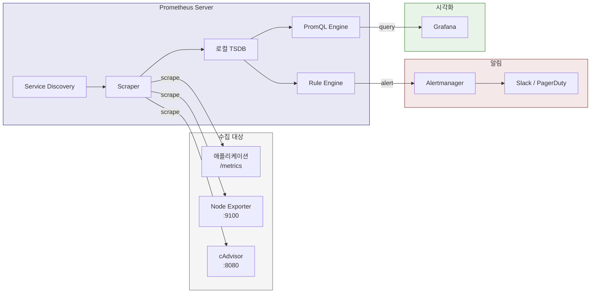

# Ch06. Prometheus — Pull 기반 메트릭 수집의 표준

**핵심 질문**: "Prometheus는 왜 직접 가서 긁어오는(pull) 모델을 선택했고, 그 선택이 어떤 결과를 낳았는가?"

---

## 1. 메트릭 수집이 없던 시절의 문제

2010년대 초, 마이크로서비스가 수십 개에서 수백 개로 늘어나면서 운영팀은 곤란해졌다. StatsD 같은 push 기반 시스템은 각 서비스가 메트릭 서버 주소를 알고 있어야 했고, 서비스가 늘어날 때마다 설정을 수정해야 했다. 새 인스턴스가 뜨면 누가 등록하는지, 내려가면 누가 치우는지가 항상 문제였다.

Graphite + StatsD 조합이 당시의 표준이었는데, 작동 방식은 이랬다. 각 서비스가 UDP로 메트릭을 StatsD에 push하면, StatsD가 집계해서 Graphite에 보내고, Graphite가 Whisper DB에 저장했다. 이 구조에서 서비스가 100개로 늘어나면 StatsD의 집계 부하가 병목이 되고, Graphite의 Whisper 파일이 디스크를 잡아먹었다. 메트릭 이름도 `servers.web01.cpu.idle` 같은 계층형 문자열이라, 새로운 차원(예: 데이터센터, 환경)을 추가하려면 이름 규칙 자체를 바꿔야 했다.

더 근본적인 문제는 "무엇을 수집할 것인가"보다 "수집 대상을 어떻게 발견할 것인가"였다. 서비스 10개까지는 수동으로 관리할 수 있지만, 쿠버네티스 위에서 Pod가 자동으로 생성·삭제되는 환경에서는 수동 등록이 성립하지 않는다. SoundCloud 엔지니어들이 Prometheus를 만든 이유가 정확히 이것이다. Google 내부 모니터링 시스템인 Borgmon에서 영감을 받아, "수집 대상이 자기를 등록하는 게 아니라, 모니터링 시스템이 대상을 찾아가는" 모델을 채택했다.

---

## 2. Prometheus란 무엇인가

**Prometheus는 시계열 데이터베이스, 메트릭 수집기, 쿼리 엔진을 하나로 합친 모니터링 시스템이다.** 2012년 SoundCloud에서 시작해 2016년 CNCF에 합류했고, 2018년 Kubernetes에 이어 두 번째로 졸업한 프로젝트다.

"일체형"이라는 점이 핵심이다. 수집, 저장, 쿼리, 알림까지 하나의 바이너리에 들어 있어서, 설치하고 설정 파일 하나만 작성하면 바로 모니터링이 시작된다. Kafka 클러스터도 필요 없고, 별도 데이터베이스도 필요 없다. 바이너리 하나를 다운받아 실행하면 9090 포트에서 웹 UI가 뜨고, PromQL 쿼리를 바로 실행할 수 있다. 이 단순함이 사실상 클라우드 네이티브 메트릭의 표준으로 자리잡은 이유이기도 하다.

Prometheus가 해결하는 문제를 한 문장으로 요약하면 이렇다: "동적으로 변하는 인프라에서, 서비스가 자기 상태를 HTTP로 노출하면 Prometheus가 찾아가서 긁어오고, 시계열로 저장하여 쿼리·알림에 사용한다."

현재 Prometheus는 v3.x 버전대에 있으며, OpenTelemetry 네이티브 지원(OTLP 수신), UTF-8 메트릭 이름, 네이티브 히스토그램 같은 현대적 기능이 추가되고 있다. 하지만 핵심 아키텍처(pull 모델 + 로컬 TSDB + PromQL)는 초기 설계에서 크게 변하지 않았다.

---

## 3. Pull 모델 vs Push 모델

Prometheus의 가장 특징적인 설계 결정은 pull 모델이다. 서비스가 메트릭을 보내는 게 아니라, Prometheus가 주기적으로 각 서비스의 `/metrics` 엔드포인트를 HTTP로 긁어온다(scrape).

이 선택이 가져온 결과는 명확하다.

**서비스 발견이 자동화된다.** Prometheus는 Kubernetes API, Consul, DNS 같은 서비스 디스커버리와 통합되어 있다. 새 Pod가 뜨면 Kubernetes API가 알려주고, Prometheus가 자동으로 scrape 대상에 추가한다. 서비스 쪽에서는 `/metrics` 엔드포인트만 열어두면 되고, Prometheus 주소를 알 필요가 없다.

**장애 원인 파악이 쉽다.** scrape가 실패하면 "저 서비스가 죽었구나"를 바로 알 수 있다. push 모델에서는 메트릭이 안 오는 이유가 서비스 장애인지, 네트워크 문제인지, 수집기 과부하인지 구분하기 어렵다. Prometheus의 `up` 메트릭은 각 scrape 대상의 생존 여부를 0/1로 나타내며, 이것만으로도 기본적인 서비스 헬스체크가 된다.

**수집 주기를 중앙에서 통제한다.** 모든 서비스의 scrape 간격을 Prometheus 설정 하나로 조절할 수 있다. push 모델에서는 각 서비스가 자체적으로 전송 주기를 결정하기 때문에, 트래픽 폭증 시 수집 서버가 과부하되는 문제가 생긴다. Prometheus에서는 이 문제가 구조적으로 발생하지 않는다.

| 항목 | Pull (Prometheus) | Push (StatsD, OTLP) |
|------|-------------------|---------------------|
| 대상 등록 | 서비스 디스커버리 자동 | 서비스가 수집기 주소를 알아야 함 |
| 장애 감지 | scrape 실패 = 서비스 다운 | 메트릭 미수신 원인 불분명 |
| 수집 주기 | 중앙 통제 | 서비스별 개별 결정 |
| 방화벽 통과 | Prometheus → 서비스 방향 열어야 함 | 서비스 → 수집기 방향 (보통 더 쉬움) |
| 단기 프로세스 | 타이밍 놓칠 수 있음 (Pushgateway 필요) | 프로세스가 직접 전송하므로 유리 |
| 백프레셔 | Prometheus가 속도 조절 | 수집기가 과부하될 수 있음 |

물론 단점도 있다. 방화벽 뒤에 있는 서비스나 배치 작업처럼 짧게 실행되고 사라지는 프로세스는 scrape 타이밍을 놓칠 수 있다. 이를 위해 Prometheus는 Pushgateway라는 보조 컴포넌트를 제공하지만, 이는 예외적인 경우에만 사용하는 것이 권장된다. Pushgateway는 마지막으로 push된 값을 계속 노출하므로, 서비스가 죽었는데도 메트릭이 살아 있는 것처럼 보이는 문제가 있기 때문이다.

```yaml
# prometheus.yml 기본 설정 예시
global:
  scrape_interval: 15s        # 기본 수집 주기
  evaluation_interval: 15s    # 알림 규칙 평가 주기

scrape_configs:
  - job_name: 'kubernetes-pods'
    kubernetes_sd_configs:     # K8s 서비스 디스커버리
      - role: pod
    relabel_configs:
      - source_labels: [__meta_kubernetes_pod_annotation_prometheus_io_scrape]
        action: keep
        regex: true
      - source_labels: [__meta_kubernetes_pod_annotation_prometheus_io_port]
        action: replace
        target_label: __address__
        regex: (.+)
        replacement: $1
```

---

## 4. 데이터 모델과 PromQL

Prometheus의 데이터 모델은 단순하다. 모든 데이터는 **메트릭 이름 + 라벨 셋 + 타임스탬프 + 값**으로 구성된 시계열이다.

```
http_requests_total{method="GET", handler="/api/users", status="200"} 1027 1679561234
```

이 한 줄이 "GET /api/users가 200을 반환한 횟수가 1027번"이라는 시계열 데이터 포인트다. 라벨이 다르면 별개의 시계열이 된다. `method="POST"`가 붙으면 완전히 다른 시계열로 저장된다. 이를 **다차원 데이터 모델**이라 부르며, 라벨 조합으로 자유롭게 필터링·집계할 수 있는 것이 관계형 DB의 WHERE 절과 비슷한 역할을 한다.

Graphite의 계층형 이름(`servers.web01.requests.GET.200`)과 비교하면 차이가 명확하다. Graphite에서 "모든 서버의 GET 요청 수"를 구하려면 와일드카드(`servers.*.requests.GET.*`)를 써야 하고, "모든 HTTP 메서드의 합"을 구하려면 또 다른 와일드카드 패턴이 필요하다. Prometheus에서는 `sum(http_requests_total{status="200"})` 한 줄이면 된다. 라벨이 독립적인 차원이므로 어떤 축으로든 자유롭게 집계할 수 있다.

### 메트릭 타입 4가지

| 타입 | 설명 | 예시 | 주요 함수 |
|------|------|------|----------|
| **Counter** | 단조 증가하는 누적값. 리셋 시 0부터 다시 시작 | `http_requests_total`, `node_cpu_seconds_total` | `rate()`, `increase()` |
| **Gauge** | 올라가기도 내려가기도 하는 현재 상태값 | `node_memory_AvailableBytes`, `temperature_celsius` | `avg_over_time()`, `min_over_time()` |
| **Histogram** | 값의 분포를 버킷별로 누적 카운트. 분위수 계산 가능 | `http_request_duration_seconds_bucket{le="0.5"}` | `histogram_quantile()` |
| **Summary** | 클라이언트에서 분위수를 미리 계산하여 노출 | `go_gc_duration_seconds{quantile="0.99"}` | 직접 읽기 |

Counter와 Gauge의 구분이 가장 중요하다. CPU 사용 시간은 계속 올라가기만 하므로 Counter고, 현재 메모리 사용량은 오르락내리락하므로 Gauge다. Counter에는 `rate()`를 적용해 초당 변화량을 구하고, Gauge에는 `avg_over_time()`을 적용해 기간 평균을 구한다. Counter에 `rate()`를 적용하지 않고 그래프를 그리면 끝없이 올라가는 선만 보이므로 의미가 없다.

Histogram과 Summary의 차이는 "누가 분위수를 계산하느냐"에 있다. Histogram은 서버(Prometheus)에서 쿼리 시점에 계산하므로 여러 인스턴스의 데이터를 합쳐서 전체 p99를 구할 수 있다. Summary는 클라이언트에서 미리 계산하므로 인스턴스별 p99는 알 수 있지만, 전체 p99를 구하는 것은 수학적으로 불가능하다. 대부분의 경우 Histogram이 권장되는 이유가 이것이다.

### PromQL 기초 — Instant Vector와 Range Vector

PromQL을 이해하려면 두 가지 벡터 타입을 구분해야 한다.

**Instant Vector**는 현재 시점의 값 하나를 반환한다. `http_requests_total{job="api-server"}`는 api-server의 모든 시계열에서 가장 최근 값을 하나씩 가져온다.

**Range Vector**는 시간 범위 내의 값 여러 개를 반환한다. `http_requests_total{job="api-server"}[5m]`는 최근 5분간의 모든 샘플을 가져온다. Range Vector는 단독으로 그래프를 그릴 수 없고, `rate()`나 `avg_over_time()` 같은 함수에 입력으로 넣어야 Instant Vector로 변환된다.

```promql
# 최근 5분간 초당 HTTP 요청 수 (상태 코드별)
rate(http_requests_total{job="api-server"}[5m])

# 요청 지연 99번째 분위수
histogram_quantile(0.99, rate(http_request_duration_seconds_bucket[5m]))

# 사용 가능한 메모리가 1GB 미만인 노드
node_memory_AvailableBytes < 1e9

# CPU 사용률 상위 5개 Pod
topk(5, rate(container_cpu_usage_seconds_total{namespace="production"}[5m]))

# 에러율 (5xx 비율)
sum(rate(http_requests_total{status=~"5.."}[5m]))
  / sum(rate(http_requests_total[5m]))
```

`rate()`가 PromQL에서 가장 많이 쓰이는 함수인 이유가 있다. Counter는 누적값이므로 그 자체로는 "지금 얼마나 바쁜가"를 알 수 없다. `rate()`가 구간 내 증가량을 시간으로 나눠서 초당 변화율을 계산해주기 때문에, Counter를 의미 있는 지표로 바꾸는 핵심 함수다. 프로세스가 재시작되어 Counter가 0으로 리셋되어도, `rate()`는 이를 자동으로 감지하고 보정한다.

`rate()`와 `irate()`의 차이도 알아둘 필요가 있다. `rate()`는 범위 내 전체 샘플의 평균 변화율을 계산하여 부드러운 그래프를 그리고, `irate()`는 마지막 두 샘플만으로 순간 변화율을 계산하여 스파이크를 잡는다. 대시보드에는 `rate()`, 알림에도 `rate()`가 일반적이며, `irate()`는 디버깅 시 순간 급증을 확인할 때 쓴다.

---

## 5. 아키텍처와 컴포넌트

Prometheus의 아키텍처는 역할이 명확하게 분리되어 있다.



**Service Discovery**는 Kubernetes API, Consul, EC2 API 등에서 수집 대상 목록을 자동으로 가져온다. 정적 설정(`static_configs`)도 가능하지만, 동적 환경에서는 거의 쓰지 않는다. Kubernetes SD의 경우 Pod, Service, Endpoint, Node, Ingress 다섯 가지 역할(role)을 지원하며, 가장 흔한 것은 `role: pod`로 Pod의 어노테이션을 기반으로 scrape 대상을 결정하는 패턴이다.

**Scraper**는 발견된 대상의 `/metrics` 엔드포인트를 주기적으로 HTTP GET으로 호출하고, 응답을 파싱하여 시계열 데이터를 추출한다. 각 scrape의 성공 여부는 `up` 메트릭으로 기록되고, scrape 소요 시간은 `scrape_duration_seconds`로 기록된다.

**로컬 TSDB**는 수집된 시계열을 디스크에 저장한다. 최근 2시간의 데이터는 "Head Block"이라 불리는 인메모리 영역에 저장하여 쓰기 성능을 확보하고, 2시간이 지나면 디스크 블록으로 compaction한다. 기본 보존 기간은 15일이지만 `--storage.tsdb.retention.time` 플래그로 조절 가능하다. TSDB 블록 구조를 간단히 보면 이렇다:

```
data/
├── 01BKGV7JBM69T2G1BGBGM6KB12/  # 블록 (ULID)
│   ├── meta.json                  # 블록 메타데이터
│   ├── chunks/                    # 시계열 데이터 (압축)
│   ├── index                      # 라벨 → 시계열 매핑
│   └── tombstones                 # 삭제 마커
├── 01BKGTZQ1SYQJTR4PB43C8PD98/
├── chunks_head/                   # Head Block (최근 2시간)
└── wal/                           # Write-Ahead Log
```

**Rule Engine**은 recording rule(미리 계산해둔 파생 메트릭)과 alerting rule(조건 충족 시 알림 발행)을 주기적으로 평가한다. recording rule은 자주 사용하는 복잡한 쿼리를 미리 계산해두어 대시보드 로딩 속도를 개선하는 용도로 쓴다.

```yaml
# recording rule 예시
groups:
  - name: http_rules
    rules:
      - record: job:http_requests_total:rate5m
        expr: sum by (job)(rate(http_requests_total[5m]))

# alerting rule 예시
  - name: http_alerts
    rules:
      - alert: HighErrorRate
        expr: sum(rate(http_requests_total{status=~"5.."}[5m])) / sum(rate(http_requests_total[5m])) > 0.05
        for: 5m
        labels:
          severity: critical
        annotations:
          summary: "HTTP 5xx 에러율이 5% 초과"
```

recording rule에서 `job:http_requests_total:rate5m`이라는 이름 규칙에 주목하자. `level:metric:operations` 형식이 Prometheus 커뮤니티 컨벤션이다. 이렇게 미리 계산된 메트릭은 대시보드에서 `rate(http_requests_total[5m])`를 매번 계산하는 대신 직접 참조할 수 있어서, 대시보드 수십 개가 같은 쿼리를 날릴 때 Prometheus 부하를 크게 줄인다.

**Alertmanager**는 Prometheus와 별도의 바이너리로, 알림 라우팅·그룹핑·억제·사일런싱을 담당한다. 같은 장애에서 100개의 알림이 동시에 발생해도 하나로 묶어서 전달하는 것이 핵심 기능이다. 예를 들어 노드 하나가 죽으면 그 위의 모든 Pod에서 알림이 발생하는데, Alertmanager가 이를 "node-X 장애"로 묶어서 Slack에 한 번만 보낸다.

---

## 6. Node Exporter vs Alloy — 역할이 다른 두 수집기

메트릭 수집 환경을 구성할 때 가장 흔한 질문이 "Node Exporter와 Alloy 중 뭘 써야 하나"인데, 사실 이 질문 자체가 잘못된 이분법이다. 둘은 경쟁 관계가 아니라 보완 관계이고, 프로덕션에서 함께 사용하는 것이 일반적이다.

### Node Exporter가 하는 일

Node Exporter는 **호스트 레벨 하드웨어·OS 메트릭 전문 수집기**다. CPU, 메모리, 디스크 I/O, 네트워크 인터페이스, 파일시스템, 시스템 부하 등 리눅스 커널이 `/proc`과 `/sys`를 통해 노출하는 수백 개의 메트릭을 수집하여 `/metrics` 엔드포인트로 내보낸다.

Kubernetes에서는 DaemonSet으로 배포하여 모든 노드에 하나씩 실행한다. 하는 일이 명확하고, 설정할 것이 거의 없으며, 리소스 사용량이 극히 적다(CPU 0.01코어, 메모리 20MB 미만 수준). 10년 넘게 안정적으로 운영된 검증된 컴포넌트다.

대표적인 메트릭을 몇 가지 보면 이런 것들이다:

```promql
# CPU 사용률 (idle 제외 비율)
1 - avg by (instance)(rate(node_cpu_seconds_total{mode="idle"}[5m]))

# 메모리 사용률
1 - (node_memory_AvailableBytes / node_memory_MemTotal_bytes)

# 디스크 사용률
1 - (node_filesystem_avail_bytes{mountpoint="/"} / node_filesystem_size_bytes{mountpoint="/"})

# 네트워크 수신 트래픽 (초당 바이트)
rate(node_network_receive_bytes_total{device="eth0"}[5m])
```

### Alloy가 하는 일

Ch03에서 다룬 Grafana Alloy는 **범용 텔레메트리 수집·라우팅 파이프라인**이다. OTLP push 수신, Prometheus scrape, 로그 수집, 트레이스 수집을 하나의 에이전트에서 처리하며, 수집한 데이터를 remote_write로 Mimir, Loki, Tempo 등 백엔드에 전달한다.

Alloy에는 `prometheus.exporter.unix`라는 컴포넌트가 있어서 Node Exporter와 유사한 호스트 메트릭을 수집할 수 있다. 그래서 "Alloy 하나면 Node Exporter가 필요 없지 않나?"라는 질문이 나오는 것이다.

### 왜 함께 쓰는 것이 일반적인가

결론부터 말하면, **Node Exporter + Alloy 병행이 프로덕션 표준 패턴**이다. 이유는 세 가지다.

첫째, **커버리지가 다르다.** Node Exporter는 수백 개의 커널 메트릭을 세밀하게 수집하는 데 최적화되어 있고, collector별 옵션도 풍부하다. `textfile` collector처럼 커스텀 메트릭을 파일로 노출하는 기능, `systemd` collector처럼 서비스 상태를 수집하는 기능은 Node Exporter 고유의 강점이다. Alloy의 `prometheus.exporter.unix`는 동일한 코드 베이스를 내장하고 있지만, 일부 플랫폼별 collector가 빠져 있거나 업데이트가 늦을 수 있다.

둘째, **장애 격리가 된다.** Node Exporter는 인프라 메트릭만 담당하므로, Alloy가 재시작되거나 설정 변경 중에도 호스트 메트릭 수집이 중단되지 않는다. 반대로 Node Exporter에 문제가 생겨도 애플리케이션 메트릭 수집은 영향받지 않는다. 모니터링 시스템의 모니터링(meta-monitoring)에서 이 격리가 중요해진다.

셋째, **역할이 명확해진다.** Node Exporter는 "이 노드의 하드웨어 상태"를, Alloy는 "이 노드 위에서 돌아가는 애플리케이션의 텔레메트리"를 담당한다. 운영팀은 Node Exporter 대시보드를, 개발팀은 Alloy 경유 애플리케이션 메트릭을 본다.

| 항목 | Node Exporter | Alloy (`prometheus.exporter.unix`) |
|------|--------------|-----------------------------------|
| 역할 | 호스트 하드웨어/OS 메트릭 전용 | 범용 텔레메트리 수집·라우팅 |
| 메트릭 범위 | `/proc`, `/sys` 기반 수백 개 | 동일 코드 베이스 내장, 일부 차이 가능 |
| 배포 형태 | DaemonSet (K8s) 또는 systemd | DaemonSet 또는 Sidecar |
| 리소스 | 극소 (CPU 0.01, RAM ~20MB) | 중간 (다기능이므로 상대적으로 큼) |
| 설정 복잡도 | 낮음 (거의 기본값 사용) | 높음 (River 설정, 파이프라인 구성) |
| OTLP 지원 | 없음 (scrape 전용) | 있음 (push 수신 + remote_write) |
| 장애 영향 | 호스트 메트릭만 중단 | 모든 텔레메트리 수집 중단 가능 |

### Alloy만으로 대체하는 경우

소규모 환경(노드 10대 미만)에서 컴포넌트 수를 최소화하고 싶다면 Alloy 단독으로 호스트 메트릭까지 수집하는 것도 합리적인 선택이다. 다만 이 경우 Alloy 장애가 모든 텔레메트리 수집에 영향을 미치므로, 모니터링 자체의 고가용성이 다소 떨어진다는 점은 인지해야 한다.

---

## 7. Exporter 생태계

Prometheus의 pull 모델이 성공한 배경에는 exporter 생태계가 있다. 데이터베이스, 메시지 큐, 웹 서버 등 주요 인프라 소프트웨어마다 전용 exporter가 존재하여, 해당 소프트웨어의 내부 메트릭을 Prometheus 형식으로 변환해준다.

| Exporter | 대상 | 주요 메트릭 |
|----------|------|------------|
| `node_exporter` | Linux 호스트 | CPU, 메모리, 디스크, 네트워크 |
| `mysqld_exporter` | MySQL | 쿼리 처리량, 커넥션 수, 슬로우 쿼리 |
| `redis_exporter` | Redis | 메모리 사용, 히트율, 커맨드 처리량 |
| `blackbox_exporter` | HTTP/TCP/ICMP 엔드포인트 | 응답 시간, SSL 만료일, 상태 코드 |
| `jmx_exporter` | JVM 기반 앱 | 힙 메모리, GC 횟수, 스레드 수 |
| `kube-state-metrics` | Kubernetes 오브젝트 | Pod 상태, Deployment replica 수 |

kube-state-metrics와 cAdvisor(kubelet 내장)의 차이를 짚어두면 유용하다. kube-state-metrics는 Kubernetes API 서버에서 오브젝트 상태를 가져오는 것이고(`kube_deployment_status_replicas`처럼 "선언된 상태 vs 실제 상태"), cAdvisor는 컨테이너 런타임에서 실시간 리소스 사용량을 가져오는 것이다(`container_cpu_usage_seconds_total`처럼 "실제로 얼마나 쓰고 있는가"). 하나는 오케스트레이션 레벨, 하나는 런타임 레벨이라 둘 다 필요하다.

### 애플리케이션 계측

서비스 자체의 비즈니스 메트릭을 노출하려면 클라이언트 라이브러리를 사용한다.

Spring Boot 애플리케이션이라면 Micrometer + `micrometer-registry-prometheus` 의존성만 추가하면 `/actuator/prometheus` 엔드포인트가 자동 생성된다. JVM 메트릭(힙, GC, 스레드), HTTP 요청 메트릭, 커넥션 풀 메트릭이 기본으로 포함되고, 커스텀 메트릭도 Micrometer API로 쉽게 추가할 수 있다.

Go 애플리케이션은 `prometheus/client_golang` 라이브러리로 커스텀 메트릭을 노출할 수 있다. Python은 `prometheus_client`, Node.js는 `prom-client`가 공식 라이브러리다.

이처럼 "계측 라이브러리로 `/metrics`를 열고, Prometheus가 긁어가게 한다"는 패턴이 생태계 전체에 일관되게 적용된다. OpenTelemetry SDK로 계측한 경우에도 Prometheus exporter를 붙이면 같은 `/metrics` 엔드포인트를 노출할 수 있어서, OTel과의 호환성도 유지된다.

### 메트릭 네이밍 컨벤션

Prometheus 커뮤니티에는 메트릭 이름에 대한 확립된 규칙이 있다. 이 규칙을 따르면 메트릭의 의미를 이름만 보고 파악할 수 있다.

- 접두사는 도메인이나 라이브러리 이름: `http_`, `node_`, `process_`
- Counter는 `_total` 접미사: `http_requests_total`, `errors_total`
- Histogram/Summary의 관측값은 `_seconds` 또는 `_bytes` 같은 단위 포함: `http_request_duration_seconds`
- Gauge는 현재 상태를 나타내는 명사형: `node_memory_AvailableBytes`, `queue_length`
- 단위는 복수형 없이 기본 단위 사용: seconds(밀리초 아님), bytes(킬로바이트 아님)

이 규칙이 중요한 이유는, `rate(http_requests_total[5m])`의 결과가 "초당 요청 수"임을 이름의 `_total`만 보고 알 수 있기 때문이다. 단위가 이름에 포함되어 있으면 대시보드에서 별도 주석 없이도 그래프의 Y축이 무엇인지 명확해진다.

---

## 8. Relabeling — 수집 시점의 데이터 변환

Prometheus의 강력하면서도 처음에 이해하기 어려운 기능이 relabeling이다. scrape 설정에서 `relabel_configs`와 `metric_relabel_configs`를 통해 메트릭을 수집하는 시점에 라벨을 추가·수정·삭제할 수 있다.

**`relabel_configs`는 scrape 대상을 결정하기 전에** 적용된다. 서비스 디스커버리에서 가져온 메타데이터 라벨(`__meta_kubernetes_*`)을 기반으로 scrape 여부를 결정하거나, 대상의 주소(`__address__`)를 수정하는 데 쓴다.

```yaml
relabel_configs:
  # prometheus.io/scrape 어노테이션이 true인 Pod만 수집
  - source_labels: [__meta_kubernetes_pod_annotation_prometheus_io_scrape]
    action: keep
    regex: true
  # 네임스페이스를 라벨로 추가
  - source_labels: [__meta_kubernetes_namespace]
    target_label: namespace
  # Pod 이름을 라벨로 추가
  - source_labels: [__meta_kubernetes_pod_name]
    target_label: pod
```

**`metric_relabel_configs`는 scrape한 후 저장하기 전에** 적용된다. 불필요한 메트릭을 버리거나, 라벨 값을 정규화하는 데 쓴다. 카디널리티가 높은 메트릭을 저장 전에 걸러내는 것이 대표적인 용도다.

```yaml
metric_relabel_configs:
  # 특정 메트릭 제외 (카디널리티 관리)
  - source_labels: [__name__]
    regex: go_.*
    action: drop
  # 라벨 값 정규화
  - source_labels: [status]
    regex: '(2..)'
    target_label: status_class
    replacement: '2xx'
```

relabeling은 Prometheus의 유연성의 핵심이다. 같은 exporter의 메트릭이라도 환경에 따라 필요한 라벨이 다르고, 저장할 메트릭의 범위도 다르다. 이 조정을 수집 시점에 할 수 있기 때문에, 애플리케이션 코드를 변경하지 않고도 메트릭 파이프라인을 제어할 수 있다.

relabeling에서 흔히 실수하는 것이 `relabel_configs`와 `metric_relabel_configs`의 적용 시점 혼동이다. `relabel_configs`에서 `drop` action을 쓰면 scrape 대상 자체를 제거하는 것이고, `metric_relabel_configs`에서 `drop`을 쓰면 특정 메트릭만 버리는 것이다. "go_* 메트릭을 제외하고 싶다"는 요구는 `metric_relabel_configs`에서 처리해야 한다. `relabel_configs`에 넣으면 해당 대상 전체를 scrape하지 않게 되어 다른 메트릭까지 사라진다.

---

## 9. 로컬 TSDB의 한계 — 왜 Mimir가 필요한가

Prometheus의 로컬 TSDB는 단일 노드에서 돌아가는 내장 저장소다. 이 설계는 단순함이라는 장점을 주지만, 규모가 커지면 세 가지 벽에 부딪힌다.

**장기 보존이 어렵다.** 기본 보존은 15일이고, 디스크를 늘려서 수개월까지 보관할 수는 있다. 그러나 1년 이상 메트릭을 보관해야 하는 용량 계획이나 연간 트렌드 분석에는 로컬 디스크가 현실적이지 않다. 디스크 장애가 발생하면 그 기간의 모든 메트릭이 유실된다.

**수평 확장이 안 된다.** 시계열 수가 수백만을 넘기면 단일 Prometheus 인스턴스의 메모리와 CPU가 부족해진다. 여러 Prometheus를 띄워서 각각 다른 대상을 scrape하는 "샤딩"은 가능하지만, 전체 메트릭을 한 곳에서 쿼리할 수는 없다. Hashmod sharding으로 대상을 분배할 수 있지만, "전체 클러스터의 에러율"을 한 번의 쿼리로 구하는 것은 불가능하다.

**고가용성이 제한적이다.** 두 대의 Prometheus가 같은 대상을 scrape하는 방식으로 HA를 구성할 수 있지만, 두 인스턴스의 데이터가 미세하게 다를 수 있고(scrape 타이밍 차이), 쿼리 시 어느 쪽을 볼지 결정하는 것이 별도 문제다.

**Federation은 임시 방편이다.** 상위 Prometheus가 하위 Prometheus의 `/federate` 엔드포인트를 scrape하여 집계된 메트릭을 모으는 방식인데, 원본 시계열의 세밀한 라벨이 사라지므로 디버깅 시 원본 데이터로 내려가야 한다. 소규모 멀티 클러스터에서는 쓸 만하지만, 근본적인 해결책은 아니다.

이 한계들이 정확히 Ch07에서 다룰 Grafana Mimir가 해결하는 영역이다. Prometheus를 수집기로 유지하면서 `remote_write`로 Mimir에 메트릭을 전달하면, 장기 보존·수평 확장·글로벌 뷰를 확보할 수 있다.

---

## 10. 면접에서 설명한다면

### "Prometheus를 한 마디로?"

**시계열 메트릭을 pull 방식으로 수집하고, PromQL로 쿼리하며, Alertmanager와 연동하여 알림까지 처리하는 CNCF 졸업 모니터링 시스템이다.** 클라우드 네이티브 환경에서 메트릭 모니터링의 사실상 표준이며, Kubernetes 서비스 디스커버리와의 통합이 핵심 강점이다.

### "Pull 모델의 장점은?"

수집 대상이 Prometheus 주소를 몰라도 되고, 서비스 디스커버리로 대상을 자동 발견하며, scrape 실패 자체가 장애 탐지 신호가 된다. 수집 주기를 중앙에서 통제하므로 수집 서버 과부하를 방지할 수 있다.

### "Counter와 Gauge의 차이는?"

Counter는 단조 증가하는 누적값(요청 수, 에러 수)이고 `rate()`로 초당 변화율을 구한다. Gauge는 올라갔다 내려갔다 하는 현재값(메모리 사용량, 큐 길이)이고 그대로 읽거나 `avg_over_time()`을 적용한다. Counter에 rate()를 안 걸면 끝없이 올라가는 그래프만 보인다.

### "Node Exporter와 Alloy를 왜 같이 쓰나?"

역할이 다르기 때문이다. Node Exporter는 호스트 하드웨어·OS 메트릭 전문이고, Alloy는 애플리케이션 텔레메트리 수집·라우팅 파이프라인이다. 함께 쓰면 장애 격리가 되고, 역할 분담이 명확해진다. 소규모 환경에서는 Alloy 단독으로 대체 가능하지만, 프로덕션에서는 병행이 일반적이다.

### "Prometheus의 한계는?"

로컬 TSDB 기반이라 장기 보존, 수평 확장, 멀티 클러스터 통합 뷰에 한계가 있다. 이를 해결하기 위해 Grafana Mimir, Thanos, VictoriaMetrics 같은 장기 저장소와 `remote_write`로 연동한다.

---

> **다음 챕터**: Ch07에서는 Prometheus의 로컬 저장소 한계를 넘어서는 **Grafana Mimir**를 다룬다. Prometheus를 수집기로 유지하면서 수평 확장 가능한 장기 메트릭 저장소를 구성하는 방법을 살펴본다.
