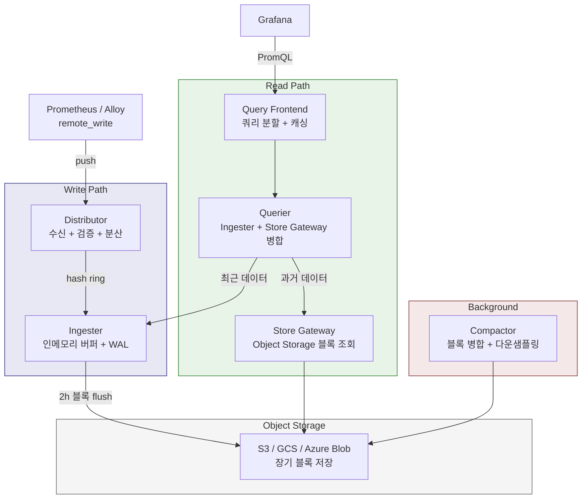

# Ch07. Grafana Mimir — 수평 확장 가능한 장기 메트릭 저장소

**핵심 질문**: "Prometheus의 로컬 저장소가 감당 못하는 규모의 메트릭을 어떻게 저장하고 쿼리하는가?"

---

## 1. Prometheus 단독으로 부족해지는 시점

Ch06에서 다룬 것처럼, Prometheus의 로컬 TSDB는 단일 노드 저장소다. 서비스 수십 개에 노드 몇 대인 환경에서는 충분하지만, 조직이 성장하면 세 가지 벽에 부딪힌다.

**첫 번째 벽은 용량이다.** 활성 시계열이 수백만 개를 넘기면 하나의 Prometheus 인스턴스가 감당할 메모리와 디스크 I/O가 부족해진다. 마이크로서비스 100개, 각각 100개 메트릭, 라벨 조합 50개만 해도 50만 시계열이고, 여러 환경(dev, staging, production)을 합치면 금세 수백만에 도달한다. Prometheus 공식 문서에서도 활성 시계열 1,000만 개를 넘기면 수직 스케일링의 한계에 도달한다고 안내하고 있다.

**두 번째 벽은 보존 기간이다.** 비용 최적화를 위한 연간 트렌드 분석, 규정 준수를 위한 메트릭 장기 보관 요구사항은 로컬 디스크 15일 보존으로 해결할 수 없다. 디스크를 늘려서 수개월까지 버틸 수는 있지만, 단일 노드의 디스크 장애가 전체 메트릭 유실로 이어진다. 금융이나 통신 업계에서 요구하는 1년~5년 보존은 로컬 TSDB로는 현실적이지 않다.

**세 번째 벽은 멀티 클러스터 뷰다.** 각 클러스터에 Prometheus가 하나씩 있을 때, "전체 클러스터의 HTTP 5xx 비율"을 한 번의 쿼리로 볼 수 없다. Federation으로 일부 해결할 수 있지만, 집계된 메트릭만 가져오므로 세밀한 디버깅에는 쓸 수 없다. 장애 발생 시 "어느 클러스터의 어느 Pod에서 에러가 시작됐는지"를 전역 뷰에서 추적하는 것이 불가능한 것이다.

이 세 가지 한계를 동시에 해결하는 것이 장기 메트릭 저장소의 역할이다.

한 가지 오해를 짚으면, "Prometheus가 느려서 Mimir로 바꾼다"는 표현은 정확하지 않다. Prometheus의 쿼리 성능은 활성 시계열 수백만 개까지 충분히 빠르다. 실제로 단일 Prometheus 인스턴스의 초당 scrape 처리량은 수백만 샘플에 달하며, PromQL 쿼리도 밀리초 단위로 응답한다. 문제는 성능이 아니라 **아키텍처 한계**다. 단일 노드의 디스크와 메모리로는 물리적으로 더 이상 데이터를 담을 수 없거나, 여러 Prometheus 인스턴스의 데이터를 하나로 합쳐서 쿼리해야 하는 상황에서 Mimir가 필요해지는 것이다.

판단 기준을 정리하면 이렇다:
- 활성 시계열 100만 미만 + 보존 1개월 이내 + 단일 클러스터 → Prometheus 단독으로 충분
- 멀티 클러스터 통합 뷰 또는 3개월 이상 보존 필요 → Mimir(또는 Thanos/VM) 도입 검토
- 팀별 격리가 필요한 플랫폼 운영 → Mimir의 네이티브 멀티 테넌시가 강점

---

## 2. Grafana Mimir란 무엇인가

**Grafana Mimir는 Prometheus 호환 메트릭을 수평 확장 가능한 방식으로 장기 저장하고 쿼리하는 오픈소스 시계열 데이터베이스다.** Cortex 프로젝트에서 2022년에 fork되었으며, Grafana Labs가 주도적으로 개발하고 있다. 라이선스는 AGPL v3이다.

Cortex와의 관계를 잠깐 짚으면, Cortex는 2018년부터 Weaveworks와 Grafana Labs가 공동 개발하던 Prometheus 장기 저장소였다. 2022년에 Grafana Labs가 Cortex를 fork하여 Mimir로 발표하면서, 성능 최적화(특히 compactor와 store-gateway)와 운영 단순화에 집중했다. Cortex는 여전히 CNCF 인큐베이팅 프로젝트로 유지되지만, 실질적인 개발 투자는 Mimir에 집중되고 있다.

Cortex와 Mimir의 가장 큰 차이는 성능이다. Mimir 발표 당시 Grafana Labs는 동일한 하드웨어에서 Cortex 대비 40배 빠른 쿼리 성능을 달성했다고 발표했다. 이 개선의 핵심은 Store Gateway의 블록 인덱스 처리 최적화와 Compactor의 "split-and-merge" 알고리즘이다. 또한 Mimir는 Cortex에서 지원하던 DynamoDB, Cassandra 같은 인덱스 백엔드를 제거하고 Object Storage 단일 백엔드로 단순화하여 운영 복잡도를 낮췄다.

핵심 가치는 "Prometheus를 그대로 쓰되, 저장소만 교체하는 것"이다. PromQL을 100% 호환하고, `remote_write` 프로토콜로 메트릭을 수신하므로, 기존 Prometheus 설정에 세 줄만 추가하면 Mimir와 연동할 수 있다.

```yaml
# prometheus.yml에 추가
remote_write:
  - url: http://mimir-distributor:9009/api/v1/push
    headers:
      X-Scope-OrgID: my-tenant
```

Alloy를 수집기로 사용하는 경우에도 동일하다. Alloy의 `prometheus.remote_write` 컴포넌트가 같은 엔드포인트로 메트릭을 전달한다.

`remote_write`는 Prometheus가 2016년부터 지원하는 표준 프로토콜로, snappy로 압축된 Protocol Buffers 형식으로 시계열 데이터를 HTTP POST한다. 네트워크 단절 시에는 Prometheus 로컬에 WAL로 버퍼링했다가 연결이 복구되면 재전송하므로, 일시적 장애에도 데이터 유실이 발생하지 않는다. 이 프로토콜은 Mimir뿐 아니라 Thanos Receive, VictoriaMetrics, Cortex 등 모든 장기 저장소가 지원하는 사실상의 표준이다.

---

## 3. 아키텍처 — Write Path와 Read Path

Mimir의 설계 원칙은 "Write Path와 Read Path를 완전히 분리하여 각각 독립적으로 확장한다"는 것이다. 쓰기 부하가 높으면 Write 컴포넌트만, 쿼리가 많으면 Read 컴포넌트만 스케일 아웃할 수 있다. 이 분리가 Prometheus 단일 바이너리와의 근본적인 차이다.

이 아키텍처가 낯설 수 있지만, Ch04에서 다룬 Loki나 Ch05의 Tempo와 구조가 동일하다. Loki도 Distributor → Ingester → Object Storage(Write), Query Frontend → Querier → Store Gateway(Read) 구조를 따른다. Grafana Labs는 이 패턴을 "마이크로서비스 기반 분산 저장소"의 표준 아키텍처로 세 제품에 일관되게 적용했다. 하나를 이해하면 나머지 둘도 자연스럽게 이해되는 이유다.



### Write Path

**Distributor**는 remote_write로 들어오는 메트릭을 수신하는 첫 번째 컴포넌트다. 하는 일이 세 가지다.

첫째, **검증**이다. 라벨 이름이 유효한지, 타임스탬프가 허용 범위 내인지, 시계열 수가 테넌트 limit을 초과하지 않았는지 확인한다. 유효하지 않은 샘플은 여기서 거부되고 에러 응답을 돌려보낸다.

둘째, **분산**이다. 시계열의 라벨 셋을 해시하여 어느 Ingester로 보낼지 결정한다. 이때 **consistent hashing ring**을 사용하는데, 이 링은 모든 Distributor와 Ingester가 공유하는 분산 해시 테이블이다(Ch08에서 hash ring의 상세 메커니즘을 다룬다). 특정 Ingester가 추가되거나 제거되어도 전체 시계열의 재분배가 최소화된다. 예를 들어 Ingester 10대 중 1대가 추가되면, 기존 시계열의 약 10%만 새 Ingester로 이동하고 나머지 90%는 그대로 유지된다.

셋째, **복제**다. replication factor가 3이면, 하나의 시계열을 링에서 연속된 3개의 Ingester에 동시에 보낸다. 3개 중 2개(quorum)가 성공하면 쓰기 성공으로 응답한다.

**Ingester**는 수신된 시계열을 인메모리에 버퍼링하면서 WAL(Write-Ahead Log)에도 기록한다. 인메모리 저장의 이유는 성능이다. Object Storage에 매번 쓰면 지연 시간이 길어지므로, 2시간 동안 인메모리에 모아뒀다가 TSDB 블록으로 압축하여 한 번에 flush한다. 이 2시간 블록은 Prometheus의 로컬 TSDB 블록과 동일한 형식이다.

Ingester가 죽으면 어떻게 될까? WAL에 기록이 남아 있으므로, 새 Ingester가 WAL을 재생(replay)하여 인메모리 상태를 복구한다. replication factor 3 덕분에 다른 두 Ingester에도 같은 데이터가 있으므로, 쿼리 시 데이터 유실이 발생하지 않는다.

Ingester의 메모리 사용량은 활성 시계열 수에 비례한다. 시계열 하나당 약 3~5KB의 메모리를 사용하므로, 100만 시계열이면 약 3~5GB가 필요하다. replication factor 3이면 같은 시계열이 3대의 Ingester에 있으므로, 전체 메모리 사용량은 3배가 된다. 이 수치를 기반으로 Ingester의 인스턴스 수와 메모리 사양을 계획할 수 있다.

### Read Path

**Query Frontend**는 클라이언트(Grafana 등)로부터 PromQL 쿼리를 받아서 최적화하는 진입점이다. 하는 일이 두 가지다.

첫째, **쿼리 분할(splitting)**이다. 24시간 범위 쿼리가 들어오면 24개의 1시간 쿼리로 쪼갠 뒤 병렬로 Querier에게 보낸다. 큰 쿼리를 잘게 나누면 각 조각이 캐시에 히트할 가능성이 높아지고, 병렬 처리로 응답 시간도 줄어든다.

둘째, **결과 캐싱**이다. 동일한 쿼리(같은 시간 범위, 같은 표현식)가 다시 들어오면 Object Storage를 다시 읽지 않고 캐시에서 바로 응답한다. 대시보드를 새로고침할 때마다 같은 쿼리가 반복되므로, 이 캐싱의 효과가 상당하다.

**Querier**는 분할된 쿼리를 실제로 실행한다. 최근 데이터(아직 flush되지 않은 것)는 Ingester에서 gRPC로 가져오고, 과거 데이터는 Store Gateway에서 가져와 병합한다. replication factor 3으로 인해 같은 시계열이 여러 Ingester에 존재하므로, 중복 제거(deduplication)를 수행하여 정확한 결과를 반환하는 것이 핵심 로직이다.

**Store Gateway**는 Object Storage의 TSDB 블록 인덱스를 로컬 디스크에 캐싱한다. Object Storage에서 전체 블록을 내려받는 대신, 인덱스만 캐싱해두면 어떤 시계열이 어느 블록에 있는지 빠르게 찾을 수 있다. 실제 데이터 청크만 필요할 때 Object Storage에서 가져오므로, 네트워크 트래픽과 지연을 크게 줄인다.

Store Gateway는 블록을 샤딩하여 여러 인스턴스에 분배한다. 블록 수가 수만 개에 달하는 대규모 환경에서, 모든 Store Gateway가 모든 블록의 인덱스를 가지고 있으면 메모리가 부족해진다. 샤딩을 통해 각 Store Gateway가 전체 블록의 일부만 담당하도록 나누면 인스턴스당 메모리 부담이 줄어든다.

### Background

**Compactor**는 두 가지 백그라운드 작업을 수행한다.

첫째, **블록 병합(compaction)**이다. Ingester가 2시간마다 생성하는 작은 블록들을 큰 블록으로 합친다. 2시간 블록 12개가 24시간 블록 하나로 합쳐지면, 하루 범위 쿼리 시 12개 블록 대신 1개 블록만 탐색하면 되므로 쿼리 성능이 개선된다. Mimir의 "split-and-merge" compactor는 Cortex 대비 이 과정을 병렬화하여 대규모 테넌트에서도 compaction 지연이 발생하지 않도록 했다.

둘째, **보존 정책 적용**이다. 테넌트별로 설정된 보존 기간이 지난 블록을 Object Storage에서 삭제한다. 보존 기간은 전역 설정과 테넌트별 오버라이드로 나뉘어, 중요한 프로덕션 테넌트는 1년, 개발 환경 테넌트는 30일처럼 차등 적용할 수 있다.

Compactor는 Object Storage에서 블록을 다운로드하여 로컬에서 병합한 뒤 다시 업로드하므로, 충분한 로컬 디스크 공간이 필요하다. 대규모 테넌트의 경우 compaction 중 임시 디스크 사용량이 수십 GB에 달할 수 있어서, Compactor Pod에는 넉넉한 ephemeral storage를 할당해야 한다. compaction이 지연되면 Store Gateway가 탐색해야 할 블록 수가 늘어나 쿼리 성능이 저하되므로, Compactor의 건강 상태를 모니터링하는 것이 중요하다.

---

## 4. 멀티 테넌시

Mimir의 멀티 테넌시는 "처음부터 설계에 녹아 있는" 기능이다. 모든 Write/Read 요청에 `X-Scope-OrgID` 헤더가 필수이며, 이 헤더로 테넌트를 식별한다.

테넌트별로 독립적인 제어가 가능한 항목은 다음과 같다:

- **Rate limit**: 초당 샘플 수, 활성 시계열 수 제한
- **보존 기간**: 팀 A는 30일, 팀 B는 1년
- **쿼리 제한**: 최대 쿼리 시간 범위, 동시 쿼리 수
- **접근 제어**: Grafana 데이터 소스에서 `X-Scope-OrgID`를 팀별로 설정하여 격리

멀티 테넌시가 실제로 어떻게 쓰이는지 예를 들면, 사내 플랫폼팀이 Mimir를 운영하면서 각 개발팀(결제팀, 주문팀, 인프라팀)에게 독립된 테넌트를 부여한다. 결제팀은 PCI-DSS 규정 때문에 메트릭을 1년 보존해야 하고, 주문팀은 3개월이면 충분하다. 인프라팀은 시계열 수가 많아서 rate limit을 더 높여야 한다. 이런 차등 설정이 하나의 Mimir 클러스터에서 테넌트별로 적용된다.

테넌트 간 데이터는 완전히 격리된다. 결제팀의 Grafana 대시보드에서는 주문팀의 메트릭을 쿼리할 수 없고, 반대도 마찬가지다. 이 격리는 Distributor부터 Querier까지 모든 컴포넌트에서 `X-Scope-OrgID`를 기준으로 강제된다.

이것이 Thanos와의 큰 차이다. Thanos에서 멀티 테넌시를 구현하려면 라벨 기반 필터링이나 별도의 인증 프록시를 붙여야 하는데, Mimir는 Distributor 단계에서 네이티브로 테넌트를 분리한다. SaaS 형태로 사내 플랫폼을 운영하는 조직에서 이 차이가 결정적이다.

---

## 5. Prometheus와의 관계

Mimir를 도입한다고 Prometheus를 버리는 것이 아니다. 가장 일반적인 패턴은 **Prometheus를 수집기로 유지하면서 Mimir를 저장소로 사용**하는 것이다.

데이터 흐름은 이렇다: Prometheus가 서비스의 `/metrics`를 scrape → 로컬 TSDB에 잠시 저장 → `remote_write`로 Mimir에 전달. 단기 쿼리(최근 몇 시간)는 Prometheus 로컬에서 처리하고, 장기 쿼리(수일~수개월)는 Grafana가 Mimir를 직접 쿼리한다.

Alloy를 사용하는 환경에서는 더 단순해진다. Alloy가 scrape와 remote_write를 모두 담당하므로 Prometheus 바이너리 자체가 필요 없어진다. 이것이 Grafana Labs가 추진하는 LGTM 스택의 이상적인 아키텍처다.

두 패턴을 비교하면 이렇다:

| 항목 | Prometheus + Mimir | Alloy + Mimir |
|------|-------------------|---------------|
| 수집기 | Prometheus (scrape + 로컬 저장) | Alloy (scrape + 직접 remote_write) |
| 로컬 저장 | 있음 (단기 쿼리 가능) | 없음 (모든 쿼리가 Mimir 경유) |
| 컴포넌트 수 | Prometheus + Mimir | Alloy + Mimir |
| 장점 | Mimir 장애 시 로컬 폴백 가능 | 컴포넌트 단순화, 로그/트레이스 통합 수집 |
| 단점 | Prometheus + Mimir 이중 저장 | 로컬 폴백 없음 |

PromQL 100% 호환이 중요한 이유가 여기에 있다. 기존에 Prometheus용으로 작성한 대시보드와 알림 규칙을 그대로 Mimir에서 사용할 수 있으므로, 마이그레이션 비용이 극히 낮다. Grafana에서 데이터 소스만 Prometheus → Mimir 엔드포인트로 바꾸면 된다. recording rule과 alerting rule도 Mimir의 Ruler 컴포넌트가 동일하게 실행한다.

---

## 6. Thanos vs Mimir vs VictoriaMetrics

Prometheus의 장기 저장소 문제를 해결하는 오픈소스 프로젝트는 세 가지가 대표적이다. 각각의 설계 철학이 다르므로 환경에 따라 적합한 선택이 달라진다.

| 항목 | Thanos | Grafana Mimir | VictoriaMetrics |
|------|--------|--------------|----------------|
| **기원** | Improbable (2017) | Cortex fork, Grafana Labs (2022) | VictoriaMetrics Inc (2018) |
| **라이선스** | Apache 2.0 | AGPL v3 | Apache 2.0 (single), Enterprise 별도 |
| **아키텍처** | Sidecar 패턴 — 기존 Prometheus 옆에 Sidecar 붙여서 Object Storage 업로드 | 독립 클러스터 — Prometheus가 remote_write로 전달 | 독립 클러스터 — remote_write 또는 자체 vmagent |
| **저장소** | Object Storage 필수 (S3, GCS 등) | Object Storage 필수 | 자체 디스크 저장소 (Object Storage 선택적) |
| **쿼리** | PromQL + StoreAPI로 분산 쿼리 | PromQL 100% 호환 | MetricsQL (PromQL 상위 호환) |
| **멀티 테넌시** | 제한적 (라벨 기반) | 네이티브 지원 (X-Scope-OrgID) | 네이티브 지원 |
| **운영 복잡도** | 중간 — 컴포넌트 6~7개 | 높음 — 컴포넌트 7~8개 | 낮음 — 단일 바이너리 가능 |
| **강점** | 기존 Prometheus 변경 최소, 커뮤니티 넓음 | LGTM 스택 통합, 멀티 테넌시, Grafana 생태계 | 리소스 효율성, 운영 단순성, 압축률 |

**Thanos**는 기존 Prometheus를 최소한으로 변경하고 싶을 때 적합하다. Sidecar가 Prometheus의 로컬 블록을 Object Storage에 올리는 방식이라, Prometheus 설정을 거의 건드리지 않는다. Querier가 Sidecar(최근 데이터)와 Store Gateway(과거 데이터)를 동시에 쿼리하여 글로벌 뷰를 제공한다. 다만 Sidecar, Store Gateway, Querier, Compactor, Ruler, Receive 등 컴포넌트를 별도로 운영해야 하며, 최근에는 Thanos Receive를 통한 remote_write 수신도 지원하여 Mimir와 유사한 패턴도 가능해졌다.

**Grafana Mimir**는 LGTM 스택(Loki, Grafana, Tempo, Mimir)을 이미 사용하거나 도입 예정인 조직에 자연스럽다. 멀티 테넌시가 설계 초기부터 고려되어 있어, SaaS 형태로 내부 팀에 메트릭 플랫폼을 제공하는 경우에 강점이 있다. AGPL v3 라이선스가 일부 조직에서는 제약이 될 수 있는데, SaaS로 Mimir를 외부에 제공하지 않는 한 내부 사용에는 문제가 없다.

**VictoriaMetrics**는 운영 단순성과 리소스 효율을 최우선으로 할 때 좋은 선택이다. 단일 바이너리(`victoria-metrics`)로 실행 가능하고, 같은 데이터를 저장할 때 Prometheus 대비 7~10배 적은 디스크를 사용한다고 알려져 있다. MetricsQL은 PromQL의 상위 호환이라 기존 쿼리가 그대로 동작하면서 추가 함수도 제공한다. 다만 Grafana 생태계와의 통합 깊이는 Mimir에 비해 얕고, 클러스터 버전은 별도 라이선스다.

세 프로젝트 모두 활발하게 개발되고 있으므로, 2~3년 전의 비교 글은 현재와 다를 수 있다. 예를 들어 Thanos는 최근 Receive 컴포넌트를 추가하여 remote_write 수신을 지원하게 되었고, VictoriaMetrics는 vmagent를 통해 Prometheus 없이 직접 scrape하는 패턴을 강화했다. 선택 시 최신 릴리즈 노트를 확인하는 것이 좋다.

### 어떤 기준으로 선택하는가

- "Prometheus를 이미 운영 중이고 최소한으로 바꾸고 싶다" → **Thanos**
- "LGTM 스택을 구축 중이거나 멀티 테넌시가 필수다" → **Mimir**
- "운영 인력이 적고 단일 바이너리로 시작하고 싶다" → **VictoriaMetrics**
- "직접 운영하고 싶지 않다" → **Grafana Cloud** (매니지드 Mimir)

실제 사례를 보면, Grafana Cloud는 Mimir 위에서 운영되며 초당 10억 개 이상의 활성 시계열을 처리한다. 이는 Mimir의 수평 확장 능력이 실전에서 검증되었다는 의미다. 온프레미스에서도 수천만 시계열 규모의 운영 사례가 공개되어 있다.

---

## 7. LGTM 스택에서 Mimir의 위치

Ch01에서 소개한 LGTM 스택의 네 기둥 중 Mimir는 메트릭을 담당하는 "M"이다. 각 기둥의 역할을 정리하면 전체 그림이 완성된다.

| 기둥 | 챕터 | 역할 | 데이터 타입 | 쿼리 언어 |
|------|------|------|-----------|----------|
| **L** — Loki | Ch04 | 로그 집계 + 쿼리 | 로그 | LogQL |
| **G** — Grafana | Ch01 | 시각화 + 대시보드 + 알림 | 모든 텔레메트리 | — |
| **T** — Tempo | Ch05 | 분산 트레이스 저장 + 쿼리 | 트레이스 | TraceQL |
| **M** — Mimir | 이 챕터 | 메트릭 장기 저장 + 쿼리 | 메트릭 | PromQL |

네 컴포넌트 모두 Object Storage를 백엔드로 사용하고, Grafana에서 통합 쿼리할 수 있다는 점이 LGTM 스택의 일관성이다. 이 일관성은 우연이 아니라 의도적인 설계다. Loki는 Cortex(Mimir의 전신)의 인덱스 구조를 로그에 적용한 것이고, Tempo는 같은 Object Storage 패턴을 트레이스에 적용한 것이다. 그래서 세 저장소의 운영 패턴(Object Storage 설정, 인덱스 캐싱, compaction)이 유사하여 학습 곡선이 완만해진다.

수집 경로도 일관된다. Alloy(Ch03)가 모든 텔레메트리를 수집하여 각 백엔드에 전달하는 통합 수집기 역할을 한다. 메트릭은 `prometheus.remote_write`로 Mimir에, 로그는 `loki.write`로 Loki에, 트레이스는 `otelcol.exporter.otlp`로 Tempo에 보낸다. Ch08에서 이 통합 파이프라인의 구체적인 설정을 다룬다.

LGTM 스택의 또 다른 강점은 **상관 분석(correlation)**이다. Grafana에서 메트릭 그래프의 특정 시점을 클릭하면 해당 시간대의 로그(Loki)와 트레이스(Tempo)로 바로 이동할 수 있다. 이것이 가능한 이유는 세 백엔드가 같은 라벨 체계(service name, namespace 등)를 공유하고, Grafana가 이 라벨을 기반으로 데이터 소스 간 링크를 자동 생성하기 때문이다. "메트릭에서 이상 감지 → 해당 시간대 로그 확인 → 문제 트레이스 추적"이라는 디버깅 흐름이 하나의 UI에서 완성된다.

---

## 8. Hash Ring — Mimir 분산의 핵심

Mimir의 여러 컴포넌트(Distributor, Ingester, Store Gateway, Compactor)가 상태를 공유하고 작업을 분배하는 방법이 hash ring이다. 이 개념을 이해하면 Mimir의 스케일링과 장애 복구 동작이 명확해진다.

hash ring은 0부터 2³²-1까지의 정수 공간을 원형으로 배치한 것이다. 각 Ingester가 자신의 토큰(해시값)을 링에 등록하면, 시계열의 라벨 해시값과 가장 가까운 Ingester가 해당 시계열을 담당한다. Ingester가 추가되면 인접한 시계열만 이동하고, 제거되면 해당 시계열이 다음 Ingester로 넘어간다. 전체 데이터를 재분배할 필요가 없으므로 스케일 아웃이 저비용이다.

ring 상태는 여러 방식으로 저장할 수 있다. 가장 간단한 것은 모든 컴포넌트가 같은 memberlist(gossip 프로토콜)를 사용하여 피어 간 직접 상태를 공유하는 것이고, 대규모 환경에서는 etcd나 Consul 같은 외부 KV 스토어에 ring 상태를 저장한다. Monolithic 모드에서는 memberlist로 충분하고, Microservices 모드에서는 외부 KV 스토어가 안정적이다. memberlist는 추가 인프라가 필요 없다는 장점이 있지만, 수십 개 인스턴스를 넘어가면 gossip 수렴 시간이 길어질 수 있다.

hash ring은 Distributor-Ingester 관계뿐 아니라 Store Gateway의 블록 샤딩과 Compactor의 작업 분배에도 사용된다. 모든 분산 작업이 동일한 메커니즘으로 조율되므로, 하나의 개념을 이해하면 Mimir 전체의 분산 동작을 파악할 수 있다.

Mimir의 `/memberlist` HTTP 엔드포인트에서 현재 ring 상태를 실시간으로 확인할 수 있다. 어떤 Ingester가 active인지, 토큰 분포가 균등한지, unhealthy 인스턴스가 있는지를 웹 UI에서 바로 볼 수 있어서 운영 시 장애 진단에 유용하다. Grafana의 Mimir 운영 대시보드(`mimir-overview`)에서도 ring 상태를 모니터링하는 패널이 포함되어 있다.

Ingester가 갑자기 죽으면 ring에서 "unhealthy"로 표시되고, 일정 시간이 지나면 제거된다. 그 사이 해당 Ingester가 담당하던 시계열은 replication factor 덕분에 다른 Ingester에도 존재하므로 쿼리 가용성이 유지된다. 새 Ingester가 뜨면 ring에 합류하여 일부 시계열을 넘겨받는데, 이때 기존 Ingester의 WAL을 기반으로 데이터를 동기화한다.

---

## 9. 배포 모드 — Monolithic vs Microservices

Mimir는 컴포넌트가 많아서 복잡해 보이지만, 실제 배포는 환경 규모에 따라 세 가지 모드 중 하나를 선택한다.

**Monolithic 모드**는 모든 컴포넌트를 하나의 프로세스에서 실행한다. `-target=all` 플래그 하나로 Distributor, Ingester, Querier, Store Gateway, Compactor가 전부 하나의 바이너리에서 돌아간다. 시계열 100만 개 미만의 소규모 환경에 적합하며, 헬름 차트 하나로 설치할 수 있다. 개발·스테이징 환경에서 시작하기 좋고, 이 모드만으로도 Prometheus 단독 대비 Object Storage 장기 보존과 PromQL 호환이라는 핵심 가치를 누릴 수 있다.

**Read-Write 모드**는 Write Path(distributor + ingester)와 Read Path(query-frontend + querier + store-gateway)를 분리한다. 쓰기와 읽기 부하를 독립적으로 조절할 수 있어서 중규모 환경에 적합하다. 예를 들어 야간에는 쓰기 부하가 줄어드는데 대시보드 쿼리는 계속된다면, Read Path만 스케일 아웃하면 된다.

**Microservices 모드**는 각 컴포넌트를 별도의 Deployment로 배포한다. 컴포넌트별 세밀한 스케일링이 가능하지만 운영 복잡도가 높다. 시계열 수천만 개 이상, 초당 수백만 샘플을 처리하는 대규모 환경에서 사용한다.

| 모드 | 활성 시계열 | 컴포넌트 수 | 운영 복잡도 | 적합 환경 |
|------|-----------|-----------|-----------|----------|
| Monolithic | ~100만 | 1 | 낮음 | 개발, 스테이징, 소규모 프로덕션 |
| Read-Write | ~1,000만 | 2~3 | 중간 | 중규모 프로덕션 |
| Microservices | 1,000만+ | 7~8 | 높음 | 대규모 프로덕션, SaaS |

대부분의 조직은 Monolithic 모드로 시작해서, 부하가 늘어나면 Read-Write 모드로 전환하는 경로를 따른다. Microservices 모드는 Grafana Cloud 같은 SaaS 사업자 수준에서 필요한 것이지, 일반적인 사내 플랫폼에서는 Read-Write 모드만으로 충분한 경우가 많다. Monolithic에서 Read-Write로의 전환은 설정 변경 수준이므로 데이터 마이그레이션이 필요 없다는 점도 장점이다.

Helm 차트를 사용한 Monolithic 모드 설치 예시를 보면 이렇다:

```bash
helm repo add grafana https://grafana.github.io/helm-charts
helm install mimir grafana/mimir-distributed \
  --set mimir.structuredConfig.common.storage.backend=s3 \
  --set mimir.structuredConfig.common.storage.s3.endpoint=s3.amazonaws.com \
  --set mimir.structuredConfig.common.storage.s3.bucket_name=mimir-blocks \
  --set deploymentMode=monolithic
```

Monolithic 모드에서도 Object Storage 설정은 필수다. "Monolithic = 로컬 디스크만 사용"이 아니라, 모든 컴포넌트가 하나의 프로세스에서 실행되되 저장소는 여전히 Object Storage라는 점을 오해하지 말아야 한다. 이것이 Prometheus 단독과의 근본적인 차이이기도 하다.

---

## 10. 운영 시 알아둘 점

### Object Storage 선택

Mimir의 장기 저장소는 S3 호환 Object Storage다. AWS S3, Google Cloud Storage, Azure Blob Storage, MinIO(온프레미스) 중 선택한다. Object Storage의 내구성(11 nines)과 비용 효율이 Mimir의 장기 보존을 경제적으로 만드는 핵심이다. 로컬 SSD 대비 10배 이상 저렴한 저장 단가를 기대할 수 있다.

### 카디널리티 관리

Mimir에서 가장 흔한 운영 문제는 **카디널리티 폭발**이다. 라벨 값에 사용자 ID나 요청 ID 같은 고유값이 들어가면 시계열 수가 폭발적으로 증가한다. `user_id="12345"` 같은 라벨이 100만 명의 사용자에 대해 생기면 시계열 100만 개가 추가로 만들어진다.

방어 전략은 세 단계다. 첫째, Distributor의 테넌트별 활성 시계열 limit(`max_global_series_per_user`)으로 하드 리미트를 건다. 이 limit을 초과하면 새 시계열 쓰기가 거부되므로, 갑작스러운 카디널리티 폭발에서 클러스터를 보호한다. 둘째, Prometheus 또는 Alloy 단에서 `metric_relabel_configs`로 고카디널리티 라벨을 수집 시점에 제거한다. 셋째, 근본적으로는 라벨 설계 가이드를 팀에 공유하여, 무한히 증가하는 값(user ID, request ID, IP 주소 등)은 라벨이 아닌 로그나 트레이스에 기록하도록 유도한다.

Mimir는 카디널리티 분석을 위한 `/api/v1/cardinality/label_names`와 `/api/v1/cardinality/label_values` API를 제공한다. 어느 라벨이 시계열 수를 폭발시키는지 진단할 때 유용하다.

### 캐싱 계층

프로덕션 환경에서는 Memcached나 Redis를 캐싱 계층으로 추가하는 것이 일반적이다. Mimir가 활용하는 캐시는 세 종류다.

**결과 캐시(Results Cache)**는 Query Frontend에서 사용한다. PromQL 쿼리 결과를 시간 범위별로 캐싱하여, 같은 쿼리가 반복되면 Object Storage를 전혀 읽지 않고 응답한다. 대시보드를 새로고침할 때마다 같은 쿼리가 반복되므로, 이 캐시의 히트율이 높을수록 Object Storage 비용이 절감된다.

**인덱스 캐시(Index Cache)**는 Store Gateway에서 사용한다. Object Storage의 TSDB 블록 인덱스를 캐싱하여, 어떤 시계열이 어느 블록에 있는지 빠르게 찾는다. 인덱스는 크기가 작지만 접근 빈도가 높으므로 캐싱 효과가 크다.

**청크 캐시(Chunks Cache)**는 Store Gateway와 Ingester에서 사용한다. 실제 시계열 데이터 청크를 캐싱하여 Object Storage 네트워크 호출을 줄인다. 크기가 크므로 Memcached를 별도 클러스터로 운영하는 것이 일반적이다.

캐싱 없이도 동작하지만, 프로덕션에서는 캐싱 유무에 따라 쿼리 지연이 수초에서 수백 밀리초로 차이가 날 수 있다.

### Alerting과 Recording Rules

Prometheus에서 Rule Engine이 담당하던 recording rule과 alerting rule은 Mimir에서 **Ruler** 컴포넌트가 담당한다. Ruler는 설정된 규칙을 주기적으로 평가하여, recording rule의 결과를 Mimir 자체에 다시 저장하고, alerting rule의 결과를 Alertmanager에 전달한다.

Ruler의 장점은 멀티 테넌트를 지원한다는 것이다. 테넌트별로 독립된 규칙 세트를 관리할 수 있고, Grafana UI에서 규칙을 편집할 수도 있다. Prometheus의 규칙 파일을 YAML로 관리하던 패턴에서, API 기반 규칙 관리로 전환되는 것이다.

Mimir로 전환하면서 Prometheus의 Rule Engine을 비활성화하고 Mimir Ruler로 이관하면, 모든 알림과 recording rule이 장기 저장된 전체 데이터를 기반으로 평가되므로 정확도가 올라간다.

### Prometheus에서 Mimir로의 마이그레이션

기존 Prometheus 환경에서 Mimir로 전환하는 일반적인 순서는 이렇다.

첫째, Mimir를 Monolithic 모드로 설치하고 Object Storage를 연결한다. 이 시점에서 Mimir는 빈 상태다.

둘째, Prometheus의 `remote_write` 설정을 추가한다. 이 순간부터 새로운 메트릭이 Mimir에 쌓이기 시작하며, Prometheus 로컬에도 동시에 저장된다. 이중 쓰기 기간이 시작되는 것이다.

셋째, Grafana에서 Mimir를 Prometheus 타입 데이터 소스로 추가하고, 기존 대시보드를 복제하여 Mimir 데이터 소스로 전환한다. PromQL이 동일하므로 쿼리 수정이 필요 없다. Grafana에서 Mimir 데이터 소스를 추가할 때는 URL을 Mimir의 Query Frontend 주소(예: `http://mimir-query-frontend:8080/prometheus`)로 설정하고, Custom HTTP Headers에 `X-Scope-OrgID`를 추가한다.

```yaml
# Grafana provisioning 예시
apiVersion: 1
datasources:
  - name: Mimir
    type: prometheus
    url: http://mimir-query-frontend:8080/prometheus
    jsonData:
      httpHeaderName1: X-Scope-OrgID
    secureJsonData:
      httpHeaderValue1: my-tenant
```

넷째, 이중 쓰기 기간 동안 두 데이터 소스의 결과가 동일한지 비교 검증한다. 차이가 있다면 대부분 scrape 타이밍이나 relabeling 설정 차이이므로 조정한다.

다섯째, 검증이 완료되면 Grafana 대시보드를 Mimir 데이터 소스로 전환하고, Prometheus의 로컬 보존 기간을 줄인다(예: 15일 → 2시간). Prometheus는 순수 수집기 역할만 하게 되고, 모든 쿼리는 Mimir가 처리한다.

기존 Prometheus 로컬에 쌓인 과거 데이터를 Mimir로 옮기려면 `mimirtool backfill` 명령을 사용할 수 있다. 다만 보존 기간이 15일 정도라면 2주 이중 쓰기 후 자연스럽게 전환하는 것이 더 간단하다.

마이그레이션 시 주의할 점이 두 가지 있다. 첫째, `remote_write`는 Prometheus의 메모리를 추가로 사용한다. 전송 대기 중인 샘플을 WAL에 버퍼링하므로, `remote_write` 활성화 후 Prometheus의 메모리 사용량이 20~30% 증가할 수 있다. 기존에 메모리 여유가 없던 인스턴스라면 리소스를 미리 늘려야 한다. 둘째, recording rule을 Mimir Ruler로 이관할 때, 동일한 규칙이 Prometheus와 Mimir에서 동시에 실행되지 않도록 해야 한다. 같은 recording rule이 양쪽에서 돌면 중복 시계열이 생기므로, Prometheus에서 먼저 비활성화하고 Mimir Ruler에서 활성화하는 순서를 지켜야 한다.

---

## 11. Mimir가 적합하지 않은 경우

모든 도구가 그렇듯 Mimir도 만능이 아니다. 도입 전에 알아둘 제약사항이 있다.

**이벤트성 데이터에는 적합하지 않다.** Mimir는 시계열 메트릭 전용이다. "사용자 A가 결제를 완료했다" 같은 이벤트 데이터는 메트릭이 아니라 로그(Loki)나 트레이스(Tempo)에 기록해야 한다. 메트릭은 "분당 결제 완료 건수"처럼 집계된 수치를 다루는 것이다.

**AGPL v3 라이선스가 걸릴 수 있다.** Mimir를 사내에서 사용하는 것은 자유지만, Mimir를 기반으로 외부에 SaaS 서비스를 제공하려면 소스 코드를 공개해야 한다. 이 제약이 문제되는 조직이라면 Apache 2.0 라이선스인 Thanos나 VictoriaMetrics를 고려해야 한다.

**소규모 환경에서는 과도한 복잡성이다.** 서비스 10개, 노드 3대인 환경에서 Mimir를 운영하는 것은 배보다 배꼽이 크다. 이 규모에서는 Prometheus 단독으로 충분하고, 장기 보존이 필요하면 Prometheus의 `--storage.tsdb.retention.time=90d`와 볼륨 확장이 더 단순한 해결책이다.

**Object Storage 의존성이 생긴다.** Mimir의 모든 장기 데이터는 Object Storage에 있으므로, S3나 GCS에 장애가 발생하면 과거 데이터 쿼리가 불가능해진다. 최근 데이터(약 2시간)는 Ingester 인메모리에 있으므로 영향이 적지만, 장기 범위 쿼리는 Object Storage 가용성에 직접적으로 의존한다. 온프레미스에서 MinIO를 사용하는 경우 MinIO 클러스터의 가용성이 Mimir의 가용성을 결정한다. 이런 의존성을 인지하고 Object Storage의 모니터링과 백업 전략을 함께 수립해야 한다.

**Grafana 외 시각화 도구와의 통합은 제한적이다.** Mimir는 Prometheus 호환 API를 제공하므로 Grafana 외에도 Prometheus API를 지원하는 도구에서 쿼리할 수 있다. 하지만 멀티 테넌시(`X-Scope-OrgID` 헤더)나 Exemplar 연동 같은 고급 기능은 Grafana에서만 완전하게 지원된다. Grafana 생태계에 올인하는 결정이 전제되는 셈이다.

이런 제약에도 불구하고, LGTM 스택을 선택한 조직에서 Mimir는 메트릭 저장소의 사실상 유일한 선택지다. 장단점을 명확히 인지한 상태에서 도입하면, Prometheus 단독으로는 불가능했던 장기 보존·글로벌 뷰·팀별 격리를 얻을 수 있다.

---

## 12. 면접에서 설명한다면

### "Grafana Mimir를 한 마디로?"

**Prometheus 호환 메트릭을 Object Storage에 장기 저장하고, PromQL로 수평 확장 가능하게 쿼리하는 시계열 데이터베이스다.** Cortex에서 fork되었으며, LGTM 스택의 "M"을 담당한다.

### "Prometheus와 어떻게 연동하나?"

Prometheus 설정에 `remote_write` 세 줄만 추가하면 된다. Prometheus가 scrape한 메트릭을 HTTP로 Mimir Distributor에 push하고, Mimir가 장기 저장을 담당한다. PromQL 100% 호환이므로 기존 대시보드와 알림 규칙을 그대로 사용할 수 있다.

### "Write Path를 설명해달라"

Distributor가 메트릭을 수신·검증하여 consistent hashing으로 Ingester에 분배한다. Ingester는 인메모리에 버퍼링하면서 WAL에 기록하고, 2시간마다 블록으로 압축하여 Object Storage에 flush한다. Replication factor 3으로 데이터 유실을 방지한다.

### "Read Path에서 Query Frontend의 역할은?"

큰 쿼리를 시간 범위별로 분할하여 병렬 실행하고, 결과를 캐싱한다. 24시간 쿼리를 24개의 1시간 쿼리로 쪼개면 캐시 히트율이 올라가고 병렬 처리로 응답 시간이 줄어든다.

### "멀티 테넌시를 왜 강조하나?"

팀별로 rate limit, 보존 기간, 쿼리 제한을 독립적으로 설정할 수 있어서, 하나의 Mimir 클러스터로 여러 팀에 메트릭 플랫폼을 제공할 수 있다. 테넌트 간 데이터는 완전히 격리되므로 보안 요구사항도 충족한다.

### "Monolithic 모드에서 시작해도 되나?"

그렇다. Monolithic 모드에서도 Object Storage에 저장하므로 장기 보존이라는 핵심 가치는 동일하다. 부하가 늘어나면 Read-Write 모드로 전환하는데, 설정 변경 수준이라 데이터 마이그레이션이 필요 없다.

### "Thanos 대신 Mimir를 선택하는 기준은?"

LGTM 스택 통합이 중요하거나, 네이티브 멀티 테넌시가 필요하면 Mimir가 적합하다. 기존 Prometheus를 최소한으로 변경하고 싶으면 Thanos의 Sidecar 패턴이 진입장벽이 낮다. 운영 단순성이 최우선이면 VictoriaMetrics를 고려한다. 세 프로젝트 모두 PromQL을 지원하므로, 나중에 전환하더라도 대시보드와 알림 규칙은 재사용할 수 있다.

### "카디널리티 폭발은 어떻게 방어하나?"

Distributor의 테넌트별 활성 시계열 limit으로 하드 리미트를 걸고, Prometheus/Alloy 단에서 고카디널리티 라벨을 수집 시점에 제거한다. 근본적으로는 user ID, request ID 같은 무한 증가 값을 라벨에 넣지 않는 라벨 설계 가이드가 필요하다.

---

> **다음 챕터**: Ch08에서는 Alloy를 중심으로 **Loki, Tempo, Mimir를 하나의 파이프라인으로 통합**하는 실제 설정을 다룬다. 여기서 다룬 Mimir의 `remote_write` 엔드포인트가 그 파이프라인의 메트릭 경로가 된다.
