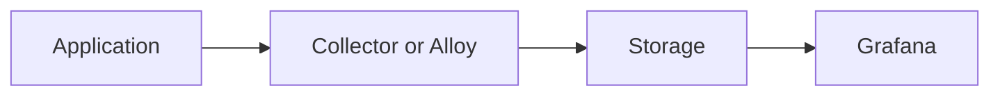
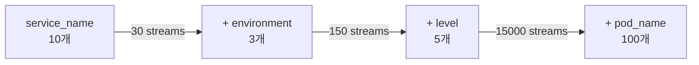
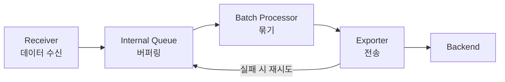
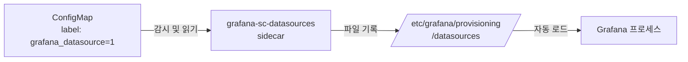
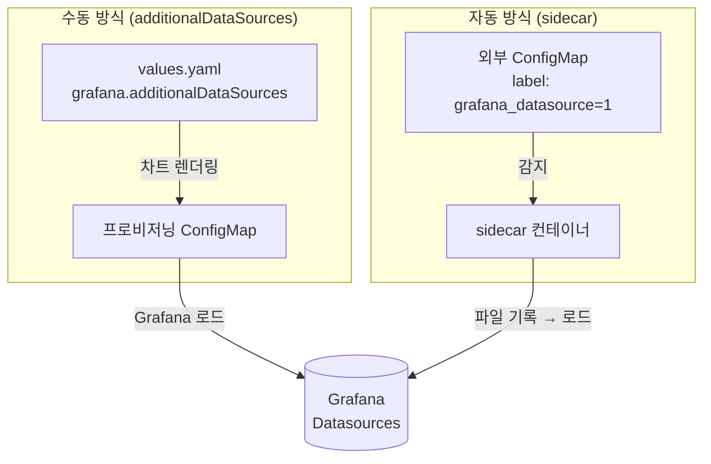

# Ch08. Operations and Troubleshooting

**핵심 질문**: "데이터가 안 보일 때 어디부터 확인해야 하는가?"

---

## 1. 운영에서 가장 흔한 오해

Observability 장애는 종종 "Grafana에 안 보인다"로 보고됩니다.  
하지만 이것은 증상일 뿐 원인이 아닙니다.

원인은 크게 네 계층 중 하나에 있습니다.

1. **Application**: 신호를 아예 안 보냄
2. **Collection**: Alloy나 collector가 못 받거나 버림
3. **Storage**: Loki나 Tempo가 적재 실패
4. **Visualization**: Grafana 데이터소스나 탐색 설정 문제



문제는 이 네 계층을 순서대로 좁히지 않으면, 운영자가 항상 UI만 만지게 된다는 점입니다.

---

## 2. 로그가 안 보일 때 체크리스트

### Step 1. 애플리케이션 로그가 실제로 발생했는가

- 컨테이너 stdout/stderr에 로그가 있는가
- 애플리케이션 로그 레벨이 너무 높게 설정되지 않았는가

### Step 2. 수집기가 로그를 받았는가

- Alloy 또는 collector receiver 상태 확인
- ingest volume이 정상인가
- drop/filter 규칙이 과도하지 않은가

### Step 3. Loki 적재가 성공했는가

- exporter 에러가 없는가
- auth, tenant, endpoint 설정이 맞는가
- 라벨 폭발로 인한 처리 문제는 없는가

### Step 4. Grafana에서 조회 축이 맞는가

- 시간 범위가 맞는가
- 서비스명 라벨이 실제 값과 일치하는가
- datasource가 올바른가

---

## 3. 트레이스가 안 보일 때 체크리스트

### Step 1. trace가 생성되는가

- SDK instrumentation이 적용되어 있는가
- 샘플링이 0%가 아닌가

### Step 2. OTLP export가 되는가

- endpoint가 맞는가
- `4317` 또는 `4318` 연결이 되는가

### Step 3. collector나 Alloy에서 드롭되는가

- tail sampling 정책이 너무 공격적인가
- batch queue가 가득 차지 않았는가

### Step 4. Tempo 적재가 성공하는가

- exporter 실패율
- backend 상태
- tenant나 auth 설정

---

## 4. 비용이 갑자기 늘 때 의심할 것

비용 급증의 근본 원인은 대부분 "데이터 볼륨"이 아니라 "인덱스 또는 처리 복잡도"에 있습니다.

### Loki 비용 증가

Loki 비용의 핵심 변수는 **스트림 수**입니다. 라벨 조합 하나가 스트림 하나를 만들기 때문에, 라벨이 하나 추가될 때마다 스트림 수가 곱으로 늘어날 수 있습니다.



위 예시에서 `pod_name`을 라벨로 올리는 순간 스트림 수가 150에서 15,000으로 100배 증가합니다. `request_id`나 `user_id`를 라벨로 넣으면 이보다 훨씬 심각해집니다.

**진단**: Loki의 `/loki/api/v1/series` 엔드포인트로 활성 스트림 수를 확인합니다.

### Tempo 비용 증가

Tempo 비용은 **저장되는 span 수**에 비례합니다. 샘플링률이 올라가거나, 앱 내부에서 불필요한 span을 과다 생성하면 저장량이 급증합니다. 예를 들어 루프 안에서 매 반복마다 span을 만들거나, 헬스체크 요청마다 trace를 생성하면 비용이 빠르게 늘어납니다.

**진단**: Collector의 `otelcol_exporter_sent_spans` 메트릭으로 초당 span export 수를 모니터링합니다.

### Alloy 비용 증가

Alloy 자체의 CPU/메모리 비용은 파이프라인 복잡도에 비례합니다. 같은 데이터를 여러 목적지로 복제(fan-out)하거나, 복잡한 relabel/transform 규칙을 적용하면 리소스 사용이 늘어납니다.

---

## 5. 백프레셔와 큐를 보는 이유

Collector는 단순 중계기가 아니라 **버퍼가 있는 처리 파이프라인**입니다. 이 구조를 이해하지 않으면 "앱은 보냈는데 데이터가 없다"는 상황을 진단할 수 없습니다.

### Collector 내부 흐름



정상 상태에서는 데이터가 receiver → queue → batch → exporter → backend로 흘러갑니다. 하지만 backend가 느려지거나 네트워크가 불안정하면 exporter가 실패하고, 재시도가 쌓이면서 queue가 차오릅니다.

### Queue가 가득 차면 무슨 일이 생기나

Queue 용량을 초과하면 **새로 들어오는 데이터가 드롭**됩니다. 이것이 백프레셔(backpressure)입니다. 앱 입장에서는 정상적으로 export했지만, collector 내부에서 데이터가 사라지는 것입니다.

| 상태 | receiver | queue | exporter | 결과 |
|------|----------|-------|----------|------|
| 정상 | 수신 중 | 여유 | 성공 | 데이터 정상 전달 |
| 지연 | 수신 중 | 차오름 | 재시도 중 | 일시 지연, 복구 가능 |
| 포화 | 수신 중 | 가득 참 | 실패 | **데이터 드롭** |

### 모니터링 포인트

운영자는 다음 메트릭을 지속적으로 확인해야 합니다.

- **`otelcol_receiver_accepted_spans`**: receiver가 실제로 받은 span 수
- **`otelcol_exporter_send_failed_spans`**: exporter 전송 실패 수
- **`otelcol_exporter_queue_size`**: 현재 queue에 대기 중인 데이터
- **`otelcol_processor_dropped_spans`**: processor에서 드롭된 span 수

이 메트릭들 사이의 비율을 보면 "어디서 데이터가 빠지는지"를 특정할 수 있습니다.

---

## 6. 로그와 트레이스 상관분석이 안 될 때

이 문제는 도구보다 데이터 모델 문제인 경우가 많습니다.

### 대표 원인

- 로그에 `trace_id`가 없음
- 서비스명이 로그와 trace에서 다름
- environment 태그가 일관되지 않음
- 시간 동기화 문제

### 해결 방향

- 로그 패턴 또는 structured metadata에 `trace_id` 유지
- `service.name` 표준화
- 공통 resource 속성 템플릿 적용

---

## 7. 현재 PoC 자산으로 해볼 수 있는 점검

현재 미니 실습에서 바로 확인 가능한 것은 다음입니다.

1. `service-a -> service-b` 호출 시 trace 흐름이 연결되는지 본다.
2. `otel-collector-config.yaml`의 tail sampling 정책이 어떤 trace를 남기는지 본다.
3. Jaeger에서 확인한 trace 관점을 Tempo 개념으로 해석해 본다.

즉, 저장소가 Tempo가 아니어도 **트러블슈팅 사고방식**은 지금 당장 훈련할 수 있습니다.

---

## 8. 운영용 한 줄 정리

"Observability 장애는 UI 문제처럼 보이더라도 실제 원인은 애플리케이션, 수집기, 저장소, 시각화 네 계층 중 하나에 있으므로, 반드시 데이터 흐름 순서대로 좁혀야 합니다."

---

## 9. Helm 차트 배포와 Grafana 프로비저닝

**핵심 질문**: "Helm으로 배포했는데 설정이 내가 원하는 대로 적용되지 않을 때, 어디서 값이 결정되고 있는가?"

### Values 병합 계층: 왜 내 설정이 무시되는가

Helm은 여러 출처의 values를 **deep merge** 방식으로 하나로 합칩니다. 여기서 "deep merge"란 단순히 상위 파일이 하위 파일 전체를 덮어쓰는 것이 아니라, 트리 구조에서 키가 선언된 위치까지 내려가 해당 키만 교체하는 방식입니다. 따라서 상위에서 선언하지 않은 키는 하위 기본값이 그대로 살아남습니다.

우선순위는 낮은 것에서 높은 것 순으로 다음과 같습니다.

```
subchart defaults (가장 낮음)
    → 부모 차트 values.yaml
        → helm install -f 로 지정한 오버라이드 파일 (가장 높음)
```

예를 들어 `loki-stack` 차트를 설치할 때 `grafana.adminPassword`를 따로 지정하지 않으면, Grafana 서브차트의 기본값(`admin`)이 그대로 사용됩니다. "오버라이드하지 않음 = 기본값 유지"는 Helm의 핵심 동작 원칙입니다. 이것을 이해하지 않으면 부모 차트 values.yaml에서 키를 잘못된 위치에 선언했을 때 "왜 적용이 안 되지?"라는 혼란을 겪게 됩니다.

서브차트의 값은 반드시 **부모 values.yaml에서 서브차트 이름을 최상위 키로 사용**해야 전달됩니다.

```yaml
# 부모 차트의 values.yaml
grafana:
  adminPassword: "my-secret"   # ← grafana 서브차트에게 전달됨
  service:
    type: LoadBalancer
```

`grafana.adminPassword`를 설정했더라도 `grafana:` 블록 밖에 쓰면 무시됩니다. Helm은 서브차트 이름과 일치하는 최상위 키 아래의 값만 해당 서브차트로 전달하기 때문입니다.

### Chart.yaml vs values.yaml: 무엇이 실제 배포를 결정하는가

Helm 차트는 두 파일을 명확히 다른 목적으로 사용합니다.

`Chart.yaml`은 차트 자체의 **메타데이터**입니다. 차트 이름, 버전, 의존성 목록, `appVersion` 같은 정보가 여기에 들어갑니다. 중요한 점은 `appVersion`이 **순수 표시용 문자열**이라는 것입니다. `appVersion: "10.4.3"`이라고 써도 실제 배포되는 Grafana 이미지 태그에는 영향을 주지 않습니다. 실제 이미지 태그는 `values.yaml`의 `image.tag` 값으로 결정됩니다.

`values.yaml`은 차트 내부 템플릿(`.yaml.tpl` 파일들)에 주입되어 **실제 K8s 매니페스트를 생성하는 원재료**입니다. Deployment의 replicas, image, resource limits, Service의 type 등 모든 실질적인 K8s 리소스 설정이 여기서 나옵니다.

비유하자면 `Chart.yaml`은 책 표지(제목, 저자, ISBN), `values.yaml`은 책의 내용입니다. 독자가 실제로 읽는 것은 내용이며, 표지의 정보를 바꾼다고 내용이 달라지지 않습니다. `appVersion`을 수정해도 실제 컨테이너 이미지가 바뀌지 않는다는 사실을 모르면 차트 업그레이드 시 혼란이 생깁니다.

### Grafana sidecar datasource 자동 발견: 왜 설정 없이 Loki가 나타나는가

Grafana Helm 차트를 배포하면 Grafana Pod 안에 `grafana-sc-datasources`라는 **sidecar 컨테이너**가 함께 실행됩니다. 이 sidecar는 K8s API를 지속적으로 감시하면서 같은 네임스페이스의 ConfigMap 중 `grafana_datasource: "1"` 라벨이 붙은 것을 찾습니다.



sidecar가 해당 ConfigMap을 발견하면, 그 안의 데이터를 Grafana 컨테이너 내부 `/etc/grafana/provisioning/datasources/` 경로에 파일로 씁니다. Grafana는 이 경로를 주기적으로 스캔하므로 재시작 없이 datasource가 자동 등록됩니다.

이것이 `loki-stack`과 `kube-prometheus-stack`을 **같은 네임스페이스**에 배포했을 때 별도 연동 설정 없이 Loki가 Grafana에 자동으로 나타나는 이유입니다. `loki-stack`의 Loki 서브차트가 해당 라벨이 붙은 ConfigMap을 자동으로 생성하고, `kube-prometheus-stack`의 Grafana sidecar가 이것을 감지하기 때문입니다. 네임스페이스가 다르면 sidecar가 ConfigMap을 감시하는 범위를 벗어나므로 자동 발견이 동작하지 않습니다.

### kube-prometheus-stack vs loki-stack: 어떤 상황에 무엇을 쓰는가

두 차트는 목적이 다릅니다. 이 차이를 이해해야 중복 배포라는 흔한 실수를 피할 수 있습니다.

`kube-prometheus-stack`은 **K8s 클러스터 모니터링에 최적화된 통합 패키지**입니다. Prometheus Operator를 핵심으로 하여 `ServiceMonitor`, `PodMonitor`, `PrometheusRule` 같은 CRD를 제공합니다. 덕분에 YAML 파일 하나로 "이 서비스의 메트릭을 수집해라"는 선언적 설정이 가능합니다. K8s 노드, 파드, API 서버 등을 위한 60개 이상의 알림 규칙이 기본 내장되어 있으며, Grafana, Alertmanager, kube-state-metrics, node-exporter가 모두 하나의 차트에 포함됩니다.

`loki-stack`은 **로그 수집 중심의 독립 차트**입니다. Loki를 핵심으로 하되, 서브차트로 Grafana, Prometheus, Promtail 등을 enabled/disabled 플래그로 선택적으로 함께 배포할 수 있습니다. Operator 없이 각 컴포넌트를 직접 Deployment/StatefulSet으로 배포하므로 구조가 단순하지만, CRD 기반의 선언적 모니터링 규칙은 지원하지 않습니다.

실무에서는 `kube-prometheus-stack`으로 메트릭/알림 인프라를 구성한 뒤 Grafana를 활성화하고, `loki-stack`은 `grafana.enabled: false`로 설정하여 Loki와 Promtail만 배포하는 패턴이 일반적입니다.

### Grafana 중복 배포 문제: 왜 두 차트를 함께 쓸 때 주의해야 하는가

여러 차트가 각각 Grafana를 서브차트로 포함할 때, 두 차트 모두에서 Grafana를 enabled 상태로 두면 **같은 네임스페이스에 Grafana가 두 개** 배포됩니다. 두 인스턴스는 별개의 설정과 데이터를 가지므로 어느 쪽에 접속했느냐에 따라 보이는 대시보드가 달라지고, 운영자가 혼란에 빠지기 쉽습니다.

해결책은 단순합니다. 하나의 차트(보통 더 포괄적인 `kube-prometheus-stack`)에서만 Grafana를 활성화하고, 나머지 차트에서는 비활성화합니다.

```yaml
# kube-prometheus-stack values.yaml
grafana:
  enabled: true   # 이 인스턴스를 사용

# loki-stack values.yaml
grafana:
  enabled: false  # Grafana 중복 배포 방지
```

datasource 연동은 앞서 설명한 sidecar ConfigMap 라벨 메커니즘으로 자동 해결됩니다. Loki 배포 시 생성되는 ConfigMap의 `grafana_datasource: "1"` 라벨을 `kube-prometheus-stack`의 Grafana sidecar가 감지하여 자동으로 Loki datasource를 등록합니다.

### additionalDataSources vs sidecar 자동 발견: 같은 목적의 두 경로

Grafana datasource를 등록하는 방법은 두 가지입니다.

**수동 방식**: `values.yaml`의 `grafana.additionalDataSources` 필드에 직접 datasource 정의를 선언합니다. 이 값은 차트 배포 시 프로비저닝 ConfigMap으로 변환되어 Grafana에 주입됩니다.

**자동 방식**: 앞서 설명한 sidecar 감시 메커니즘입니다. 네임스페이스 내에서 `grafana_datasource: "1"` 라벨이 붙은 ConfigMap이 생성되면 sidecar가 자동으로 등록합니다.

두 방식 모두 활성화된 상태에서 **동일한 datasource를 이중으로 설정하면 Grafana에 같은 datasource가 두 개 표시됩니다.** 이것이 `loki-stack`과 `kube-prometheus-stack`을 같은 네임스페이스에서 사용할 때 `grafana.additionalDataSources`에 Loki를 수동 추가하면 안 되는 이유입니다.



같은 네임스페이스에서 sidecar가 정상 동작한다면, 수동으로 `additionalDataSources`를 추가하는 것은 중복이 됩니다. sidecar가 이미 처리하고 있기 때문입니다. 반대로 다른 네임스페이스이거나 sidecar가 비활성화된 환경에서는 `additionalDataSources`를 통한 수동 선언이 필요합니다.

### 운영 시 확인 포인트 요약

Helm 배포 후 설정이 예상대로 되지 않을 때 확인할 순서는 다음과 같습니다.

1. `helm get values <release>` 로 실제 적용된 values 전체를 확인합니다. 이것이 렌더링에 사용된 최종 값입니다.
2. `helm template <chart>` 로 실제 생성될 K8s 매니페스트를 사전에 출력하여 의도대로 렌더링되는지 검증합니다.
3. Grafana datasource가 없을 때는 `kubectl get configmap -n <namespace> -l grafana_datasource=1` 로 sidecar가 감시할 ConfigMap이 존재하는지 확인합니다.
4. Grafana datasource가 중복될 때는 `additionalDataSources` 설정과 ConfigMap 라벨 양쪽을 모두 점검합니다.
