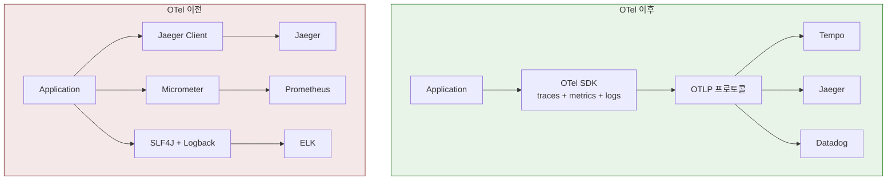
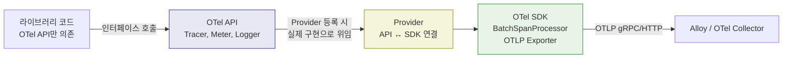
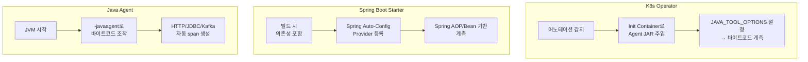
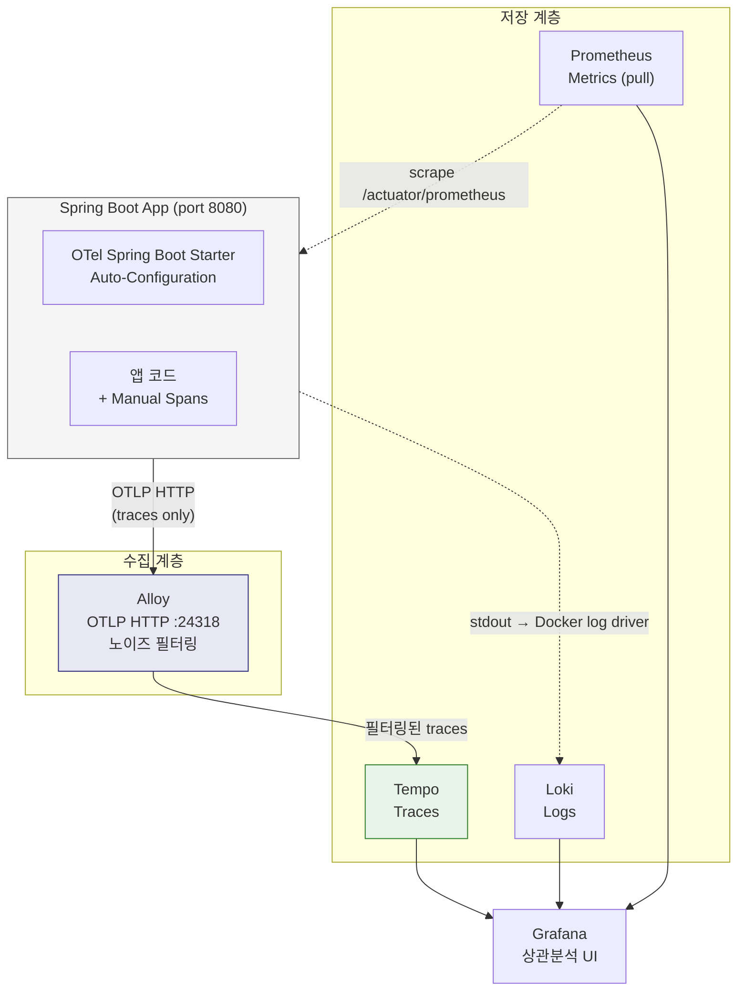

# Ch09. Application Instrumentation

**핵심 질문**: "애플리케이션이 텔레메트리를 생성하려면 무엇을 설정해야 하고, OpenTelemetry는 이 문제를 어떻게 해결하는가?"

---

## 1. 계측 없는 애플리케이션의 문제

Ch02~Ch08에서 Alloy(수집기), Loki(로그), Tempo(트레이스), Mimir(메트릭)를 다뤘다. 이들은 모두 텔레메트리를 받아서 저장하고 조회하는 파이프라인이다. 그런데 파이프라인이 아무리 잘 갖춰져 있어도, 애플리케이션이 텔레메트리를 생성하지 않으면 파이프라인에 들어갈 데이터 자체가 없다.

계측(instrumentation)이 없는 애플리케이션에서 장애가 발생하면 어떤 일이 벌어지는가? 운영자는 로그를 grep하고, 타임스탬프를 눈으로 비교하고, "아마 이 서비스가 느렸을 것이다"라고 추측한다. 서비스가 3개일 때는 이것으로 버틸 수 있지만, 20개가 넘어가면 요청 하나가 어떤 경로를 따라 흘러갔는지 파악하는 것 자체가 불가능해진다.

계측은 이 문제를 해결한다. 애플리케이션이 스스로 "나는 지금 이 작업을 시작했고, 이만큼 걸렸고, 이 결과를 냈다"는 정보를 구조화된 형태로 내보내는 것이다. 이 정보가 trace, metric, log라는 세 가지 신호로 표현되고, 파이프라인을 통해 저장소에 도달한다.

그렇다면 질문은 이것이다. **애플리케이션이 이 세 가지 신호를 생성하려면 구체적으로 무엇을 해야 하는가?**

---

## 2. OpenTelemetry란 무엇인가

### 계측 표준이 없던 시절

OpenTelemetry 이전에는 분산 추적 라이브러리가 난립했다. Jaeger 클라이언트, Zipkin 클라이언트, Datadog APM SDK, New Relic Agent 등 벤더마다 고유한 SDK를 제공했고, 한 번 선택하면 다른 벤더로 전환하기가 어려웠다. 메트릭은 Micrometer나 Prometheus 클라이언트를 따로 쓰고, 로그는 SLF4J/Logback을 쓰는 식으로 세 신호의 생성 방식이 완전히 분리되어 있었다.

이 상황의 문제는 두 가지다. 첫째, 벤더 락인이 발생한다. Jaeger 클라이언트로 계측한 코드를 Tempo로 전환하려면 코드를 다시 작성해야 한다. 둘째, 세 신호 간 상관관계가 깨진다. 트레이스 라이브러리와 로그 라이브러리가 별도로 동작하므로, 로그에 trace_id를 자동으로 심는 것 같은 연결이 자연스럽지 않다.

### OTel의 해결: 벤더 중립 계측 표준

OpenTelemetry(OTel)는 CNCF 프로젝트로, **traces, metrics, logs 세 신호를 하나의 통합된 API/SDK로 생성하는 벤더 중립 표준**이다. 핵심 아이디어는 "계측 코드는 한 번만 작성하고, 데이터를 어디로 보낼지는 설정으로 결정한다"는 것이다.

OTel 이전과 이후를 비교하면 차이가 명확하다.



OTel을 쓰면 애플리케이션 코드는 OTel API만 호출한다. 데이터를 Jaeger로 보낼지 Tempo로 보낼지는 Exporter 설정만 바꾸면 된다. 벤더를 교체해도 애플리케이션 코드를 수정할 필요가 없다.

### OTel의 범위

OTel이 커버하는 영역과 커버하지 않는 영역을 구분하는 것이 중요하다.

| OTel이 하는 것 | OTel이 하지 않는 것 |
|---------------|-------------------|
| 텔레메트리 생성 (API/SDK) | 텔레메트리 저장 (Loki, Tempo, Mimir의 역할) |
| 데이터 전송 프로토콜 (OTLP) | 데이터 시각화 (Grafana의 역할) |
| 자동 계측 라이브러리 | 알림 규칙, 대시보드 정의 |
| Collector를 통한 가공/라우팅 | 장기 보관 정책 |

OTel은 **생성과 전송**에만 집중한다. 저장과 시각화는 LGTM 스택의 다른 컴포넌트가 담당한다. 이 경계를 이해하면 "OTel을 도입하면 Grafana가 필요 없는가?" 같은 혼동이 사라진다.

---

## 3. OTel SDK의 구조: API / SDK / Provider

OpenTelemetry의 핵심 설계는 **API와 SDK를 분리**한 것이다. 이 분리가 왜 중요한지 이해하려면, 라이브러리 개발자의 입장을 생각해 보면 된다.

### 왜 분리했는가

HTTP 클라이언트 라이브러리를 만들고 있다고 하자. 이 라이브러리에 요청 시간을 추적하는 span을 추가하고 싶다. 그런데 최종 사용자가 Jaeger를 쓸지, Tempo를 쓸지, 아예 추적을 끌지 라이브러리 개발자는 알 수 없다. API만 의존하면 이 문제가 해결된다. 라이브러리는 `Tracer.spanBuilder("http-request")`를 호출하기만 하고, 실제로 span이 어디로 전송될지는 최종 앱이 SDK를 등록하면서 결정한다.

| 계층 | 역할 | 누가 의존하는가 | 크기 |
|------|------|----------------|------|
| **API** | 인터페이스 정의 (Tracer, Meter, Logger) | 라이브러리, 앱 코드 | 가벼움 (no-op 기본 구현) |
| **SDK** | 실제 처리 구현 (배칭, 샘플링, export) | 최종 애플리케이션만 | 무거움 (설정, 의존성 다수) |
| **Provider** | API와 SDK를 연결하는 등록 지점 | 앱 시작 코드 | 초기화 시 1회 |

Provider를 등록하지 않으면 API 호출은 아무 일도 하지 않는다(no-op). 이것이 의도된 동작이다. 라이브러리가 OTel API를 사용하더라도, 최종 앱이 SDK를 설정하지 않으면 성능 오버헤드가 0에 가깝다.



### 세 신호의 Provider

OTel SDK는 세 신호 각각에 대해 별도의 Provider를 갖는다.

| Provider | 생성하는 신호 | 주요 Processor |
|----------|-------------|---------------|
| `TracerProvider` | Spans (traces) | `BatchSpanProcessor` → OTLP Exporter |
| `MeterProvider` | Metrics | `PeriodicMetricReader` → OTLP Exporter |
| `LoggerProvider` | Logs | `BatchLogRecordProcessor` → OTLP Exporter |

세 Provider가 모두 같은 OTLP Exporter를 통해 Collector로 데이터를 보낸다. 프로토콜이 통일되어 있으므로 Collector 설정도 단순해진다.

### Propagation: 컨텍스트 전파

분산 추적이 동작하려면 서비스 A가 서비스 B를 호출할 때 trace_id와 span_id가 함께 전달되어야 한다. 이 역할을 하는 것이 **Propagator**다.

```
Service A → HTTP Header에 traceparent 삽입 → Service B가 헤더에서 추출 → 같은 trace에 연결
```

W3C TraceContext 형식이 기본이며, 헤더는 이렇게 생겼다.

```
traceparent: 00-4bf92f3577b34da6a3ce929d0e0e4736-00f067aa0ba902b7-01
              ──  ────────trace_id────────  ────span_id──── ─flags
```

- `trace_id`: 전체 요청 경로를 식별하는 32자리 hex
- `span_id`: 현재 작업 단위를 식별하는 16자리 hex
- `flags`: `01`이면 샘플링됨, `00`이면 샘플링 안 됨

서비스 B가 이 헤더를 받으면 동일한 trace_id로 자식 span을 생성한다. 이렇게 서비스 간 context가 전파되어야 Tempo에서 하나의 요청 경로를 완전한 trace로 볼 수 있다. Propagator가 빠지면 각 서비스가 독립된 trace를 생성하므로, 분산 추적이 끊긴다.

---

## 4. Auto-Instrumentation: 코드 수정 없는 계측

수동으로 모든 HTTP 호출, DB 쿼리, 메시지 발행에 span을 추가하는 것은 현실적이지 않다. Auto-instrumentation은 프레임워크와 라이브러리의 진입/종료 지점에 자동으로 span을 추가해서, 코드 한 줄 수정 없이 기본 추적을 활성화한다.

Java 생태계에서 자동 계측을 적용하는 방법은 세 가지이며, 각각 동작 원리가 다르다.

### Java Agent (`-javaagent`)

JVM이 클래스를 로드하는 시점에 바이트코드를 조작(bytecode manipulation)하여 계측 코드를 주입한다. `java.lang.instrument` API를 사용하며, 앱의 소스 코드나 빌드 스크립트를 전혀 변경하지 않는다.

```bash
java -javaagent:opentelemetry-javaagent.jar \
     -Dotel.service.name=checkout \
     -Dotel.exporter.otlp.endpoint=http://alloy:4317 \
     -jar myapp.jar
```

**동작 원리를 좀 더 들여다보면:** Agent는 JVM이 `HttpServlet.service()`, `DataSource.getConnection()`, `KafkaProducer.send()` 같은 메서드를 로드할 때, 메서드 앞뒤에 span 시작/종료 코드를 삽입한다. 원본 클래스 파일은 변경되지 않고, 메모리에 로드되는 바이트코드만 바뀐다.

**자동으로 계측되는 대상** (일부):

| 카테고리 | 라이브러리/프레임워크 | 생성되는 span |
|----------|---------------------|-------------|
| HTTP 서버 | Spring MVC, Servlet | `GET /api/orders` |
| HTTP 클라이언트 | RestTemplate, WebClient, OkHttp | `HTTP GET https://payment-svc/pay` |
| 데이터베이스 | JDBC, Hibernate, R2DBC | `SELECT orders WHERE id=?` |
| 메시징 | Kafka Producer/Consumer, RabbitMQ | `order-events send`, `order-events receive` |
| gRPC | gRPC Client/Server | `grpc.service.Method` |
| 캐시 | Jedis, Lettuce (Redis) | `GET cache:user:123` |

**장점**: 코드 수정 0, 계측 범위가 넓음, 별도 JAR 하나만 추가
**단점**: 바이트코드 조작이므로 JVM 시작 시간이 약간 늘어남 (보통 1~3초), Agent 버전에 따라 특정 라이브러리와 호환성 이슈 가능

### Spring Boot Starter

Gradle/Maven 의존성으로 추가하는 방식이다. Spring Boot의 Auto-Configuration 메커니즘을 활용해서 `TracerProvider`, `MeterProvider`를 자동으로 설정한다.

```kotlin
// build.gradle.kts
dependencies {
    implementation("io.opentelemetry.instrumentation:opentelemetry-spring-boot-starter")
}
```

```yaml
# application.yml
otel:
  service:
    name: checkout
  exporter:
    otlp:
      endpoint: http://alloy:4317
  traces:
    sampler:
      type: parentbased_traceidratio
      arg: 0.1   # 10% 샘플링
```

**Java Agent와의 핵심 차이**: Agent는 JVM 외부에서 바이트코드를 조작하지만, Starter는 Spring의 Bean 등록과 AOP를 통해 계측한다. JAR 안에 포함되므로 어디서든 동일하게 동작한다는 장점이 있지만, Spring 생태계 밖의 라이브러리(순수 JDBC, raw Kafka client 등)는 계측 범위가 Agent보다 좁을 수 있다.

### K8s Operator (OTel Operator)

Kubernetes 환경에서 Pod의 어노테이션만 추가하면 Init Container가 Java Agent를 자동 주입한다. 앱 빌드를 전혀 건드리지 않는다.

```yaml
apiVersion: apps/v1
kind: Deployment
metadata:
  name: checkout
spec:
  template:
    metadata:
      annotations:
        instrumentation.opentelemetry.io/inject-java: "true"  # 이 한 줄이 전부
    spec:
      containers:
        - name: checkout
          image: checkout:1.0
```

**동작 과정:**
1. OTel Operator가 `inject-java: "true"` 어노테이션을 감지
2. Pod 스펙에 Init Container를 자동 추가 — Agent JAR을 다운로드
3. 메인 컨테이너의 `JAVA_TOOL_OPTIONS`에 `-javaagent` 옵션을 주입
4. JVM 시작 시 Agent가 바이트코드 계측 수행

플랫폼팀이 `Instrumentation` CRD(Custom Resource Definition)로 Exporter endpoint, 샘플링 비율, Resource 속성을 중앙에서 관리할 수 있다는 점이 큰 장점이다. 개발팀은 계측에 대해 아무것도 몰라도 된다.

### 실전: TPS Helm Chart에 OTel Operator 적용하기

TPS 프로젝트의 Helm 차트(`tps-helm/`)는 umbrella chart 구조로 14개 Java API 서비스를 관리한다. OTel Operator를 사용하면 Deployment마다 Agent 경로, JVM 옵션, 설정 파일을 반복할 필요 없이, **CRD 1개 + 어노테이션 1줄**로 전체 서비스에 계측을 적용할 수 있다.

**Step 1. Instrumentation CRD 정의** — parent chart에 1개만 추가

```yaml
# templates/otel-instrumentation.yaml
{{- if .Values.global.otel.enabled }}
apiVersion: opentelemetry.io/v1alpha1
kind: Instrumentation
metadata:
  name: tps-otel-instrumentation
  namespace: trb-app
spec:
  exporter:
    endpoint: {{ .Values.global.otel.collectorEndpoint }}
  propagators:
    - tracecontext        # W3C TraceContext
    - baggage
  sampler:
    type: parentbased_traceidratio
    argument: "{{ .Values.global.otel.samplingRatio }}"
  java:
    image: ghcr.io/open-telemetry/opentelemetry-operator/autoinstrumentation-java:latest
    env:
      - name: OTEL_INSTRUMENTATION_SPRING_SCHEDULING_ENABLED
        value: "false"    # @Scheduled 노이즈 차단
      - name: OTEL_METRICS_EXPORTER
        value: "none"     # 메트릭은 기존 Prometheus scrape 유지
      - name: OTEL_LOGS_EXPORTER
        value: "none"     # 로그는 기존 stdout 유지
  resource:
    resourceAttributes:
      deployment.environment: {{ .Values.global.otel.environment }}
{{- end }}
```

이 CRD 하나가 모든 Java 서비스의 계측 설정을 중앙에서 관리한다. Collector endpoint, 샘플링 비율, Agent 버전을 한 곳에서 바꾸면 전체 서비스에 적용된다.

**Step 2. 각 서비스 Deployment에 어노테이션 추가**

```yaml
# charts/{service}/templates/deployment.yaml
spec:
  template:
    metadata:
      labels:
        {{- include "common.labels" . | nindent 8 }}
      annotations:
        {{- if .Values.global.otel.enabled }}
        instrumentation.opentelemetry.io/inject-java: "true"
        {{- end }}
```

기존 Deployment 템플릿의 `annotations` 블록에 조건부로 1줄 추가하는 것이 전부다. Operator가 이 어노테이션을 감지하면 Pod 생성 시 Init Container를 주입하고, `JAVA_TOOL_OPTIONS`에 `-javaagent`를 자동 설정한다.

**Step 3. values.yaml에 OTel 설정 추가**

```yaml
# values.yaml (기본값 — 기본 비활성화)
global:
  otel:
    enabled: false
    collectorEndpoint: "http://alloy.monitoring.svc:4317"
    samplingRatio: "0.1"
    environment: "dev"

# values-dev.yaml (개발계)
global:
  otel:
    enabled: true
    collectorEndpoint: "http://alloy.monitoring.svc:4317"
    samplingRatio: "1.0"     # 개발계는 전수 수집
    environment: "dev"

# values-stg.yaml (스테이징)
global:
  otel:
    enabled: true
    collectorEndpoint: "http://alloy.monitoring.svc:4317"
    samplingRatio: "0.5"     # 스테이징은 50%
    environment: "staging"

# values-op.yaml (운영)
global:
  otel:
    enabled: true
    collectorEndpoint: "http://alloy.monitoring.svc:4317"
    samplingRatio: "0.1"     # 운영은 10%
    environment: "production"
```

**이 구조의 이점:**

| 항목 | 설명 |
|------|------|
| **중앙 관리** | Instrumentation CRD 1개로 Agent 버전, endpoint, 샘플링 일괄 제어 |
| **Deployment 변경 최소** | 서비스당 어노테이션 1줄만 추가 (env, volume 불필요) |
| **환경별 분리** | values-dev/stg/op에서 샘플링 비율만 바꾸면 됨 |
| **버전 업그레이드** | CRD의 `java.image` 태그 변경 → 전체 서비스 Rolling Update |
| **벤더 중립** | Collector endpoint만 바꾸면 Tempo/Jaeger/Datadog 교체 가능 |
| **on/off 토글** | `global.otel.enabled: false`로 즉시 비활성화 (코드 변경 없음) |

TPS처럼 동일 기술 스택(Spring Boot)의 서비스가 15개인 환경에서 OTel Operator의 가치가 극대화된다. 개발팀은 어노테이션 1줄만 확인하면 되고, 나머지 계측 설정은 플랫폼팀이 CRD에서 관리한다.

### 세 방식의 비교



| 기준 | Java Agent | Spring Boot Starter | K8s Operator |
|------|-----------|-------------------|-------------|
| **코드 변경** | 없음 | build.gradle 1줄 | 없음 |
| **계측 범위** | 넓음 (150+ 라이브러리) | Spring 생태계 중심 | Agent와 동일 |
| **관리 주체** | 개발팀 (JVM 옵션) | 개발팀 (빌드 의존성) | 플랫폼팀 (CRD) |
| **비-K8s 환경** | 가능 | 가능 | 불가능 |
| **버전 일괄 업그레이드** | 어려움 (앱별 관리) | 어려움 (앱별 관리) | 쉬움 (CRD 1곳) |
| **Spring 외 프레임워크** | 지원 | 미지원 | 지원 |

**선택 기준 정리:**

| 상황 | 권장 방식 | 이유 |
|------|----------|------|
| 로컬 개발, Docker Compose, VM 배포 | Spring Boot Starter | JAR 하나로 완결, 인프라 의존 없음 |
| K8s + 플랫폼팀 중앙 관리 | K8s Operator | 코드 수정 없이 버전 일괄 업그레이드 |
| 비-Spring Java 앱 (Quarkus, Vert.x 등) | Java Agent | Spring Auto-Config 불가 |
| 여러 언어 혼용 환경 (Java + Go + Python) | K8s Operator | 언어별 통일된 주입 방식 |

**주의**: Agent + Starter를 동시에 쓰면 `TracerProvider`가 두 개 등록되어 span이 중복된다. 환경당 하나만 선택해야 한다.

---

## 5. Manual Instrumentation: 비즈니스 로직 계측

Auto-instrumentation은 프레임워크 경계(HTTP 진입, DB 호출, 메시지 발행)를 자동으로 추적한다. 하지만 비즈니스 로직 내부 — "재고 확인 → 가격 계산 → 할인 적용 → 결제 요청" 같은 흐름 — 은 프레임워크가 알 수 없으므로 수동으로 span을 추가해야 한다.

### 기본 패턴: Span 생성과 종료

```java
import io.opentelemetry.api.trace.Tracer;
import io.opentelemetry.api.trace.Span;
import io.opentelemetry.context.Scope;

@Service
public class OrderService {

    private final Tracer tracer;

    public OrderService(Tracer tracer) {
        this.tracer = tracer;
    }

    public Order processOrder(String orderId) {
        Span span = tracer.spanBuilder("process-order")
            .setAttribute("order.id", orderId)
            .startSpan();

        try (Scope scope = span.makeCurrent()) {
            Order order = validateOrder(orderId);
            Payment payment = requestPayment(order);
            span.setAttribute("order.total", order.getTotal());
            span.setAttribute("payment.status", payment.getStatus());
            return order;
        } catch (Exception e) {
            span.setStatus(StatusCode.ERROR, e.getMessage());
            span.recordException(e);  // 예외 정보를 span event로 기록
            throw e;
        } finally {
            span.end();  // 반드시 end()를 호출해야 span이 완성됨
        }
    }
}
```

`makeCurrent()`는 현재 span을 thread-local context에 등록한다. 이렇게 해야 `requestPayment()` 안에서 생성되는 자식 span이 이 span의 하위에 연결된다. `makeCurrent()` 없이 span을 만들면 부모-자식 관계가 끊어져서 trace가 분절된다.

### Spring에서의 간편한 방법: @WithSpan

매번 try-finally로 span을 관리하는 것이 번거로우면, `@WithSpan` 어노테이션을 사용할 수 있다.

```java
@Service
public class PaymentService {

    @WithSpan("validate-payment-method")
    public boolean validatePaymentMethod(
            @SpanAttribute("payment.method") String method,
            @SpanAttribute("payment.amount") double amount) {
        // 메서드 진입 시 자동으로 span 시작, 종료 시 자동 end()
        // @SpanAttribute로 파라미터를 span attribute에 추가
        return method != null && amount > 0;
    }
}
```

`@WithSpan`은 Spring AOP를 통해 동작하며, 메서드 시작/종료에 맞춰 span을 자동 관리한다. 단, AOP의 한계로 같은 클래스 내 메서드 호출(`this.method()`)에서는 동작하지 않는다.

### Span Event: span 안에서의 시점 기록

span은 "시작~종료" 구간을 표현하지만, 그 안에서 특정 시점에 무슨 일이 있었는지 기록하고 싶을 때 **Span Event**를 사용한다.

```java
Span span = Span.current();
span.addEvent("inventory-checked", Attributes.of(
    AttributeKey.longKey("available.quantity"), 42L,
    AttributeKey.stringKey("warehouse"), "SEOUL-01"
));
```

Event는 새로운 span을 만드는 것이 아니라 기존 span에 타임스탬프가 찍힌 마커를 추가하는 것이다. 재고 확인, 캐시 히트/미스, 외부 API 응답 수신 같은 시점을 기록하기에 적합하다.

### Breadth-First 원칙

수동 계측에서 가장 중요한 원칙은 **breadth-first**(넓이 우선)다.

```
✅ 올바른 순서:
1단계: 모든 서비스에 auto-instrumentation 적용 → end-to-end 가시성 확보
2단계: 병목이 발견된 서비스에만 manual span 추가 → 세부 구간 식별

❌ 잘못된 순서:
한 서비스에 manual span을 50개 추가하는데, 나머지 서비스는 계측 없음
→ 전체 요청 경로를 볼 수 없으므로 투자 대비 효과 낮음
```

분산 환경에서 end-to-end 가시성이 한 서비스의 세밀한 디테일보다 가치가 크기 때문이다. 또한 새 span을 만들기보다 **기존 span에 attribute를 추가**하는 것이 나을 때가 많다. span이 너무 많아지면 trace가 읽기 어려워지고 저장 비용도 늘어난다.

---

## 6. 필수 Resource 속성

텔레메트리에는 "무엇이 일어났는가"뿐 아니라 **"어디서 일어났는가"**도 필요하다. Resource 속성이 이 역할을 한다. Grafana에서 서비스를 선택하거나, 환경별로 필터링하거나, 배포 버전별 성능을 비교할 때 모두 Resource 속성을 기준으로 한다.

### 필수 속성과 그 이유

| 속성 | 용도 | 왜 필요한가 |
|------|------|-----------|
| `service.name` | 서비스 식별 | Grafana, Tempo, Loki 모두 이 값으로 서비스를 구분한다. 설정하지 않으면 `unknown_service`로 표시되어 쓸모없는 데이터가 된다 |
| `service.version` | 배포 버전 | "v1.2.3 배포 후 에러가 늘었는가?"를 확인하려면 버전 정보가 span에 있어야 한다 |
| `deployment.environment` | 환경 구분 | dev/staging/prod 데이터를 분리하지 않으면 개발 테스트가 prod 메트릭을 오염시킨다 |
| `service.instance.id` | 인스턴스 식별 | "3대 중 1대만 에러가 나는가?"를 확인할 때 필요하다. Pod 이름이나 IP가 흔히 쓰인다 |

### 설정 방법

환경변수로 설정하는 것이 가장 보편적이다.

```bash
# 환경변수 방식
OTEL_RESOURCE_ATTRIBUTES=service.name=checkout,service.version=1.2.3,deployment.environment=prod
```

Spring Boot Starter를 쓴다면 `application.yml`에서도 가능하다.

```yaml
otel:
  resource:
    attributes:
      service.name: checkout
      service.version: 1.2.3
      deployment.environment: prod
```

### K8s 환경의 자동 감지

K8s에서는 Resource Detector가 `k8s.namespace.name`, `k8s.pod.name`, `k8s.node.name` 같은 속성을 자동으로 채운다. 하지만 **`service.name`과 `service.version`은 자동 감지되지 않으므로 직접 지정해야 한다.** 이 두 값이 없으면 Grafana에서 서비스를 구분할 수 없다.

### Resource 속성과 Loki 라벨의 관계

Ch04에서 다뤘듯이 Loki의 라벨은 카디널리티가 낮아야 한다. OTel Resource 속성 중 `service.name`이나 `deployment.environment`는 카디널리티가 낮으므로 Loki 라벨로 승격(promote)하기 적합하다. 반면 `service.instance.id`는 Pod가 재시작될 때마다 바뀔 수 있으므로 Structured Metadata에 넣는 것이 안전하다.

이 승격 결정은 Alloy의 설정에서 이루어지지만, 어떤 속성을 승격할지의 설계 판단은 Loki의 라벨 전략에 속한다.

---

## 7. SDK 설정과 샘플링 전략

SDK 설정은 코드가 아닌 환경변수나 설정 파일로 관리하는 것이 원칙이다. 환경마다 endpoint, 샘플링 비율, 배치 크기가 다르기 때문이다.

### 핵심 환경변수

```bash
# 서비스 이름
OTEL_SERVICE_NAME=checkout

# Collector 엔드포인트 (gRPC: 4317, HTTP: 4318)
OTEL_EXPORTER_OTLP_ENDPOINT=http://alloy:4317

# 프로토콜 선택 (grpc 또는 http/protobuf)
OTEL_EXPORTER_OTLP_PROTOCOL=grpc

# 샘플링 전략
OTEL_TRACES_SAMPLER=parentbased_traceidratio
OTEL_TRACES_SAMPLER_ARG=0.1

# 로그 레벨
OTEL_LOG_LEVEL=info

# 비활성화할 계측 (특정 라이브러리 제외)
OTEL_INSTRUMENTATION_COMMON_DB_STATEMENT_SANITIZER_ENABLED=true
```

### 샘플링이 왜 중요한가

프로덕션에서 모든 요청의 trace를 저장하면 비용이 폭발한다. 초당 1,000 요청의 서비스에서 평균 span이 10개라면, 분당 60만 개의 span이 생성된다. 대부분의 정상 요청은 동일한 패턴이므로 전부 저장할 필요가 없다. 샘플링은 대표적인 trace만 선택해서 저장 비용을 제어한다.

### 샘플링 전략 비교

| 전략 | 설정값 | 동작 | 적합한 상황 |
|------|-------|------|-----------|
| Always On | `always_on` | 모든 trace 수집 | 개발/스테이징 환경 |
| Always Off | `always_off` | 수집 안 함 | 계측 비활성화 |
| TraceIdRatio | `traceidratio` | 확률적 샘플링 (예: 10%) | 단독 서비스 |
| ParentBased + Ratio | `parentbased_traceidratio` | 부모 span의 결정을 따름 + 루트는 비율 적용 | **프로덕션 권장** |

**`parentbased_traceidratio`가 프로덕션에서 권장되는 이유**: 서비스 A가 10% 샘플링으로 trace를 시작했는데, 서비스 B가 독립적으로 20% 샘플링을 적용하면 하나의 trace에서 일부 span만 존재하는 "불완전한 trace"가 생긴다. `parentbased`는 부모의 샘플링 결정을 자식이 그대로 따르므로, trace가 완전하거나 아예 없거나 둘 중 하나가 된다.

```
# parentbased_traceidratio 동작 예시
Service A (루트): 10% 확률로 샘플링 결정 → "이 trace는 수집한다"
  → Service B: 부모가 "수집"이라고 했으므로 무조건 수집
    → Service C: 마찬가지로 무조건 수집
→ 결과: 완전한 trace (A → B → C 모든 span 존재)

Service A (루트): 90% 확률로 "수집 안 함" 결정
  → Service B: 부모가 "안 함"이라고 했으므로 수집 안 함
→ 결과: trace 자체가 없음 (불완전한 trace 방지)
```

### Tail-Based Sampling

Head-based sampling(위의 방식)은 trace 시작 시점에 수집 여부를 결정한다. 하지만 에러가 발생한 trace는 비율과 무관하게 100% 수집하고 싶을 수 있다. 이때 **tail-based sampling**을 Collector(Alloy)에서 적용한다.

```
앱 → 모든 trace를 Collector로 전송 → Collector가 trace 완성 후 판단:
  - 에러 span이 있으면 → 저장
  - 레이턴시가 P99 이상이면 → 저장
  - 정상이고 빠르면 → 10%만 저장
```

tail-based sampling은 Collector에서 trace를 일정 시간 버퍼링한 후 결정하므로 메모리를 더 사용하지만, "에러는 놓치지 않으면서 비용을 절감"하는 전략이 가능하다.

---

## 8. 실제 프로젝트로 보는 계측 적용 (redpanda-playground)

이론만으로는 "실제로 어떻게 설정하는가"가 와닿지 않는다. redpanda-playground 프로젝트의 실제 구성을 따라가면서 앞에서 다룬 개념들이 코드에서 어떻게 구현되는지 확인한다.

### 전체 아키텍처



주목할 점은 **세 신호의 전송 경로가 다르다**는 것이다.

OTel의 정석 구조라면 세 신호가 모두 동일한 경로를 탄다. 앱이 OTel SDK로 traces, logs, metrics를 생성하고, OTLP 프로토콜로 Alloy(Collector)에 push하면, Alloy가 단일 진입점으로서 필터링/라우팅/enrichment를 처리한 뒤 각 백엔드(Tempo, Loki, Mimir)로 분배한다.

```
정석 구조: 앱 ──OTLP──▶ Alloy ──▶ Tempo  (traces)
          앱 ──OTLP──▶ Alloy ──▶ Loki   (logs)
          앱 ──OTLP──▶ Alloy ──▶ Mimir  (metrics)
```

그러나 이 프로젝트에서는 traces만 OTel 경로를 타고, 나머지 둘은 기존 인프라 방식을 유지한다.

```
이 프로젝트: 앱 ──OTLP──▶ Alloy ──▶ Tempo         (traces: OTel push)
            앱 ──stdout──▶ Docker ──▶ Alloy ──▶ Loki  (logs: 인프라 수집)
            앱 ◀──scrape── Prometheus                   (metrics: pull)
```

왜 정석대로 하지 않았는가? 이미 Docker log driver와 Prometheus scrape가 잘 돌고 있었기 때문이다. 이것을 OTLP로 전환하려면 OTel Logback Appender 추가, Docker 수집 비활성화, Micrometer OTLP exporter 설정, Prometheus scrape 제거, Mimir 도입 등 기존 인프라를 걷어내고 새로 연결하는 작업이 필요하다. traces라는 새 신호를 도입하는 것만으로도 end-to-end 가시성이라는 핵심 가치를 얻을 수 있으므로, 나머지는 건드리지 않는 점진적 도입 전략을 택했다.

### Step 1: Spring Boot Starter 설정 — build.gradle + application.yml

```groovy
// build.gradle (root) — OTel BOM으로 버전 통일
dependencyManagement {
    imports {
        mavenBom org.springframework.boot.gradle.plugin.SpringBootPlugin.BOM_COORDINATES
        mavenBom 'io.opentelemetry.instrumentation:opentelemetry-instrumentation-bom:2.12.0'
    }
}

// app/build.gradle — Starter 의존성 추가
dependencies {
    implementation 'io.opentelemetry.instrumentation:opentelemetry-spring-boot-starter'
    // BOM이 버전을 관리하므로 버전 명시 불필요
    // Starter가 opentelemetry-api, opentelemetry-sdk, OTLP Exporter를 전이 의존으로 포함
}
```

```yaml
# application.yml — Agent의 환경변수를 대체
otel:
  service:
    name: redpanda-playground
  exporter:
    otlp:
      endpoint: http://localhost:24318
      protocol: http/protobuf
  metrics:
    exporter: none
  logs:
    exporter: none
```

Agent 방식에서는 `build.gradle`의 `bootRun` 태스크에 환경변수를 나열했지만, Starter 방식에서는 `application.yml`에 설정이 통합된다. 이전에 Agent에서 사용하던 `-javaagent` JVM 옵션, `OTEL_SERVICE_NAME`, `OTEL_EXPORTER_OTLP_ENDPOINT` 같은 환경변수가 모두 `otel.*` 프로퍼티로 대체된 것이다.

이 설정에서 배울 수 있는 패턴이 몇 가지 있다.

**빌드 의존성으로 완결.** Agent 방식은 `lib/opentelemetry-javaagent.jar` 파일을 별도로 관리해야 했다. Starter는 Gradle 의존성으로 포함되므로 JAR 관리가 필요 없고, 버전 업그레이드도 BOM 한 곳만 바꾸면 된다.

**신호별 Exporter 분리.** `otel.metrics.exporter=none`, `otel.logs.exporter=none`으로 trace만 OTLP로 보낸다. Starter의 기본값이 `otlp`이므로, 이 설정을 빼면 메트릭과 로그도 OTLP로 이중 전송된다. 메트릭은 Spring Actuator + Micrometer가 `/actuator/prometheus`로 노출하고 Prometheus가 scrape하는 기존 방식을 유지하는 것이 실용적이다.

**@Scheduled 노이즈 자동 해결.** Agent 방식에서는 `OTEL_INSTRUMENTATION_SPRING_SCHEDULING_ENABLED=false`로 스케줄링 계측을 명시적으로 꺼야 했다. Starter는 `@Scheduled` 메서드를 자동 계측하지 않으므로 OutboxPoller(500ms)나 WebhookTimeoutChecker(30s)의 노이즈 span이 애초에 생성되지 않는다.

### Step 2: 자동 계측이 만드는 Span들

Starter의 Auto-Configuration이 활성화되면 코드 수정 없이 다음이 자동 계측된다.

| 카테고리 | 이 프로젝트의 라이브러리 | 생성되는 span 예시 |
|----------|----------------------|------------------|
| HTTP 서버 | Spring MVC | `POST /api/webhooks` |
| 데이터베이스 | MyBatis (JDBC) | `SELECT playground.outbox_event` |
| 메시징 | Spring Kafka Producer | `webhook-outbox-events send` |
| 메시징 | Spring Kafka Consumer | `webhook-outbox-events receive` |

HTTP 요청이 들어오면 Starter가 자동으로 루트 span을 생성하고, 그 안에서 실행되는 DB 쿼리와 Kafka 발행이 자식 span으로 연결된다. 이것만으로 "요청 → DB → Kafka" 경로가 Tempo에 하나의 trace로 보인다. Starter는 Spring AOP 기반이므로 Agent(바이트코드 조작)보다 계측 범위가 좁지만, Spring 생태계 내의 주요 라이브러리는 충분히 커버한다.

### Step 3: Manual Span — Outbox 패턴에서 trace 연결

자동 계측으로 해결되지 않는 상황이 하나 있다. **Transactional Outbox 패턴**에서 HTTP 요청과 Kafka 발행 사이에 시간 차이가 생기는 경우다.

```
HTTP 요청 (trace A) → DB에 outbox_event 저장 → 응답 반환
                                   ↓
              [500ms 후] OutboxPoller가 레코드 읽음 → Kafka 발행
```

OutboxPoller는 별도의 @Scheduled 스레드에서 동작하므로, HTTP 요청의 trace context가 자동으로 전파되지 않는다. 이대로 두면 Kafka 발행이 별도의 trace로 분리되어 "이 메시지가 어떤 HTTP 요청에서 비롯되었는가"를 추적할 수 없다.

이 문제를 해결하기 위해 수동으로 trace context를 저장하고 복원한다.

```java
// 1. HTTP 요청 처리 시: 현재 trace context를 W3C traceparent 형식으로 캡처
private String captureTraceParent() {
    SpanContext ctx = Span.current().getSpanContext();
    if (!ctx.isValid()) return null;  // Agent 없으면 no-op
    return String.format("00-%s-%s-01", ctx.getTraceId(), ctx.getSpanId());
}

// EventPublisher에서 outbox 레코드에 traceparent를 함께 저장
public void publish(...) {
    OutboxEvent event = OutboxEvent.of(aggregateType, aggregateId, ...);
    event.setTraceParent(captureTraceParent());  // DB에 trace 정보 저장
    outboxMapper.insert(event);
}
```

```java
// 2. OutboxPoller에서: 저장된 traceparent를 복원하여 자식 span 생성
Tracer tracer = GlobalOpenTelemetry.getTracer("outbox-poller");
Span span = tracer.spanBuilder("OutboxPoller.publish")
    .setParent(Context.current().with(Span.wrap(parentContext)))  // 원본 trace에 연결
    .setAttribute("outbox.event.id", event.getId())
    .setAttribute("outbox.event.type", event.getEventType())
    .setAttribute("outbox.aggregate.id", event.getAggregateId())
    .startSpan();

try (Scope ignored = span.makeCurrent()) {
    kafkaTemplate.send(record).get(5, TimeUnit.SECONDS);
} catch (Exception e) {
    span.setStatus(StatusCode.ERROR, e.getMessage());
    span.recordException(e);
    throw e;
} finally {
    span.end();
}
```

이렇게 하면 Tempo에서 하나의 trace 안에 `POST /api/webhooks` → `OutboxPoller.publish` → `kafka send`가 모두 연결되어 보인다. HTTP 요청부터 Kafka 발행까지의 end-to-end 경로가 500ms의 시간차에도 불구하고 하나의 trace로 유지된다.

이것이 Section 5에서 설명한 "Manual Instrumentation이 필요한 경우"의 실제 사례다. Auto-instrumentation은 HTTP와 Kafka를 각각 계측하지만, 두 사이의 비동기 연결은 비즈니스 로직에 속하므로 수동으로 bridging해야 한다.

### Step 4: Collector에서 노이즈 필터링 — Alloy 설정

Starter 방식에서는 `@Scheduled` 메서드 자체의 계측이 없으므로 Agent보다 노이즈가 적다. 하지만 OutboxPoller의 DB 폴링 쿼리(`SELECT outbox_event`, `UPDATE outbox_event`)는 여전히 JDBC 자동 계측에 의해 span이 생성된다. 이 span들은 500ms마다 반복되는 인프라 노이즈이므로, Alloy에서 필터링한다.

```alloy
// docker/monitoring/alloy-config.alloy
otelcol.processor.filter "noise" {
  traces {
    span = [
      "IsMatch(name, \"SELECT playground.outbox_event.*\")",
      "IsMatch(name, \"UPDATE playground.outbox_event.*\")",
      "name == \"playground\"",                    // DB 커넥션 풀 체크
      "name == \"GET /actuator/prometheus\"",       // Prometheus scrape
    ]
  }
}
```

필터링 대상이 모두 **leaf span**(자식 span이 없는 말단 span)이라는 점이 중요하다. 부모 span을 필터링하면 자식 span이 고아(orphan)가 되어 trace가 불완전해진다. leaf span만 제거하면 trace의 구조는 온전히 유지되면서 노이즈만 사라진다.

**노이즈 제어의 두 단계 전략:**
1. **Starter 레벨** (구조적 필터): Starter는 `@Scheduled` 메서드를 계측하지 않으므로 스케줄러 span이 애초에 생성되지 않는다. Agent 방식에서는 `OTEL_INSTRUMENTATION_SPRING_SCHEDULING_ENABLED=false`로 명시적으로 꺼야 했던 부분이 자동으로 해결된다.
2. **Collector 레벨** (세밀한 필터): Alloy의 span filter — 특정 패턴의 span만 선별적으로 drop

### Step 5: 전체 파이프라인 요약

이 프로젝트의 구성을 Ch02~Ch08의 내용과 연결하면 전체 흐름이 하나로 이어진다.

```
Spring Boot App                  Alloy (Ch03)           Storage              Grafana (Ch08)
┌──────────────────┐             ┌───────────┐          ┌──────────┐
│ OTel Starter     │──OTLP HTTP──▶│ 노이즈    │──OTLP──▶│ Tempo    │──────▶ Trace 조회
│ (auto + manual)  │             │ 필터링    │          │ (Ch05)   │
└──────────────────┘             └───────────┘          └──────────┘
│ stdout ──────────── Docker log driver ──────────────▶ Loki (Ch04) ──────▶ 로그 조회
│ /actuator/prometheus ◀── Prometheus scrape 15s ─────▶ Prometheus  ──────▶ 메트릭 조회
```

- 앱이 OTel Spring Boot Starter를 통해 trace를 OTLP HTTP로 Alloy에 push한다 (이 챕터)
- Alloy가 노이즈 span을 필터링하고 Tempo로 전달한다 (Ch03)
- 로그는 stdout → Docker log driver → Loki 경로를 탄다 (Ch04)
- 메트릭은 Prometheus가 `/actuator/prometheus`를 scrape한다
- `service.name=redpanda-playground`가 세 신호를 연결하는 공통 축이다
- Grafana에서 trace의 traceId를 클릭하면 해당 시간대의 로그로 점프할 수 있다

### 보충: 로그 수집 경로 상세 — OTel 없이 Loki에 도달하는 과정

위 아키텍처에서 traces는 OTel SDK → OTLP → Alloy → Tempo 경로를 타지만, 로그는 OTel을 전혀 거치지 않는다. Spring Boot 앱의 `log.info()` 한 줄이 Loki에 도달하기까지의 실제 경로를 따라가 보면 이 차이가 명확해진다.

**1단계: 앱이 stdout에 텍스트를 출력한다.**

```java
@Slf4j
@Service
public class WebhookService {
    public void process(WebhookEvent event) {
        log.info("Webhook received: {}", event.getId());
    }
}
```

SLF4J → Logback이 이 호출을 받아서 포맷팅한 뒤 `System.out`에 출력한다. 여기서 끝이다. 앱은 Loki의 존재를 모르고, 네트워크 호출도 없고, 로그 수집 클라이언트도 없다.

**2단계: Docker Engine이 stdout을 파일로 캡처한다.**

컨테이너 프로세스가 stdout에 쓴 모든 출력을 Docker의 log driver가 자동으로 가로채서 JSON 파일로 저장한다.

```
/var/lib/docker/containers/<container-id>/<container-id>-json.log
```

```json
{"log":"2026-03-15 09:23:45.123 INFO ... Webhook received: evt-001\n","stream":"stdout","time":"2026-03-15T09:23:45.123Z"}
```

Docker가 타임스탬프와 스트림 종류(stdout/stderr)를 자동으로 감싼다. 이것도 앱과 무관하게 Docker 인프라가 하는 일이다.

**3단계: Alloy가 Docker 로그 파일을 tail해서 Loki로 push한다.**

```
Alloy → /var/lib/docker/containers/**/*-json.log를 tail
       → 컨테이너명, 이미지명 등 라벨 추출
       → HTTP POST /loki/api/v1/push → Loki
```

전체 경로를 이어서 보면 이렇다.

```
log.info("...")
  ↓ SLF4J → Logback
stdout (텍스트 출력)
  ↓ Docker Engine (자동 캡처)
/var/lib/docker/containers/xxx-json.log
  ↓ Alloy가 파일을 tail
HTTP POST → Loki /loki/api/v1/push
  ↓
Loki (저장 + 인덱싱)
```

앱 입장에서는 `System.out.println()`과 다를 바가 없다. OTel SDK도, 로그 전송 라이브러리도, 어떤 네트워크 호출도 앱 코드에 없다. 로그 수집은 전적으로 Docker + Alloy 인프라가 담당한다.

**만약 OTel로 로그를 보냈다면?** `otel.logs.exporter: otlp`로 설정하면 경로가 완전히 달라진다.

```
log.info("...")
  ↓ SLF4J → Logback
  ↓ OTel LoggerProvider가 Logback Appender로 가로챔
  ↓ BatchLogRecordProcessor → OTLP HTTP
  ↓ Alloy (otelcol.receiver.otlp)
  ↓ Loki
```

이 경우 앱이 직접 네트워크로 로그를 push한다. OTel SDK가 Logback에 Appender를 등록해서 로그를 가로채고, OTLP 프로토콜로 Collector에 보내는 구조다.

두 방식의 트레이드오프는 다음과 같다.

| 기준 | Docker stdout 방식 (이 프로젝트) | OTel OTLP 방식 |
|------|-------------------------------|---------------|
| 앱 변경 | 없음 | `otel.logs.exporter: otlp` 설정 |
| 수집 주체 | Docker + Alloy (인프라) | OTel SDK (앱 내부) |
| trace-log 연결 | Alloy가 파싱 시 trace_id 추출 | trace_id가 로그 레코드에 자동 포함 |
| 장점 | 인프라만으로 동작, 앱 무관 | 구조화된 로그, 상관관계 자동화 |
| 단점 | 텍스트 파싱 필요, 연결이 느슨함 | SDK 오버헤드, 이중 수집 위험 |

이 프로젝트에서 Docker stdout 방식을 택한 이유는 이미 Docker log driver + Alloy가 동작하고 있었기 때문이다. 잘 동작하는 기존 인프라를 두고 OTel 로그를 추가하면 이중 수집이 되거나, 기존 파이프라인과 충돌할 수 있다. OTel은 traces라는 새로운 신호에만 집중하고, logs와 metrics는 기존 방식을 유지하는 것이 실용적 판단이었다.

---

## 9. 면접에서 설명한다면

### "OpenTelemetry가 무엇인가요?"

OpenTelemetry는 traces, metrics, logs 세 가지 텔레메트리 신호를 벤더 중립적으로 생성하고 전송하는 CNCF 표준입니다. 핵심 설계는 API와 SDK의 분리인데, 라이브러리는 가벼운 API만 의존하고, 실제 데이터 처리와 전송은 최종 앱이 SDK를 등록하면서 결정합니다. 이 덕분에 계측 코드를 한 번 작성하면 Jaeger든 Tempo든 Datadog이든 백엔드를 자유롭게 교체할 수 있습니다.

### "Auto-instrumentation과 Manual instrumentation의 차이는?"

Auto-instrumentation은 프레임워크 경계(HTTP 진입/종료, DB 쿼리, 메시지 발행)를 코드 수정 없이 자동으로 추적합니다. Java Agent 방식은 바이트코드 조작으로 150개 이상의 라이브러리를 계측합니다. 반면 비즈니스 로직 내부 — 예를 들어 "주문 검증 → 재고 확인 → 결제 요청" 같은 도메인 흐름 — 은 프레임워크가 알 수 없으므로 수동으로 span을 추가해야 합니다. 실무에서는 auto로 전체 서비스의 end-to-end 가시성을 먼저 확보하고, 병목이 발견된 곳에만 manual span을 추가하는 breadth-first 접근이 효과적입니다.

### "분산 추적에서 context propagation이 왜 중요한가요?"

서비스 A가 B를 호출할 때 trace_id와 span_id가 HTTP 헤더(W3C TraceContext)로 전달되어야 하나의 요청 경로가 하나의 trace로 연결됩니다. propagation이 빠지면 각 서비스가 독립된 trace를 생성하므로, Tempo에서 전체 요청 경로를 볼 수 없습니다. OTel SDK는 W3C TraceContext를 기본으로 사용하며, RestTemplate, WebClient 같은 HTTP 클라이언트에 자동으로 헤더를 삽입합니다.

### "프로덕션에서 샘플링을 어떻게 설정하나요?"

`parentbased_traceidratio`를 기본으로 사용합니다. 루트 서비스에서 확률적으로 샘플링 결정을 하고, 하위 서비스는 부모의 결정을 따릅니다. 이렇게 하면 trace가 완전하거나 아예 없거나 둘 중 하나가 되어 불완전한 trace를 방지합니다. 에러나 고지연 요청을 100% 수집하고 싶으면 Collector에서 tail-based sampling을 추가로 적용합니다.
