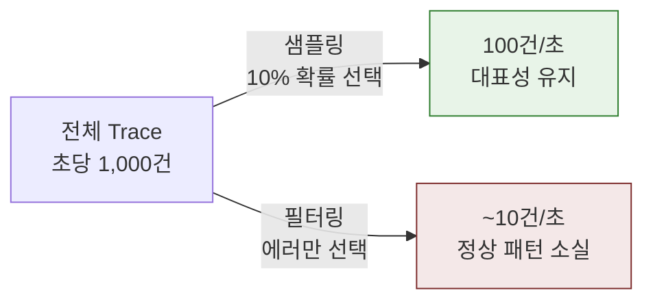
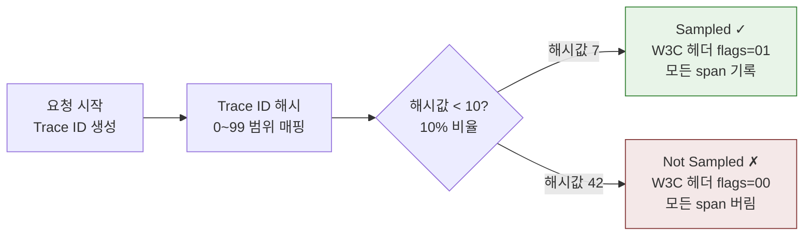
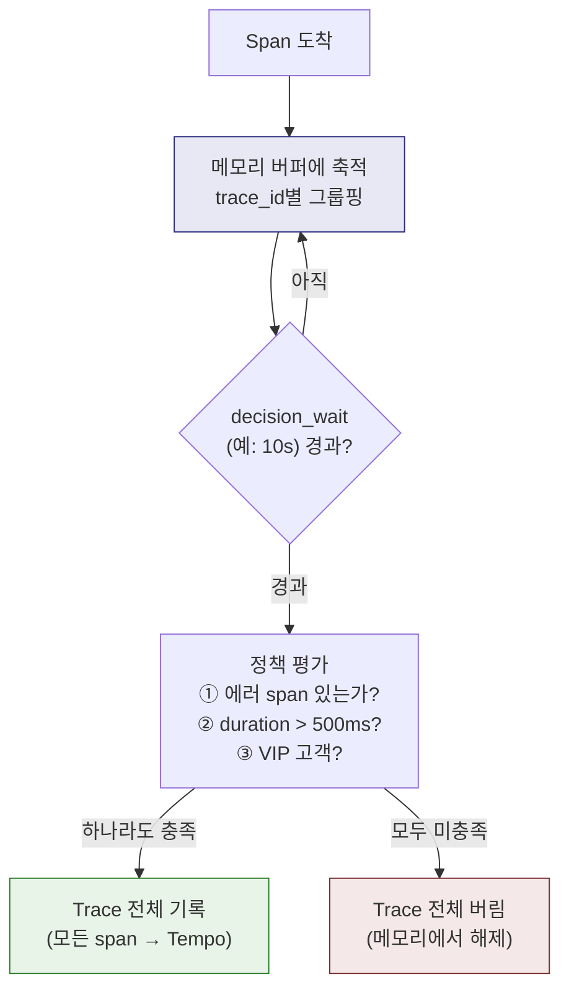
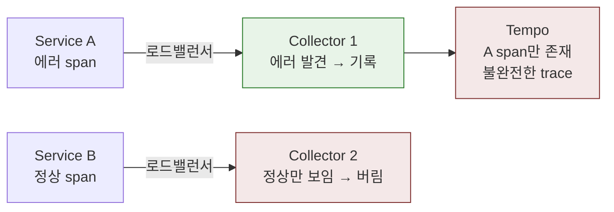
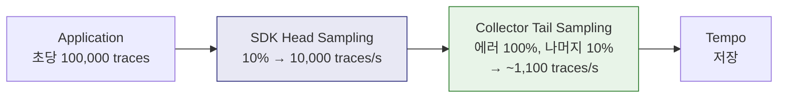
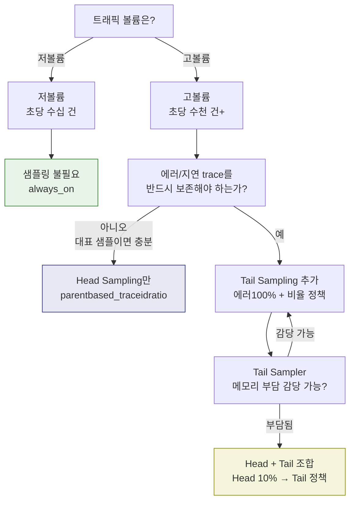

# Ch10. Sampling Strategies

**핵심 질문**: "모든 trace를 저장하지 않으면서도 중요한 정보를 놓치지 않으려면 어떻게 해야 하는가?"

---

## 1. 왜 샘플링이 필요한가

프로덕션 환경에서 모든 trace를 저장하면 어떤 일이 벌어지는지 숫자로 생각해 보자. 초당 1,000건의 요청을 처리하는 서비스가 있고, 요청당 평균 10개의 span이 생성된다면, 하루에 8억 6,400만 개의 span이 쌓인다. span 하나가 평균 1KB라고 가정하면 하루 저장량이 약 800GB다. Tempo나 Jaeger에 이 데이터를 전부 보내면 저장 비용, 네트워크 대역폭, Collector 메모리가 모두 문제가 된다.

그런데 이 8억 개의 span 중 실제로 분석할 가치가 있는 것은 얼마나 될까? 대부분의 요청은 정상적으로 완료되고, 패턴도 비슷하다. "GET /api/products → DB 조회 → 응답"이 수백만 번 반복되는데, 이 중 하나만 봐도 나머지를 대표할 수 있다.

**샘플링은 통계적 대표성에 기반한다.** 초당 1,000개의 trace 중 10%인 100개만 저장해도 시스템의 정상 동작 패턴을 파악하기에 충분하다. 동시에 에러나 고지연 같은 비정상 trace는 놓치지 않도록 별도 정책을 적용한다. 이것이 "비용은 줄이면서 가시성은 유지하는" 샘플링의 핵심 목표다.

### 샘플링 vs 필터링

이 두 개념을 혼동하면 안 된다. **필터링**은 특정 조건의 데이터만 남기는 것이다. "에러 trace만 저장"하면 정상 요청의 패턴을 전혀 볼 수 없으므로 대표성이 깨진다. **샘플링**은 전체에서 확률적으로 또는 조건적으로 선택하되, 전체를 대표할 수 있도록 설계하는 것이다.

Ch09의 redpanda-playground에서 Alloy가 `SELECT outbox_event` span을 drop하는 것은 필터링이다(노이즈 제거). 반면 "전체 trace의 10%만 저장"하는 것은 샘플링이다. 두 전략은 목적이 다르고 적용 위치도 다르다.



---

## 2. Head Sampling: trace 시작 시점의 결정

Head Sampling은 trace의 첫 span이 생성되는 시점에 "이 trace를 기록할지 말지"를 즉시 결정한다. 결정이 내려지면 W3C TraceContext 헤더의 `sampled` 플래그를 통해 하위 서비스에 전파되고, 모든 서비스가 동일한 결정을 따른다.

### 동작 원리: Consistent Probability Sampling

가장 보편적인 Head Sampling 방식은 **Consistent Probability Sampling**이다. Trace ID의 해시값이 설정한 비율 이내에 들어오면 기록하고, 아니면 버린다.



"Consistent"라는 이름이 붙은 이유가 있다. 같은 Trace ID는 어느 서비스에서 해시하든 같은 결과가 나온다. 서비스 A에서 "기록"으로 결정된 trace는 서비스 B, C에서도 반드시 "기록"이다. 이 일관성이 없으면 하나의 trace에서 일부 span만 존재하는 "불완전한 trace"가 발생한다.

### OTel SDK에서의 설정

```bash
# parentbased_traceidratio: 프로덕션 권장
OTEL_TRACES_SAMPLER=parentbased_traceidratio
OTEL_TRACES_SAMPLER_ARG=0.1    # 10%
```

`parentbased`가 붙으면 부모 span의 결정을 자식이 그대로 따른다. 이 동작이 중요한 이유를 구체적으로 살펴보자.

```
시나리오: Service A(10%) → Service B(20%) → Service C(5%)

parentbased 없이 (traceidratio만):
  A: 10% 확률로 "기록" 결정
  B: 독립적으로 20% 확률 적용 → A는 기록인데 B는 버릴 수 있음
  → 결과: A의 span은 있고 B의 span은 없는 불완전한 trace

parentbased와 함께:
  A: 10% 확률로 "기록" 결정 → flags=01로 전파
  B: 부모가 "기록"이므로 무조건 기록 (자체 비율 무시)
  C: 마찬가지로 무조건 기록
  → 결과: 완전한 trace (A → B → C 모든 span 존재)
```

루트 서비스(최초 요청을 받는 서비스)만 확률 결정을 하고, 나머지는 부모를 따른다. 그래서 `parentbased_traceidratio`의 비율은 사실상 **루트 서비스에서의 샘플링 비율**을 의미한다.

### OTel SDK에서 제공하는 Sampler 종류

| Sampler | 설정값 | 동작 | 용도 |
|---------|-------|------|------|
| Always On | `always_on` | 모든 trace 기록 | 개발/테스트 환경 |
| Always Off | `always_off` | 모든 trace 버림 | 계측 비활성화 |
| TraceIdRatio | `traceidratio` | 확률 기반 (부모 무시) | 단독 서비스, 테스트 |
| ParentBased + Ratio | `parentbased_traceidratio` | 부모 따름 + 루트만 확률 | **프로덕션 표준** |
| ParentBased + AlwaysOn | `parentbased_always_on` | 부모 따름 + 루트는 항상 기록 | 저볼륨 프로덕션 |

### 장점과 한계

**장점:**
- 구현이 단순하고 계산 비용이 거의 없다 (해시 연산 1회)
- 상태(stateful) 없이 동작하므로 수평 확장이 쉽다
- SDK, Collector, 어디서든 적용 가능하다
- Trace ID 기반이므로 서비스 간 일관성이 보장된다

**한계:**
- 결정 시점에 trace의 전체 내용을 알 수 없다. 요청이 시작될 때 "이 요청이 에러로 끝날지, 3초나 걸릴지"를 예측할 방법이 없다
- 따라서 에러 trace가 확률에 의해 빠질 수 있다. 10% 샘플링이면 에러 trace도 90%가 유실된다
- 이 한계가 Tail Sampling이 필요한 이유다

---

## 3. Tail Sampling: trace 완료 후의 결정

Tail Sampling은 Head Sampling의 핵심 한계 — "결정 시점에 결과를 모른다" — 를 해결한다. trace에 속하는 모든 span이 도착한 후에 전체 내용을 보고 기록 여부를 판단한다.

### 동작 원리

Collector(Alloy 또는 OTel Collector)가 도착하는 span을 trace_id별로 메모리 버퍼에 모은다. `decision_wait` 시간이 경과하면 버퍼에 모인 span 전체를 정책(policy)에 대조한다. 정책을 하나라도 만족하면 trace 전체를 저장소로 보내고, 아니면 전체를 버린다.



### 정책 종류와 실무 예시

| 정책 타입 | 조건 | 실무 시나리오 |
|----------|------|-------------|
| **status_code** | 에러 status span 포함 | 500 응답, 예외 발생 → 100% 기록 |
| **latency** | trace 전체 duration 기준 | 500ms 이상 느린 요청 → 100% 기록 |
| **probabilistic** | 확률 기반 | 정상 요청 → 10%만 기록 (대표성 유지) |
| **string_attribute** | span 속성값 매칭 | `customer.tier=premium` → 100% 기록 |
| **rate_limiting** | 초당 최대 건수 제한 | 초당 100건 이하로 제한 → 비용 상한선 |
| **composite** | 여러 정책 조합 | AND/OR 조합으로 복잡한 규칙 구성 |

### OTel Collector 설정 예시

```yaml
processors:
  tail_sampling:
    decision_wait: 10s          # trace 완료 대기 시간
    num_traces: 100000          # 동시 버퍼링 최대 trace 수
    expected_new_traces_per_sec: 1000
    policies:
      # 정책 1: 에러 trace는 무조건 기록
      - name: errors-policy
        type: status_code
        status_code:
          status_codes: [ERROR]

      # 정책 2: 500ms 이상 느린 trace 기록
      - name: latency-policy
        type: latency
        latency:
          threshold_ms: 500

      # 정책 3: VIP 고객 요청은 전부 기록
      - name: vip-policy
        type: string_attribute
        string_attribute:
          key: customer.tier
          values: [premium, enterprise]

      # 정책 4: 나머지는 10%만 기록 (대표성 유지)
      - name: probabilistic-policy
        type: probabilistic
        probabilistic:
          sampling_percentage: 10
```

정책은 위에서 아래로 평가되며, **하나라도 만족하면 해당 trace를 기록**한다 (OR 로직). 위 설정은 "에러면 기록, 느리면 기록, VIP면 기록, 나머지는 10%"라는 전략이다.

### decision_wait 튜닝

`decision_wait`는 Tail Sampling의 가장 민감한 설정이다.

| 설정 | 너무 짧을 때 (예: 2s) | 너무 길 때 (예: 60s) |
|------|----------------------|---------------------|
| 문제 | 아직 span이 덜 도착한 상태에서 결정 → 에러 span이 나중에 도착하면 놓침 | 메모리에 trace가 쌓여서 OOM 위험 |
| 결과 | 불완전한 trace로 잘못된 판단 | Collector 불안정 |
| 권장 | 서비스 간 최대 레이턴시보다 약간 길게 | 10~30초가 일반적 |

서비스 간 호출이 최대 5초 걸린다면, `decision_wait`를 10초 정도로 설정하면 대부분의 span이 도착한다. 비동기 처리(Outbox 패턴 등)가 있다면 그 지연 시간도 고려해야 한다.

### Tail Sampling의 비용과 운영 복잡도

Tail Sampling은 Head Sampling보다 강력하지만, 공짜가 아니다.

**메모리 비용.** trace가 완료될 때까지 모든 span을 메모리에 보관한다. `num_traces=100,000`이고 trace당 평균 10개 span, span당 1KB면 약 1GB의 메모리가 필요하다. 트래픽 급증 시 `num_traces`를 초과하면 오래된 trace부터 강제로 결정을 내리는데, 이때 불완전한 trace로 잘못된 판단이 발생할 수 있다.

**분산 Collector의 라우팅 문제.** Collector가 여러 인스턴스로 스케일링되어 있으면, 같은 trace의 span이 서로 다른 인스턴스에 도착할 수 있다. 인스턴스 A는 에러 span을 보고 기록하지만, 인스턴스 B는 정상 span만 보고 버릴 수 있다.



이 문제를 해결하려면 **trace_id 기반 로드밸런싱**이 필요하다. 같은 trace_id를 가진 span은 항상 같은 Collector 인스턴스로 라우팅되어야 한다. OTel Collector의 `loadbalancing` exporter가 이 역할을 하며, consistent hashing으로 trace_id를 특정 인스턴스에 매핑한다.

```yaml
# 1단계 Collector: trace_id 기반 라우팅
exporters:
  loadbalancing:
    protocol:
      otlp:
        endpoint: "tail-sampler-pool:4317"
    resolver:
      dns:
        hostname: tail-sampler-pool
    routing_key: traceID    # trace_id로 consistent hashing

# 2단계 Collector: Tail Sampling 수행
processors:
  tail_sampling:
    decision_wait: 10s
    policies: [...]
```

---

## 4. Head + Tail 조합 전략

고볼륨 환경에서는 Tail Sampling 단독으로 운영하기 어렵다. 초당 10만 건의 trace를 모두 Collector 메모리에 버퍼링하면 수십 GB의 메모리가 필요하기 때문이다. 이때 Head + Tail 조합이 효과적이다.

### 2단계 파이프라인



1. **Head Sampling (SDK)**: 전체의 10%만 Collector로 전송 → 네트워크와 Collector 부하 90% 감소
2. **Tail Sampling (Collector)**: Head를 통과한 10% 중에서 에러/지연 trace를 우선 기록, 나머지는 10%

최종 결과: 전체 trace의 약 1.1%가 저장되지만, 에러 trace는 10% 확률로 Head를 통과한 것 중 100%가 보존된다.

### 주의점: Head Sampling의 에러 누락

Head + Tail 조합에서도 Head Sampling 단계에서 에러 trace가 90% 빠진다는 한계는 남아 있다. Head는 trace 시작 시점에 결과를 모르기 때문이다. 이것을 감수할 수 있는지가 조합 전략의 핵심 판단 포인트다.

- **감수 가능**: 에러 볼륨이 충분히 높아서 10%만 저장해도 패턴 파악이 가능한 경우
- **감수 불가**: 에러가 극히 드물어서 하나도 놓치면 안 되는 경우 → Head를 100%로 두고 Tail만 사용

### 대안: Always-On Head + Tail

에러를 절대 놓치고 싶지 않다면, Head를 `always_on`으로 두고 Tail에서만 비용 제어를 하는 방식도 있다. 네트워크 비용은 올라가지만 에러 trace를 100% 확보할 수 있다.

```
전략 A (비용 우선): Head 10% → Tail (에러100%, 나머지10%)
  - 에러 trace 약 10% 보존 (Head에서 90% 유실)
  - 저장량: 전체의 ~1.1%

전략 B (가시성 우선): Head 100% → Tail (에러100%, 나머지1%)
  - 에러 trace 100% 보존
  - 저장량: 전체의 ~1% + 모든 에러
  - Collector 메모리 비용 높음
```

환경에 따라 적절한 지점을 선택하면 된다.

---

## 5. 실제 프로젝트의 샘플링 구성 (redpanda-playground)

Ch09에서 다룬 redpanda-playground의 실제 샘플링 구성을 살펴보면, 이론이 실무에서 어떻게 적용되는지 확인할 수 있다.

### SDK 레벨: 샘플링 미설정 (= always_on)

```groovy
// build.gradle — 샘플링 관련 환경변수 없음
environment 'OTEL_TRACES_EXPORTER', 'otlp'
// OTEL_TRACES_SAMPLER 미설정 → 기본값 parentbased_always_on
```

개발/PoC 환경이므로 모든 trace를 수집한다. 프로덕션으로 전환하려면 여기에 `OTEL_TRACES_SAMPLER=parentbased_traceidratio`와 `OTEL_TRACES_SAMPLER_ARG=0.1`을 추가하면 된다.

### Collector 레벨: 노이즈 필터링 (Alloy)

```alloy
// alloy-config.alloy — span 단위 필터링
otelcol.processor.filter "noise" {
  traces {
    span = [
      "IsMatch(name, \"SELECT playground.outbox_event.*\")",
      "IsMatch(name, \"UPDATE playground.outbox_event.*\")",
      "name == \"playground\"",
      "name == \"GET /actuator/prometheus\"",
    ]
  }
}
```

이 프로젝트에서는 Tail Sampling 대신 **span 필터링**을 사용한다. 500ms마다 실행되는 OutboxPoller의 DB 쿼리 span, Prometheus scrape span 등 반복적인 인프라 노이즈를 제거하는 것이다.

이것은 엄밀히 말하면 샘플링이 아니라 필터링이다. 하지만 개발 환경에서는 이 정도로 충분하다. 프로덕션에서 볼륨이 커지면 여기에 Tail Sampling을 추가하는 구조로 확장할 수 있다.

### 프로덕션 확장 시나리오

이 프로젝트를 프로덕션에 배포한다면 샘플링 구성을 이렇게 발전시킬 수 있다.

```
현재 (PoC):
  SDK: always_on → Alloy: 노이즈 필터링 → Tempo

프로덕션 단계 1 (간단):
  SDK: parentbased_traceidratio 10% → Alloy: 노이즈 필터링 → Tempo

프로덕션 단계 2 (정교):
  SDK: parentbased_traceidratio 10% → Alloy: 노이즈 필터링 + Tail Sampling → Tempo
  Tail 정책: 에러 100%, 지연>500ms 100%, 나머지 10%
```

---

## 6. 비교 요약

| 항목 | Head Sampling | Tail Sampling |
|------|---------------|---------------|
| **결정 시점** | trace 시작 (첫 span) | trace 완료 후 |
| **결정 기준** | Trace ID 해시 + 확률 | 전체 span 데이터 (에러, 지연, 속성) |
| **에러 trace 보장** | 불가 (확률에 의존) | 가능 (100% 기록 정책) |
| **리소스 비용** | 낮음 (stateless, 해시 1회) | 높음 (stateful, 메모리 버퍼) |
| **구현 복잡도** | 낮음 | 높음 (decision_wait 튜닝, 분산 라우팅) |
| **구현 위치** | SDK 또는 Collector | Collector만 (span 수집 필요) |
| **스케일링** | 쉬움 (stateless) | 어려움 (trace_id 기반 라우팅 필요) |
| **적합한 환경** | 범용, 첫 단계 | 에러/지연 기반 정교한 제어 필요 시 |

---

## 7. 샘플링 전략 선택 기준

### 의사 결정 흐름



### 환경별 권장 설정

| 환경 | 권장 전략 | 설정 예시 |
|------|----------|----------|
| 개발/테스트 | Always On | `OTEL_TRACES_SAMPLER=always_on` |
| 스테이징 | Head 50% | `parentbased_traceidratio` + `0.5` |
| 프로덕션 (저볼륨) | Head 100% + Tail | 에러100%, 지연100%, 나머지50% |
| 프로덕션 (고볼륨) | Head 10% + Tail | 에러100%, 지연100%, 나머지10% |
| 규정 준수 필요 | Always On + 아카이브 | 전수 보관, 객체 스토리지 장기 저장 |

### 샘플링이 불필요한 경우

- 트래픽이 적어 전수 저장해도 비용 부담이 없는 환경
- 규정상 모든 요청 데이터를 보존해야 하는 환경 (금융, 의료)
- 이미 메트릭 기반 모니터링만으로 충분하고, trace는 간헐적 디버깅용인 환경

---

## 8. 트러블슈팅: "trace가 안 보인다"

운영 중 가장 흔한 문제가 "Tempo에서 trace가 보이지 않는다"이다. 샘플링을 이해하면 이 문제의 진단이 체계적으로 가능해진다.

### 체크리스트

```
1. 샘플링 설정 확인
   □ OTEL_TRACES_SAMPLER 값이 always_off가 아닌가?
   □ OTEL_TRACES_SAMPLER_ARG 비율이 0이 아닌가?
   □ Tail Sampling 정책이 모든 trace를 버리는 조건은 아닌가?

2. Collector 연결 확인
   □ OTEL_EXPORTER_OTLP_ENDPOINT가 올바른 주소인가?
   □ Collector가 실행 중이고 OTLP receiver가 활성화되어 있는가?
   □ 프로토콜 불일치 (gRPC vs HTTP) 가 아닌가?

3. context propagation 확인
   □ 서비스 간 호출에서 W3C TraceContext 헤더가 전파되고 있는가?
   □ 프록시/로드밸런서가 traceparent 헤더를 제거하지 않는가?

4. 노이즈 필터 확인
   □ Alloy/Collector의 필터가 너무 넓게 설정되어 원하는 span까지 제거하는가?

5. 시간 범위 확인
   □ Grafana에서 조회하는 시간 범위가 trace 생성 시점을 포함하는가?
   □ Tempo의 retention 기간이 지나지 않았는가?
```

### 진단 순서

가장 효율적인 진단 순서는 **뒤에서 앞으로** (Backend → Collector → SDK)다.

1. **Tempo 직접 확인**: trace_id를 알고 있다면 Tempo API로 직접 조회 — 저장소에 있는데 Grafana 설정 문제인지 확인
2. **Collector 로그 확인**: Alloy/Collector의 로그에서 span 수신/전송 건수 확인 — Collector까지 도달했는지 확인
3. **SDK 로그 확인**: `OTEL_LOG_LEVEL=debug`로 SDK가 span을 생성하고 export하는지 확인

---

## 9. 면접에서 설명한다면

### "Head Sampling과 Tail Sampling의 차이는?"

Head Sampling은 trace 시작 시점에 Trace ID의 해시값으로 확률적 결정을 내립니다. 계산 비용이 거의 없고 stateless라 스케일링이 쉽지만, 에러 trace를 확률적으로 놓칠 수 있습니다. Tail Sampling은 trace 완료 후 에러, 지연, 속성 조건으로 결정하므로 에러 trace를 100% 보존할 수 있지만, Collector에서 모든 span을 메모리 버퍼링해야 하므로 리소스 비용이 높습니다.

### "프로덕션에서 어떤 전략을 쓰나요?"

`parentbased_traceidratio`를 기본으로 사용합니다. 루트 서비스에서만 확률 결정을 하고 하위 서비스는 부모를 따르므로 trace의 완전성이 보장됩니다. 에러를 놓치면 안 되는 환경에서는 Collector에 Tail Sampling을 추가해서 에러 trace를 100% 보존합니다. 볼륨이 커서 Tail Sampler 부담이 크면 Head 10% + Tail 조합으로 Collector 부하를 줄입니다.

### "Tail Sampling의 운영 리스크는?"

두 가지입니다. 첫째, 메모리 — trace 완료 대기 중 span이 쌓여 OOM 위험이 있으므로 `num_traces`와 `decision_wait`를 적절히 튜닝해야 합니다. 둘째, 분산 라우팅 — Collector가 여러 인스턴스면 같은 trace의 span이 흩어져 불완전한 판단이 발생합니다. trace_id 기반 consistent hashing으로 라우팅해야 합니다.

### "샘플링 비율을 어떻게 결정하나요?"

"저장 비용 예산 / (일일 trace 수 × span당 평균 크기)"로 역산합니다. 예를 들어 Tempo 스토리지 예산이 월 100GB이고, 일일 trace가 500만 건, trace당 10KB면 일일 50GB → 비율 약 6%가 됩니다. 여기에 에러/지연 trace를 100% 포함시키면 실제 저장량이 약간 늘어나므로, 확률 비율을 5%로 내리는 식으로 조정합니다.
