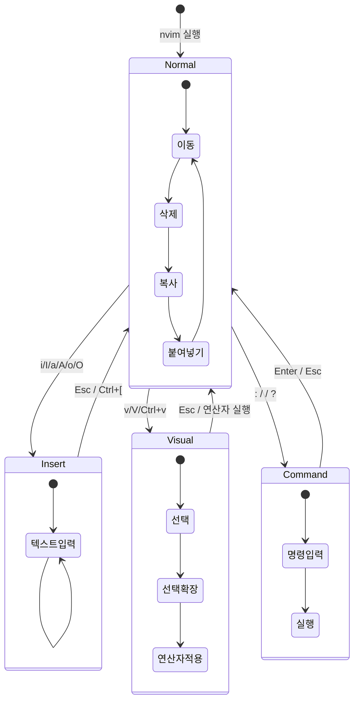

# 01. 모드 이해 - Vim의 근본적 차별점

Vim이 다른 에디터와 근본적으로 다른 이유는 모달 편집(modal editing)입니다. 대부분의 에디터는 입력 모드 하나만 존재하지만, Vim은 여러 모드를 전환하며 각 모드에서 키의 의미가 달라집니다. "Normal 모드가 기본"이라는 패러다임을 이해하면 Vim의 효율성이 보입니다.

---

## 목표

- [ ] 4가지 핵심 모드의 역할을 설명할 수 있다
- [ ] 모드 간 전환 키를 체화할 수 있다
- [ ] "Normal이 기본"인 이유를 설명할 수 있다

---

## 1. 왜 모달 편집인가?

프로그래머는 코드를 작성하는 시간보다 읽기와 수정에 80% 이상의 시간을 씁니다. 기존 에디터는 항상 입력 모드이므로, 이동이나 삭제를 위해 화살표 키나 마우스, 특수 키 조합(Ctrl+X, Shift+화살표 등)을 사용해야 합니다. Vim은 이 문제를 모드로 해결합니다.

Normal 모드에서는 모든 키가 명령어가 됩니다. `j`는 "j를 입력"하는 것이 아니라 "아래로 이동"을 의미합니다. 이동, 삭제, 복사, 붙여넣기 등 대부분의 작업을 홈 포지션(hjkl 근처)에서 수행할 수 있어 손목 이동이 최소화됩니다.

Insert 모드는 정말로 텍스트를 입력해야 할 때만 진입합니다. 입력이 끝나면 즉시 Normal 모드로 돌아가는 습관이 Vim 효율성의 핵심입니다.

---

## 2. 4가지 핵심 모드

Vim에는 여러 모드가 있지만, 실무에서 주로 사용하는 것은 다음 4가지입니다.

### Normal 모드

기본 모드입니다. Vim을 실행하면 이 모드에서 시작합니다. 이 모드에서는 모든 키가 명령어로 동작합니다.

**주요 기능:**
- 이동: `h` `j` `k` `l` (←↓↑→)
- 삭제: `dd` (줄 삭제), `dw` (단어 삭제)
- 복사: `yy` (줄 복사), `yw` (단어 복사)
- 붙여넣기: `p` (뒤에), `P` (앞에)
- 실행 취소: `u` (undo), `Ctrl+r` (redo)

**모드 전환:**
- `i` → Insert 모드 (커서 위치에서 입력)
- `v` → Visual 모드 (문자 단위 선택)
- `:` → Command-line 모드 (Ex 명령)

### Insert 모드

텍스트를 입력하는 모드입니다. 일반적인 에디터의 기본 상태와 같습니다. 이 모드에서는 키보드 입력이 그대로 문서에 삽입됩니다.

**진입 방법:**
- `i`: 커서 위치에서 입력 시작
- `I`: 줄의 맨 앞에서 입력 시작
- `a`: 커서 다음 위치에서 입력 시작 (append)
- `A`: 줄의 맨 뒤에서 입력 시작
- `o`: 아래에 새 줄 생성 후 입력
- `O`: 위에 새 줄 생성 후 입력

**모드 전환:**
- `Esc` 또는 `Ctrl+[` → Normal 모드로 복귀

**중요:** Insert 모드에 오래 머물지 마세요. 입력이 끝나면 즉시 `Esc`로 Normal 모드로 돌아가는 습관을 들여야 합니다.

### Visual 모드

텍스트를 선택하는 모드입니다. 선택 후 연산자(삭제, 복사 등)를 적용할 수 있습니다. 3가지 하위 모드가 있습니다.

**3가지 하위 모드:**
- `v` (문자 단위): 커서 이동으로 문자 단위 선택
- `V` (줄 단위): 줄 전체를 선택
- `Ctrl+v` (블록 단위): 사각형 블록 선택 (열 편집)

**사용 예:**
```
1. v로 Visual 모드 진입
2. hjkl 또는 w/b로 선택 영역 확장
3. d (삭제), y (복사), c (변경) 등 연산자 적용
```

**모드 전환:**
- `Esc` → Normal 모드로 복귀
- 연산자 실행 시 자동으로 Normal 모드로 복귀

### Command-line 모드

Ex 명령어를 입력하는 모드입니다. 파일 저장, 종료, 검색/치환, 설정 변경 등 다양한 명령을 수행합니다.

**진입 방법:**
- `:` → Ex 명령 입력
- `/` → 앞으로 검색
- `?` → 뒤로 검색

**주요 명령:**
- `:w` → 저장 (write)
- `:q` → 종료 (quit)
- `:wq` 또는 `:x` → 저장 후 종료
- `:q!` → 강제 종료 (변경사항 버림)
- `:%s/old/new/g` → 전체 치환

**모드 전환:**
- `Enter` → 명령 실행 후 Normal 모드로 복귀
- `Esc` → 명령 취소 후 Normal 모드로 복귀

---

## 3. 모드 전환 상태 다이어그램

4가지 모드 간의 전환 관계를 다이어그램으로 나타내면 다음과 같습니다.



모든 모드는 Normal 모드를 중심으로 연결됩니다. 다른 모드 간 직접 전환은 불가능하며, 반드시 Normal 모드를 거쳐야 합니다. 예를 들어 Insert 모드에서 Visual 모드로 가려면 `Esc` → `v` 순서로 진행해야 합니다.

---

## 4. "Normal이 기본" 패러다임

Vim과 다른 에디터의 가장 큰 철학적 차이는 "기본 모드"입니다.

### 일반 에디터의 철학
- **기본 상태**: 항상 입력 모드
- **특수 기능**: Ctrl, Alt, Shift 조합키로 호출
- **이동**: 화살표 키, 마우스 필수
- **결과**: 손이 홈 포지션을 벗어나 생산성 저하

### Vim의 철학
- **기본 상태**: Normal 모드 (명령 대기 상태)
- **텍스트 입력**: 필요할 때만 Insert 모드 진입
- **이동/편집**: 홈 포지션에서 단축키로 수행
- **결과**: 손목 이동 최소화, 효율성 극대화

이 패러다임을 받아들이는 것이 Vim 학습의 첫 관문입니다. "왜 Normal 모드로 자꾸 돌아가야 하지?"라는 의문이 들 수 있지만, 익숙해지면 "왜 다른 에디터는 항상 입력 모드인가?"라는 생각이 들게 됩니다.

**핵심 규칙:**
> Insert 모드에 오래 머물지 마세요. 입력이 끝나면 즉시 `Esc`로 Normal 모드로 복귀하세요.

이 습관이 체화되면 Vim의 진정한 효율성을 경험할 수 있습니다.

---

## 5. Insert 모드 진입 방법 요약

Normal 모드에서 Insert 모드로 진입하는 방법은 여러 가지입니다. 상황에 맞는 명령을 선택하면 추가 이동 없이 바로 입력할 수 있습니다.

| 키 | 동작 | 사용 시점 |
|---|------|----------|
| `i` | 커서 위치에서 입력 | 커서가 이미 원하는 위치에 있을 때 |
| `I` | 줄의 맨 앞에서 입력 | 들여쓰기 후 첫 문자 위치 |
| `a` | 커서 다음 위치에서 입력 (append) | 단어나 문장 끝에 추가할 때 |
| `A` | 줄의 맨 뒤에서 입력 | 줄 끝에 세미콜론, 주석 추가 등 |
| `o` | 아래에 새 줄 생성 후 입력 | 현재 줄 아래에 코드 추가 |
| `O` | 위에 새 줄 생성 후 입력 | 현재 줄 위에 코드 추가 |

**팁:** `A`는 `$a`의 축약입니다. `$`는 줄 끝으로 이동, `a`는 append 진입이므로, 두 동작을 하나로 합친 것입니다. 이런 식으로 Vim의 명령어는 논리적으로 조합됩니다.

---

## 명령어 요약

| 키 | 현재 모드 | 목표 모드 | 설명 |
|---|----------|----------|------|
| `i` | Normal | Insert | 커서 위치에서 입력 |
| `I` | Normal | Insert | 줄 맨 앞에서 입력 |
| `a` | Normal | Insert | 커서 다음에서 입력 |
| `A` | Normal | Insert | 줄 맨 뒤에서 입력 |
| `o` | Normal | Insert | 아래 새 줄에서 입력 |
| `O` | Normal | Insert | 위 새 줄에서 입력 |
| `Esc` | Insert | Normal | Normal 모드로 복귀 |
| `Ctrl+[` | Insert | Normal | Normal 모드로 복귀 (Esc 대체) |
| `v` | Normal | Visual | 문자 단위 선택 |
| `V` | Normal | Visual | 줄 단위 선택 |
| `Ctrl+v` | Normal | Visual | 블록 단위 선택 |
| `Esc` | Visual | Normal | 선택 취소 |
| `:` | Normal | Command-line | Ex 명령 입력 |
| `/` | Normal | Command-line | 앞으로 검색 |
| `?` | Normal | Command-line | 뒤로 검색 |
| `Enter` | Command-line | Normal | 명령 실행 |
| `Esc` | Command-line | Normal | 명령 취소 |

---

## 체크포인트

다음 질문에 면접에서 답변하듯이 설명할 수 있는지 확인하세요.

### 1. Vim에서 Normal 모드가 기본인 이유는?

<details>
<summary>모범 답안 확인</summary>

프로그래머는 코드 작성보다 읽기와 수정에 80% 이상의 시간을 씁니다. 기존 에디터는 항상 입력 모드이므로, 이동이나 삭제 같은 편집 작업을 위해 화살표 키, 마우스, 복잡한 키 조합(Ctrl+X 등)을 사용해야 합니다. 이는 손이 홈 포지션을 벗어나게 하여 비효율적입니다. Vim은 이 문제를 모달 편집으로 해결합니다. Normal 모드를 기본으로 하여 모든 키를 명령어로 사용할 수 있게 하고, 정말로 텍스트를 입력해야 할 때만 Insert 모드에 진입합니다. 이렇게 하면 대부분의 편집 작업을 홈 포지션에서 수행할 수 있어 생산성이 극대화됩니다.

</details>

### 2. Insert 모드에서 Normal 모드로 돌아가는 방법은?

<details>
<summary>모범 답안 확인</summary>

Insert 모드에서 Normal 모드로 돌아가는 방법은 두 가지입니다. 첫째, `Esc` 키를 누르는 것이 가장 일반적인 방법입니다. 둘째, `Ctrl+[`를 사용할 수도 있습니다. 이는 `Esc`와 동일한 기능을 하며, 일부 사용자는 `Ctrl+[`가 손목 이동이 적어 더 편하다고 느낍니다. 두 방법 모두 즉시 Normal 모드로 전환되며, Insert 모드에 오래 머물지 않고 입력이 끝나면 바로 돌아가는 습관이 Vim 효율성의 핵심입니다.

</details>

### 3. Visual 모드의 3가지 하위 모드는?

<details>
<summary>모범 답안 확인</summary>

Visual 모드에는 3가지 하위 모드가 있습니다. 첫째, `v`로 진입하는 문자 단위(character-wise) Visual 모드로, 커서 이동으로 개별 문자를 선택합니다. 둘째, `V`(대문자)로 진입하는 줄 단위(line-wise) Visual 모드로, 줄 전체를 선택합니다. 셋째, `Ctrl+v`로 진입하는 블록 단위(block-wise) Visual 모드로, 사각형 블록을 선택하여 열 편집(column editing)이 가능합니다. 선택 후 `d`(삭제), `y`(복사), `c`(변경) 같은 연산자를 적용하면 선택 영역에 대해 작업을 수행하고 자동으로 Normal 모드로 복귀합니다.

</details>

---

다음: [02. 내비게이션](./02-navigation.md)
