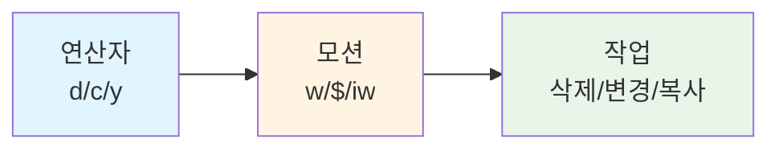

# 03. 연산자와 모션 - Vim의 문법 체계

Vim의 진정한 강력함은 연산자(operator)와 모션(motion)의 조합에 있습니다. 이것은 Vim만의 고유한 "언어 문법"으로, `동사 + 목적어` 구조를 따릅니다. `d`(삭제)라는 동사에 `w`(단어)라는 목적어를 붙이면 `dw`(단어 삭제)가 됩니다. 이 문법을 이해하면 새로운 명령을 외울 필요 없이 조합으로 만들어낼 수 있습니다. **이 챕터가 Vim 학습에서 가장 중요한 챕터입니다.**

---

## 목표

- [ ] operator + motion 조합 문법을 설명할 수 있다
- [ ] 텍스트 오브젝트(iw, i", ip 등)를 자유롭게 사용할 수 있다
- [ ] dot(.) 명령으로 반복 작업을 효율화할 수 있다

---

## 1. Vim의 문법: 동사 + 목적어

Vim은 자연어 문법과 유사한 구조를 가지고 있습니다. 동사에 해당하는 연산자(operator)와 목적어에 해당하는 모션(motion)을 조합하여 명령을 만듭니다. 이 조합 시스템을 이해하면 수백 개의 명령을 외울 필요 없이, 몇 가지 기본 요소의 조합만으로 원하는 작업을 수행할 수 있습니다.

### 연산자(동사)

연산자는 어떤 작업을 수행할지 정의합니다.

- `d` - delete (삭제)
- `c` - change (변경, 삭제 후 Insert 모드 진입)
- `y` - yank (복사)
- `>` - indent (들여쓰기)
- `<` - dedent (내어쓰기)
- `=` - auto-indent (자동 들여쓰기)
- `gU` - 대문자로 변환
- `gu` - 소문자로 변환

### 모션(목적어)

모션은 연산자가 작용할 범위를 정의합니다.

- `w` - word (다음 단어의 시작)
- `b` - back (이전 단어의 시작)
- `e` - end (단어의 끝)
- `0` - 줄의 시작
- `$` - 줄의 끝
- `gg` - 파일의 시작
- `G` - 파일의 끝
- `f{char}` - 현재 줄에서 {char}를 앞으로 찾기
- `/{pattern}` - 패턴 검색

### 조합 예시

| 명령어 | 의미 | 설명 |
|--------|------|------|
| `dw` | delete word | 커서부터 단어 끝까지 삭제 |
| `d$` | delete to end | 커서부터 줄 끝까지 삭제 |
| `d0` | delete to start | 줄 시작부터 커서 앞까지 삭제 |
| `diw` | delete inner word | 단어 전체 삭제 (커서 위치 무관) |
| `ci"` | change inner quote | 따옴표 안 내용 변경 |
| `yap` | yank a paragraph | 단락 전체 복사 |
| `>}` | indent to brace | 다음 중괄호까지 들여쓰기 |
| `gUw` | uppercase word | 단어를 대문자로 변환 |

### 조합 구조 다이어그램



이 문법 체계의 핵심은 **조합성(composability)**입니다. 새로운 연산자를 배우면 모든 모션과 조합할 수 있고, 새로운 모션을 배우면 모든 연산자와 조합할 수 있습니다.

## 2. 텍스트 오브젝트 - Vim의 핵심 무기

텍스트 오브젝트는 Vim에서 가장 강력한 개념 중 하나입니다. 일반 모션은 커서의 현재 위치부터 특정 위치까지를 범위로 지정하지만, 텍스트 오브젝트는 커서가 어디에 있든 **문법적으로 의미 있는 단위**(단어, 문장, 단락, 괄호 안 등)를 선택합니다.

### i(inner) vs a(around)

텍스트 오브젝트는 두 가지 변형이 있습니다.

- `i` (inner) - 구분자를 제외한 내부 내용만
- `a` (around) - 구분자를 포함한 전체

예를 들어, `"hello world"` 문자열에 커서가 있을 때:

- `ci"` - 따옴표 안의 `hello world`를 삭제하고 Insert 모드로 (`""`만 남음)
- `ca"` - 따옴표를 포함한 전체를 삭제하고 Insert 모드로 (빈 공간)

### 주요 텍스트 오브젝트

| 오브젝트 | 설명 | 예시 |
|----------|------|------|
| `iw` / `aw` | inner/around word (단어) | `diw` - 단어 삭제 |
| `is` / `as` | inner/around sentence (문장) | `cis` - 문장 변경 |
| `ip` / `ap` | inner/around paragraph (단락) | `yap` - 단락 복사 |
| `i"` / `a"` | inner/around double quotes | `ci"` - 따옴표 안 변경 |
| `i'` / `a'` | inner/around single quotes | `di'` - 따옴표 안 삭제 |
| `i)` / `a)` 또는 `ib` / `ab` | inner/around parentheses | `yi)` - 괄호 안 복사 |
| `i}` / `a}` 또는 `iB` / `aB` | inner/around braces | `di{` - 중괄호 안 삭제 |
| `i>` / `a>` | inner/around angle brackets | `ci>` - 꺾쇠 안 변경 |
| `it` / `at` | inner/around tag (HTML) | `dit` - 태그 안 삭제 |

### 실전 예시

```javascript
function greet(name) {
  console.log("Hello, " + name);
}
```

커서가 `name` 위에 있을 때:

- `diw` - `name`만 삭제 (`greet()`로 변경)
- `di(` - 괄호 안의 `name`만 삭제 (`greet()`로 변경)
- `da(` - 괄호를 포함하여 삭제 (`greet`로 변경)

커서가 `"Hello, "` 문자열 안에 있을 때:

- `ci"` - 따옴표 안 내용을 변경할 수 있도록 삭제 (`""`만 남고 Insert 모드)
- `ca"` - 따옴표를 포함한 전체 삭제 (빈 공간)

이 텍스트 오브젝트는 **커서의 정확한 위치에 구애받지 않는다**는 점이 핵심입니다. 단어 중간에 있든 끝에 있든, `diw`는 항상 단어 전체를 삭제합니다.

## 3. 숫자 수식어 (count)

모든 연산자와 모션 앞에 숫자를 붙여 반복 횟수를 지정할 수 있습니다. 이를 count 또는 숫자 수식어라고 합니다.

### 기본 문법

```
{count}{operator}{motion}
```

또는

```
{operator}{count}{motion}
```

두 형식 모두 동일하게 작동합니다.

### 예시

| 명령어 | 의미 | 설명 |
|--------|------|------|
| `3dw` | delete 3 words | 3개 단어 삭제 |
| `d3w` | delete 3 words | 위와 동일 |
| `5j` | 5 lines down | 5줄 아래로 이동 |
| `2dd` | delete 2 lines | 2줄 삭제 |
| `4yy` | yank 4 lines | 4줄 복사 |
| `3>>` | indent 3 lines | 3줄 들여쓰기 |
| `10k` | 10 lines up | 10줄 위로 이동 |

### 실전 활용

숫자 수식어는 특히 반복 작업에서 강력합니다. 예를 들어, 5개의 연속된 줄에 주석을 추가해야 할 때:

```
5I# <Esc>   (5줄의 시작 부분에 # 삽입)
```

또는 3개의 단어를 대문자로 변경할 때:

```
3gUw   (3개 단어를 대문자로)
```

## 4. dot(.) 명령 - 반복의 핵심

dot(.) 명령은 Vim에서 가장 강력한 생산성 도구 중 하나입니다. 마지막 **변경**을 그대로 반복합니다.

### "변경"의 정의

dot이 반복하는 "변경"은 다음을 의미합니다:

1. Normal 모드에서 Insert 모드로 진입하여 입력한 후 다시 Normal 모드로 돌아온 한 사이클
2. 또는 연산자 + 모션 조합 (예: `dw`, `ciw`, `>j`)

### 기본 사용법

```
ciw                  # 단어 변경
newWord<Esc>         # 새 단어 입력 후 Normal 모드
w                    # 다음 단어로 이동
.                    # 마지막 변경(ciw + newWord) 반복
```

### 실전 패턴: 검색 + 변경 + 반복

이 패턴은 코드 리팩토링에서 매우 자주 사용됩니다:

1. `*` - 현재 커서 아래 단어를 검색
2. `ciw` - 단어를 변경
3. `newName<Esc>` - 새 이름 입력
4. `n` - 다음 검색 결과로 이동
5. `.` - 변경 반복 (ciw + newName)
6. `n.n.n.` - 계속 반복

이 패턴은 IDE의 "Rename Symbol"과 유사하지만, 더 세밀한 제어가 가능합니다. 어떤 것은 변경하고 어떤 것은 건너뛸 수 있습니다 (`n`으로 건너뛰고, `.`으로 변경).

### dot 공식

> **한 번 잘 만든 변경은 무한 반복 가능**

복잡한 변경일수록 dot의 가치가 커집니다. 예를 들어:

```
A;<Esc>              # 줄 끝에 세미콜론 추가
j.                   # 다음 줄에도 반복
j.                   # 계속 반복
```

이는 매크로보다 간단하고, 직관적이며, 즉시 적용 가능합니다.

## 5. 연산자 두 번 반복 = 현재 줄

모든 연산자를 두 번 반복하면 현재 줄 전체에 작용합니다. 이는 Vim의 일관성 있는 설계 철학 중 하나입니다.

### 줄 단위 명령어

| 명령어 | 의미 | 설명 |
|--------|------|------|
| `dd` | delete line | 현재 줄 삭제 |
| `yy` | yank line | 현재 줄 복사 |
| `cc` | change line | 현재 줄 변경 (들여쓰기 유지) |
| `>>` | indent line | 현재 줄 들여쓰기 |
| `<<` | dedent line | 현재 줄 내어쓰기 |
| `==` | auto-indent line | 현재 줄 자동 들여쓰기 |
| `gUU` | uppercase line | 현재 줄 대문자 변환 |
| `guu` | lowercase line | 현재 줄 소문자 변환 |

### 숫자 수식어와 조합

```
3dd                  # 3줄 삭제
5>>                  # 5줄 들여쓰기
2yy                  # 2줄 복사
```

이 패턴은 기억하기 쉽고, 타이핑도 빠릅니다. `d$`(줄 끝까지 삭제) 대신 `D`를 사용할 수도 있지만, `dd`는 더 일관성 있는 패턴입니다.

## 실습

이제 배운 내용을 실전에서 연습해봅니다. `practice/exercises/02-operators.txt` 파일을 열어 다음 연습을 수행하세요:

### 연습 1: 기본 조합

1. 파일을 열고 첫 번째 단락으로 이동
2. `dw` - 단어 삭제
3. `d$` - 줄 끝까지 삭제
4. `diw` - 커서가 단어 중간에 있을 때 단어 전체 삭제
5. `u`로 되돌리기

### 연습 2: 텍스트 오브젝트

1. 따옴표로 둘러싸인 문자열을 찾아 `ci"` 실행
2. 괄호 안 내용을 `di)` 또는 `dib`로 삭제
3. HTML 태그가 있다면 `dit`로 태그 내부 삭제
4. 단락 전체를 `dap`로 삭제

### 연습 3: dot 반복

1. 단어를 `ciw`로 변경하고 새 내용 입력
2. 다음 단어로 이동 (`w`)
3. `.`으로 변경 반복
4. 여러 단어에 반복 적용

### 연습 4: 검색 + 변경 패턴

1. `*`로 단어 검색
2. `ciw`로 변경
3. `n`으로 다음 검색 결과로 이동
4. `.`으로 변경 반복

## 명령어 요약

| 명령어 | 설명 |
|--------|------|
| `{operator}{motion}` | 연산자 + 모션 조합 (예: dw, c$) |
| `{count}{operator}{motion}` | 숫자 수식어 (예: 3dw, 5j) |
| `{operator}{count}{motion}` | 위와 동일 (예: d3w) |
| `d` | delete 연산자 |
| `c` | change 연산자 (삭제 후 Insert) |
| `y` | yank 연산자 (복사) |
| `>` | indent 연산자 |
| `<` | dedent 연산자 |
| `=` | auto-indent 연산자 |
| `gU` | 대문자 변환 연산자 |
| `gu` | 소문자 변환 연산자 |
| `iw` / `aw` | inner/around word |
| `is` / `as` | inner/around sentence |
| `ip` / `ap` | inner/around paragraph |
| `i"` / `a"` | inner/around double quotes |
| `i'` / `a'` | inner/around single quotes |
| `i)` / `a)` | inner/around parentheses |
| `i}` / `a}` | inner/around braces |
| `i>` / `a>` | inner/around angle brackets |
| `it` / `at` | inner/around tag |
| `.` | 마지막 변경 반복 |
| `dd` | 현재 줄 삭제 |
| `yy` | 현재 줄 복사 |
| `cc` | 현재 줄 변경 |
| `>>` | 현재 줄 들여쓰기 |
| `<<` | 현재 줄 내어쓰기 |

## 체크포인트

<details>
<summary>1. `ciw`와 `caw`의 차이를 설명하세요</summary>

`ciw` (change inner word)는 단어의 내부만 변경합니다. 단어 앞뒤의 공백은 유지됩니다. 예를 들어, `hello world`에서 `hello`에 커서가 있을 때 `ciw`를 실행하면 `hello`만 삭제되고 `world` 앞의 공백은 유지됩니다.

`caw` (change around word)는 단어와 함께 뒤따르는 공백(또는 앞 공백)도 함께 변경합니다. 같은 상황에서 `caw`를 실행하면 `hello`와 그 뒤의 공백까지 삭제되어 커서가 `world` 바로 앞에 위치하게 됩니다.

일반적으로 `iw`는 단어만 정확히 선택할 때, `aw`는 단어를 삭제한 후 공백도 정리하고 싶을 때 사용합니다.
</details>

<details>
<summary>2. dot(.) 명령이 "반복"하는 것의 정확한 정의는?</summary>

dot 명령은 마지막 **변경(change)**을 반복합니다. 여기서 "변경"은 두 가지를 의미합니다:

1. Normal 모드에서 Insert 모드로 진입하여 텍스트를 입력/수정하고 다시 Normal 모드로 돌아온 전체 사이클. 예를 들어, `i` → 입력 → `<Esc>`의 전체 과정이 하나의 변경입니다.

2. 연산자 + 모션 조합으로 수행된 작업. 예를 들어, `dw` (단어 삭제), `ciw` (단어 변경), `>j` (2줄 들여쓰기) 등입니다.

중요한 점은, 단순한 이동 명령 (`h`, `j`, `k`, `l`, `w`, `b` 등)은 변경이 아니므로 dot으로 반복되지 않습니다. 또한 검색(`/`, `*`, `n`)도 변경이 아닙니다. 오직 버퍼의 내용을 수정하는 작업만 dot으로 반복됩니다.
</details>

<details>
<summary>3. `di"`, `da"`, `yi)`, `ci{`의 동작을 각각 설명하세요</summary>

- `di"` (delete inner double quotes): 커서가 따옴표로 둘러싸인 영역 안에 있을 때, 따옴표는 유지하고 내부 내용만 삭제합니다. `"hello"`가 `""`로 변경됩니다.

- `da"` (delete around double quotes): 따옴표를 포함한 전체를 삭제합니다. `"hello"`가 완전히 사라집니다.

- `yi)` (yank inner parentheses): 괄호 안의 내용만 복사합니다. `(hello)`에서 `hello`만 레지스터에 저장되고, 괄호는 복사되지 않습니다.

- `ci{` (change inner braces): 중괄호 안의 내용을 삭제하고 Insert 모드로 진입합니다. `{ code }`가 `{}`로 변경되고 커서는 중괄호 안에서 Insert 모드가 됩니다. 함수 본문을 완전히 다시 작성할 때 유용합니다.

모두 커서가 해당 구분자 영역 안에 있기만 하면 정확한 위치에 상관없이 작동합니다.
</details>

---
다음: [04. 편집 필수기](./04-editing-essentials.md)
