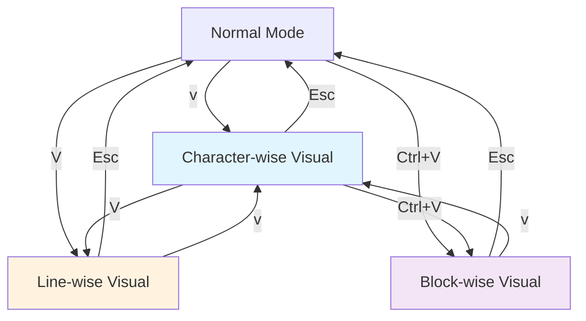

# 07. 비주얼 모드 - 선택하고 조작하기

Normal 모드의 operator + motion 조합이 Vim의 핵심 문법이라면, Visual 모드는 "먼저 선택한 뒤 조작하는" 보완적 접근입니다. 특히 블록 선택(Ctrl+V)은 다른 에디터에서 찾기 어려운 Vim만의 강력한 기능으로, 여러 줄의 같은 열을 동시에 편집할 수 있습니다. operator + motion이 어색한 복잡한 선택이 필요할 때 Visual 모드가 빛을 발합니다.

---

## 목표

- [ ] v, V, Ctrl+V 세 가지 비주얼 모드를 구분할 수 있다
- [ ] 비주얼 블록 모드로 다중 줄 편집을 수행할 수 있다
- [ ] 선택 영역에 연산자를 적용할 수 있다

---

## 1. 세 가지 비주얼 모드

Vim은 세 가지 서로 다른 비주얼 모드를 제공하며, 각 모드는 선택 단위가 다릅니다. 문자 단위로 정밀하게 선택할 수도 있고, 줄 전체를 한 번에 선택할 수도 있으며, 심지어 직사각형 블록으로 선택할 수도 있습니다.

### v (Character-wise Visual Mode)

문자 단위로 선택하는 가장 기본적인 비주얼 모드입니다. 커서 위치에서 시작하여 이동 명령으로 선택 영역을 확장합니다.

```vim
" 예시: 단어 3개 선택 후 삭제
v3wd

" 예시: 현재 위치부터 줄 끝까지 선택 후 복사
v$y

" 예시: 괄호 안 내용 선택
vi(
```

### V (Line-wise Visual Mode)

줄 전체를 단위로 선택합니다. 부분 선택 없이 항상 줄 전체가 선택되므로, 코드 블록을 이동하거나 삭제할 때 유용합니다.

```vim
" 예시: 5줄 선택 후 들여쓰기
V4j>

" 예시: 현재 줄부터 파일 끝까지 선택
VG

" 예시: 함수 전체 선택 ({ 에서 시작)
V%
```

### Ctrl+V (Block-wise Visual Mode)

직사각형 블록으로 선택하는 Vim만의 독특한 기능입니다. 여러 줄의 같은 열 위치를 동시에 편집할 수 있어, 테이블 데이터나 코드 정렬 작업에 필수적입니다.

```vim
" 예시: 5줄 × 3열 블록 선택
Ctrl+V 4j 2l

" 예시: 줄 끝까지 블록 선택
Ctrl+V 10j $
```

### 모드 관계도



## 2. 비주얼 모드에서의 조작

선택 영역을 만든 후에는 다양한 연산자를 적용할 수 있습니다. Normal 모드의 연산자들이 대부분 그대로 작동합니다.

### 기본 연산자

선택된 영역에 대해 삭제, 복사, 변경, 정렬 등의 작업을 수행합니다.

```vim
" d: 삭제 (delete)
viwd        " 단어 선택 후 삭제

" y: 복사 (yank)
Vj y        " 2줄 선택 후 복사

" c: 변경 (change)
v$c         " 줄 끝까지 선택 후 변경

" >: 들여쓰기
V5j>        " 6줄 선택 후 들여쓰기

" <: 내어쓰기
V3j<        " 4줄 선택 후 내어쓰기

" =: 자동 정렬
V%=         " 블록 선택 후 자동 정렬
```

### 대소문자 변환

선택된 텍스트의 대소문자를 변환할 수 있습니다.

```vim
" U: 대문자로 변환
viwU        " 단어를 대문자로

" u: 소문자로 변환
viwu        " 단어를 소문자로

" ~: 대소문자 토글
v3w~        " 3단어의 대소문자 반전
```

### 선택 범위 조정

선택 영역의 반대편 끝으로 커서를 이동하여 선택 방향을 바꿀 수 있습니다.

```vim
" o: 선택 영역의 반대편 끝으로 커서 이동
v5j         " 아래로 5줄 선택
o           " 선택 시작점으로 커서 이동
3k          " 위로 3줄 확장
```

## 3. 비주얼 블록 모드 실전

블록 모드는 다른 에디터에서는 멀티 커서로 해결하는 작업을 더 직관적으로 수행할 수 있게 해줍니다.

### 여러 줄 앞에 동일 텍스트 삽입

주석 추가, 들여쓰기 문자 삽입 등에 활용됩니다.

```vim
" 패턴: Ctrl+V → 줄 선택 → I → 텍스트 입력 → Esc

" 예시: 5줄 앞에 // 주석 추가
Ctrl+V      " 블록 모드 진입
4j          " 아래로 4줄 선택 (총 5줄)
I           " 삽입 모드 (줄 앞)
//          " 주석 입력
Esc         " 모든 줄에 적용됨
```

### 여러 줄 끝에 텍스트 추가

줄 끝에 세미콜론, 콤마 등을 일괄 추가할 때 사용합니다.

```vim
" 패턴: Ctrl+V → $ → 줄 선택 → A → 텍스트 입력 → Esc

" 예시: 배열 요소 끝에 콤마 추가
Ctrl+V      " 블록 모드 진입
$           " 줄 끝으로 이동
3j          " 아래로 3줄 선택
A           " 줄 끝에 삽입
,           " 콤마 입력
Esc         " 모든 줄에 적용됨
```

### 열 삭제

CSV 파일이나 테이블에서 특정 열을 제거할 때 유용합니다.

```vim
" 예시: 3번째 열 삭제
Ctrl+V      " 블록 모드 진입
10j         " 아래로 10줄
3l          " 오른쪽으로 3칸 (3번째 열)
d           " 삭제
```

### CSV/테이블 데이터 열 편집

실제 데이터 파일에서 특정 열만 수정하는 시나리오입니다.

```vim
" 예시: price 열의 값 앞에 $ 추가
" name,price,quantity
" apple,100,5
" banana,200,3

/price      " price 열 위치 찾기
j           " 데이터 시작 줄로
Ctrl+V      " 블록 모드
j           " 모든 데이터 줄 선택
I           " 삽입 모드
$           " $ 입력
Esc         " 적용
```

## 4. 유용한 비주얼 모드 명령

실전에서 자주 사용하는 추가 명령들입니다.

### gv - 마지막 선택 영역 재선택

이전 선택 영역을 다시 선택하여 추가 작업을 수행할 수 있습니다.

```vim
" 시나리오: 들여쓰기를 여러 번 반복
V5j>        " 6줄 선택 후 들여쓰기
gv          " 같은 영역 재선택
>           " 다시 들여쓰기
gv>         " 한 번 더 (총 3단계 들여쓰기)
```

### r - 선택 영역을 동일 문자로 채우기

블록 모드에서 선택한 영역을 하나의 문자로 채웁니다.

```vim
" 예시: 구분선 만들기
Ctrl+V      " 블록 모드
20l         " 20칸 선택
r-          " 모두 - 로 채우기
" 결과: --------------------
```

### 비주얼 모드에서 치환

선택 영역에 대해서만 치환 명령을 실행합니다.

```vim
" 선택 후 : 입력 시 자동으로 범위가 '<,'> 로 설정됨
V5j         " 6줄 선택
:           " 명령 모드 ('<,'> 자동 입력됨)
s/old/new/g " 선택 영역에서만 치환
```

## 실습

`practice/exercises/06-visual-block.txt` 파일을 열어 다음 작업을 수행하세요.

### 연습 1: 주석 추가/제거

```
function add(a, b) {
  return a + b;
}

function multiply(a, b) {
  return a * b;
}
```

작업: 모든 함수 줄 앞에 `// ` 주석 추가

### 연습 2: 테이블 정렬

```
Name      Age  City
Alice     25   Seoul
Bob       30   Busan
Charlie   28   Incheon
```

작업: Age 열의 숫자를 모두 +5

### 연습 3: CSV 열 편집

```
product,price,stock
apple,1000,50
banana,1500,30
orange,2000,20
```

작업: price 열 앞에 "₩" 추가

## 명령어 요약

| 명령 | 모드 | 설명 |
|------|------|------|
| `v` | Normal | 문자 단위 비주얼 모드 |
| `V` | Normal | 줄 단위 비주얼 모드 |
| `Ctrl+V` | Normal | 블록 단위 비주얼 모드 |
| `o` | Visual | 선택 반대편 끝으로 이동 |
| `gv` | Normal | 마지막 선택 영역 재선택 |
| `I` | Block Visual | 블록 앞에 삽입 |
| `A` | Block Visual | 블록 뒤에 삽입 |
| `r{char}` | Block Visual | 선택 영역을 문자로 채우기 |
| `d/y/c` | Visual | 삭제/복사/변경 |
| `>/<` | Visual | 들여쓰기/내어쓰기 |
| `U/u/~` | Visual | 대문자/소문자/토글 |

## 체크포인트

<details>
<summary>1. 여러 줄 앞에 동시에 주석 // 를 추가하는 방법은?</summary>

`Ctrl+V`로 블록 모드 진입 → `j/k`로 줄 선택 → `I`로 삽입 모드 → `//` 입력 → `Esc`로 적용. 블록 삽입은 `I`(앞) 또는 `A`(뒤) 후 `Esc`를 눌러야 모든 줄에 반영됩니다.

</details>

<details>
<summary>2. gv 명령의 용도는?</summary>

마지막 비주얼 선택 영역을 다시 선택합니다. 들여쓰기를 여러 번 반복하거나, 이전 선택에 다른 연산자를 적용할 때 유용합니다. 예: `V5j>` → `gv>` → `gv>` (3단계 들여쓰기)

</details>

<details>
<summary>3. operator+motion과 Visual 모드 중 어느 것을 먼저 시도해야 하나요?</summary>

operator+motion을 먼저 시도해야 합니다. `d3w`가 `v3wd`보다 빠르고 Vim의 철학에 맞습니다. Visual 모드는 복잡한 선택이나 블록 편집처럼 motion으로 표현하기 어려운 경우에만 사용합니다. "Visual 모드는 마지막 수단"이라는 원칙을 기억하세요.

</details>

---

다음: [08. 버퍼/윈도우/탭](./08-buffers-windows.md)
