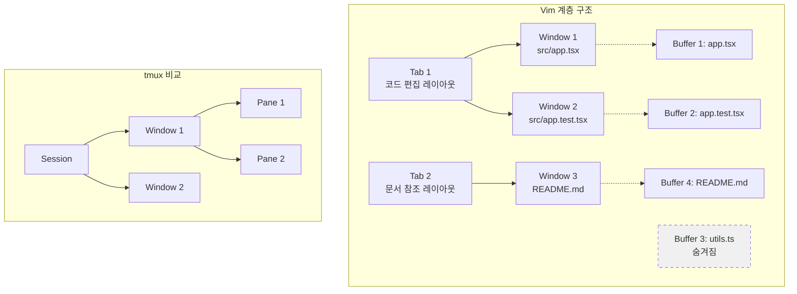

# 08. 버퍼, 윈도우, 탭 - 다중 파일 작업

실전 개발에서는 항상 여러 파일을 동시에 다룹니다. 컴포넌트, 테스트, 스타일, 설정 파일을 오가며 작업하는 것이 일상입니다. Vim은 이를 Buffer, Window, Tab이라는 세 가지 계층으로 관리합니다. 이 계층 구조는 tmux의 Session/Window/Pane 구조와 유사하며(tmux를 이미 학습했다면 빠르게 이해할 수 있습니다), 각 계층의 역할을 정확히 이해하면 파일 간 전환이 매끄러워집니다.

---

## 목표

- [ ] Buffer, Window, Tab의 관계를 설명할 수 있다
- [ ] 여러 파일을 버퍼로 열고 전환할 수 있다
- [ ] 화면을 분할하여 동시에 여러 파일을 볼 수 있다

---

## 1. 세 가지 계층 이해

Vim의 다중 파일 관리는 세 가지 독립적이면서도 연결된 계층으로 이루어져 있습니다. 이 구조를 이해하면 "파일 하나 = 탭 하나"라는 잘못된 패턴에서 벗어날 수 있습니다.

### Buffer (버퍼)

메모리에 로드된 파일의 내용입니다. 화면에 보이지 않아도 존재하며, Vim을 종료할 때까지 유지됩니다. 파일을 열면 버퍼가 생성되고, 다른 파일로 전환해도 이전 버퍼는 메모리에 남아있습니다.

```vim
" 파일 열기 → 새 버퍼 생성
:e src/components/Header.tsx

" 다른 파일 열기 → 또 다른 버퍼 생성 (Header는 숨겨짐)
:e src/components/Footer.tsx

" 버퍼 목록 확인
:ls
" 1 #h   "src/components/Header.tsx"
" 2 %a   "src/components/Footer.tsx"
```

### Window (윈도우)

버퍼를 표시하는 뷰포트입니다. 하나의 버퍼를 여러 윈도우에서 동시에 볼 수 있으며, 각 윈도우는 독립적인 커서 위치와 스크롤 위치를 갖습니다. 화면 분할은 윈도우를 추가하는 것입니다.

```vim
" 수평 분할 → 새 윈도우 생성 (같은 버퍼 표시)
:split

" 수직 분할 + 다른 파일 열기
:vsplit src/tests/Header.test.tsx
```

### Tab (탭)

윈도우 레이아웃의 모음입니다. 하나의 탭은 여러 윈도우를 포함할 수 있으며, 탭 간 전환 시 윈도우 배치가 통째로 바뀝니다. 탭은 "작업 공간 프리셋"으로 사용하는 것이 효과적입니다.

```vim
" 새 탭 생성
:tabnew

" 탭에 코드 편집용 레이아웃 설정
:vsplit src/utils/api.ts
:split src/types/api.d.ts
```

### tmux와의 비교

tmux를 학습했다면 다음과 같이 대응됩니다.

| Vim | tmux | 역할 |
|-----|------|------|
| Buffer | 백그라운드 프로세스 | 메모리에 있지만 보이지 않을 수 있음 |
| Window | Pane | 화면 분할 영역 |
| Tab | Window | 레이아웃 단위 |



## 2. 버퍼 관리

버퍼는 Vim의 작업 단위입니다. 파일을 열고, 전환하고, 닫는 모든 작업이 버퍼 관리입니다.

### 버퍼 열기와 목록 확인

```vim
" 파일 열기 (새 버퍼 생성)
:e src/components/Button.tsx
:edit src/components/Button.tsx

" 버퍼 목록 확인
:ls
:buffers
" 출력:
"   1 %a   "src/App.tsx"
"   2 #h   "src/components/Button.tsx"
"   3      "src/utils/format.ts"

" 기호 의미:
" % : 현재 윈도우의 버퍼
" # : 대체 버퍼 (Ctrl+6으로 전환 가능)
" a : 활성 버퍼 (윈도우에 로드됨)
" h : 숨겨진 버퍼 (로드되었지만 보이지 않음)
```

### 버퍼 간 전환

```vim
" 다음/이전 버퍼
:bn
:bnext
:bp
:bprevious

" 버퍼 번호로 이동
:b2
:buffer 2

" 부분 이름으로 전환 (자동완성 지원)
:b But<Tab>
:b Button

" 대체 버퍼로 전환 (최근 파일)
Ctrl+6
Ctrl+^
```

### 버퍼 닫기

```vim
" 현재 버퍼 닫기
:bd
:bdelete

" 특정 버퍼 닫기
:bd 3
:bd Button.tsx

" 저장하지 않은 버퍼 강제 닫기
:bd!

" 다른 버퍼 모두 닫기 (현재만 유지)
:%bd|e#
```

### 숨겨진 버퍼 (hidden)

기본적으로 Vim은 저장하지 않은 버퍼에서 다른 파일로 전환하려 하면 에러를 발생시킵니다. `set hidden` 옵션을 활성화하면 저장하지 않아도 전환할 수 있습니다.

```vim
" .vimrc 또는 init.lua에 추가
set hidden
" 또는 Lua:
vim.opt.hidden = true

" 이제 저장 없이 전환 가능
:e file1.txt
" 수정...
:e file2.txt    " 에러 없이 전환됨
```

## 3. 윈도우 분할

여러 파일을 동시에 보려면 화면을 분할합니다. 각 윈도우는 독립적으로 스크롤되며, 같은 버퍼를 여러 윈도우에 표시할 수도 있습니다.

### 분할 생성

```vim
" 수평 분할 (위아래)
:sp
:split
Ctrl+W s

" 수평 분할 + 파일 열기
:sp src/utils/api.ts

" 수직 분할 (좌우)
:vsp
:vsplit
Ctrl+W v

" 수직 분할 + 파일 열기
:vsp src/types/api.d.ts
```

### 윈도우 간 이동

```vim
" 방향키로 이동
Ctrl+W h    " 왼쪽 윈도우
Ctrl+W j    " 아래 윈도우
Ctrl+W k    " 위 윈도우
Ctrl+W l    " 오른쪽 윈도우

" 순환 이동
Ctrl+W w    " 다음 윈도우
Ctrl+W W    " 이전 윈도우

" 끝으로 이동
Ctrl+W t    " 맨 위(top) 윈도우
Ctrl+W b    " 맨 아래(bottom) 윈도우
```

### 윈도우 크기 조절

```vim
" 균등 분할
Ctrl+W =

" 현재 윈도우 최대화
Ctrl+W _    " 세로 최대화
Ctrl+W |    " 가로 최대화

" 크기 증감
Ctrl+W +    " 높이 증가
Ctrl+W -    " 높이 감소
Ctrl+W >    " 너비 증가
Ctrl+W <    " 너비 감소

" 숫자 지정
:resize 20      " 높이를 20줄로
:vertical resize 80  " 너비를 80열로
```

### 윈도우 닫기

```vim
" 현재 윈도우 닫기
Ctrl+W q
:q

" 다른 윈도우 모두 닫기
Ctrl+W o
:only
```

## 4. 탭 페이지

탭은 여러 윈도우를 묶은 레이아웃 프리셋입니다. "파일 하나 = 탭 하나"가 아니라 "작업 컨텍스트 = 탭 하나"로 사용합니다.

### 탭 생성과 전환

```vim
" 새 탭 생성
:tabnew
:tabnew src/config.ts

" 탭 전환
:tabn
:tabnext
gt

:tabp
:tabprevious
gT

" 특정 탭으로 이동
:tabn 3
3gt

" 첫/마지막 탭
:tabfirst
:tablast
```

### 탭 관리

```vim
" 탭 닫기
:tabc
:tabclose

" 다른 탭 모두 닫기
:tabo
:tabonly

" 탭 이동
:tabm 0         " 맨 앞으로
:tabm           " 맨 뒤로
:tabm 2         " 2번 위치로
```

### 탭의 올바른 사용

```vim
" ❌ 잘못된 사용: 파일마다 탭
:tabnew App.tsx
:tabnew Button.tsx
:tabnew Header.tsx

" ✅ 올바른 사용: 작업 컨텍스트별 탭
" Tab 1: 코드 편집 (3개 윈도우 분할)
:vsplit src/components/Header.tsx
:split tests/Header.test.tsx

" Tab 2: 문서 참조 (1개 윈도우)
:tabnew README.md

" Tab 3: 설정 파일 (2개 윈도우)
:tabnew
:vsplit tsconfig.json
:e package.json
```

## 5. 실전 멀티파일 워크플로우

실제 개발 시나리오에서 버퍼, 윈도우, 탭을 어떻게 조합하는지 알아봅니다.

### 패턴 1: 소스/테스트 나란히 보기

컴포넌트와 테스트를 수직 분할로 배치하여 동시에 편집합니다.

```vim
:e src/components/UserProfile.tsx
:vsp tests/UserProfile.test.tsx

" 윈도우 간 이동: Ctrl+W h/l
" 두 파일 모두 버퍼에 유지됨
```

### 패턴 2: 같은 파일의 다른 위치 보기

긴 파일에서 상단 함수와 하단 함수를 동시에 참조할 때 유용합니다.

```vim
:e src/utils/helpers.ts
/function processData     " 상단 함수 찾기
:sp                       " 수평 분할
Ctrl+W j                  " 아래 윈도우로
/function validateData    " 하단 함수 찾기

" 같은 버퍼가 두 윈도우에 표시됨
" 한 윈도우에서 수정 → 다른 윈도우에도 즉시 반영
```

### 패턴 3: 탭으로 컨텍스트 분리

코드 작성 탭과 문서 참조 탭을 분리합니다.

```vim
" Tab 1: 개발 작업
:e src/api/users.ts
:vsp src/types/user.d.ts
:split tests/users.test.ts

" Tab 2: API 문서 확인
:tabnew
:e docs/api-spec.md
:vsp CHANGELOG.md

" gt/gT로 빠르게 전환
```

### 패턴 4: tmux + Vim 윈도우 조합

tmux pane과 Vim window를 언제 사용할지 구분합니다.

```vim
" tmux pane 사용 시점:
" - 서로 다른 도구 (편집기 + 터미널)
" - 독립적인 프로세스 (서버 + 로그)
" - 영구적인 분할 (항상 같은 배치)

# tmux 예시
tmux split-window -h      # 오른쪽에 터미널
tmux split-window -v      # 아래에 로그 모니터

" Vim window 사용 시점:
" - 같은 프로젝트의 여러 파일
" - 일시적인 참조 (잠시 보고 닫음)
" - 파일 간 복사/붙여넣기

" Vim 예시
:vsp related-file.ts      " 참조용으로 잠시 열기
:q                        " 작업 후 바로 닫기
```

## 실습

`practice/exercises/07-multi-file/` 디렉토리에서 다음 작업을 수행하세요.

### 연습 1: 버퍼 전환

```bash
# 3개 파일 열기
nvim file-a.ts file-b.ts file-c.ts
```

작업:
1. `:ls`로 버퍼 목록 확인
2. `:bn`으로 다음 파일 이동
3. `:b file-a`로 첫 파일 복귀
4. `Ctrl+6`으로 최근 파일 전환

### 연습 2: 윈도우 분할

```vim
:e file-a.ts
```

작업:
1. `:vsp file-b.ts`로 수직 분할
2. `Ctrl+W l`로 오른쪽 이동
3. `:sp file-c.ts`로 오른쪽을 다시 수평 분할
4. `Ctrl+W =`로 윈도우 크기 균등화

### 연습 3: 탭 레이아웃

작업:
1. 탭 1: file-a.ts와 file-b.ts를 수직 분할
2. 탭 2: file-c.ts 단독 표시
3. `gt`로 탭 전환

## 명령어 요약

| 명령 | 설명 |
|------|------|
| `:e {file}` | 파일 열기 (버퍼 생성) |
| `:ls` / `:buffers` | 버퍼 목록 |
| `:bn` / `:bp` | 다음/이전 버퍼 |
| `:b {n}` / `:b {name}` | 버퍼 번호/이름으로 전환 |
| `:bd` | 버퍼 닫기 |
| `Ctrl+6` | 대체 버퍼 전환 |
| `:sp` / `:vsp` | 수평/수직 분할 |
| `Ctrl+W hjkl` | 윈도우 이동 |
| `Ctrl+W =` | 윈도우 균등 분할 |
| `Ctrl+W _` / `\|` | 세로/가로 최대화 |
| `Ctrl+W q` / `Ctrl+W o` | 윈도우 닫기/단독화 |
| `:tabnew` | 새 탭 |
| `gt` / `gT` | 다음/이전 탭 |
| `:tabc` / `:tabo` | 탭 닫기/단독화 |

## 체크포인트

<details>
<summary>1. Buffer와 Window의 관계를 설명하세요 (하나의 Buffer가 여러 Window에 표시 가능한가?)</summary>

가능합니다. Buffer는 메모리의 데이터이고, Window는 그것을 보여주는 뷰포트입니다. `:sp`로 분할하면 같은 Buffer가 두 Window에 표시되며, 한쪽에서 수정하면 다른 쪽에도 즉시 반영됩니다. 이는 같은 파일의 다른 위치를 동시에 보거나, 상단에서 참조하며 하단에서 작성할 때 유용합니다.

</details>

<details>
<summary>2. :set hidden 옵션이 왜 필요한가?</summary>

기본적으로 Vim은 저장하지 않은 버퍼를 떠나려 하면 에러를 발생시킵니다. `set hidden`을 활성화하면 저장하지 않아도 다른 버퍼로 전환할 수 있습니다. 이는 여러 파일을 오가며 작업하다가 한 번에 모두 저장(`:wa`)하는 워크플로우를 가능하게 합니다. 단, 종료 시 저장 안 된 버퍼가 있으면 경고가 표시됩니다.

</details>

<details>
<summary>3. tmux pane과 Vim window를 각각 언제 사용하나요?</summary>

tmux pane은 **독립적인 프로세스**를 나란히 실행할 때 사용합니다(편집기 + 서버 + 로그). Vim window는 **같은 프로젝트의 여러 파일**을 일시적으로 참조할 때 사용합니다. 기준: 영구적 분할이 필요하면 tmux, 일시적 참조면 Vim. 예: 서버 로그는 항상 보여야 하므로 tmux pane, 테스트 파일은 필요할 때만 `:vsp`로 엽니다.

</details>

---

다음: [09. 설정 파일](./09-config.md)
