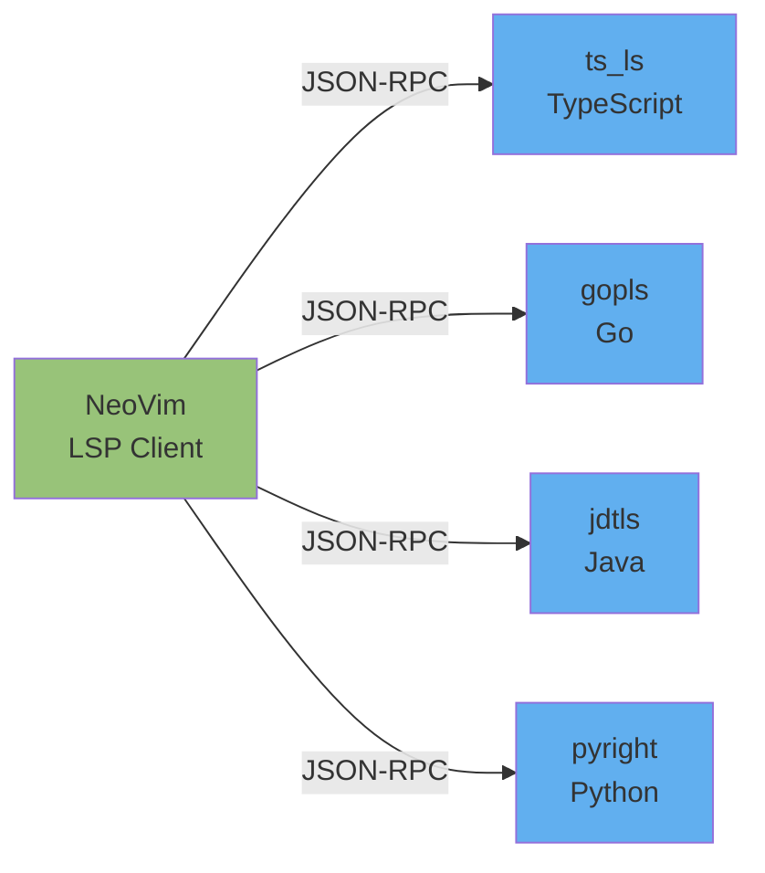

# 11. LSP와 자동완성 - IDE급 인텔리전스

Language Server Protocol(LSP)은 에디터와 프로그래밍 언어 분석 서버 사이의 표준 프로토콜입니다. NeoVim은 0.5 버전부터 LSP 클라이언트를 내장하고 있어, 별도의 무거운 IDE 없이도 코드 점프(go to definition), 참조 찾기, 리네임, 자동완성 등 IDE 핵심 기능을 사용할 수 있습니다. mason.nvim과 nvim-lspconfig의 조합으로 언어 서버를 쉽게 설치하고 관리할 수 있습니다.

---

## 목표

- [ ] LSP의 개념과 NeoVim에서의 동작 방식을 설명할 수 있다
- [ ] mason.nvim으로 언어 서버를 설치할 수 있다
- [ ] gd, gr, K 등 LSP 단축키를 사용할 수 있다

---

## 1. LSP란 무엇인가?

Language Server Protocol은 마이크로소프트가 VS Code를 위해 개발한 후 오픈 표준으로 공개한 프로토콜입니다. LSP 이전에는 각 에디터마다 각 언어를 위한 별도 플러그인이 필요했습니다. 예를 들어 TypeScript 지원을 위해 Vim, Emacs, Sublime Text가 각각 다른 플러그인을 개발해야 했습니다. LSP는 이 문제를 해결합니다.

LSP의 핵심은 **에디터와 언어 서버 사이의 분리**입니다. 에디터는 JSON-RPC 프로토콜로 언어 서버에게 "이 위치의 정의를 찾아줘", "이 심볼의 참조를 모두 찾아줘"라고 요청하고, 언어 서버는 코드를 분석해서 응답합니다. 이렇게 하면 하나의 언어 서버(예: TypeScript Language Server)를 모든 에디터에서 재사용할 수 있습니다.



NeoVim은 `vim.lsp` 모듈을 통해 LSP 클라이언트 기능을 제공합니다. 이 클라이언트는 언어 서버와 통신하며, 사용자가 `gd`(go to definition)를 누르면 서버에게 정의 위치를 요청하고 그 결과로 커서를 이동시킵니다.

### LSP가 제공하는 기능

- **정의로 이동(Go to Definition)**: 함수나 변수가 정의된 위치로 점프
- **참조 찾기(Find References)**: 심볼이 사용된 모든 위치 검색
- **타입 정보 표시(Hover)**: 커서 아래 심볼의 타입과 문서 표시
- **자동완성(Completion)**: 컨텍스트 기반 코드 제안
- **리네임(Rename)**: 심볼 이름을 프로젝트 전체에서 안전하게 변경
- **진단(Diagnostics)**: 실시간 오류/경고 표시
- **코드 액션(Code Actions)**: 빠른 수정, import 추가 등

---

## 2. mason.nvim - 언어 서버 관리자

mason.nvim은 LSP 서버, 린터, 포매터를 설치하고 관리하는 통합 패키지 매니저입니다. 과거에는 각 언어 서버를 수동으로 설치해야 했지만(npm, pip, go install 등), mason은 NeoVim 안에서 UI를 통해 모든 것을 관리할 수 있게 해줍니다.

### 설치 및 기본 사용

```lua
-- practice/configs/lazy-plugins/mason.lua
return {
  "williamboman/mason.nvim",
  dependencies = {
    "williamboman/mason-lspconfig.nvim",
  },
  config = function()
    require("mason").setup({
      ui = {
        icons = {
          package_installed = "✓",
          package_pending = "➜",
          package_uninstalled = "✗"
        }
      }
    })
  end,
}
```

mason을 설치한 후 `:Mason` 명령으로 UI를 열 수 있습니다. 이 UI에서는 다음 작업이 가능합니다.

- **i**: 패키지 설치
- **X**: 패키지 제거
- **u**: 패키지 업데이트
- **/**: 검색

### 주요 언어 서버

| 언어 | 서버 이름 | 설명 |
|------|-----------|------|
| TypeScript/JavaScript | `ts_ls` | 공식 TypeScript 언어 서버 |
| Go | `gopls` | Go 공식 언어 서버 |
| Lua | `lua_ls` | NeoVim 설정에 필수 |
| Java | `jdtls` | Eclipse JDT 기반 서버 |
| Python | `pyright` | 마이크로소프트 Python 서버 |
| Rust | `rust_analyzer` | Rust 공식 서버 |

### mason-lspconfig.nvim

mason과 nvim-lspconfig를 연결하는 브리지 플러그인입니다. mason으로 설치한 서버를 자동으로 lspconfig에 등록해줍니다.

```lua
-- practice/configs/lazy-plugins/mason.lua에 추가
require("mason-lspconfig").setup({
  ensure_installed = { "lua_ls", "ts_ls", "gopls" },
  automatic_installation = true,
})
```

`ensure_installed`에 나열된 서버는 NeoVim 시작 시 자동으로 설치됩니다.

---

## 3. nvim-lspconfig - 언어 서버 설정

nvim-lspconfig는 각 언어 서버의 설정 템플릿을 제공합니다. 대부분의 언어 서버는 기본 설정만으로도 잘 동작하지만, 프로젝트별 옵션이나 단축키 커스터마이징이 필요할 때 이 플러그인을 사용합니다.

### 기본 설정 구조

```lua
-- practice/configs/lazy-plugins/lsp.lua
return {
  "neovim/nvim-lspconfig",
  dependencies = {
    "williamboman/mason.nvim",
    "williamboman/mason-lspconfig.nvim",
  },
  config = function()
    local lspconfig = require("lspconfig")

    -- TypeScript 서버 설정
    lspconfig.ts_ls.setup({})

    -- Go 서버 설정
    lspconfig.gopls.setup({})

    -- Lua 서버 설정 (NeoVim API 인식)
    lspconfig.lua_ls.setup({
      settings = {
        Lua = {
          diagnostics = {
            globals = { "vim" }, -- vim 전역 변수 인식
          },
        },
      },
    })
  end,
}
```

### on_attach - LSP 단축키 등록

모든 LSP 서버에 공통으로 적용할 단축키는 `on_attach` 콜백에 정의합니다. 이 함수는 서버가 버퍼에 attach될 때마다 실행됩니다.

```lua
local on_attach = function(client, bufnr)
  local opts = { buffer = bufnr, noremap = true, silent = true }

  -- 정의로 이동
  vim.keymap.set("n", "gd", vim.lsp.buf.definition, opts)

  -- 참조 찾기
  vim.keymap.set("n", "gr", vim.lsp.buf.references, opts)

  -- 구현으로 이동
  vim.keymap.set("n", "gI", vim.lsp.buf.implementation, opts)

  -- 타입 정보 표시
  vim.keymap.set("n", "K", vim.lsp.buf.hover, opts)

  -- 리네임
  vim.keymap.set("n", "<leader>rn", vim.lsp.buf.rename, opts)

  -- 코드 액션
  vim.keymap.set("n", "<leader>ca", vim.lsp.buf.code_action, opts)

  -- 진단 이동
  vim.keymap.set("n", "[d", vim.diagnostic.goto_prev, opts)
  vim.keymap.set("n", "]d", vim.diagnostic.goto_next, opts)
end

-- 모든 서버에 적용
lspconfig.ts_ls.setup({ on_attach = on_attach })
lspconfig.gopls.setup({ on_attach = on_attach })
```

### capabilities - 자동완성 연동

LSP 서버에게 "이 클라이언트는 자동완성을 지원해"라고 알려주는 설정입니다. nvim-cmp와 함께 사용합니다.

```lua
local capabilities = require("cmp_nvim_lsp").default_capabilities()

lspconfig.ts_ls.setup({
  on_attach = on_attach,
  capabilities = capabilities,
})
```

---

## 4. LSP 핵심 단축키

LSP를 효과적으로 사용하려면 다음 단축키를 손에 익혀야 합니다.

| 단축키 | 기능 | 설명 |
|--------|------|------|
| `gd` | Go to Definition | 심볼이 정의된 위치로 이동 |
| `gr` | Go to References | 심볼이 사용된 모든 위치 표시 |
| `gI` | Go to Implementation | 인터페이스의 구현으로 이동 |
| `K` | Hover | 커서 아래 심볼의 문서 표시 |
| `<leader>rn` | Rename | 심볼 이름 변경 |
| `<leader>ca` | Code Action | 빠른 수정 메뉴 |
| `[d` | Previous Diagnostic | 이전 오류/경고로 이동 |
| `]d` | Next Diagnostic | 다음 오류/경고로 이동 |
| `<leader>d` | Diagnostic List | 모든 진단 목록 (Telescope) |

### 사용 시나리오

**시나리오 1: 함수 정의 찾기**
```typescript
// 커서가 여기에 있을 때
processUser(userData);

// gd를 누르면
function processUser(data: UserData) {
  // 여기로 점프
}
```

**시나리오 2: 함수 사용처 모두 찾기**
```typescript
// 함수 정의에서 gr을 누르면
function calculateTotal(items: Item[]) {
  return items.reduce((sum, item) => sum + item.price, 0);
}

// Telescope로 모든 호출 위치가 표시됨
// - checkout.ts:45: const total = calculateTotal(cart.items);
// - report.ts:102: return calculateTotal(orderItems);
```

**시나리오 3: 변수 이름 변경**
```go
// 커서를 oldName에 두고 <leader>rn 실행
func processData(oldName string) {
    fmt.Println(oldName)
    return strings.ToUpper(oldName)
}

// "newName"을 입력하면 모든 위치가 변경됨
func processData(newName string) {
    fmt.Println(newName)
    return strings.ToUpper(newName)
}
```

---

## 5. nvim-cmp - 자동완성

nvim-cmp는 NeoVim에서 가장 많이 사용되는 자동완성 프레임워크입니다. LSP뿐만 아니라 버퍼, 파일 경로, 스니펫 등 다양한 소스에서 완성 제안을 받을 수 있습니다.

### 필수 플러그인

```lua
-- practice/configs/lazy-plugins/cmp.lua
return {
  "hrsh7th/nvim-cmp",
  dependencies = {
    "hrsh7th/cmp-nvim-lsp",     -- LSP 소스
    "hrsh7th/cmp-buffer",        -- 버퍼 텍스트
    "hrsh7th/cmp-path",          -- 파일 경로
    "L3MON4D3/LuaSnip",          -- 스니펫 엔진
    "saadparwaiz1/cmp_luasnip",  -- LuaSnip 소스
    "rafamadriz/friendly-snippets", -- 스니펫 모음
  },
  config = function()
    local cmp = require("cmp")
    local luasnip = require("luasnip")

    -- friendly-snippets 로드
    require("luasnip.loaders.from_vscode").lazy_load()

    cmp.setup({
      snippet = {
        expand = function(args)
          luasnip.lsp_expand(args.body)
        end,
      },
      mapping = cmp.mapping.preset.insert({
        ["<C-b>"] = cmp.mapping.scroll_docs(-4),
        ["<C-f>"] = cmp.mapping.scroll_docs(4),
        ["<C-Space>"] = cmp.mapping.complete(),
        ["<C-e>"] = cmp.mapping.abort(),
        ["<CR>"] = cmp.mapping.confirm({ select = true }),

        -- Tab으로 완성 선택
        ["<Tab>"] = cmp.mapping(function(fallback)
          if cmp.visible() then
            cmp.select_next_item()
          elseif luasnip.expand_or_jumpable() then
            luasnip.expand_or_jump()
          else
            fallback()
          end
        end, { "i", "s" }),

        ["<S-Tab>"] = cmp.mapping(function(fallback)
          if cmp.visible() then
            cmp.select_prev_item()
          elseif luasnip.jumpable(-1) then
            luasnip.jump(-1)
          else
            fallback()
          end
        end, { "i", "s" }),
      }),
      sources = cmp.config.sources({
        { name = "nvim_lsp" },   -- LSP 우선
        { name = "luasnip" },    -- 스니펫
        { name = "buffer" },     -- 버퍼 텍스트
        { name = "path" },       -- 파일 경로
      }),
    })
  end,
}
```

### 완성 소스 우선순위

nvim-cmp는 여러 소스에서 받은 제안을 병합해서 보여줍니다. `sources` 배열의 순서가 우선순위입니다.

1. **nvim_lsp**: 가장 정확한 제안 (타입 기반)
2. **luasnip**: 자주 쓰는 패턴을 스니펫으로
3. **buffer**: 현재 버퍼의 단어들
4. **path**: 파일 경로 자동완성

### 스니펫 사용 예시

friendly-snippets를 설치하면 다양한 언어의 스니펫을 사용할 수 있습니다.

```typescript
// "cl" 타이핑 후 Tab
console.log();

// "fn" 타이핑 후 Tab
function name(params) {

}

// "if" 타이핑 후 Tab
if (condition) {

}
```

Tab과 Shift+Tab으로 스니펫의 플레이스홀더 사이를 이동할 수 있습니다.

---

## 6. 진단(Diagnostics)

LSP 서버는 코드의 오류와 경고를 실시간으로 분석해서 NeoVim에 전달합니다. 이를 진단(diagnostics)이라고 부릅니다.

### 진단 표시 방식

NeoVim은 진단을 다음과 같은 방식으로 표시합니다.

- **사인(Signs)**: 라인 번호 옆 아이콘 (E: Error, W: Warning)
- **가상 텍스트(Virtual Text)**: 코드 뒤에 인라인으로 표시되는 메시지
- **부동 창(Floating Window)**: 커서 위치의 진단을 팝업으로 표시
- **Underline**: 문제가 있는 코드에 밑줄

### 진단 설정 커스터마이징

```lua
vim.diagnostic.config({
  virtual_text = {
    prefix = "●", -- 가상 텍스트 앞 아이콘
    spacing = 4,
  },
  signs = true,
  underline = true,
  update_in_insert = false, -- Insert 모드에서는 진단 업데이트 안 함
  severity_sort = true,     -- 심각도 순으로 정렬
  float = {
    source = "always",      -- 진단 소스 표시 (예: eslint)
    border = "rounded",
  },
})

-- 사인 아이콘 커스터마이징
local signs = { Error = "✘", Warn = "▲", Hint = "⚑", Info = "»" }
for type, icon in pairs(signs) do
  local hl = "DiagnosticSign" .. type
  vim.fn.sign_define(hl, { text = icon, texthl = hl, numhl = hl })
end
```

### 진단 단축키

```lua
-- 부동 창으로 진단 보기
vim.keymap.set("n", "<leader>e", vim.diagnostic.open_float)

-- 진단 목록 (quickfix)
vim.keymap.set("n", "<leader>q", vim.diagnostic.setloclist)

-- Telescope로 진단 보기 (추천)
vim.keymap.set("n", "<leader>d", "<cmd>Telescope diagnostics<CR>")
```

---

## 실습

1. **mason.nvim으로 언어 서버 설치**
   - `:Mason`으로 UI 열기
   - `ts_ls`, `lua_ls`, `gopls` 설치
   - `:LspInfo`로 활성화된 서버 확인

2. **TypeScript 파일에서 LSP 테스트**
   ```typescript
   // test.ts
   function greet(name: string): string {
     return `Hello, ${name}!`;
   }

   const message = greet("World");
   console.log(message);
   ```
   - `greet` 위에서 `K` → 타입 정보 확인
   - `greet` 위에서 `gd` → 정의로 이동
   - `greet` 위에서 `gr` → 참조 찾기
   - `name` 위에서 `<leader>rn` → 이름 변경

3. **자동완성 테스트**
   - 새 줄에서 `con` 타이핑 → nvim-cmp 팝업 확인
   - Tab/Shift+Tab으로 항목 선택
   - Enter로 확정

4. **진단 테스트**
   ```typescript
   // 의도적으로 오류 만들기
   const x: number = "hello"; // Type error
   ```
   - 에러 메시지 확인
   - `[d`, `]d`로 진단 이동
   - `<leader>e`로 부동 창 열기

---

## 명령어 요약

| 명령어/단축키 | 기능 |
|---------------|------|
| `:Mason` | mason 패키지 관리 UI |
| `:LspInfo` | 현재 버퍼의 LSP 서버 정보 |
| `:LspStart` / `:LspStop` | LSP 시작/중지 |
| `gd` | 정의로 이동 |
| `gr` | 참조 찾기 |
| `gI` | 구현으로 이동 |
| `K` | 타입 정보/문서 표시 |
| `<leader>rn` | 심볼 이름 변경 |
| `<leader>ca` | 코드 액션 |
| `[d` / `]d` | 이전/다음 진단 |
| `<leader>e` | 진단 부동 창 |
| `<C-Space>` | 자동완성 강제 트리거 (Insert 모드) |
| `<Tab>` / `<S-Tab>` | 완성 항목 선택 (Insert 모드) |

---

## 체크포인트

<details>
<summary><strong>1. LSP가 에디터별 플러그인보다 우수한 이유는?</strong></summary>

LSP는 에디터와 언어 분석 로직을 분리합니다. 과거에는 Vim용 TypeScript 플러그인, Emacs용 TypeScript 플러그인을 각각 개발해야 했지만, LSP는 하나의 TypeScript 언어 서버(ts_ls)를 모든 에디터에서 재사용할 수 있게 해줍니다. 이는 개발 비용을 줄이고, 모든 에디터가 동일한 품질의 언어 지원을 받을 수 있게 합니다. 또한 JSON-RPC라는 표준 프로토콜을 사용하므로 에디터 개발자는 언어별 세부 구현을 알 필요 없이 LSP 클라이언트만 구현하면 됩니다.
</details>

<details>
<summary><strong>2. mason.nvim의 역할은?</strong></summary>

mason.nvim은 LSP 서버, 린터, 포매터를 NeoVim 안에서 통합 관리하는 패키지 매니저입니다. 과거에는 TypeScript 서버는 npm으로, Go 서버는 go install로 각각 설치해야 했지만, mason은 `:Mason` UI에서 모든 도구를 검색하고 설치할 수 있게 해줍니다. mason-lspconfig.nvim과 함께 사용하면 설치된 서버를 자동으로 nvim-lspconfig에 연결해주므로, 수동 설정이 거의 필요 없습니다. 또한 `ensure_installed` 옵션으로 필수 서버를 자동 설치할 수 있어 환경 구축이 간편합니다.
</details>

<details>
<summary><strong>3. gd와 gr의 차이를 설명하세요</strong></summary>

`gd`(go to definition)는 심볼이 **정의된 위치**로 커서를 이동시킵니다. 예를 들어 함수 호출에서 `gd`를 누르면 함수 선언부로 점프합니다. 반면 `gr`(go to references)는 심볼이 **사용된 모든 위치**를 찾아서 Telescope 또는 quickfix 리스트로 보여줍니다. `gd`는 "이게 어디서 정의됐지?"를 알고 싶을 때, `gr`는 "이게 어디서 쓰이지?"를 알고 싶을 때 사용합니다. 리팩토링 시에는 보통 `gr`로 모든 사용처를 확인한 후 변경합니다.
</details>

---
다음: [12. IdeaVim](./12-ideavim.md)
