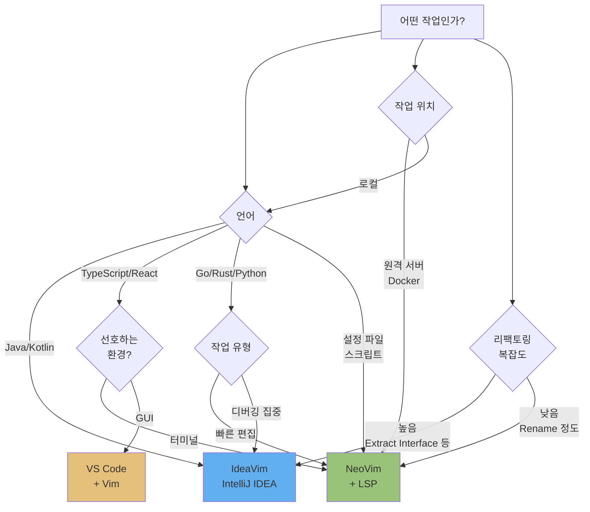

# 14. 실전 워크플로우 + 치트시트

지금까지 Vim의 모션, 연산자, 플러그인, 통합 방법을 모두 학습했습니다. 이 마지막 챕터에서는 일상 개발에서 어떤 도구를 어떤 상황에 선택할지 정리하고, 가장 자주 사용하는 명령어를 치트시트로 제공합니다. Vim은 한 번에 모든 것을 익히는 도구가 아니라, 매일 조금씩 새로운 명령어를 추가하며 성장하는 도구입니다.

---

## 목표

- [ ] 상황별 도구 선택 기준을 설명할 수 있다
- [ ] Top 30 명령어를 손에 익힐 수 있다
- [ ] 주간 연습 계획을 수립할 수 있다

---

## 1. 상황별 도구 선택

Vim 생태계에는 NeoVim, IdeaVim, VS Code Vim 등 여러 구현체가 있습니다. 각각의 강점을 이해하고 상황에 맞게 선택하면 생산성이 극대화됩니다.

### NeoVim을 선택하는 경우

NeoVim은 완전한 Vim 경험을 제공하며, 터미널 중심 워크플로우에서 빛을 발합니다.

**최적 상황:**
- 설정 파일 편집 (nginx.conf, docker-compose.yml, .env 등)
- 셸 스크립트 작성 (bash, zsh, Python 스크립트)
- 빠른 편집이 필요한 경우 (git commit 메시지, README 수정)
- 원격 서버 작업 (SSH, Docker 컨테이너)
- 터미널과의 긴밀한 통합 (tmux, Claude Code 등)
- 다양한 언어를 오가며 작업 (Go, TypeScript, Python, Rust 등)
- 가벼운 리소스 환경 (메모리 제약, 느린 네트워크)

**장점:**
- 실행 속도가 매우 빠름 (밀리초 단위 시작)
- 무한한 커스터마이징 가능 (Lua, Vimscript)
- 플러그인 생태계가 방대함 (Telescope, LSP, Tree-sitter 등)
- 터미널 네이티브 (키보드만으로 모든 작업)

### IdeaVim을 선택하는 경우

IdeaVim은 IntelliJ IDEA의 강력한 기능과 Vim 모션을 결합합니다.

**최적 상황:**
- Java/Kotlin 프로젝트 (Spring Boot, Android 등)
- 복잡한 리팩토링 (Extract Interface, Change Signature, Safe Delete 등)
- 디버깅 집중 작업 (조건부 중단점, 표현식 평가 등)
- 데이터베이스 작업 (IntelliJ Database 도구와 통합)
- 빌드 도구 통합 (Gradle, Maven UI)
- 팀이 IntelliJ를 표준으로 사용하는 환경

**장점:**
- 언어별 최적화된 리팩토링 (특히 Java/Kotlin)
- 통합 디버거 (최고 수준)
- 빌드/테스트 실행 UI
- 설정 없이 바로 사용 가능 (기본값이 우수)

### VS Code + Vim 플러그인

VS Code의 Vim 플러그인(VSCodeVim)은 중간 지점입니다.

**최적 상황:**
- 웹 프론트엔드 개발 (TypeScript, React, Vue)
- Jupyter Notebook 작업
- Live Share 협업
- 다양한 확장 기능이 필요한 경우 (REST Client, Docker 등)
- GUI 도구를 선호하지만 Vim 모션을 쓰고 싶은 경우

**장점:**
- 친숙한 GUI (초보자 진입 장벽 낮음)
- 확장 생태계가 거대함
- 원격 개발 기능 (Remote-SSH, Dev Containers)

### 판단 플로우



### 실전 조합 예시

많은 개발자들이 여러 도구를 상황에 따라 전환합니다.

**하루의 워크플로우:**
1. 아침: tmux 세션 복구 → NeoVim으로 어제 작업 리뷰
2. 오전: IdeaVim(IntelliJ)으로 Spring Boot API 개발
3. 점심: NeoVim으로 README.md 업데이트, git commit
4. 오후: IdeaVim으로 복잡한 리팩토링 (Extract Service Layer)
5. 저녁: NeoVim으로 스크립트 작성, 설정 파일 수정

**핵심:** Vim의 언어(motion + operator)는 모든 도구에서 동일하므로, 하나를 배우면 모두 사용할 수 있습니다.

---

## 2. Top 30 Vim 명령어 치트시트

일상 개발에서 가장 자주 사용하는 명령어 30개입니다. 이것만 완벽히 익혀도 생산성이 크게 향상됩니다.

| 범주 | 명령어 | 설명 | ROI |
|------|--------|------|-----|
| **이동** | `hjkl` | 좌/하/상/우 이동 | ⭐⭐⭐ |
| | `w` / `b` / `e` | 단어 앞/뒤/끝으로 이동 | ⭐⭐⭐ |
| | `0` / `^` / `$` | 줄 시작/첫 문자/끝으로 이동 | ⭐⭐⭐ |
| | `gg` / `G` | 파일 시작/끝으로 이동 | ⭐⭐⭐ |
| | `{n}G` | n번째 줄로 이동 (예: 42G) | ⭐⭐ |
| | `f{c}` / `t{c}` | 문자 c까지/앞까지 이동 | ⭐⭐⭐ |
| | `Ctrl+D` / `Ctrl+U` | 반 페이지 아래/위 스크롤 | ⭐⭐ |
| | `%` | 괄호 짝으로 이동 | ⭐⭐ |
| **편집** | `i` / `I` | 커서 앞/줄 시작에서 삽입 | ⭐⭐⭐ |
| | `a` / `A` | 커서 뒤/줄 끝에서 삽입 | ⭐⭐⭐ |
| | `o` / `O` | 아래/위에 새 줄 삽입 | ⭐⭐⭐ |
| | `x` | 문자 삭제 | ⭐⭐ |
| | `dd` | 줄 삭제 | ⭐⭐⭐ |
| | `D` | 커서부터 줄 끝까지 삭제 | ⭐⭐ |
| | `cw` | 단어 변경 (삭제 후 삽입) | ⭐⭐⭐ |
| | `ci"` / `ci(` / `ci{` | 따옴표/괄호 안 내용 변경 | ⭐⭐⭐ |
| | `cc` | 줄 전체 변경 | ⭐⭐ |
| | `yy` | 줄 복사 | ⭐⭐⭐ |
| | `p` / `P` | 커서 아래/위에 붙여넣기 | ⭐⭐⭐ |
| | `u` | 실행 취소 (Undo) | ⭐⭐⭐ |
| | `Ctrl+R` | 다시 실행 (Redo) | ⭐⭐⭐ |
| | `.` | 마지막 변경 반복 | ⭐⭐⭐ |
| **검색** | `/{pattern}` | 앞으로 검색 | ⭐⭐⭐ |
| | `n` / `N` | 다음/이전 검색 결과 | ⭐⭐⭐ |
| | `*` | 커서 아래 단어 검색 | ⭐⭐⭐ |
| | `:%s/old/new/g` | 전체 파일 치환 | ⭐⭐⭐ |
| **레지스터** | `"ayy` / `"ap` | a 레지스터에 복사/붙여넣기 | ⭐⭐ |
| | `"+y` | 시스템 클립보드로 복사 | ⭐⭐⭐ |
| | `"0p` | 마지막 복사 내용 붙여넣기 | ⭐⭐ |
| **윈도우** | `:e {file}` | 파일 열기 | ⭐⭐ |

**ROI(Return on Investment) 기준:**
- ⭐⭐⭐: 매일 수십 번 사용, 필수 암기
- ⭐⭐: 주 단위로 사용, 익숙해지면 유용
- ⭐: 특수 상황, 알아두면 좋음

### 복합 명령어 예시

Vim의 진정한 힘은 명령어를 조합하는 것입니다.

```vim
" 현재 단어를 큰따옴표로 감싸기
ysiw"         (surround 플러그인)

" 함수 안의 모든 내용 삭제
di{           (delete inner braces)

" 현재 줄부터 파일 끝까지 들여쓰기
>G            (indent to end of file)

" 다음 세미콜론까지 변경
ct;           (change till semicolon)

" 괄호 안의 두 번째 인자 삭제
f,w           (find comma, next word)
diw           (delete inner word)

" 현재 단어를 레지스터 a에 복사하고 다음 단어와 교체
"ayiw          (yank inner word to register a)
w              (next word)
viwp           (visual inner word, paste)
```

---

## 3. Vim-as-Language 마인드맵

Vim은 **언어**입니다. 동사(operator), 명사(motion/text-object), 수식어(count/modifier)를 조합하여 문장을 만듭니다.

```mermaid
mindmap
  root((Vim 언어))
    동사 Operator
      d delete
      c change
      y yank
      v visual
      > indent
      = format
    명사 Motion/Object
      w word
      b back
      iw inner word
      i" inner quotes
      ap around paragraph
      gg top
      G bottom
    수식어 Modifier
      숫자 2, 3, 5
      검색 /, ?, *
      점프 f, t, F, T
      범위 %, (, ), [, ]
    조합 Examples
      d2w delete 2 words
      ci" change inner quotes
      >ap indent paragraph
      y$ yank to end
      3dd delete 3 lines
      gUiw uppercase word
```

### 새 조합 만들기 연습

학습한 명령어를 조합하여 새로운 패턴을 만들어보세요.

**연습 문제:**
1. 함수 정의를 다음 함수로 복사하려면? → `va{y}p` (visual around braces, yank, next brace, paste)
2. URL(http://...)을 레지스터에 복사하려면? → `yi"` (yank inner quotes) 또는 `vf/y` (visual find slash, yank)
3. 현재 줄을 위로 이동하려면? → `ddkP` (delete line, up, paste before)
4. 세 개의 연속된 단어를 대문자로? → `gUiw.` 또는 `v2e~` (visual 2 end, toggle case)

**핵심:** 명령어를 외우는 것이 아니라, 조합 규칙을 이해하면 무한한 패턴을 만들 수 있습니다.

---

## 4. 주간 연습 계획

Vim은 점진적으로 학습하는 도구입니다. 한 번에 모든 것을 익히려 하지 말고, 주마다 작은 목표를 세우세요.

### Week 1: 기본 모드 전환 + hjkl

**목표:** 화살표 키 없이 이동하기

- `vimtutor` 매일 15분 (1-2 레슨)
- hjkl만으로 파일 탐색 연습
- Insert 모드에서 짧게 머물고 바로 Esc

**연습 파일:**
```bash
# 연습용 파일 생성
curl https://lipsum.com/feed/html > practice.txt
nvim practice.txt

# hjkl로만 이동, i로 편집, Esc로 복귀
```

**마일스톤:** 화살표 키를 누르지 않고도 자연스럽게 이동

### Week 2: 단어 이동 + operator

**목표:** w/b/e + d/c/y 조합

- `w`, `b`, `e`로 빠르게 단어 이동
- `dw`, `cw`, `yiw` 연습
- `.` (dot 명령어)로 반복 작업

**연습:**
```javascript
// 이 코드에서 변수명을 모두 수정
const userName = "Alice";
const userEmail = "alice@example.com";
const userAge = 30;

// userName에서 cw → user<Esc> → j0.j0. (dot 반복)
```

**마일스톤:** 단어 단위 편집이 문자 단위보다 빠름을 체감

### Week 3: 텍스트 오브젝트 + dot 명령

**목표:** `iw`, `i"`, `i(`, `ap` 활용

- `ci"`, `ci(`, `ci{`로 괄호 안 내용 변경
- `diw`, `daw`로 단어 삭제
- `vap`로 문단 선택

**연습:**
```python
def greet(name):
    message = "Hello, {name}!"
    print(message)

# "Hello, {name}!"에서 ci" → 내용 변경
# (name)에서 ci( → 인자 변경
# 전체 함수 선택 vap
```

**마일스톤:** 마우스 없이 정확한 범위 선택

### Week 4: 검색/치환 + 비주얼 모드

**목표:** `/`, `:%s`, Visual 모드

- `/pattern`으로 검색 후 `n`, `N`으로 이동
- `:%s/old/new/gc`로 확인하며 치환
- Visual 모드로 여러 줄 편집

**연습:**
```bash
# 로그 파일에서 ERROR 찾기
nvim app.log
/ERROR
# n으로 다음 에러 이동

# 모든 "http://"를 "https://"로 변경
:%s/http:/https:/gc
```

**마일스톤:** grep 대신 Vim 검색 사용

### Week 5+: 플러그인 + 설정 커스터마이징

**목표:** Telescope, LSP, 자신만의 설정

- Telescope로 파일 찾기 (`<leader>ff`)
- LSP로 정의 이동 (`gd`)
- `.ideavimrc` 또는 `init.lua` 커스터마이징

**연습:**
```lua
-- 자신만의 단축키 추가
vim.keymap.set("n", "<leader>w", ":w<CR>") -- 빠른 저장
vim.keymap.set("n", "<leader>q", ":q<CR>") -- 빠른 종료

-- 플러그인 추가
-- Telescope, nvim-tree, lualine 등
```

**마일스톤:** Vim이 일상 에디터가 됨

---

## 5. 흔한 실수와 해결법

### "hjkl이 불편해요"

**증상:** 화살표 키가 더 편함, hjkl이 어색함

**해결:**
- 2주만 참으면 자동화됩니다 (근육 기억)
- 화살표 키를 비활성화하여 강제 학습:
  ```lua
  vim.keymap.set("n", "<Up>", "<Nop>")
  vim.keymap.set("n", "<Down>", "<Nop>")
  vim.keymap.set("n", "<Left>", "<Nop>")
  vim.keymap.set("n", "<Right>", "<Nop>")
  ```
- 홈 포지션에서 손을 떼지 않아도 되므로 장기적으로 빠름

### "Normal 모드로 안 돌아가요"

**증상:** Insert 모드에서 오래 머물고 Esc를 누르지 않음

**해결:**
- Insert 모드는 "삽입 작업만" 하는 곳입니다
- 생각하거나 읽을 때는 Normal 모드로 복귀
- `jk`를 Esc 대체 키로 매핑:
  ```lua
  vim.keymap.set("i", "jk", "<Esc>")
  ```
- 습관: "타이핑 완료 → 즉시 Esc"

### "뭘 눌러야 할지 모르겠어요"

**증상:** 명령어가 너무 많아서 어떤 걸 써야 할지 혼란스러움

**해결:**
- which-key 플러그인 설치 (단축키 힌트 표시)
- `:help {keyword}` 적극 활용 (예: `:help motion`)
- 처음에는 Top 10만 사용:
  1. `hjkl`, `w`, `b`
  2. `i`, `a`, `o`
  3. `dd`, `yy`, `p`
  4. `/`, `n`
  5. `u`, `.`

### "너무 많아서 외울 수 없어요"

**증상:** 수백 개 명령어를 외워야 할 것 같음

**해결:**
- **한 주에 3개 명령어만 추가**하세요
- 외우는 것이 아니라 **반복으로 체화**
- dot 명령(`.`)이 핵심: 한 번 잘 입력하면 반복 가능
- 조합 규칙을 이해하면 새 명령어를 유추 가능
  - `diw` (delete inner word) → `ciw` (change inner word)는 자연스럽게 추론

---

## 6. 추가 학습 자원

### 인터랙티브 학습

- **Vim Adventures** (https://vim-adventures.com): 게임으로 Vim 배우기
- **vimtutor**: 터미널에서 `vimtutor` 실행 (30분 튜토리얼)
- **OpenVim** (https://openvim.com): 브라우저 기반 튜토리얼

### 책

- **Practical Vim (Drew Neil)**: Vim 사용자 필독서, "Think in Vim" 철학
- **Modern Vim (Drew Neil)**: NeoVim, 터미널 통합
- **Learning the vi and Vim Editors (O'Reilly)**: 기초부터 고급까지

### 비디오

- **ThePrimeagen (YouTube)**: NeoVim 설정, 플러그인, 워크플로우
- **Chris@Machine**: NeoVim from Scratch 시리즈
- **Vim Casts (vimcasts.org)**: 짧은 튜토리얼 비디오

### 내장 도움말

가장 정확하고 완전한 문서는 Vim 안에 있습니다.

```vim
:help                  " 도움말 시작
:help motion           " 모션 도움말
:help operator         " 연산자 도움말
:help text-objects     " 텍스트 오브젝트
:help :substitute      " 치환 명령어
:help lsp              " LSP 관련

" Ctrl+] : 링크 따라가기
" Ctrl+O : 이전 위치로
```

---

## 실습

### 자신만의 치트시트 만들기

A4 용지 한 장에 자신이 가장 자주 쓰는 명령어를 정리하세요.

**템플릿:**
```
┌─────────────────────────────────────┐
│         MY VIM CHEATSHEET           │
├─────────────────────────────────────┤
│ 이동:                               │
│  w/b/e: 단어, 0/$: 줄, gg/G: 파일  │
│                                     │
│ 편집:                               │
│  i/a/o: 삽입, dd/yy/p: 삭제/복사   │
│  ci": 따옴표 안 변경                │
│                                     │
│ 검색:                               │
│  /pattern, n, *                     │
│  :%s/old/new/g                      │
│                                     │
│ 내 단축키:                          │
│  <leader>ff: 파일 찾기              │
│  <leader>fg: 텍스트 검색            │
│  gd: 정의로 이동                    │
└─────────────────────────────────────┘
```

모니터 옆에 붙여두고 2주 후에는 외워졌는지 확인하세요.

---

## 명령어 요약

| 명령어 | 기능 |
|--------|------|
| `vimtutor` | 대화형 튜토리얼 |
| `:help {topic}` | 내장 도움말 |
| `.` | 마지막 변경 반복 (가장 강력) |
| `*` | 커서 아래 단어 검색 |
| `ci"` / `ci(` | 따옴표/괄호 안 내용 변경 |
| `>ap` | 문단 들여쓰기 |
| `"+y` | 시스템 클립보드로 복사 |
| `:%s/old/new/gc` | 확인하며 전체 치환 |
| `f{c}` / `t{c}` | 문자까지 점프 |
| `Ctrl+O` / `Ctrl+I` | 이전/다음 위치 (점프 리스트) |

---

## 체크포인트

<details>
<summary><strong>1. NeoVim과 IdeaVim을 각각 어떤 상황에 사용하나요?</strong></summary>

**NeoVim**은 터미널 중심 워크플로우, 빠른 편집, 원격 서버 작업에 적합합니다. 설정 파일(nginx.conf, docker-compose.yml), 스크립트(bash, Python), git commit 메시지, 다양한 언어를 오가는 작업에서 빛을 발합니다. 실행이 매우 빠르고(밀리초), tmux/Claude Code와의 통합이 자연스럽습니다.

**IdeaVim**은 Java/Kotlin 프로젝트, 복잡한 리팩토링(Extract Interface, Change Signature), 디버깅 집중 작업에서 우수합니다. IntelliJ의 언어별 최적화된 도구(Spring, Gradle, Database)를 Vim 모션으로 제어할 수 있습니다. 팀이 IntelliJ를 표준으로 사용하는 기업 환경에서도 적합합니다.

대부분의 개발자는 두 도구를 모두 사용하며, 작업에 따라 전환합니다. Vim 언어(motion + operator)는 동일하므로 하나를 배우면 모두 활용할 수 있습니다.
</details>

<details>
<summary><strong>2. Vim 학습에서 가장 ROI가 높은 명령어 3가지는?</strong></summary>

1. **`.` (dot 명령어)**: 마지막 변경을 반복합니다. 한 번 잘 입력하면 여러 곳에 적용할 수 있어, Vim의 핵심 철학인 "반복 최소화"를 구현합니다. 예를 들어 `ciw`로 단어를 변경한 후, 다른 단어로 이동해서 `.`만 누르면 동일한 변경이 적용됩니다.

2. **`ci{motion}` (change inner)**: 텍스트 오브젝트 변경입니다. `ci"` (따옴표 안 변경), `ci(` (괄호 안 변경), `ciw` (단어 변경) 등은 정확한 범위 선택 없이도 의미 단위로 편집할 수 있게 해줍니다. 마우스 드래그보다 훨씬 빠릅니다.

3. **`/{pattern}` + `n`**: 검색 후 다음 결과로 이동입니다. `/TODO`로 모든 TODO를 찾고 `n`으로 순회하며 처리하는 패턴은 일상적입니다. `*`(커서 아래 단어 검색)와 함께 사용하면 변수 사용처를 빠르게 탐색할 수 있습니다.

이 세 가지만 익혀도 편집 속도가 2배 이상 향상됩니다.
</details>

<details>
<summary><strong>3. 일주일에 새로운 Vim 명령어를 얼마나 추가하는 것이 적절한가요?</strong></summary>

**주당 2-3개**가 적절합니다. 한 번에 많은 명령어를 외우려 하면 압도되고, 실제로는 사용하지 않게 됩니다. 대신 2-3개를 선택해서 일주일 동안 **의식적으로 반복 사용**하면 근육 기억이 형성됩니다.

예를 들어 Week 1에는 `w`, `b`, `e`만 집중하고, Week 2에는 `ci"`, `ci(`, `diw`를 추가합니다. 3개월 후에는 36개 명령어가 자동화되며, 이는 일상 개발의 95%를 커버합니다.

**중요한 것은 수가 아니라 체화입니다.** 10개를 어렴풋이 아는 것보다, 5개를 완벽히 자동화한 것이 더 가치 있습니다. Vim은 마라톤이지 단거리 경주가 아닙니다. 매일 조금씩 성장하는 것을 즐기세요.
</details>

---
처음으로: [README](../README.md)
