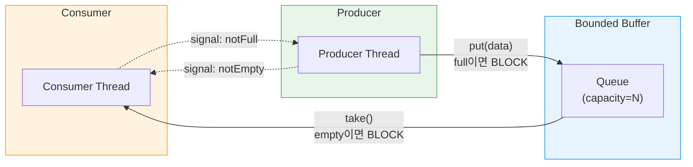
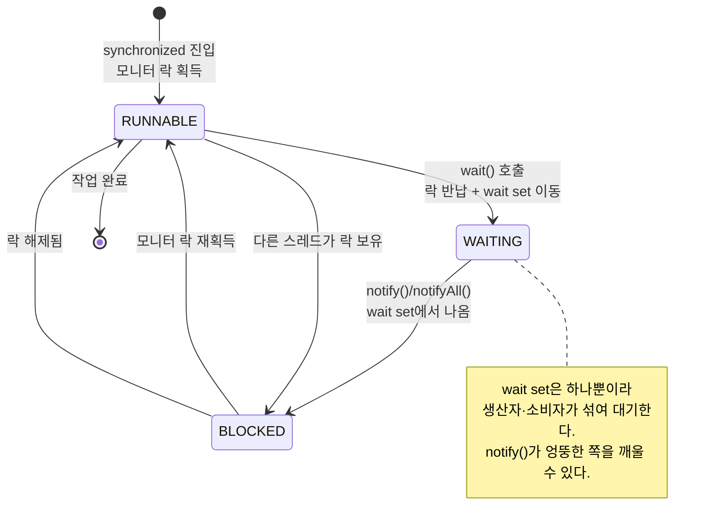
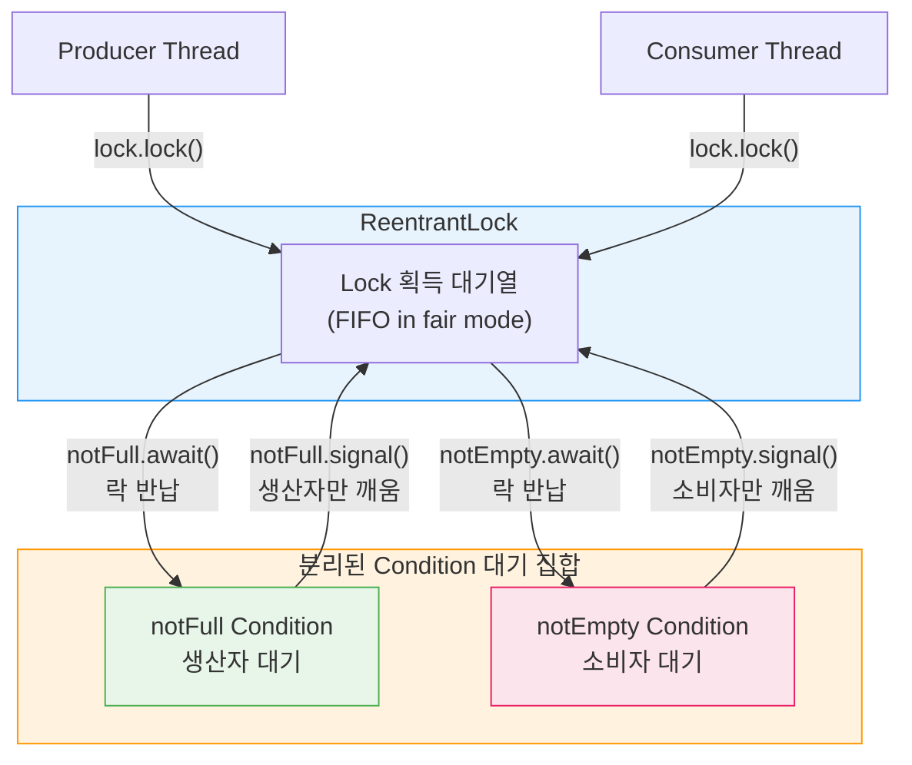

# 생산자-소비자 패턴
---
> 생산자-소비자 패턴은 데이터를 만드는 쪽과 소비하는 쪽을 버퍼로 분리해 독립적으로 동작하게 한다. `wait()`/`notify()`의 한계를 이해하고, `ReentrantLock`과 `Condition`으로 어떻게 개선하는지, 그리고 `BlockingQueue`로 어떻게 단순화하는지를 함께 살펴본다.

## 1. 생산자-소비자 문제 정의

생산자(producer)는 데이터를 생성해 공유 버퍼에 넣고, 소비자(consumer)는 버퍼에서 데이터를 꺼내 처리한다. 핵심 문제는 **처리 속도 불일치(rate mismatch)**다. 생산자가 소비자보다 빠르면 버퍼가 넘치고, 소비자가 생산자보다 빠르면 버퍼가 비어 낭비가 발생한다. 버퍼는 이 속도 차이를 흡수하는 완충재 역할을 한다.

실무에서 이 패턴은 어디서나 등장한다. 로그 수집기가 이벤트를 생산하면 파일 기록기가 비동기로 소비하고, HTTP 요청이 들어오면 스레드 풀의 워커 스레드가 처리하며, Kafka 자체가 이 패턴의 분산 버전이다. 즉, 생산자-소비자를 이해하면 대부분의 비동기 시스템 설계 원리를 이해한 것이다.

**유한 버퍼(Bounded Buffer)**의 중요성을 간과하면 안 된다. 무한 버퍼를 허용하면 소비가 따라가지 못할 때 버퍼가 무한정 커지며 결국 OutOfMemoryError가 발생한다. 실무에서는 버퍼 크기에 상한을 두고, 가득 찼을 때 생산자를 블로킹하거나 요청을 거절하는 **배압(backpressure)** 전략을 함께 설계해야 한다.

이 패턴이 해결하는 핵심은 **스레드 간 결합도 제거**다. 버퍼가 없으면 생산자는 소비자가 처리를 끝낼 때까지 기다려야 하고, 소비자는 생산자가 데이터를 만들어줄 때까지 기다려야 한다. 서로 직접 의존하는 구조는 하나가 느려지면 전체가 느려진다. 버퍼를 사이에 두면 두 쪽이 각자 최적의 속도로 동작할 수 있고, 하나가 일시 중단되어도 상대방에게 즉각 영향을 주지 않는다. 이것이 메시지 큐(Kafka, RabbitMQ)가 마이크로서비스 간에 널리 쓰이는 이유이기도 하다.

버퍼 크기는 시스템 특성에 따라 튜닝이 필요하다. 너무 작으면 생산자가 자주 블로킹되어 처리량이 떨어지고, 너무 크면 지연 시간이 늘어나고 장애 발생 시 손실 데이터가 많아진다. 일반적으로 평균 처리량 차이에 버스트 지속 시간을 곱한 값을 기준으로 설정하고, 모니터링으로 실제 큐 깊이를 관찰하며 조정한다.



## 2. wait() / notify() 메커니즘

`Object.wait()`와 `Object.notify()`를 이해하려면 먼저 **모니터(Monitor)** 개념이 필요하다. Java의 모든 객체는 내부에 모니터를 가지며, `synchronized`는 그 모니터 락을 획득하는 명령이다. 락을 보유한 스레드만 임계 영역에 진입할 수 있고, 다른 스레드는 BLOCKED 상태로 진입 대기열(entry set)에 쌓인다. BLOCKED 상태의 스레드는 OS 스케줄러가 관리하므로 JVM이 직접 순서를 제어하지 않는다. 이것이 lock 획득 순서를 보장할 수 없는 근본 이유다.

**`wait()`는 3단계로 동작한다.** ① 현재 보유한 모니터 락을 반납한다. ② 해당 객체의 *wait set*으로 이동해 WAITING 상태가 된다. ③ `notify()`로 깨어나면 BLOCKED로 전환되어 락을 재획득할 때까지 다시 기다린다. 락을 재획득해야 비로소 RUNNABLE 상태로 실행을 재개한다. 이 과정에서 락 반납과 재획득이 원자적으로 처리되지 않으면 타이밍 버그가 생기므로, `wait()`/`notify()`는 반드시 `synchronized` 블록 안에서만 호출해야 한다.

**`notify()` vs `notifyAll()` 트레이드오프**를 정확히 알아야 한다. `notify()`는 wait set에서 스레드 하나만 깨우므로 O(1)이지만, 어떤 스레드가 깨어날지 보장되지 않아 기아가 발생할 수 있다. `notifyAll()`은 wait set의 모든 스레드를 깨워 O(n) 경합을 유발하지만, 적어도 한 스레드가 진행을 보장한다. 실무에서는 안전을 위해 `notifyAll()`을 기본으로 사용하고, 성능이 중요하고 대기 조건이 정확히 하나임을 증명할 수 있을 때만 `notify()`를 고려한다.

```java
public class BoundedQueue {
    private final Queue<String> queue = new ArrayDeque<>();
    private final int max;

    public BoundedQueue(int max) {
        this.max = max;
    }

    public synchronized void put(String data) throws InterruptedException {
        while (queue.size() == max) {  // if가 아닌 while — spurious wakeup 방어
            wait();                    // 락 반납 후 대기
        }
        queue.offer(data);
        notifyAll();                   // 소비자 깨우기
    }

    public synchronized String take() throws InterruptedException {
        while (queue.isEmpty()) {
            wait();
        }
        String data = queue.poll();
        notifyAll();                   // 생산자 깨우기
        return data;
    }
}
```

조건 검사를 `if`가 아닌 `while`로 작성하는 이유는 **spurious wakeup** 때문이다. POSIX의 `pthread_cond_wait` 명세는 조건 변경 없이도 임의로 깨어날 수 있음을 허용한다. JVM도 이 명세를 따르므로, `notify()` 없이 깨어나는 상황이 실제로 발생할 수 있다. `if`로 작성하면 조건이 바뀌지 않았는데도 실행을 진행하는 버그가 생기지만, `while`로 감싸면 재진입 시 조건을 다시 확인해 안전하게 방어할 수 있다.

spurious wakeup 외에도 `while`이 필요한 또 다른 이유가 있다. `notifyAll()`로 여러 소비자를 동시에 깨웠을 때, 락을 가장 먼저 획득한 소비자가 버퍼를 모두 비워버리면 나중에 깨어나는 소비자는 빈 버퍼에서 `take()`를 시도하게 된다. 이 경우에도 `if`는 이미 통과했으므로 재확인 없이 진행하여 `queue.poll()`이 `null`을 반환하는 버그가 발생한다. `while`은 이 상황도 정확히 방어한다.

### wait() / notify() 한계

`notify()`는 대기 집합에서 **임의의 스레드 하나**를 깨운다. 생산자와 소비자가 같은 wait set을 공유하기 때문에, 소비자가 소비자를 깨우는 상황이 발생할 수 있다. 깨어난 소비자는 버퍼가 비어 있어 다시 대기 상태로 돌아가는데, 이 과정이 반복되면 특정 스레드가 장기간 실행되지 못하는 **스레드 기아(thread starvation)** 문제로 이어진다. `notifyAll()`을 쓰면 모든 스레드를 깨워 기아를 방지하지만, n개의 스레드가 동시에 경합하므로 O(n) 비용이 발생한다. 결국 wait()/notify()의 근본 한계는 세 가지다: ① 단일 wait set으로 생산자·소비자를 구분하지 못함, ② 락 획득 순서 보장 불가(기아), ③ 타임아웃이나 인터럽트를 세밀하게 다루기 어려움.

타임아웃은 `wait(long timeout)` 형태로 지정할 수 있지만, 깨어난 이유가 `notify()`인지 타임아웃인지 구분할 방법이 없다. 반환 후 조건을 직접 재확인해야 하는데, 이 판단 로직이 코드를 복잡하게 만든다. `ReentrantLock`의 `awaitUntil(Date deadline)`이나 `await(long time, TimeUnit unit)`은 조건 충족 여부를 `boolean`으로 반환해 타임아웃 처리가 훨씬 명확하다.

다음 다이어그램은 `wait()`/`notify()` 기반 스레드 상태 전이를 보여준다. 생산자와 소비자가 **하나의 wait set을 공유**하는 것이 핵심 한계다.



## 3. ReentrantLock과 Condition

**왜 synchronized로 부족한가.** 버퍼가 "가득 찼을 때" 생산자를 멈추는 조건과 "비었을 때" 소비자를 멈추는 조건은 별개다. 그런데 `synchronized`는 하나의 wait set만 제공하므로, 두 조건을 같은 공간에서 관리할 수밖에 없다. `ReentrantLock`은 `newCondition()`으로 Condition 객체를 여러 개 생성할 수 있어, 조건별로 대기 집합을 완전히 분리한다.

`Condition.await()`는 `Object.wait()`와 동일하게 락을 반납하고 대기하지만, 해당 Condition의 대기 집합에만 추가된다. `signal()`도 그 Condition에서 기다리는 스레드만 정확히 깨운다. 덕분에 생산자는 `notFull` Condition에서 자고, 소비자는 `notEmpty` Condition에서 자므로, `signal()` 한 번으로 올바른 쪽만 깨울 수 있다.

Condition을 분리하면 `notifyAll()` 대신 `signal()`을 안전하게 사용할 수 있다는 부수 효과도 있다. `notifyAll()`이 필요했던 이유는 같은 wait set에 생산자와 소비자가 섞여 있어 누가 깨어날지 알 수 없었기 때문이다. Condition을 분리하면 `notFull.signal()`은 오직 생산자만, `notEmpty.signal()`은 오직 소비자만 깨우므로 불필요한 경합 없이 정확히 하나의 스레드만 깨운다. 스레드 수가 많을수록 이 차이가 성능에 영향을 준다.

```java
import java.util.concurrent.locks.*;

public class BoundedQueue {
    private final Lock lock = new ReentrantLock();
    private final Condition notFull  = lock.newCondition(); // 생산자 대기
    private final Condition notEmpty = lock.newCondition(); // 소비자 대기

    private final Queue<String> queue = new ArrayDeque<>();
    private final int max;

    public BoundedQueue(int max) {
        this.max = max;
    }

    public void put(String data) throws InterruptedException {
        lock.lock();
        try {
            while (queue.size() == max) {
                notFull.await();          // 생산자만 대기
            }
            queue.offer(data);
            notEmpty.signal();            // 소비자 하나만 깨움
        } finally {
            lock.unlock();
        }
    }

    public String take() throws InterruptedException {
        lock.lock();
        try {
            while (queue.isEmpty()) {
                notEmpty.await();         // 소비자만 대기
            }
            String data = queue.poll();
            notFull.signal();             // 생산자 하나만 깨움
            return data;
        } finally {
            lock.unlock();
        }
    }
}
```

**"재진입(Reentrant)"의 의미**는 같은 스레드가 이미 보유한 락을 다시 획득할 수 있다는 것이다. 내부적으로 hold count를 증가시키고, `unlock()`할 때마다 감소시킨다. count가 0이 되어야 실제로 락이 해제된다. 재귀 메서드나 같은 락을 사용하는 메서드 간 호출이 있을 때 재진입이 없으면 스스로 데드락에 빠진다. `synchronized`도 재진입을 지원하는데, JVM이 모니터 보유 스레드를 기록해두고 동일 스레드의 재진입은 허용하는 방식이다.

**`finally`에서 `unlock()` 필수인 이유**는 `synchronized`와 달리 예외 발생 시 자동 해제가 없기 때문이다. 임계 영역 안에서 예외가 던져지면 `unlock()`이 실행되지 않아 락이 영구히 잠기고, 다른 스레드는 무한 대기 상태가 된다. 이것이 실무에서 가장 흔한 ReentrantLock 버그다. `lock.lock()`은 try 블록 바깥에 놓아야 락 획득 실패 시 `finally`의 `unlock()`이 호출되지 않도록 해야 한다는 점도 주의해야 한다.

### 공정 모드 vs 비공정 모드

```java
Lock fairLock    = new ReentrantLock(true);  // 공정 모드: FIFO 순서 보장
Lock defaultLock = new ReentrantLock();      // 비공정 모드(기본): 성능 우선
```

공정 모드는 내부적으로 FIFO 큐를 유지해 대기 순서대로 락을 넘겨주므로 기아를 방지한다. 비공정 모드는 락이 풀리는 순간 대기 중인 스레드들이 경쟁(barging)하여 가장 빨리 반응하는 스레드가 획득한다. 비공정이 기본인 이유는 컨텍스트 스위칭 비용을 줄여 처리량이 2-3배 높기 때문이다. 기아가 심각한 문제가 아닌 한 비공정 모드를 쓰는 것이 일반적이다.

### tryLock과 데드락 방지

```java
// 데드락 방지 패턴: 두 락을 순서 없이 획득할 때
Lock lockA = new ReentrantLock();
Lock lockB = new ReentrantLock();

boolean acquired = false;
while (!acquired) {
    lockA.lock();
    try {
        if (lockB.tryLock(100, TimeUnit.MILLISECONDS)) {
            try {
                // 두 락 모두 보유 — 임계 영역
                acquired = true;
            } finally {
                lockB.unlock();
            }
        }
        // tryLock 실패 시 lockA를 finally에서 해제하고 재시도
    } finally {
        lockA.unlock();
    }
}
```

`tryLock(timeout)`은 지정 시간 안에 락을 얻지 못하면 `false`를 반환한다. 락 A를 보유한 상태에서 `tryLock(B)`가 실패하면 A도 해제하고 재시도함으로써, 두 스레드가 서로 상대방의 락을 기다리는 데드락 상황을 탈출할 수 있다. 재시도 사이에 약간의 랜덤 지연(jitter)을 추가하면 두 스레드가 동시에 재시도해 다시 충돌하는 **라이브락(livelock)**도 방지할 수 있다.

`lockInterruptibly()`는 `synchronized`와 달리 대기 중에 인터럽트를 받으면 `InterruptedException`을 던지며 즉시 대기를 중단한다. `synchronized`의 BLOCKED 상태에서는 인터럽트가 무시되므로, 취소 가능한 작업에서는 `ReentrantLock`이 필수다. 예를 들어 태스크 취소 요청이 들어왔을 때 락 대기 중인 스레드도 즉시 응답하게 하려면 `lockInterruptibly()`를 써야 한다.

다음 다이어그램은 ReentrantLock + Condition이 대기 집합을 **분리**하여 `wait()`/`notify()`의 한계를 어떻게 해결하는지 보여준다.



`synchronized`의 단일 wait set과 달리, Condition을 분리하면 `signal()` 한 번으로 **정확히 올바른 쪽**만 깨울 수 있다. 생산자가 데이터를 넣으면 `notEmpty.signal()`로 소비자만 깨우고, 소비자가 데이터를 꺼내면 `notFull.signal()`로 생산자만 깨운다. `notifyAll()`처럼 모든 스레드를 깨울 필요가 없으므로 경합이 줄고 처리량이 향상된다.

## 4. ReadWriteLock / ReentrantReadWriteLock

**읽기-쓰기 분리가 필요한 이유**는 대부분의 공유 데이터가 읽기 빈도가 쓰기의 10~100배이기 때문이다. `synchronized`는 읽기끼리도 직렬화하여 불필요한 병목을 만든다. 읽기는 데이터를 변경하지 않으므로 동시에 여러 스레드가 읽어도 안전하다. `ReentrantReadWriteLock`은 이 사실을 이용해 읽기 락은 공유하고 쓰기 락만 배타적으로 제어한다.

**읽기-쓰기 락의 호환 규칙**은 다음과 같다: 읽기↔읽기는 양립 가능(동시 진입 허용), 읽기↔쓰기는 배타적, 쓰기↔쓰기도 배타적이다. 쓰기 락을 얻으려면 모든 읽기 락과 다른 쓰기 락이 해제되어야 한다.

```java
ReadWriteLock rwLock = new ReentrantReadWriteLock();
Lock readLock  = rwLock.readLock();
Lock writeLock = rwLock.writeLock();

// 다수 스레드가 동시에 읽기 가능
readLock.lock();
try {
    return data;
} finally {
    readLock.unlock();
}

// 쓰기는 단독 점유
writeLock.lock();
try {
    data = newValue;
} finally {
    writeLock.unlock();
}
```

**쓰기 기아(writer starvation)** 문제에 주의해야 한다. 읽기 요청이 끊임없이 들어오면 쓰기 스레드는 읽기 락이 모두 해제되기를 기다리다 영원히 실행되지 못한다. `ReentrantReadWriteLock(true)` 공정 모드로 완화할 수 있지만, 처리량 저하를 감수해야 한다.

Java 8부터 제공하는 **StampedLock**은 낙관적 읽기(optimistic read)를 추가로 지원해 읽기 성능을 더 높인다. 읽기 락 없이 스탬프만 받아 읽기를 시도하고, 쓰기가 끼어들었으면 재시도하는 방식이다.

```java
StampedLock sl = new StampedLock();

// 낙관적 읽기: 락 없이 스탬프만 획득
long stamp = sl.tryOptimisticRead();
int snapshot = data; // 읽기 시도
if (!sl.validate(stamp)) {
    // 쓰기가 끼어든 경우 — 읽기 락으로 재시도
    stamp = sl.readLock();
    try {
        snapshot = data;
    } finally {
        sl.unlockRead(stamp);
    }
}
```

단, StampedLock은 재진입이 불가능하고 사용 복잡도가 높으므로, 극한의 읽기 성능이 필요한 경우에만 선택한다. 낙관적 읽기는 `validate()` 실패 시 재시도 로직을 직접 작성해야 하며, 잘못 구현하면 오히려 버그가 생기기 쉽다. 캐시, 설정 객체, 인메모리 데이터 그리드처럼 읽기가 압도적으로 많은 자료구조에 `ReentrantReadWriteLock`이 적합하고, 구현이 단순하므로 먼저 이것을 선택하는 것이 올바른 순서다.

**읽기 락 업그레이드(lock upgrade)는 불가능**하다는 것도 함정이다. 읽기 락을 보유한 채 쓰기 락을 획득하려 하면 데드락이 발생한다. 쓰기가 필요해졌을 때는 읽기 락을 먼저 해제하고, 다시 쓰기 락을 획득해야 한다. 그 사이에 다른 스레드가 데이터를 변경할 수 있으므로, 쓰기 락 획득 후 데이터 상태를 다시 검증하는 것이 안전하다.

반대 방향인 **락 다운그레이드(lock downgrade)는 가능**하다. 쓰기 락을 보유한 상태에서 읽기 락을 먼저 획득하고, 그 다음에 쓰기 락을 해제하면 다른 쓰기 스레드가 끼어들지 않은 채로 읽기 락으로 전환할 수 있다. 쓰기 후 변경된 값을 즉시 읽어야 하는 패턴에서 유용하다.

```java
writeLock.lock();
try {
    data = newValue;        // 쓰기
    readLock.lock();        // 읽기 락 먼저 획득
} finally {
    writeLock.unlock();     // 쓰기 락 해제 → 다운그레이드 완료
}
try {
    return data;            // 안전하게 읽기
} finally {
    readLock.unlock();
}
```

## 5. synchronized vs ReentrantLock 비교

| 항목 | synchronized | ReentrantLock |
|------|-------------|---------------|
| 재진입성 | 지원 | 지원 |
| 공정성 설정 | 불가 | 가능 (`new ReentrantLock(true)`) |
| 인터럽트 응답 | BLOCKED 상태는 인터럽트 불가 | `lockInterruptibly()` 지원 |
| 타임아웃 | 불가 | `tryLock(timeout)` 지원 |
| 조건 변수 | 단일 (`wait()`/`notify()`) | 다수 (`newCondition()`) |
| 락 자동 해제 | 블록 종료 시 자동 | `finally`에서 수동 필수 |
| 코드 복잡도 | 낮음 (언어 내장) | 높음 (명시적 lock/unlock) |
| Virtual Thread | Pinning 발생 가능 | Pinning 방지 |

`synchronized`는 블록을 벗어나면 자동으로 락이 해제되므로 실수가 없고 코드가 단순하다. 단순한 상호 배제라면 `synchronized`가 정답이다. 반면 복수 조건 대기, 타임아웃, 인터럽트, 공정성 제어가 필요하다면 `ReentrantLock`을 선택한다. Java 21의 Virtual Thread 환경에서는 특히 중요한데, `synchronized` 블록 안에서 블로킹 I/O가 발생하면 캐리어 스레드가 고정(Pinning)되어 Virtual Thread의 이점이 사라진다. 이 경우 `ReentrantLock`으로 교체해 Pinning을 방지해야 한다.

**선택 가이드라인을 한 문장으로 정리**하면 이렇다: 코드 단순성이 중요하고 고급 기능이 불필요하면 `synchronized`, 조건 변수가 2개 이상 필요하거나 타임아웃·인터럽트가 필요하거나 Virtual Thread와 함께 쓴다면 `ReentrantLock`이다. 성능 차이는 현대 JVM에서 대부분 무시할 수 있는 수준이므로, 기능 요구사항으로만 판단해도 충분하다. 단, `synchronized`도 JVM이 바이어스드 락(biased locking), 경량 락(thin lock) 등의 최적화를 적용하므로 경합이 없는 상황에서는 오히려 `synchronized`가 더 빠를 수 있다.

## 6. BlockingQueue 기반 구현

**BlockingQueue가 내부적으로 하는 일**은 3절에서 직접 만든 것과 동일하다. `ArrayBlockingQueue`의 소스를 보면 `ReentrantLock` 하나와 `notFull`, `notEmpty` 두 개의 Condition이 있다. `put()`은 `notFull.await()`로 대기하고, `take()`는 `notEmpty.await()`로 대기한다. 즉 `BlockingQueue`는 직접 구현한 패턴의 프로덕션 검증 버전이다.

```java
import java.util.concurrent.*;

BlockingQueue<String> queue = new ArrayBlockingQueue<>(10);

// 생산자 스레드
Thread producer = new Thread(() -> {
    try {
        for (int i = 1; i <= 5; i++) {
            queue.put("data" + i);  // 가득 차면 자동 대기
            System.out.println("생산: data" + i);
        }
    } catch (InterruptedException e) {
        Thread.currentThread().interrupt();
    }
}, "producer");

// 소비자 스레드
Thread consumer = new Thread(() -> {
    try {
        for (int i = 1; i <= 5; i++) {
            String data = queue.take(); // 비면 자동 대기
            System.out.println("소비: " + data);
        }
    } catch (InterruptedException e) {
        Thread.currentThread().interrupt();
    }
}, "consumer");

producer.start();
consumer.start();
```

주요 메서드는 대기 방식에 따라 네 가지로 분류된다.

- **예외 발생**: `add()` (가득 차면 `IllegalStateException`), `remove()` (비면 `NoSuchElementException`)
- **값 반환**: `offer()` (가득 차면 `false`), `poll()` (비면 `null`)
- **블로킹**: `put()` (공간 생길 때까지 대기), `take()` (데이터 들어올 때까지 대기)
- **타임아웃**: `offer(e, timeout, unit)`, `poll(timeout, unit)` (지정 시간 대기 후 실패 반환)

**구현체별 특성**은 사용 목적에 따라 구분된다.

| 구현체 | 크기 | 내부 구조 | 특징 |
|--------|------|----------|------|
| `ArrayBlockingQueue` | 고정 | 배열, 단일 락 | 예측 가능한 메모리, 단순 |
| `LinkedBlockingQueue` | 선택적(기본 무한) | 연결 리스트, 생산/소비 별도 락 | 생산·소비 독립적 → 높은 처리량 |
| `PriorityBlockingQueue` | 무한 | 힙 | 우선순위 기반 소비 |
| `SynchronousQueue` | 0 | 없음 | 생산자-소비자 직접 핸드오프 |
| `DelayQueue` | 무한 | 힙 | 지연 시간 경과 후 소비 가능 |

`LinkedBlockingQueue`의 처리량이 높은 이유는 생산자용 락과 소비자용 락이 분리되어 있어 생산과 소비가 동시에 진행될 수 있기 때문이다. `ArrayBlockingQueue`는 단일 락을 공유하므로 생산과 소비가 번갈아 진행된다. `ThreadPoolExecutor`의 `workQueue`가 `BlockingQueue`를 사용하며, `FixedThreadPool`은 `LinkedBlockingQueue(무한)`, `CachedThreadPool`은 `SynchronousQueue`를 기본으로 채택한다.

`SynchronousQueue`는 크기가 0이라 항목을 저장하지 않는다. 생산자가 `put()`을 호출하면 소비자가 `take()`를 호출할 때까지 블로킹된다. 즉 생산자와 소비자가 직접 만나 핸드오프(handoff)하는 구조다. `CachedThreadPool`이 이를 사용하는 이유는, 작업이 들어올 때마다 즉시 새 스레드를 생성하거나 유휴 스레드에 직접 전달하기 위해서다. 버퍼에 쌓지 않고 바로 처리하므로 지연이 최소화되지만, 소비자(스레드)가 없으면 스레드를 무한정 생성하는 위험이 있다.

### poison pill 패턴

소비자에게 종료 신호를 보낼 때 **poison pill** 패턴을 사용한다. 특수한 "독약" 메시지를 큐에 넣어 소비자가 이 메시지를 꺼내는 순간 스스로 종료하게 만든다.

```java
static final String POISON_PILL = "__SHUTDOWN__";

// 생산자: 작업 완료 후 독약 투입
for (String item : items) {
    queue.put(item);
}
queue.put(POISON_PILL);

// 소비자: 독약 수신 시 종료
while (true) {
    String data = queue.take();
    if (POISON_PILL.equals(data)) {
        break; // 정상 종료
    }
    process(data);
}
```

소비자가 여러 명이면 소비자 수만큼 독약을 투입해야 한다. 각 소비자가 하나의 독약을 소비하면 종료되기 때문이다. 실무에서 `InterruptedException`으로 종료 신호를 대신하는 방법도 있지만, 인터럽트는 I/O 중단 등 다른 의미와 겹칠 수 있으므로 poison pill이 의도를 더 명확하게 표현한다.

### BlockingQueue 사용 시 흔한 실수

**`InterruptedException` 무시**가 가장 빈번한 실수다. `take()`나 `put()`은 `InterruptedException`을 던질 수 있는데, 이를 catch해서 빈 블록으로 처리하면 인터럽트 신호가 사라진다. 올바른 방법은 `Thread.currentThread().interrupt()`를 호출해 인터럽트 상태를 복원하는 것이다. 스레드 풀이 해당 스레드를 종료할 때 인터럽트로 신호를 보내므로, 이를 무시하면 풀이 정상 종료되지 않는다.

**`LinkedBlockingQueue`의 무한 용량 함정**도 주의해야 한다. `new LinkedBlockingQueue<>()`처럼 용량을 지정하지 않으면 `Integer.MAX_VALUE` 크기의 큐가 생성된다. 소비가 따라가지 못하면 메모리가 소진될 때까지 항목이 쌓인다. `ThreadPoolExecutor`에 `LinkedBlockingQueue(무한)`을 쓰는 `FixedThreadPool`이 이 패턴을 따르는데, 작업이 폭발적으로 증가하면 OOM이 발생한다. 실무에서는 반드시 용량 상한을 지정하고, 가득 찼을 때의 정책(`RejectedExecutionHandler`)을 함께 설계해야 한다.

**`poll()`의 `null` 반환을 체크하지 않는** 버그도 자주 보인다. `take()`와 달리 `poll()`은 큐가 비어 있으면 즉시 `null`을 반환한다. 반환값을 NullPointerException 방어 없이 직접 사용하면 런타임 에러가 발생한다. 블로킹이 필요하면 `take()`, 논블로킹이 필요하면 `poll()`의 반환값을 반드시 null 체크해야 한다.

### 마무리: 어떤 방식을 선택할까

세 가지 방식의 추상화 수준이 다르다. `wait()`/`notify()`는 가장 낮은 수준으로 메커니즘을 직접 이해하기에 좋지만 실무 코드에서 직접 쓰면 버그 위험이 높다. `ReentrantLock` + `Condition`은 중간 수준으로 복잡한 조건이 필요할 때 적합하다. `BlockingQueue`는 가장 높은 추상화로, 생산자-소비자 패턴이라면 이것을 먼저 선택해야 한다. 직접 구현이 필요한 이유가 명확하지 않으면 `BlockingQueue`로 시작하고, 한계에 부딪혔을 때 낮은 수준으로 내려가는 것이 올바른 접근이다.

### 인터뷰에서 자주 나오는 질문

**"wait()을 if 대신 while로 감싸는 이유는?"** — spurious wakeup과 notifyAll() 후 경합으로 인한 조건 재확인 필요성을 함께 설명해야 한다. spurious wakeup만 언급하면 절반짜리 답이다.

**"synchronized와 ReentrantLock의 차이는?"** — 기능 목록을 나열하는 것보다, Virtual Thread Pinning 문제와 복수 Condition의 필요성을 실무 맥락으로 설명하면 더 인상적이다.

**"ArrayBlockingQueue와 LinkedBlockingQueue 중 어떤 걸 선택하나?"** — 크기가 예측 가능하면 `ArrayBlockingQueue`(메모리 효율, GC 압력 낮음), 높은 처리량이 필요하면 `LinkedBlockingQueue`(생산/소비 락 분리)를 선택하고, 반드시 용량 상한을 지정한다고 답해야 한다.

**"생산자-소비자 패턴에서 소비자를 안전하게 종료하는 방법은?"** — `ExecutorService.shutdown()` + `awaitTermination()`을 쓰거나, poison pill 패턴으로 소비자 수만큼 종료 신호를 큐에 투입하는 두 가지 방법을 설명한다. `Thread.interrupt()`로 종료하는 방법도 있지만, `BlockingQueue`의 `put()`/`take()`가 `InterruptedException`을 던지므로 이를 처리하는 코드가 있어야 한다고 덧붙이면 완성도 있는 답변이 된다.

생산자-소비자 패턴은 동시성 프로그래밍의 핵심을 압축한 문제다. `wait()`/`notify()`의 저수준 메커니즘에서 출발해 `BlockingQueue`의 고수준 추상화까지 계층적으로 이해하면, 어떤 동시성 문제를 만나도 올바른 도구를 선택할 수 있는 판단 기준이 생긴다.
