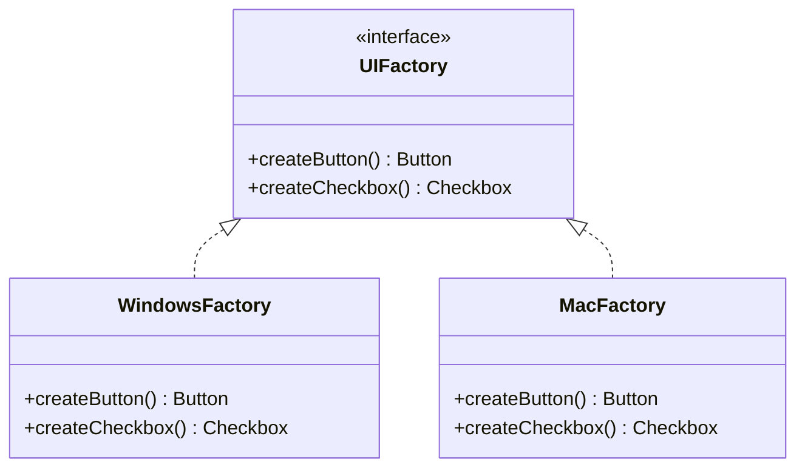

# 생성 패턴

---

> 생성 패턴(Creational Patterns)은 객체 생성 방식을 추상화하여 클라이언트가 어떤 클래스의 인스턴스가 만들어지는지 알지 않아도 되게 한다. 이를 통해 시스템이 어떤 객체를 사용하는지와 그 객체가 어떻게 만들어지는지를 분리할 수 있다.

## 패턴 개요

| 패턴 | 목적 | 핵심 아이디어 |
|------|------|-------------|
| Factory Method | 생성 책임을 서브클래스로 위임 | 어떤 객체를 만들지는 서브클래스가 결정 |
| Abstract Factory | 관련 객체 군(family) 생성 | 서로 호환되는 객체들을 일관되게 생성 |
| Builder | 복잡한 객체를 단계별로 조립 | 생성 과정과 표현을 분리 |
| Singleton | 인스턴스를 하나로 제한 | 전역 접근점 제공 |
| Prototype | 기존 객체를 복사하여 생성 | `clone()`으로 새 인스턴스 확보 |

## Factory Method

**팩토리 메서드 패턴**은 객체 생성을 위한 인터페이스를 정의하되, 어떤 클래스를 인스턴스화할지는 서브클래스가 결정하도록 한다. `new`를 직접 호출하는 대신 팩토리 메서드를 호출하면, 클라이언트 코드는 구체 타입에서 분리된다. 스프링의 `BeanFactory`가 이 패턴의 대표적인 활용 사례다.

```java
// 제품 인터페이스
interface Notification {
    void send(String message);
}

record EmailNotification(String email) implements Notification {
    public void send(String message) {
        System.out.println("Email to " + email + ": " + message);
    }
}

record SmsNotification(String phone) implements Notification {
    public void send(String message) {
        System.out.println("SMS to " + phone + ": " + message);
    }
}

// 팩토리 메서드를 가진 추상 클래스
abstract class NotificationService {
    // 팩토리 메서드: 서브클래스가 구체 타입을 결정한다
    protected abstract Notification createNotification();

    public void notifyUser(String message) {
        Notification n = createNotification();
        n.send(message);
    }
}

class EmailNotificationService extends NotificationService {
    private final String email;
    EmailNotificationService(String email) { this.email = email; }

    @Override
    protected Notification createNotification() {
        return new EmailNotification(email);
    }
}
```

## Abstract Factory

**추상 팩토리 패턴**은 관련 있는 객체들의 군(family)을 생성하는 인터페이스를 제공한다. 구체 팩토리를 교체하는 것만으로 전체 객체 군이 일관되게 바뀌므로, 테마나 플랫폼 전환처럼 관련 객체들이 함께 바뀌어야 하는 상황에 적합하다.



```java
interface UIFactory {
    Button createButton();
    Checkbox createCheckbox();
}

class WindowsFactory implements UIFactory {
    public Button createButton()     { return new WindowsButton(); }
    public Checkbox createCheckbox() { return new WindowsCheckbox(); }
}

class MacFactory implements UIFactory {
    public Button createButton()     { return new MacButton(); }
    public Checkbox createCheckbox() { return new MacCheckbox(); }
}

// 클라이언트는 UIFactory만 알면 된다
class Application {
    private final Button button;
    private final Checkbox checkbox;

    Application(UIFactory factory) {
        this.button   = factory.createButton();
        this.checkbox = factory.createCheckbox();
    }
}
```

## Builder

**빌더 패턴**은 복잡한 객체를 단계별로 구성할 수 있게 한다. 생성자의 매개변수가 많아질 때(특히 선택적 파라미터가 많을 때) 가독성과 안전성을 크게 높인다. Java 21의 `record`는 작고 불변인 DTO에 적합하지만, 필드가 많고 선택적 조합이 복잡할 때는 여전히 Builder가 유용하다.

```java
// record는 간단한 불변 객체에 적합하다
record Point(int x, int y) {}

// Builder는 선택적 필드가 많은 복잡한 객체에 적합하다
class HttpRequest {
    private final String url;
    private final String method;
    private final Map<String, String> headers;
    private final String body;
    private final int timeoutMs;

    private HttpRequest(Builder builder) {
        this.url       = builder.url;
        this.method    = builder.method;
        this.headers   = Map.copyOf(builder.headers);
        this.body      = builder.body;
        this.timeoutMs = builder.timeoutMs;
    }

    static class Builder {
        private final String url;               // 필수
        private String method = "GET";          // 선택 (기본값)
        private Map<String, String> headers = new HashMap<>();
        private String body;
        private int timeoutMs = 3000;

        Builder(String url) { this.url = url; }

        Builder method(String method)   { this.method = method; return this; }
        Builder header(String k, String v) { headers.put(k, v); return this; }
        Builder body(String body)       { this.body = body; return this; }
        Builder timeout(int ms)         { this.timeoutMs = ms; return this; }

        HttpRequest build() { return new HttpRequest(this); }
    }
}

// 사용: comma-leading 스타일
var request = new HttpRequest.Builder("https://api.example.com/orders")
        .method("POST")
        .header("Content-Type", "application/json")
        .body("{\"item\":\"book\"}")
        .timeout(5000)
        .build();
```

## Singleton

**싱글턴 패턴**은 클래스 인스턴스가 오직 하나임을 보장하고 전역 접근점을 제공한다. `enum`을 사용하면 직렬화와 리플렉션 공격에도 안전한 싱글턴을 가장 간결하게 구현할 수 있다. 스프링 컨텍스트의 빈(Bean)은 기본적으로 싱글턴 스코프로 관리된다.

```java
// 권장: enum 싱글턴 — 직렬화 안전, 리플렉션 공격 방어
enum AppConfig {
    INSTANCE;

    private final String version = "1.0.0";
    public String getVersion() { return version; }
}

// 참고: 지연 초기화가 필요할 때 — Bill Pugh Holder 패턴
class LazyRegistry {
    private LazyRegistry() {}

    private static class Holder {
        // JVM 클래스 로딩 메커니즘이 스레드 안전성을 보장한다
        static final LazyRegistry INSTANCE = new LazyRegistry();
    }

    public static LazyRegistry getInstance() {
        return Holder.INSTANCE;
    }
}
```

## Prototype

**프로토타입 패턴**은 기존 객체를 복사하여 새 객체를 생성한다. 클래스에 직접 의존하지 않고 복사할 수 있으므로, 객체 생성 비용이 크거나 초기 상태가 복잡할 때 유용하다. Java에서는 `Cloneable`보다 **복사 생성자**나 **정적 팩토리 메서드**가 더 안전하고 명확하다.

```java
record ServerConfig(String host, int port, List<String> tags) {
    // 복사 생성자: 얕은 복사의 함정을 피하기 위해 List를 새로 만든다
    ServerConfig(ServerConfig other) {
        this(other.host, other.port, new ArrayList<>(other.tags));
    }

    // 정적 팩토리로 의도를 명확히 표현
    static ServerConfig copyOf(ServerConfig original) {
        return new ServerConfig(original);
    }
}

// 사용: 기존 설정 기반으로 새 설정 생성
var base   = new ServerConfig("localhost", 8080, List.of("primary"));
var replica = ServerConfig.copyOf(base); // 독립적인 사본
```
