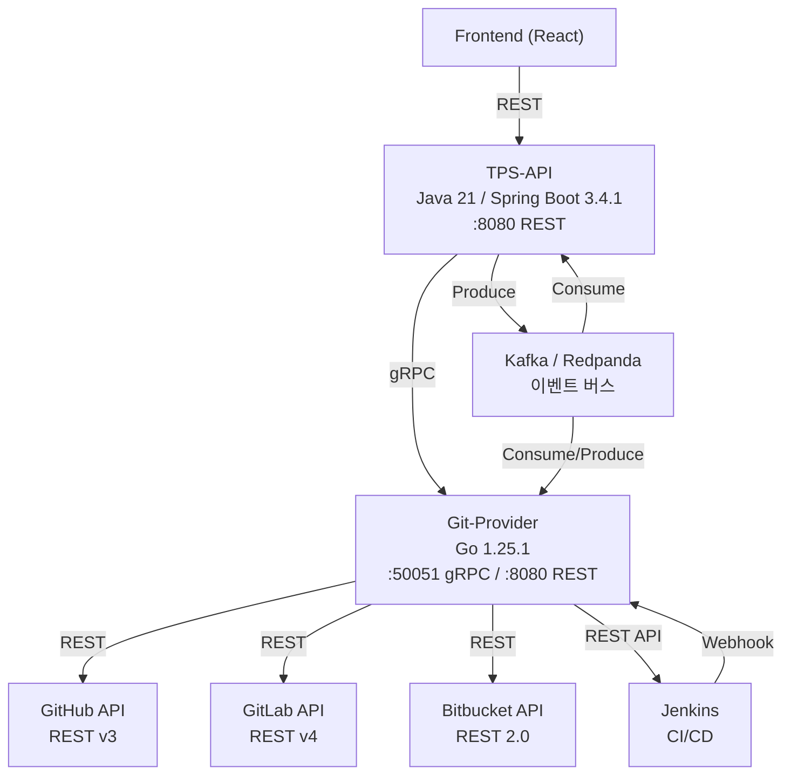
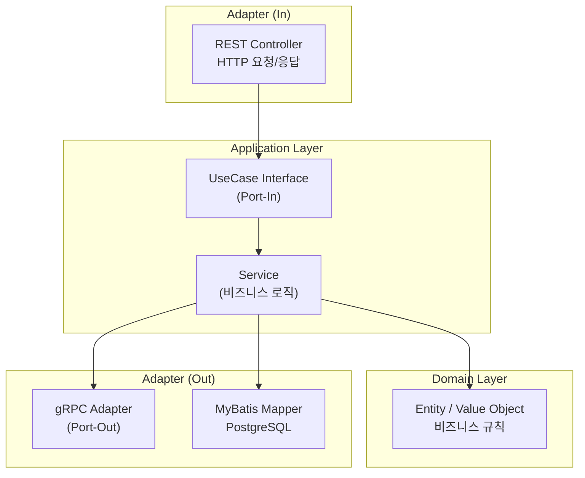

# 시스템 아키텍처 개요

## 프로젝트 정의

Devops TPS는 GitHub, GitLab, Bitbucket 세 가지 Git 프로바이더를 단일 API로 통합 관리하는 DevOps 플랫폼이다. 프론트엔드 요청은 TPS-API(Spring Boot)를 거쳐 gRPC로 Git-Provider(Go)에 전달되고, Git-Provider가 각 Provider REST API를 호출하여 결과를 반환하는 구조다.

---

## 시스템 구조 다이어그램



---

## 헥사고날 아키텍처 (TPS-API)

TPS-API는 헥사고날 아키텍처를 기반으로 도메인 계층이 외부 기술에 의존하지 않도록 설계되어 있다. 외부와의 통신은 모두 Port/Adapter 패턴으로 격리한다.



---

## 기술 스택

### TPS-API

| 영역 | 기술 | 버전/비고 |
|------|------|----------|
| 언어 | Java | 21 (Virtual Threads 활성화) |
| 프레임워크 | Spring Boot | 3.4.1 |
| RPC | gRPC | 1.60.1 |
| ORM | MyBatis | 3.0.4 |
| DB | PostgreSQL | - |
| 이벤트 | Kafka / Redpanda | franz-go 클라이언트 |

### Git-Provider

| 영역 | 기술 | 버전/비고 |
|------|------|----------|
| 언어 | Go | 1.25.1 |
| RPC | gRPC + protobuf | proto3 |
| REST 프록시 | grpc-gateway | v2 |
| GitHub 클라이언트 | google/go-github | v57 |
| GitLab 클라이언트 | xanzy/go-gitlab | v115 |
| Bitbucket 클라이언트 | ktrysmt/go-bitbucket | v0.9.88 |
| 이벤트 | franz-go | Kafka 클라이언트 |

---

## gRPC 서비스 목록

Git-Provider는 총 6개 Proto 서비스, 41개 RPC를 제공한다.

| 서비스 | Proto 파일 | 구현 파일 | RPC 수 | 상태 |
|--------|-----------|----------|-------|------|
| GitService | provider.proto | git_server.go | 8 | 구현 완료 |
| BranchService | branch.proto | branch_server.go | 5 | 구현 완료 |
| ContentsService | contents.proto | contents_server.go | 3 | 구현 완료 |
| MergeRequestService | mergerequest.proto | mr_server.go | 11 | 구현 완료 |
| CICDService | cicd.proto | cicd_server.go | 8 | 구현 완료 |
| WorkflowService | workflow.proto | workflow_server.go | 6 | 구현 완료 |
| ProviderService | provider.proto | - | 4 | Proto만 정의, 서버 미구현 |

**총 구현 RPC: 41개**

### GitService RPC 상세 (8개)

| RPC | HTTP | 설명 |
|-----|------|------|
| ListRepositories | POST /v1/repositories/list | 저장소 목록 |
| GetRepository | POST /v1/repositories/get | 저장소 상세 |
| CreateRepository | POST /v1/repositories | 저장소 생성 |
| DeleteRepository | POST /v1/repositories/delete | 저장소 삭제 |
| ListBranches | POST /v1/branches/list | 브랜치 목록 |
| GetBranch | POST /v1/branches/get | 브랜치 상세 |
| CreateBranch | POST /v1/branches | 브랜치 생성 |
| DeleteBranch | POST /v1/branches/delete | 브랜치 삭제 |

### BranchService RPC 상세 (5개)

| RPC | 설명 |
|-----|------|
| CompareBranches | 브랜치 간 ahead/behind/diff 비교 |
| ListCommitsDiff | 커밋 차이 목록 |
| ListMergedBranches | 머지 완료 브랜치 목록 |
| ListStaleBranches | 오래된 브랜치 목록 |
| CleanupBranches | 브랜치 일괄 삭제 (dry-run 지원) |

---

## 서비스 통신 흐름

```
Frontend
  └─[REST]─> TPS-API (:8080)
                └─[gRPC]─> Git-Provider (:50051)
                              ├─[REST]─> GitHub API
                              ├─[REST]─> GitLab API
                              └─[REST]─> Bitbucket API

TPS-API <──[Kafka]──> Git-Provider
Git-Provider <──[REST/Webhook]──> Jenkins
```

---

## 디렉토리 구조

### Git-Provider (Go)

```
git-provider/
├── api/proto/v1/
│   ├── provider.proto       # Provider 설정 + GitService + ProviderService
│   ├── branch.proto         # BranchService
│   ├── contents.proto       # ContentsService
│   └── mergerequest.proto   # MergeRequestService
├── cmd/
│   ├── server/main.go       # gRPC(:50051) + REST Gateway(:8080) 서버
│   └── test/main.go         # 테스트 클라이언트
├── internal/
│   ├── client/              # Provider API 어댑터 (~5,640줄)
│   │   ├── github.go        # GitHubClient (1,140줄)
│   │   ├── gitlab.go        # GitLabClient (960줄)
│   │   └── bitbucket.go     # BitbucketClient (1,248줄)
│   ├── server/              # gRPC 서버 구현
│   │   ├── git_server.go    # Repository + Branch CRUD (330줄)
│   │   ├── branch_server.go # 브랜치 분석 (540줄)
│   │   ├── contents_server.go # 파일 탐색 (190줄)
│   │   ├── mr_server.go     # MR 라이프사이클 (1,007줄)
│   │   └── client_factory.go # 클라이언트 팩토리 (37줄)
│   └── provider/            # Provider 설정 타입
└── pkg/pb/v1/               # 생성된 Go protobuf 코드
```

### TPS-API (Java)

```
com.runnershigh.tps/
├── domain/                  # 도메인 계층 (비즈니스 규칙)
│   ├── common/BaseEntity.java
│   ├── repository/          # Repository 도메인
│   ├── connection/          # Connection 도메인
│   ├── contents/            # Contents 도메인
│   └── branchcomparison/    # BranchComparison 도메인
├── application/             # 유스케이스 계층
│   ├── port/in/             # 인바운드 포트 (UseCase 인터페이스)
│   ├── port/out/            # 아웃바운드 포트 (GitProviderPort)
│   └── service/             # 서비스 구현
└── adapter/
    ├── in/web/              # REST 컨트롤러
    └── out/grpc/            # gRPC 클라이언트 어댑터
```

---

## 관련 문서

- [Architecture/phase1-summary.md](phase1-summary.md) - Phase 1 완료 보고
- [Architecture/service-communication.md](service-communication.md) - 서비스 간 통신 상세
- [Repository/domain-model.md](../Repository/domain-model.md) - Repository 도메인 모델
- [Provider/usecase-model.md](../Provider/usecase-model.md) - Provider 유스케이스
