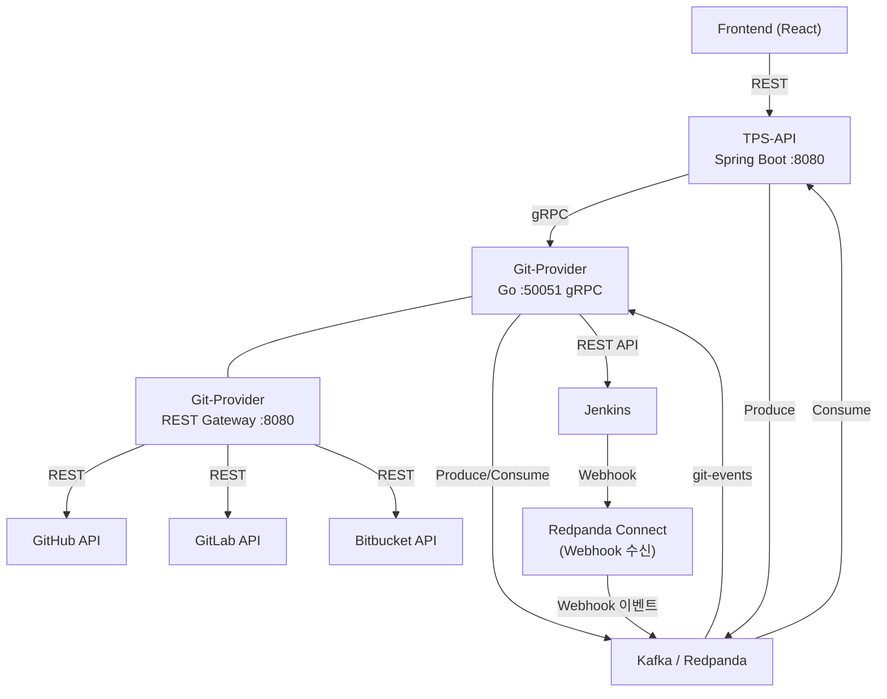
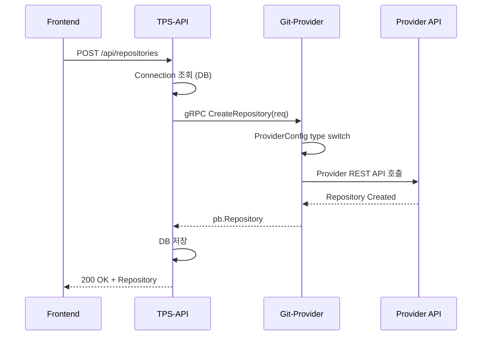
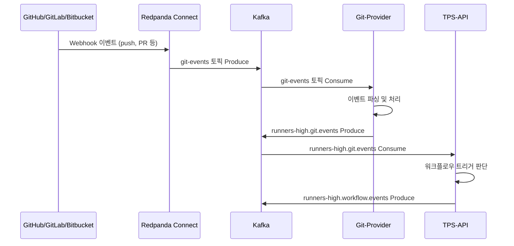
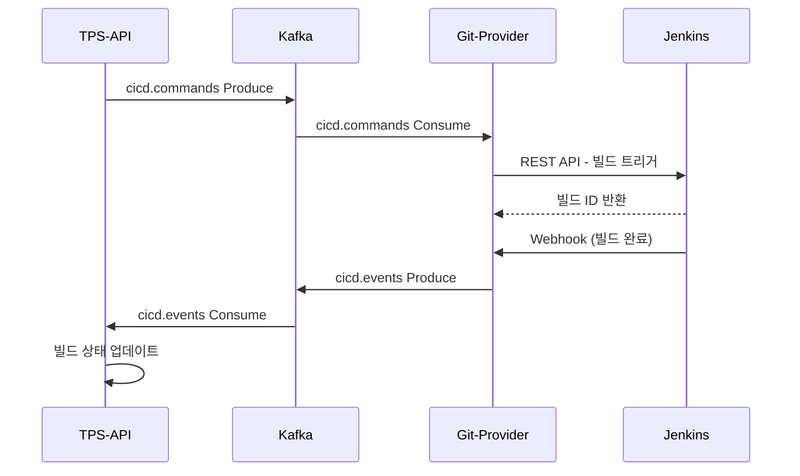
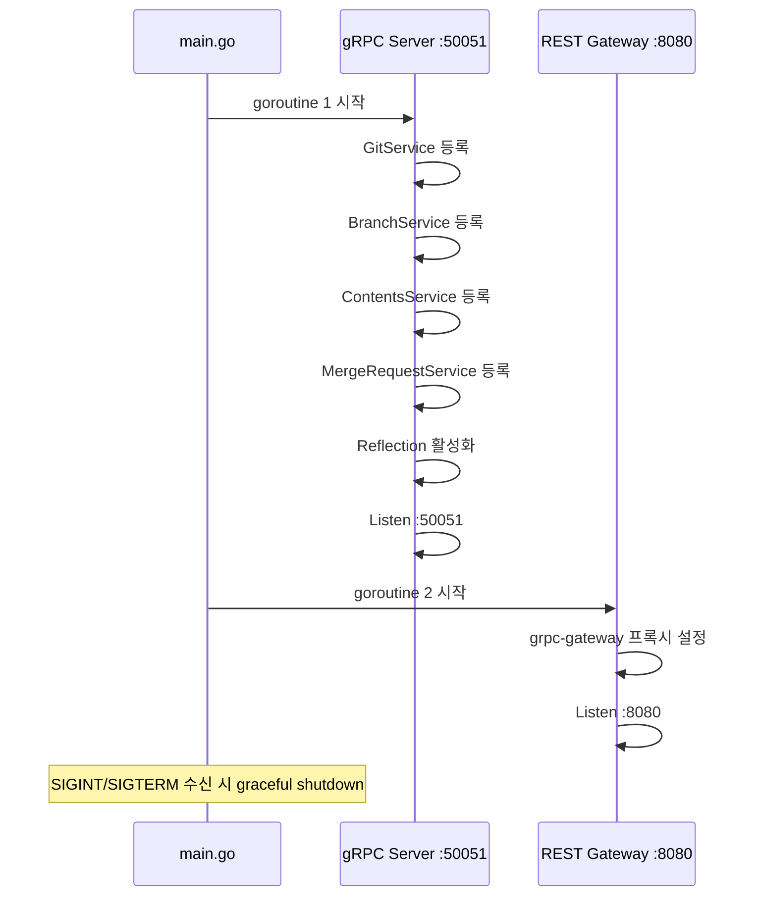

# 서비스 간 통신

## 전체 서비스 통신 다이어그램



---

## 통신 프로토콜 정리

| 구간 | 프로토콜 | 비고 |
|------|---------|------|
| Frontend → TPS-API | REST (HTTP/1.1) | JSON 응답 |
| TPS-API → Git-Provider | gRPC (HTTP/2) | proto3, :50051 |
| Git-Provider → GitHub/GitLab/Bitbucket | REST (HTTPS) | Provider별 API |
| TPS-API ↔ Kafka | Kafka Protocol | franz-go |
| Git-Provider ↔ Kafka | Kafka Protocol | franz-go |
| Git-Provider → Jenkins | REST (HTTP) | Jenkins Remote API |
| Jenkins → Redpanda Connect | Webhook (HTTP) | POST |
| Redpanda Connect → Kafka | Kafka Protocol | git-events 토픽 |

---

## 주요 흐름 시퀀스 다이어그램

### 1. 저장소 생성 흐름



### 2. Webhook → Kafka → Workflow 흐름



### 3. CI/CD 파이프라인 트리거 흐름



---

## Kafka 토픽 라우팅 테이블

| 토픽 | 생산자 | 소비자 | 설명 |
|------|--------|--------|------|
| `runners-high.git.commands` | TPS-API | Git-Provider | Git 작업 명령 |
| `runners-high.git.events` | Git-Provider | TPS-API | Git 이벤트 결과 |
| `runners-high.notifications` | TPS-API | Notification Service | 알림 발송 |
| `runners-high.ticket.events` | TPS-API | TPS-API | 티켓 상태 변경 |
| `runners-high.build.events` | TPS-API | TPS-API | 빌드 상태 변경 |
| `runners-high.deploy.events` | TPS-API | TPS-API | 배포 상태 변경 |
| `runners-high.workflow.events` | TPS-API | TPS-API | 워크플로우 실행 |
| `runners-high.approval.events` | TPS-API | TPS-API | 결재 승인/반려 |
| `git-events` | Redpanda Connect | Git-Provider | Webhook 원시 이벤트 |
| `cicd.commands` | Git-Provider | Git-Provider | CI/CD 명령 |
| `cicd.events` | Git-Provider | Git-Provider | CI/CD 이벤트 |
| `cicd-results` | Git-Provider | TPS-API | CI/CD 최종 결과 |
| `workflow.events` | Git-Provider | TPS-API | 워크플로우 이벤트 |

---

## gRPC 서버 시작 흐름

Git-Provider `main.go`는 두 개의 goroutine으로 서버를 구동한다.



---

## Provider Dispatch 패턴

모든 gRPC 서버 메서드는 동일한 구조로 Provider를 선택한다.

```
요청 수신
  └─ 입력 검증
       └─ ProviderConfig type switch
            ├─ *pb.ProviderConfig_Github → createGitHubClient()
            ├─ *pb.ProviderConfig_Gitlab → createGitLabClient()
            └─ *pb.ProviderConfig_Bitbucket → createBitbucketClient()
                  └─ Provider API 호출
                       └─ Proto 메시지 변환
                            └─ 응답 반환
```

이 패턴 덕분에 서버는 stateless를 유지한다. 인증 정보를 요청마다 전달받으므로 서버가 세션을 관리할 필요가 없다. 단점은 매 요청마다 클라이언트를 새로 생성하는 오버헤드가 있다는 점으로, 향후 커넥션 풀 또는 캐싱이 필요할 수 있다.

---

## 관련 문서

- [overview.md](overview.md) - 시스템 아키텍처 전체 개요
- [Provider/api-design.md](../Provider/api-design.md) - ProviderService API 설계
- [Repository/api-design.md](../Repository/api-design.md) - GitService Repository RPC
