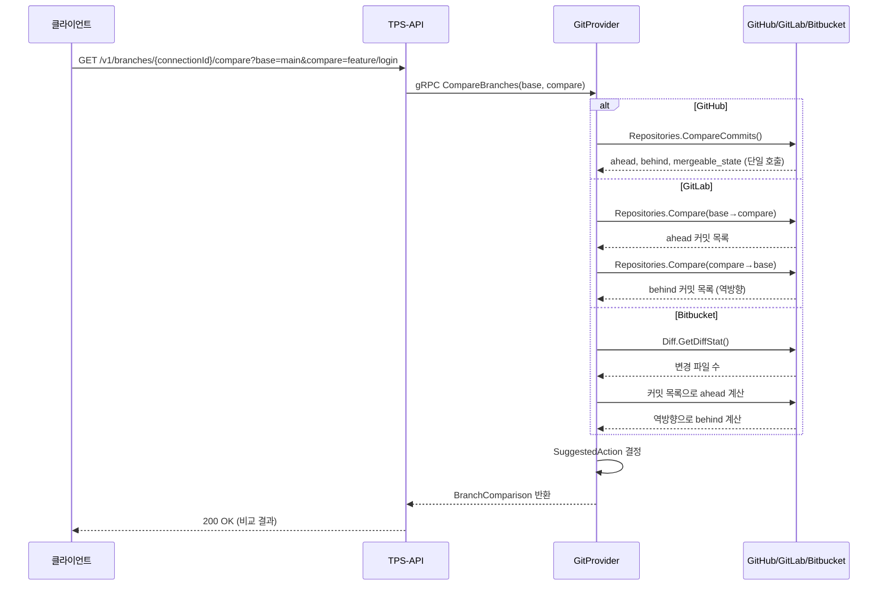

# Branch API 설계

## 개요

브랜치 관련 기능은 두 개의 gRPC 서비스로 구성된다. `GitService`는 브랜치의 기본 CRUD를 담당하고, `BranchService`는 브랜치 간 비교·분석·정리와 같은 고수준 기능을 담당한다.

---

## 서비스 구성

| 서비스 | RPC 수 | 역할 |
|--------|--------|------|
| GitService | 4 | 브랜치 CRUD |
| BranchService | 5 | 브랜치 비교·분석·정리 |

---

## GitService - 브랜치 CRUD

### RPC 목록

| RPC | HTTP 메서드 | 경로 | 설명 |
|-----|------------|------|------|
| ListBranches | GET | `/v1/git/{connectionId}/branches` | 브랜치 목록 조회 |
| GetBranch | GET | `/v1/git/{connectionId}/branches/{name}` | 브랜치 상세 조회 |
| CreateBranch | POST | `/v1/git/{connectionId}/branches` | 브랜치 생성 |
| DeleteBranch | DELETE | `/v1/git/{connectionId}/branches/{name}` | 브랜치 삭제 |

### ListBranches

**요청 파라미터**

| 파라미터 | 타입 | 필수 | 기본값 | 설명 |
|----------|------|------|--------|------|
| connectionId | UUID | 필수 | - | Connection ID (path) |
| owner | String | 필수 | - | 저장소 소유자 |
| repo | String | 필수 | - | 저장소 이름 |
| page | Integer | 선택 | 1 | 페이지 번호 |
| perPage | Integer | 선택 | 30 | 페이지당 항목 수 |

**응답 필드**

| 필드 | 타입 | 설명 |
|------|------|------|
| branches[].name | String | 브랜치명 |
| branches[].sha | String | HEAD 커밋 SHA |
| branches[].protected | Boolean | 보호된 브랜치 여부 |
| totalCount | Integer | 전체 브랜치 수 |

### GetBranch

**요청 파라미터**

| 파라미터 | 타입 | 필수 | 설명 |
|----------|------|------|------|
| connectionId | UUID | 필수 | Connection ID (path) |
| name | String | 필수 | 브랜치명 (path) |
| owner | String | 필수 | 저장소 소유자 |
| repo | String | 필수 | 저장소 이름 |

**응답 필드**

| 필드 | 타입 | 설명 |
|------|------|------|
| name | String | 브랜치명 |
| sha | String | HEAD 커밋 SHA |
| protected | Boolean | 보호된 브랜치 여부 |
| commit.message | String | 최신 커밋 메시지 |
| commit.author | Object | 커밋 작성자 정보 |
| commit.date | DateTime | 커밋 시간 |

### CreateBranch

**요청 본문**

| 필드 | 타입 | 필수 | 설명 |
|------|------|------|------|
| connectionId | UUID | 필수 | Connection ID |
| owner | String | 필수 | 저장소 소유자 |
| repo | String | 필수 | 저장소 이름 |
| name | String | 필수 | 생성할 브랜치명 |
| sha | String | 필수 | 기준 커밋 SHA 또는 브랜치명 |

### DeleteBranch

**요청 파라미터**

| 파라미터 | 타입 | 필수 | 설명 |
|----------|------|------|------|
| connectionId | UUID | 필수 | Connection ID (path) |
| name | String | 필수 | 삭제할 브랜치명 (path) |
| owner | String | 필수 | 저장소 소유자 |
| repo | String | 필수 | 저장소 이름 |

---

## BranchService - 브랜치 분석·정리

### RPC 목록

| RPC | HTTP 메서드 | 경로 | 설명 |
|-----|------------|------|------|
| CompareBranches | GET | `/v1/branches/{connectionId}/compare` | 두 브랜치 비교 |
| ListCommitsDiff | GET | `/v1/branches/{connectionId}/compare/commits` | 브랜치 간 커밋 차이 |
| ListMergedBranches | GET | `/v1/branches/{connectionId}/merged` | 머지된 브랜치 목록 |
| ListStaleBranches | GET | `/v1/branches/{connectionId}/stale` | 비활성 브랜치 목록 |
| CleanupBranches | POST | `/v1/branches/cleanup` | 브랜치 일괄 정리 |

### CompareBranches

두 브랜치 간 커밋 수 차이, 머지 가능 여부, 권장 액션을 반환한다.

**요청 파라미터**

| 파라미터 | 타입 | 필수 | 기본값 | 설명 |
|----------|------|------|--------|------|
| connectionId | UUID | 필수 | - | Connection ID (path) |
| owner | String | 필수 | - | 저장소 소유자 |
| repo | String | 필수 | - | 저장소 이름 |
| base | String | 필수 | - | 기준 브랜치 (예: main) |
| compare | String | 필수 | - | 비교 브랜치 (예: feature/login) |

**응답 필드**

| 필드 | 타입 | 설명 |
|------|------|------|
| baseBranch | String | 기준 브랜치명 |
| compareBranch | String | 비교 브랜치명 |
| aheadBy | Integer | compare가 base보다 앞선 커밋 수 |
| behindBy | Integer | compare가 base보다 뒤처진 커밋 수 |
| mergeableState | Enum | `MERGEABLE`, `CONFLICTING`, `UNKNOWN` |
| mergeStatus | String | `clean`, `conflicting`, `unknown` |
| suggestedAction | Enum | 권장 액션 (아래 참조) |
| diffStat | Object | 변경 통계 |
| diffStat.additions | Integer | 추가된 라인 수 |
| diffStat.deletions | Integer | 삭제된 라인 수 |
| diffStat.changes | Integer | 총 변경 라인 수 |
| diffStat.filesChanged | Integer | 변경된 파일 수 |
| conflictingFiles | Array | 충돌 파일 목록 |

**MergeableState 값**

| 값 | 설명 |
|----|------|
| `MERGEABLE` | 충돌 없이 머지 가능 |
| `CONFLICTING` | 충돌 발생, 수동 해결 필요 |
| `UNKNOWN` | 판단 불가 (정보 부족) |

**SuggestedAction 값**

| 값 | 설명 | 발생 조건 |
|----|------|-----------|
| `CREATE_MR` | MR 생성 권장 | 머지 가능하고 변경사항 있음 |
| `REBASE` | 리베이스 권장 | 뒤처진 커밋이 10개 초과 |
| `MERGE_BASE` | 기준 브랜치 머지 권장 | 양방향으로 커밋이 갈린 상태 |
| `RESOLVE_CONFLICTS` | 충돌 해결 필요 | 충돌 발생 |
| `UP_TO_DATE` | 변경사항 없음 | 이미 동기화된 상태 |
| `FAST_FORWARD` | Fast-forward 가능 | ahead > 0, behind = 0 |

**응답 예시**

```json
{
  "success": true,
  "data": {
    "baseBranch": "main",
    "compareBranch": "feature/login",
    "aheadBy": 5,
    "behindBy": 2,
    "mergeableState": "MERGEABLE",
    "mergeStatus": "clean",
    "suggestedAction": "CREATE_MR",
    "diffStat": {
      "additions": 150,
      "deletions": 30,
      "changes": 180,
      "filesChanged": 8
    },
    "conflictingFiles": []
  }
}
```

**curl 예시**

```bash
curl "http://localhost:8080/v1/branches/550e8400-e29b-41d4-a716-446655440000/compare?owner=myorg&repo=myrepo&base=main&compare=feature/login"
```

### ListCommitsDiff

두 브랜치 간 커밋 목록을 페이지네이션으로 반환한다.

**요청 파라미터**

| 파라미터 | 타입 | 필수 | 기본값 | 설명 |
|----------|------|------|--------|------|
| connectionId | UUID | 필수 | - | Connection ID (path) |
| owner | String | 필수 | - | 저장소 소유자 |
| repo | String | 필수 | - | 저장소 이름 |
| base | String | 필수 | - | 기준 브랜치 |
| compare | String | 필수 | - | 비교 브랜치 |
| page | Integer | 선택 | 1 | 페이지 번호 |
| perPage | Integer | 선택 | 30 | 페이지당 항목 수 |

**응답 필드**

| 필드 | 타입 | 설명 |
|------|------|------|
| commits[].sha | String | 커밋 SHA |
| commits[].message | String | 커밋 메시지 |
| commits[].author.name | String | 작성자 이름 |
| commits[].author.email | String | 작성자 이메일 |
| commits[].author.date | DateTime | 커밋 시간 |
| commits[].url | String | Provider 커밋 URL |
| totalCount | Integer | 전체 커밋 수 |
| page | Integer | 현재 페이지 |
| perPage | Integer | 페이지당 항목 수 |

### ListMergedBranches

기준 브랜치에 이미 머지된 브랜치 목록을 반환한다.

**요청 파라미터**

| 파라미터 | 타입 | 필수 | 기본값 | 설명 |
|----------|------|------|--------|------|
| connectionId | UUID | 필수 | - | Connection ID (path) |
| owner | String | 필수 | - | 저장소 소유자 |
| repo | String | 필수 | - | 저장소 이름 |
| base | String | 선택 | main | 기준 브랜치 |

**응답 필드 (MergedBranchInfo)**

| 필드 | 타입 | 설명 |
|------|------|------|
| name | String | 브랜치명 |
| mergedAt | DateTime | 머지된 시간 |
| mergedBy | String | 머지한 사용자 |
| lastCommitSha | String | 마지막 커밋 SHA |
| lastCommitMessage | String | 마지막 커밋 메시지 |
| lastCommitDate | DateTime | 마지막 커밋 시간 |

### ListStaleBranches

지정된 기간 동안 활동이 없는 브랜치 목록을 반환한다.

**요청 파라미터**

| 파라미터 | 타입 | 필수 | 기본값 | 설명 |
|----------|------|------|--------|------|
| connectionId | UUID | 필수 | - | Connection ID (path) |
| owner | String | 필수 | - | 저장소 소유자 |
| repo | String | 필수 | - | 저장소 이름 |
| staleDays | Integer | 선택 | 30 | 비활성 기준 일수 |

**응답 필드 (StaleBranchInfo)**

| 필드 | 타입 | 설명 |
|------|------|------|
| name | String | 브랜치명 |
| lastCommitSha | String | 마지막 커밋 SHA |
| lastCommitMessage | String | 마지막 커밋 메시지 |
| lastCommitDate | DateTime | 마지막 커밋 시간 |
| lastCommitAuthor | String | 마지막 커밋 작성자 |
| daysSinceLastCommit | Integer | 마지막 커밋 이후 경과 일수 |
| isProtected | Boolean | 보호된 브랜치 여부 |

### CleanupBranches

머지된 브랜치와 비활성 브랜치를 일괄 삭제한다. `dryRun=true`(기본값)로 실제 삭제 전 미리보기가 가능하다.

**요청 본문**

| 필드 | 타입 | 필수 | 기본값 | 설명 |
|------|------|------|--------|------|
| connectionId | UUID | 필수 | - | Connection ID |
| owner | String | 필수 | - | 저장소 소유자 |
| repo | String | 필수 | - | 저장소 이름 |
| dryRun | Boolean | 선택 | true | Dry-run 모드 (true: 미리보기만) |
| options.includeMerged | Boolean | 선택 | true | 머지된 브랜치 포함 여부 |
| options.includeStale | Boolean | 선택 | false | 비활성 브랜치 포함 여부 |
| options.staleDays | Integer | 선택 | 30 | 비활성 기준 일수 |
| options.baseBranch | String | 선택 | main | 머지 기준 브랜치 |
| options.excludePatterns | Array | 선택 | [] | 제외할 브랜치 패턴 (glob) |
| options.excludeProtected | Boolean | 선택 | true | 보호된 브랜치 제외 여부 |

**응답 필드 (CleanupResult)**

| 필드 | 타입 | 설명 |
|------|------|------|
| dryRun | Boolean | Dry-run 모드 여부 |
| summary.toDeleteCount | Integer | 삭제 대상 수 (dry-run 시) |
| summary.skippedCount | Integer | 건너뛴 수 |
| summary.deletedCount | Integer | 삭제 성공 수 |
| summary.failedCount | Integer | 삭제 실패 수 |
| toDelete | Array | 삭제 대상 목록 (dry-run 시) |
| skipped | Array | 건너뛴 목록 |
| deleted | Array | 삭제된 목록 (실제 삭제 시) |
| failed | Array | 실패한 목록 (실제 삭제 시) |

**SkipReason 값**

| 값 | 설명 |
|----|------|
| `PROTECTED` | 보호된 브랜치 |
| `EXCLUDED_PATTERN` | 제외 패턴에 해당 |
| `DEFAULT_BRANCH` | 기본 브랜치 |
| `BASE_BRANCH` | 정리 기준 브랜치 |

---

## 브랜치 비교 플로우



---

## gRPC Proto 정의

```protobuf
service GitService {
  rpc ListBranches(ListBranchesRequest) returns (ListBranchesResponse);
  rpc GetBranch(GetBranchRequest) returns (GetBranchResponse);
  rpc CreateBranch(CreateBranchRequest) returns (CreateBranchResponse);
  rpc DeleteBranch(DeleteBranchRequest) returns (DeleteBranchResponse);
}

service BranchService {
  rpc CompareBranches(CompareBranchesRequest) returns (CompareBranchesResponse);
  rpc ListCommitsDiff(ListCommitsDiffRequest) returns (ListCommitsDiffResponse);
  rpc ListMergedBranches(ListMergedBranchesRequest) returns (ListMergedBranchesResponse);
  rpc ListStaleBranches(ListStaleBranchesRequest) returns (ListStaleBranchesResponse);
  rpc CleanupBranches(CleanupBranchesRequest) returns (CleanupBranchesResponse);
}

enum MergeableState {
  MERGEABLE_STATE_UNKNOWN = 0;
  MERGEABLE_STATE_MERGEABLE = 1;
  MERGEABLE_STATE_CONFLICTING = 2;
}

enum SuggestedAction {
  SUGGESTED_ACTION_UNKNOWN = 0;
  SUGGESTED_ACTION_CREATE_MR = 1;
  SUGGESTED_ACTION_REBASE = 2;
  SUGGESTED_ACTION_MERGE_BASE = 3;
  SUGGESTED_ACTION_RESOLVE_CONFLICTS = 4;
  SUGGESTED_ACTION_UP_TO_DATE = 5;
  SUGGESTED_ACTION_FAST_FORWARD = 6;
}

message DiffStat {
  int32 additions = 1;
  int32 deletions = 2;
  int32 changes = 3;
  int32 files_changed = 4;
}
```

---

## 에러 응답

| HTTP 코드 | 에러 코드 | 설명 |
|-----------|-----------|------|
| 400 | `INVALID_REQUEST` | 필수 파라미터 누락 (base, compare 등) |
| 403 | `FORBIDDEN` | 브랜치 삭제 권한 없음 |
| 404 | `NOT_FOUND` | 브랜치 또는 저장소를 찾을 수 없음 |
| 422 | `UNPROCESSABLE` | 자기 자신과 비교 등 논리적 오류 |

---

## Provider별 API 매핑

| 기능 | GitHub API | GitLab API | Bitbucket API |
|------|------------|------------|---------------|
| 브랜치 비교 | `GET /repos/{owner}/{repo}/compare/{base}...{head}` | `GET /projects/{id}/repository/compare` | `GET /repositories/{workspace}/{repo}/commits/{revision}` |
| 브랜치 삭제 | `DELETE /repos/{owner}/{repo}/git/refs/heads/{branch}` | `DELETE /projects/{id}/repository/branches/{branch}` | `DELETE /repositories/{workspace}/{repo}/refs/branches/{branch}` |
| 머지된 브랜치 | `GET /repos/{owner}/{repo}/branches` + 필터링 | `GET /projects/{id}/repository/branches` + 필터링 | `GET /repositories/{workspace}/{repo}/refs/branches` |
