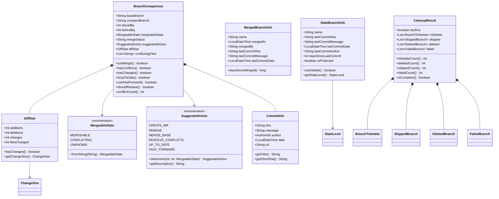
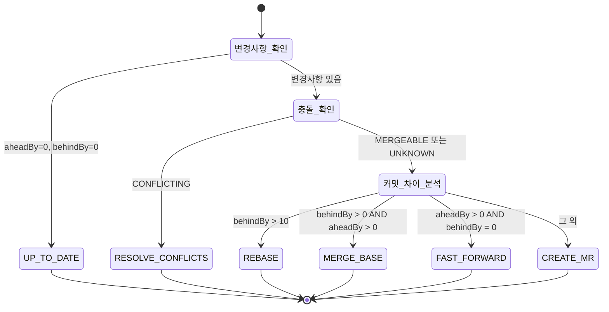

# Branch 유스케이스 모델

## 개요

BranchComparison 도메인은 두 브랜치 간의 관계를 분석하여 개발자에게 적절한 행동을 안내한다. 단순한 커밋 수 비교를 넘어, 충돌 여부·변경 규모·권장 액션을 종합적으로 제공한다.

---

## 도메인 클래스 다이어그램



---

## SuggestedAction 결정 로직

SuggestedAction은 `aheadBy`, `behindBy`, `MergeableState` 세 가지 값을 조합하여 결정된다. 결정 우선순위는 다음과 같다.



---

## StaleLevel (비활성 심각도)

StaleBranchInfo는 경과 일수를 기반으로 비활성 수준을 4단계로 분류한다.

| 수준 | 조건 | 의미 |
|------|------|------|
| `LOW` | 30일 이하 | 최근 활동 없음 |
| `MEDIUM` | 31~90일 | 방치 가능성 있음 |
| `HIGH` | 91~180일 | 삭제 검토 권장 |
| `CRITICAL` | 181일 초과 | 즉시 삭제 검토 필요 |

---

## ChangeSize (변경 규모)

DiffStat은 변경 라인 수와 파일 수를 기준으로 변경 규모를 분류한다.

| 규모 | 조건 | 의미 |
|------|------|------|
| `SMALL` | changes < 50 AND filesChanged < 5 | 소규모 변경 |
| `MEDIUM` | changes < 500 AND filesChanged < 20 | 중규모 변경 |
| `LARGE` | 그 외 | 대규모 변경 (리뷰 주의) |

---

## CleanupResult 구조

CleanupResult는 dry-run과 실제 삭제 두 가지 모드에서 사용된다. 같은 타입이지만 모드에 따라 채워지는 필드가 다르다.

| 필드 | dry-run 시 | 실제 삭제 시 |
|------|-----------|-------------|
| `toDelete` | 삭제 예정 목록 채워짐 | 빈 배열 |
| `deleted` | 빈 배열 | 삭제 성공 목록 채워짐 |
| `failed` | 빈 배열 | 삭제 실패 목록 채워짐 |
| `skipped` | 제외된 브랜치 목록 | 제외된 브랜치 목록 |

---

## MergeableState 변환

각 Provider가 반환하는 머지 상태 문자열은 `MergeableState.fromString()`으로 통일된다.

| Provider | 원본 값 | 변환 결과 |
|----------|---------|-----------|
| GitHub | `"clean"` | `MERGEABLE` |
| GitHub | `"conflicting"` | `CONFLICTING` |
| GitLab | `"can_be_merged"` | `MERGEABLE` |
| GitLab | `"cannot_be_merged"` | `CONFLICTING` |
| Bitbucket | N/A (직접 계산) | `UNKNOWN` |

---

## 도메인 불변 보장

BranchComparison과 CleanupResult는 Java record로 정의되어 생성 후 상태 변경이 불가능하다. 컬렉션 필드는 생성자에서 `List.copyOf()`로 방어 복사하여 외부에서 수정해도 내부 상태에 영향을 주지 않는다.

```java
// BranchComparison 생성자 내 방어 복사
public BranchComparison {
    conflictingFiles = conflictingFiles == null
        ? Collections.emptyList()
        : List.copyOf(conflictingFiles);
}
```
