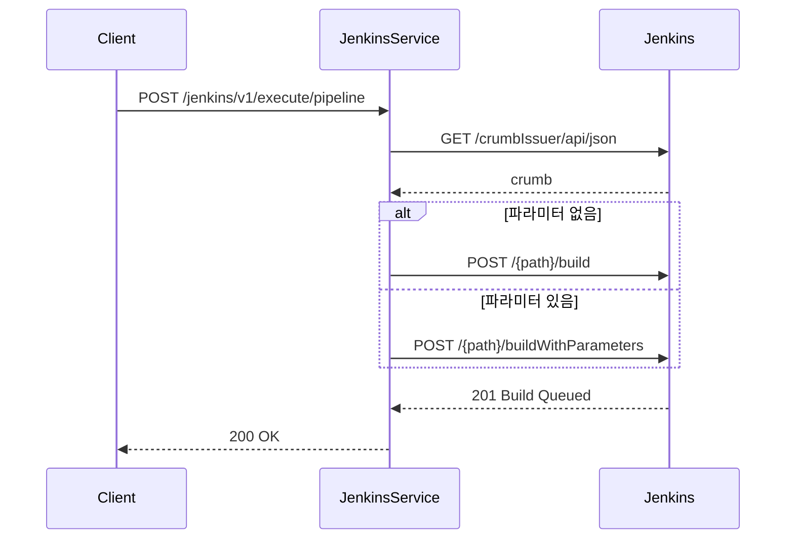
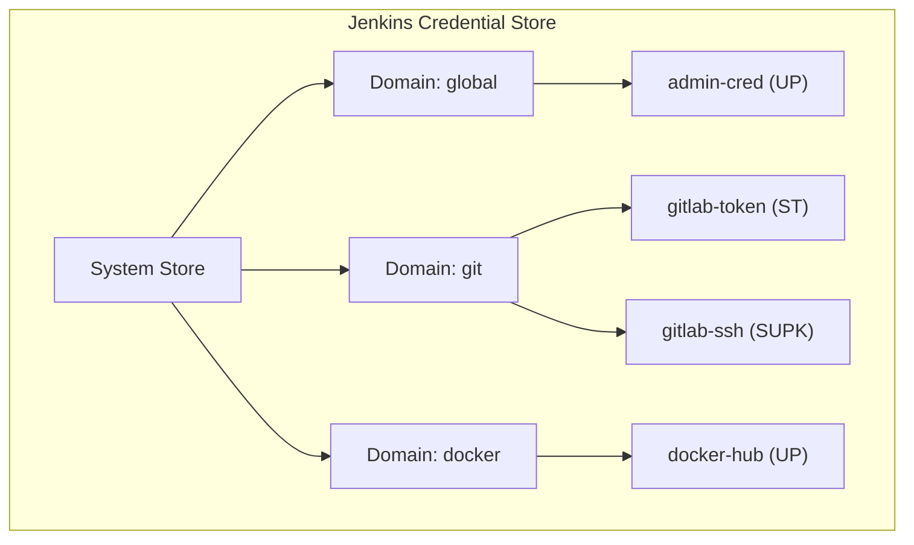
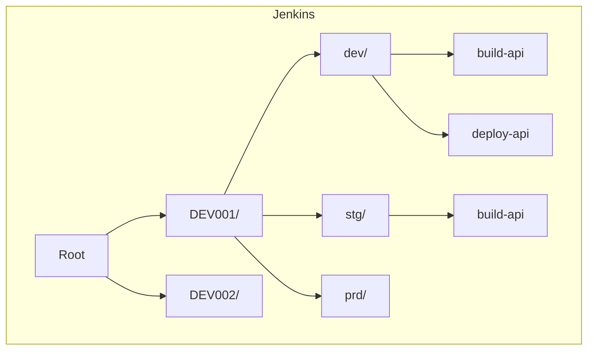
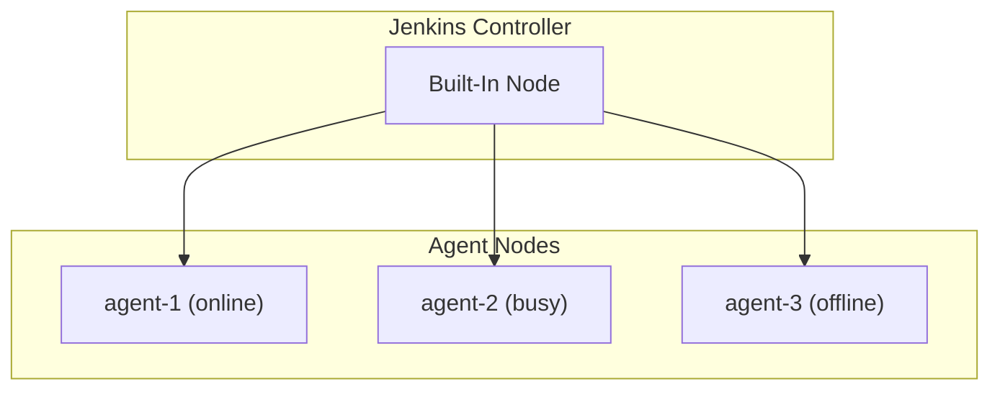

# Jenkins API 참조

TPS 시스템이 Jenkins와 연동하는 데 사용하는 API를 파이프라인, 자격증명, 폴더, 노드 영역으로 통합 정리한다.

---

## 공통 사항

### 인증

모든 Jenkins API 호출에 Basic Auth가 필요하다. 비밀번호 대신 API 토큰을 사용하는 것이 권장된다.

```
Authorization: Basic base64(username:api_token)
```

### CSRF 토큰 (Crumb)

파이프라인 생성, 빌드 트리거 등 쓰기 작업 전에 crumb을 먼저 획득해야 한다.

```
GET /crumbIssuer/api/json
→ {"crumb": "abc123...", "crumbRequestField": "Jenkins-Crumb"}

이후 요청 헤더에 추가:
Jenkins-Crumb: abc123...
```

---

## 1. 파이프라인 API

TPS 워크플로우와 연계하여 Jenkins 파이프라인(Job)의 전체 생명주기를 관리한다.

### 호출하는 Jenkins API

| Method | Endpoint | 설명 |
|--------|----------|------|
| GET | `/crumbIssuer/api/json` | CSRF 토큰 획득 |
| GET | `/{path}/api/json` | 파이프라인 정보 조회 |
| GET | `/{path}/lastBuild/buildNumber` | 마지막 빌드 번호 |
| GET | `/{path}/config.xml` | 파이프라인 스크립트 조회 |
| POST | `/{path}/createItem` | 파이프라인 생성 |
| POST | `/{path}/config.xml` | 파이프라인 수정 |
| POST | `/{path}/doDelete` | 파이프라인 삭제 |
| POST | `/{path}/build` | 파이프라인 실행 |
| POST | `/{path}/buildWithParameters` | 파라미터 포함 실행 |
| POST | `/{path}/{buildNo}/stop` | 빌드 중지 |
| POST | `/{path}/descriptorByName/.../checkScriptCompile` | 스크립트 검증 |

### 제공하는 외부 API

| Method | Endpoint | 설명 |
|--------|----------|------|
| POST | `/jenkins/v1/create/pipeline` | 파이프라인 생성 |
| PUT | `/jenkins/v1/update/pipeline` | 파이프라인 수정 |
| DELETE | `/jenkins/v1/delete/pipeline` | 파이프라인 삭제 |
| POST | `/jenkins/v1/execute/pipeline` | 파이프라인 실행 (동기) |
| POST | `/jenkins/v1/execute/pipeline/async` | 파이프라인 실행 (비동기) |
| POST | `/jenkins/v1/stop/pipeline` | 파이프라인 중지 |
| POST | `/jenkins/v1/validate/pipeline` | 스크립트 검증 |
| POST | `/jenkins/v1/upsert/trigger` | 트리거 생성/수정 |
| POST | `/jenkins/v1/execute/trigger` | 트리거 실행 |
| POST | `/jenkins/v1/get/pipeline/last/status` | 최근 실행 상태 |

### 파이프라인 경로 구조

```
Jenkins Root
└── {taskCd}/
    └── {envrnCd}/
        └── {bizNm}    ← 파이프라인 Job
```

예시: `DEV001/dev/build-api`

### 실행 흐름

**동기 실행**: 클라이언트가 완료를 기다린다.



**비동기 실행**: 워크플로우 엔진이 호출하고, 로그는 AsyncMessageFeignClient로 포워딩된다.

**트리거 실행**: 여러 파이프라인을 `pplnOrd` 순서대로 순차 실행한다.

### 주요 DTO

```java
// 파이프라인 요청
public class PipelineVo {
    PipelineStructVo pipelineStructVo;         // 파이프라인 구조
    List<PipelineParamVo> pipelineParamVoList; // 파라미터 목록
    String jenkinsFile;                        // Jenkinsfile 스크립트
}

public class PipelineStructVo {
    String taskCd;   // 업무 코드
    String envrnCd;  // 환경/브랜치 코드
    String bizNm;    // 파이프라인명
}

// 트리거 실행
public class TriggerPipelineVo {
    String wrkflwExcnNo;           // 워크플로우 실행 번호
    String taskCd;                 // 업무 코드
    String envrnCd;                // 환경 코드
    List<PplnOrdVo> pplnOrdVoList; // 파이프라인 순서 목록
}
```

---

## 2. 자격증명 API (Credential)

Jenkins에서 사용하는 인증 정보를 Domain 기반으로 체계적으로 관리한다.

### Credential 타입

| 타입 | 약어 | 용도 |
|------|------|------|
| Username with Password | `up` | Git 계정, Container Registry 인증 |
| SSH Username with PrivateKey | `supk` | SSH 접속, Git SSH Clone |
| Secret Text | `st` | API 토큰, 비밀번호 저장 |

### Credential 구조



### 호출하는 Jenkins API

| Method | Endpoint | 설명 |
|--------|----------|------|
| GET | `/manage/credentials/store/system/api/json` | Domain 목록 조회 |
| GET | `/credentials/store/system/domain/{domain}/api/json` | Credential 목록 조회 |
| GET | `/credentials/store/system/domain/{domain}/credential/{id}` | Credential 존재 확인 |
| POST | `/manage/credentials/store/system/createDomain` | Domain 생성 |
| POST | `/credentials/store/system/domain/{domain}/createCredentials` | Credential 생성 |
| POST | `/credentials/store/system/domain/{domain}/credential/{id}/updateSubmit` | Credential 수정 |
| POST | `/credentials/store/system/domain/{domain}/credential/{id}/doDelete` | Credential 삭제 |

Credential 생성 API는 `application/x-www-form-urlencoded` 형식으로 전달한다.

### 제공하는 외부 API

| Method | Endpoint | 설명 |
|--------|----------|------|
| GET | `/jenkins/v1/select/domains` | Domain 목록 조회 |
| GET | `/jenkins/v1/select/credentials` | Credential 목록 조회 |
| GET | `/jenkins/v1/select/credential` | Credential 존재 확인 |
| POST | `/jenkins/v1/create/domain` | Domain 생성 |
| POST | `/jenkins/v1/create/credential/type/up` | Username/Password 생성 |
| PUT | `/jenkins/v1/update/credential/type/up` | Username/Password 수정 |
| POST | `/jenkins/v1/create/credential/type/supk` | SSH Key 생성 |
| PUT | `/jenkins/v1/update/credential/type/supk` | SSH Key 수정 |
| POST | `/jenkins/v1/create/credential/type/st` | Secret Text 생성 |
| PUT | `/jenkins/v1/update/credential/type/st` | Secret Text 수정 |
| DELETE | `/jenkins/v1/delete/credential` | Credential 삭제 |

### 주요 DTO

```java
public class UserPassTypeVo {
    String domain;       // Credential Domain
    String username;     // 사용자명
    String password;     // 비밀번호
    String id;           // Credential ID
    String description;  // 설명
}

public class SshUserPrivateTypeVo {
    String domain;       // Credential Domain
    String id;           // Credential ID
    String description;  // 설명
    String username;     // SSH 사용자명
    String privateKey;   // SSH 비공개키 (PEM 형식)
}

public class SecretTextTypeVo {
    String domain;       // Credential Domain
    String secret;       // 시크릿 값
    String id;           // Credential ID
    String description;  // 설명
}
```

---

## 3. 폴더 API

TPS 업무코드(`taskCd`)와 환경코드(`envrnCd`)를 기반으로 Jenkins 폴더 구조를 관리한다.

### 폴더 구조 예시



경로 패턴: `/{taskCd}/{envrnCd}/{bizNm}`

### 자동 폴더 생성

파이프라인 생성 시 `autoCreateFolder(taskCd, envrnCd)`가 자동 호출된다. 각 계층 폴더의 존재 여부를 확인하고 없으면 생성하는 방식으로 동작한다.

```
1. GET /job/{taskCd}/api/json → 404면 taskCd 폴더 생성
2. GET /job/{taskCd}/job/{envrnCd}/api/json → 404면 envrnCd 폴더 생성
```

### 호출하는 Jenkins API

| Method | Endpoint | 설명 |
|--------|----------|------|
| GET | `/{path}/api/json` | 폴더 존재 확인 |
| POST | `/{path}/createItem` | 폴더 생성 |
| POST | `/{path}/doDelete` | 폴더 삭제 |

폴더 생성 요청 형식:

```
POST /{path}/createItem
Content-Type: application/x-www-form-urlencoded

name={folderName}&mode=com.cloudbees.hudson.plugins.folder.Folder
```

CloudBees Folder Plugin이 설치되어 있어야 폴더 생성이 가능하다.

### 제공하는 외부 API

| Method | Endpoint | 파라미터 |
|--------|----------|---------|
| POST | `/jenkins/v1/create/folder` | `folderName`, `folderPath` (빈 값이면 루트) |
| DELETE | `/jenkins/v1/delete/folder` | `folderFullPath` |

폴더 삭제 시 하위 Job이 모두 함께 삭제되므로 주의가 필요하다.

---

## 4. 노드 API (Agent/Node)

Jenkins 워커 노드의 상태를 모니터링하고 리소스 사용 현황을 파악한다.

### 노드 구조



### 호출하는 Jenkins API

| Method | Endpoint | 설명 |
|--------|----------|------|
| GET | `/computer/api/json` | 전체 Node 목록 조회 |
| GET | `/computer/{agentId}/api/json` | 특정 Agent 상태 조회 |

### 제공하는 외부 API

| Method | Endpoint | 설명 |
|--------|----------|------|
| GET | `/jenkins/v1/get/nodes` | 전체 Node 상태 조회 |
| GET | `/jenkins/v1/get/agent` | 특정 Agent 상태 조회 (`agentId` 파라미터) |
| GET | `/jenkins/v1/get/agent/monitoring` | Agent 모니터링 정보 |

### 모니터링 지표

| 지표 | 설명 | 계산 방식 |
|------|------|----------|
| `totalAgent` | 전체 Agent 수 | 등록된 모든 Agent |
| `inProgressAgent` | 실행 중인 Agent 수 | busy == true인 Agent |
| `availableAgent` | 사용 가능한 Agent 수 | online && !busy인 Agent |

### /computer/api/json 응답 예시

```json
{
  "_class": "hudson.model.ComputerSet",
  "busyExecutors": 2,
  "computer": [
    {
      "_class": "hudson.model.Hudson$MasterComputer",
      "displayName": "Built-In Node",
      "offline": false,
      "numExecutors": 2
    },
    {
      "_class": "hudson.slaves.SlaveComputer",
      "displayName": "agent-1",
      "offline": false,
      "numExecutors": 4
    }
  ],
  "totalExecutors": 6
}
```

### 주요 DTO

```java
public class AgentVo {
    String displayName;   // 표시 이름
    String description;   // 설명
    long numExecutors;    // 동시 빌드 가능 수
    boolean offline;      // 오프라인 여부
    String architecture;  // 아키텍처
}

public class NodeMonitoringVo {
    long totalAgent;           // 전체 Agent 수
    long inProgressAgent;      // 실행 중인 Agent 수
    long availableAgent;       // 사용 가능한 Agent 수
    List<AgentVo> agentVoList; // Agent 상세 목록
}
```

Built-In Node(마스터)도 목록에 포함된다. `numExecutors`는 해당 노드에서 동시에 실행 가능한 빌드 수를 나타낸다.
