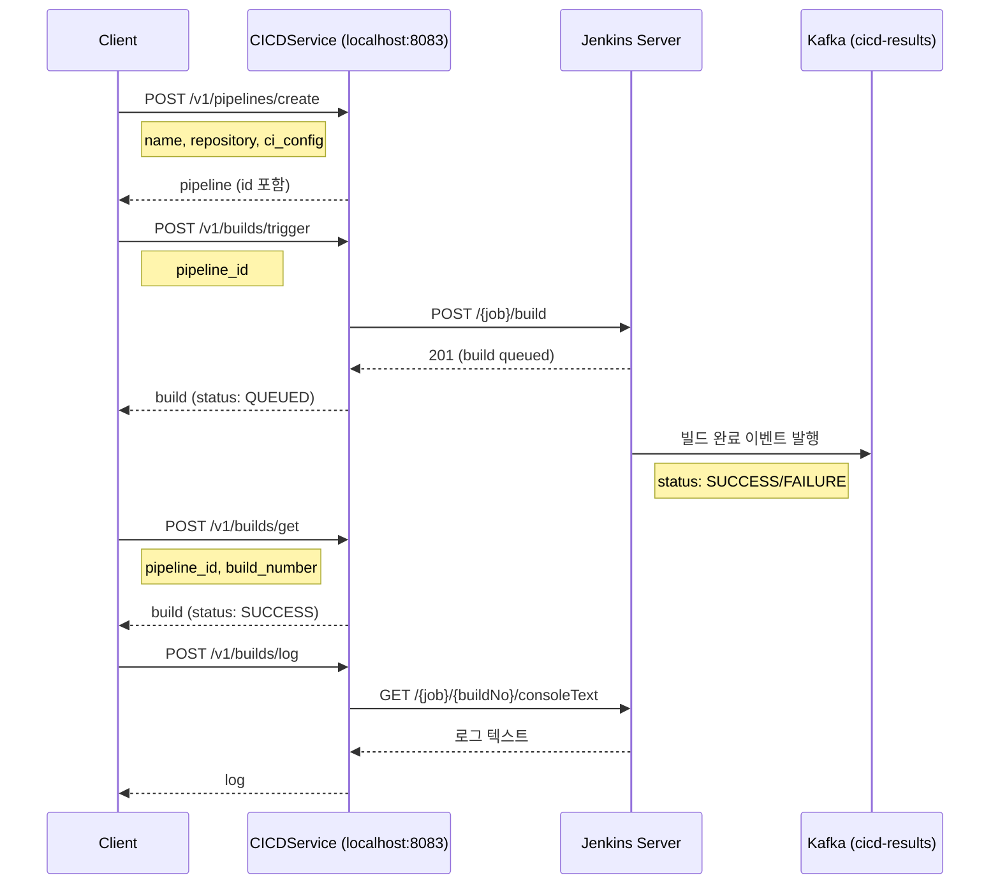

# CICD API 설계

CICDService는 `cicd.proto`에 정의된 8개 RPC를 통해 파이프라인 CRUD와 빌드 관리를 담당한다. grpc-gateway를 통해 모든 RPC가 HTTP POST로 노출된다.

---

## 메시지 타입

### JenkinsConfig

| 필드 | 타입 | 설명 |
|------|------|------|
| `url` | string | Jenkins 서버 URL (예: `http://jenkins:8080`) |
| `username` | string | Jenkins 사용자명 |
| `api_token` | string | Jenkins API 토큰 |

### CIConfig

| 필드 | 타입 | 설명 |
|------|------|------|
| `config` | oneof | CI 프로바이더 설정 (현재: `jenkins`) |

oneof 구조로 설계되어 향후 `GitHubActionsConfig`, `GitLabCIConfig` 추가 시 하위 호환성을 유지한다.

### PipelineStage

| 필드 | 타입 | 설명 |
|------|------|------|
| `name` | string | 스테이지 이름 ("Build", "Test", "Deploy") |
| `command` | string | 실행 명령어 |
| `timeout_seconds` | int32 | 타임아웃 (초) |

### Pipeline

| 필드 | 타입 | 설명 |
|------|------|------|
| `id` | string | 파이프라인 UUID |
| `name` | string | 파이프라인 이름 |
| `repository` | string | `namespace/repo` 형식 |
| `branch_pattern` | string | 매칭 브랜치 패턴 ("main", "feature/*") |
| `stages` | PipelineStage[] | 스테이지 목록 |
| `ci_config` | CIConfig | CI 프로바이더 설정 |
| `jenkins_job_name` | string | Jenkins Job 이름 |
| `created_at` | string | 생성 시각 (RFC3339) |
| `updated_at` | string | 수정 시각 (RFC3339) |

### BuildStatus

| 값 | 설명 |
|----|------|
| `BUILD_STATUS_QUEUED` | 빌드 큐에 등록됨 |
| `BUILD_STATUS_RUNNING` | 빌드 실행 중 |
| `BUILD_STATUS_SUCCESS` | 빌드 성공 |
| `BUILD_STATUS_FAILURE` | 빌드 실패 |
| `BUILD_STATUS_ABORTED` | 빌드 중단 |

### Build

| 필드 | 타입 | 설명 |
|------|------|------|
| `id` | string | 빌드 UUID |
| `pipeline_id` | string | 파이프라인 ID |
| `build_number` | int32 | Jenkins 빌드 번호 |
| `status` | BuildStatus | 빌드 상태 |
| `trigger` | string | 트리거 원인 ("push", "mr_merged", "manual") |
| `branch` | string | 빌드 대상 브랜치 |
| `commit_sha` | string | 커밋 SHA |
| `started_at` | string | 시작 시각 (RFC3339) |
| `finished_at` | string | 종료 시각 (RFC3339) |
| `duration_seconds` | int32 | 실행 시간 (초) |
| `url` | string | Jenkins 빌드 URL |

---

## RPC 목록

### 파이프라인 관리 (4개)

#### CreatePipeline

파이프라인을 생성하고 메모리 스토어에 저장한다.

| 항목 | 내용 |
|------|------|
| HTTP | `POST /v1/pipelines/create` |
| gRPC | `CICDService.CreatePipeline` |

**요청 (CreatePipelineRequest)**

| 필드 | 타입 | 필수 | 설명 |
|------|------|------|------|
| `name` | string | Y | 파이프라인 이름 |
| `repository` | string | Y | `namespace/repo` |
| `branch_pattern` | string | Y | 트리거 브랜치 패턴 |
| `stages` | PipelineStage[] | N | 스테이지 목록 |
| `ci_config` | CIConfig | Y | CI 프로바이더 설정 |
| `jenkins_job_name` | string | Y | Jenkins Job 이름 |

**응답 (CreatePipelineResponse)**

| 필드 | 타입 | 설명 |
|------|------|------|
| `pipeline` | Pipeline | 생성된 파이프라인 |

---

#### GetPipeline

ID로 파이프라인을 조회한다.

| 항목 | 내용 |
|------|------|
| HTTP | `POST /v1/pipelines/get` |
| gRPC | `CICDService.GetPipeline` |

**요청 (GetPipelineRequest)**

| 필드 | 타입 | 필수 | 설명 |
|------|------|------|------|
| `id` | string | Y | 파이프라인 UUID |

**응답 (GetPipelineResponse)**

| 필드 | 타입 | 설명 |
|------|------|------|
| `pipeline` | Pipeline | 파이프라인 정보 |

---

#### ListPipelines

저장된 파이프라인 목록을 조회한다. `repository` 필터를 지정하면 해당 저장소의 파이프라인만 반환한다.

| 항목 | 내용 |
|------|------|
| HTTP | `POST /v1/pipelines/list` |
| gRPC | `CICDService.ListPipelines` |

**요청 (ListPipelinesRequest)**

| 필드 | 타입 | 필수 | 설명 |
|------|------|------|------|
| `repository` | string | N | 저장소 필터 |

**응답 (ListPipelinesResponse)**

| 필드 | 타입 | 설명 |
|------|------|------|
| `pipelines` | Pipeline[] | 파이프라인 목록 |

---

#### DeletePipeline

ID로 파이프라인을 삭제한다.

| 항목 | 내용 |
|------|------|
| HTTP | `POST /v1/pipelines/delete` |
| gRPC | `CICDService.DeletePipeline` |

**요청 (DeletePipelineRequest)**

| 필드 | 타입 | 필수 | 설명 |
|------|------|------|------|
| `id` | string | Y | 파이프라인 UUID |

**응답 (DeletePipelineResponse)**

| 필드 | 타입 | 설명 |
|------|------|------|
| `success` | bool | 삭제 성공 여부 |

---

### 빌드 관리 (4개)

#### TriggerBuild

파이프라인의 빌드를 트리거한다. Jenkins API를 호출하여 빌드를 시작하고 QUEUED 상태의 Build 객체를 반환한다.

| 항목 | 내용 |
|------|------|
| HTTP | `POST /v1/builds/trigger` |
| gRPC | `CICDService.TriggerBuild` |

**요청 (TriggerBuildRequest)**

| 필드 | 타입 | 필수 | 설명 |
|------|------|------|------|
| `pipeline_id` | string | Y | 파이프라인 UUID |
| `branch` | string | N | 오버라이드 브랜치 |
| `commit_sha` | string | N | 특정 커밋 SHA |

**응답 (TriggerBuildResponse)**

| 필드 | 타입 | 설명 |
|------|------|------|
| `build` | Build | 생성된 빌드 (초기 상태: QUEUED) |

---

#### GetBuild

특정 빌드 정보를 조회한다.

| 항목 | 내용 |
|------|------|
| HTTP | `POST /v1/builds/get` |
| gRPC | `CICDService.GetBuild` |

**요청 (GetBuildRequest)**

| 필드 | 타입 | 필수 | 설명 |
|------|------|------|------|
| `pipeline_id` | string | Y | 파이프라인 UUID |
| `build_number` | int32 | Y | Jenkins 빌드 번호 |

**응답 (GetBuildResponse)**

| 필드 | 타입 | 설명 |
|------|------|------|
| `build` | Build | 빌드 상세 정보 |

---

#### ListBuilds

파이프라인의 빌드 이력을 조회한다.

| 항목 | 내용 |
|------|------|
| HTTP | `POST /v1/builds/list` |
| gRPC | `CICDService.ListBuilds` |

**요청 (ListBuildsRequest)**

| 필드 | 타입 | 필수 | 설명 |
|------|------|------|------|
| `pipeline_id` | string | Y | 파이프라인 UUID |
| `limit` | int32 | N | 최대 개수 (기본값 20) |

**응답 (ListBuildsResponse)**

| 필드 | 타입 | 설명 |
|------|------|------|
| `builds` | Build[] | 빌드 목록 (최신순) |

---

#### GetBuildLog

빌드의 콘솔 로그를 조회한다.

| 항목 | 내용 |
|------|------|
| HTTP | `POST /v1/builds/log` |
| gRPC | `CICDService.GetBuildLog` |

**요청 (GetBuildLogRequest)**

| 필드 | 타입 | 필수 | 설명 |
|------|------|------|------|
| `pipeline_id` | string | Y | 파이프라인 UUID |
| `build_number` | int32 | Y | Jenkins 빌드 번호 |

**응답 (GetBuildLogResponse)**

| 필드 | 타입 | 설명 |
|------|------|------|
| `log` | string | 콘솔 로그 전문 |

---

## 흐름 다이어그램

### 파이프라인 생성 → 빌드 트리거 → 결과 확인

---

## RPC 요약표

| RPC | HTTP 엔드포인트 | 설명 |
|-----|----------------|------|
| CreatePipeline | POST /v1/pipelines/create | 파이프라인 생성 |
| GetPipeline | POST /v1/pipelines/get | 파이프라인 조회 |
| ListPipelines | POST /v1/pipelines/list | 파이프라인 목록 |
| DeletePipeline | POST /v1/pipelines/delete | 파이프라인 삭제 |
| TriggerBuild | POST /v1/builds/trigger | 빌드 트리거 |
| GetBuild | POST /v1/builds/get | 빌드 조회 |
| ListBuilds | POST /v1/builds/list | 빌드 이력 |
| GetBuildLog | POST /v1/builds/log | 빌드 로그 조회 |
