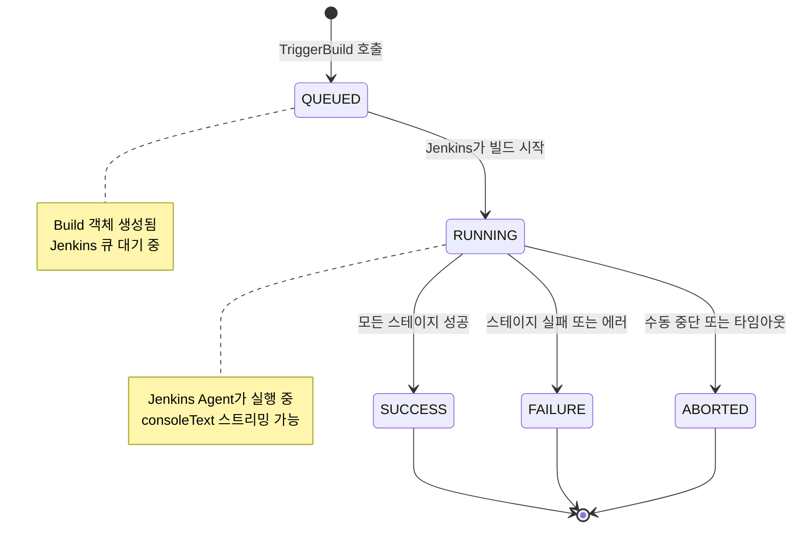

# CICD 유스케이스 모델

CICDService는 Jenkins를 추상화하여 파이프라인 생애주기와 빌드 실행을 관리한다. 주요 액터는 DevOps 관리자(파이프라인 정의)와 CI/CD 시스템(자동 빌드 트리거)이다.

---

## 액터

| 액터 | 역할 |
|------|------|
| **DevOps 관리자** | 파이프라인 생성·수정·삭제, 빌드 수동 트리거, 로그 조회 |
| **CI/CD 시스템** | 워크플로우 엔진이 이벤트 기반으로 자동 빌드 트리거 |

---

## 유스케이스

### UC-C1: 파이프라인 생성

**액터**: DevOps 관리자

**설명**: 저장소와 브랜치 패턴을 기반으로 CI 파이프라인을 정의한다. Jenkins Job 이름과 연결하여 빌드 트리거 시 해당 Job이 실행된다.

**사전 조건**:
- Jenkins 서버가 실행 중이고 접근 가능해야 한다.
- Jenkins API 토큰이 유효해야 한다.

**기본 흐름**:
1. 관리자가 파이프라인 이름, 저장소, 브랜치 패턴, Jenkins 설정을 입력한다.
2. 시스템이 파이프라인 객체를 생성하고 UUID를 부여한다.
3. 메모리 스토어에 저장하고 생성된 파이프라인을 반환한다.

**대안 흐름**:
- Jenkins 설정이 누락된 경우 → 요청 거부

---

### UC-C2: 빌드 트리거

**액터**: DevOps 관리자, CI/CD 시스템

**설명**: 파이프라인 ID를 지정하여 Jenkins 빌드를 시작한다. 수동(관리자)과 자동(워크플로우 엔진) 두 경로로 호출된다.

**사전 조건**:
- 파이프라인이 존재해야 한다.
- Jenkins Job이 존재해야 한다.

**기본 흐름**:
1. 요청자가 `pipeline_id`를 전달한다. 브랜치 오버라이드가 있으면 함께 전달한다.
2. 시스템이 파이프라인의 Jenkins 설정을 조회한다.
3. Jenkins API(`POST /{job}/build`)를 호출하여 빌드를 큐에 등록한다.
4. QUEUED 상태의 Build 객체를 즉시 반환한다.
5. Jenkins가 빌드를 실행하면 상태가 RUNNING으로 전환된다.
6. 빌드 완료 시 `cicd-results` Kafka 토픽으로 결과 이벤트가 발행된다.

**대안 흐름**:
- Jenkins 오프라인 → FAILURE 상태로 빌드 생성
- 파이프라인 미존재 → NotFound 에러 반환

---

### UC-C3: 빌드 로그 조회

**액터**: DevOps 관리자

**설명**: 특정 빌드의 Jenkins 콘솔 로그를 가져와 빌드 실패 원인 분석에 활용한다.

**기본 흐름**:
1. 관리자가 `pipeline_id`와 `build_number`를 지정한다.
2. 시스템이 Jenkins API(`GET /{job}/{buildNo}/consoleText`)를 호출한다.
3. 로그 전문을 문자열로 반환한다.

---

## BuildStatus 생애주기

빌드는 생성부터 종료까지 단방향으로 상태가 전이된다. ABORTED는 실행 중 외부 개입(수동 중단, 타임아웃)으로 발생하는 예외적 종료 상태다.



---

## 도메인 모델

```
Pipeline (파이프라인 정의)
├── id: UUID
├── name: 파이프라인 이름
├── repository: namespace/repo
├── branch_pattern: 트리거 패턴
├── stages[]: 스테이지 목록
│   ├── name: 스테이지명
│   ├── command: 실행 명령어
│   └── timeout_seconds: 타임아웃
├── ci_config: CI 프로바이더 설정
│   └── jenkins: JenkinsConfig
│       ├── url
│       ├── username
│       └── api_token
└── jenkins_job_name: Jenkins Job 이름

Build (빌드 인스턴스)
├── id: UUID
├── pipeline_id: 연결된 파이프라인
├── build_number: Jenkins 빌드 번호
├── status: BuildStatus
├── trigger: 트리거 원인 (push/mr_merged/manual)
├── branch: 빌드 대상 브랜치
├── commit_sha: 커밋 SHA
├── started_at / finished_at: 시작·종료 시각
├── duration_seconds: 실행 시간
└── url: Jenkins 빌드 URL
```

---

## 설계 특징

Pipeline과 Build는 분리된 생명주기를 가진다. Pipeline은 "무엇을 어떻게 빌드할지" 정의이고, Build는 "실제로 빌드된 인스턴스"다. 이 분리 덕분에 하나의 파이프라인에서 여러 빌드 이력을 독립적으로 추적할 수 있다.

`CIConfig`의 `oneof` 설계는 현재 Jenkins만 지원하지만, 향후 GitHub Actions나 GitLab CI를 추가할 때 기존 코드를 수정하지 않고 새 필드를 추가하는 것만으로 확장이 가능하다는 점에서 Strategy 패턴의 proto 구현에 해당한다.
