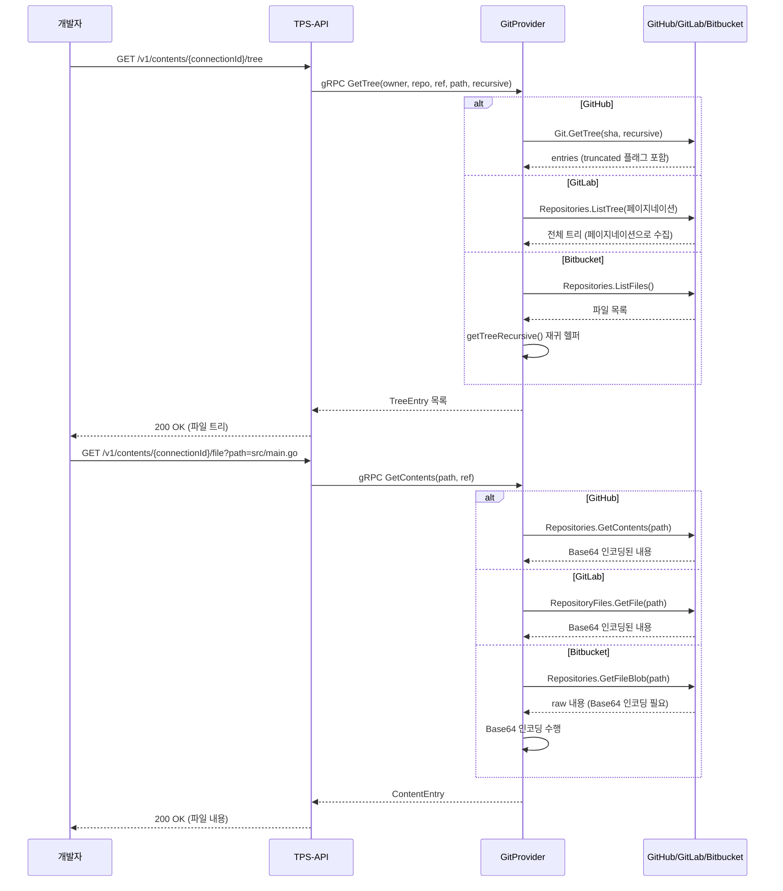

# Contents API 설계

## 개요

ContentsService는 저장소 내 파일과 디렉토리를 탐색하는 읽기 전용 API다. 파일 트리 조회, 파일 내용 조회, README 자동 탐지의 3개 RPC로 구성된다. `contents_server.go` (190줄)에 구현되어 있으며, 4개 서비스 중 가장 작다.

---

## RPC 목록

| RPC | HTTP 메서드 | 경로 | 설명 |
|-----|------------|------|------|
| GetTree | GET / POST | `/v1/contents/{connectionId}/tree` | 파일 트리 조회 |
| GetContents | GET / POST | `/v1/contents/{connectionId}/file` | 파일/디렉토리 내용 조회 |
| GetReadme | GET | `/v1/contents/{connectionId}/readme` | README 자동 탐지 및 반환 |

모든 엔드포인트는 GET(쿼리 파라미터)과 POST(요청 본문) 두 가지 방식을 지원한다.

---

## GetTree - 파일 트리 조회

저장소의 파일과 디렉토리 구조를 반환한다. `recursive=true`이면 전체 하위 트리를 재귀적으로 조회한다.

### 요청 파라미터

| 파라미터 | 타입 | 필수 | 기본값 | 설명 |
|----------|------|------|--------|------|
| connectionId | UUID | 필수 | - | Connection ID (path) |
| owner | String | 필수 | - | 저장소 소유자 |
| repo | String | 필수 | - | 저장소 이름 |
| ref | String | 선택 | default_branch | 브랜치명 또는 커밋 SHA |
| path | String | 선택 | "" (루트) | 조회 시작 경로 |
| recursive | Boolean | 선택 | false | 재귀 조회 여부 |

### 응답 필드 (TreeEntry)

| 필드 | 타입 | 설명 |
|------|------|------|
| entries | Array | 트리 엔트리 목록 |
| entries[].path | String | 파일/디렉토리 전체 경로 (예: `src/main.go`) |
| entries[].type | String | `BLOB` (파일) 또는 `TREE` (디렉토리) |
| entries[].sha | String | Git SHA |
| entries[].size | Long | 파일 크기 (bytes, BLOB만. TREE는 null) |
| entries[].mode | String | Git 모드 (`100644`: 일반 파일, `040000`: 디렉토리) |
| truncated | Boolean | 결과가 잘렸는지 여부 (GitHub 대용량 트리 시 true) |
| ref | String | 조회한 브랜치/커밋 |
| path | String | 조회한 경로 |

### 응답 예시

```json
{
  "success": true,
  "data": {
    "entries": [
      {
        "path": "src/main/java/com/example",
        "type": "TREE",
        "sha": "abc123def456",
        "size": null,
        "mode": "040000"
      },
      {
        "path": "src/main/java/com/example/Application.java",
        "type": "BLOB",
        "sha": "def456ghi789",
        "size": 1024,
        "mode": "100644"
      }
    ],
    "truncated": false,
    "ref": "main",
    "path": "src/main/java"
  }
}
```

### curl 예시

```bash
# 루트 트리 조회
curl "http://localhost:8080/v1/contents/550e8400-e29b-41d4-a716-446655440000/tree?owner=myorg&repo=myrepo"

# 특정 브랜치 특정 경로
curl "http://localhost:8080/v1/contents/550e8400-e29b-41d4-a716-446655440000/tree?owner=myorg&repo=myrepo&ref=develop&path=src/main"

# 전체 재귀 조회
curl "http://localhost:8080/v1/contents/550e8400-e29b-41d4-a716-446655440000/tree?owner=myorg&repo=myrepo&recursive=true"

# POST 방식
curl -X POST "http://localhost:8080/v1/contents/tree" \
  -H "Content-Type: application/json" \
  -d '{
    "connectionId": "550e8400-e29b-41d4-a716-446655440000",
    "owner": "myorg",
    "repo": "myrepo",
    "ref": "develop",
    "path": "src/main/java",
    "recursive": true
  }'
```

---

## GetContents - 파일/디렉토리 내용 조회

단일 파일의 내용 또는 디렉토리의 항목 목록을 반환한다. 파일이면 Base64 인코딩된 내용을 반환하고, 디렉토리이면 하위 항목 목록을 반환한다.

### 요청 파라미터

| 파라미터 | 타입 | 필수 | 기본값 | 설명 |
|----------|------|------|--------|------|
| connectionId | UUID | 필수 | - | Connection ID |
| owner | String | 필수 | - | 저장소 소유자 |
| repo | String | 필수 | - | 저장소 이름 |
| path | String | 필수 | - | 파일 경로 |
| ref | String | 선택 | default_branch | 브랜치명 또는 커밋 SHA |

### 응답 필드 (ContentEntry)

| 필드 | 타입 | 설명 |
|------|------|------|
| path | String | 파일 경로 |
| type | String | `FILE`, `DIR`, `SYMLINK`, `SUBMODULE` |
| name | String | 파일명 (경로에서 마지막 세그먼트) |
| size | Long | 파일 크기 (bytes) |
| sha | String | Git SHA |
| content | String | Base64 인코딩된 파일 내용 (파일인 경우) |
| encoding | String | 인코딩 방식 (항상 `base64`) |
| url | String | API URL |
| download_url | String | 파일 직접 다운로드 URL |
| entries | Array | 하위 항목 목록 (디렉토리인 경우) |

### 응답 예시 (파일)

```json
{
  "success": true,
  "data": {
    "path": "README.md",
    "type": "FILE",
    "name": "README.md",
    "size": 42,
    "sha": "abc123def456789",
    "content": "IyBNeVByb2plY3QKClRoaXMgaXMgYSBzYW1wbGUgcHJvamVjdC4=",
    "encoding": "base64"
  }
}
```

### curl 예시

```bash
# GET 방식 - 파일 조회
curl "http://localhost:8080/v1/contents/550e8400-e29b-41d4-a716-446655440000/file?owner=myorg&repo=myrepo&path=README.md"

# 특정 브랜치의 파일
curl "http://localhost:8080/v1/contents/550e8400-e29b-41d4-a716-446655440000/file?owner=myorg&repo=myrepo&path=src/main.go&ref=develop"

# POST 방식
curl -X POST "http://localhost:8080/v1/contents/file" \
  -H "Content-Type: application/json" \
  -d '{
    "connectionId": "550e8400-e29b-41d4-a716-446655440000",
    "owner": "myorg",
    "repo": "myrepo",
    "path": "pom.xml",
    "ref": "release/v1.0"
  }'
```

---

## GetReadme - README 자동 탐지

저장소 루트(또는 지정된 경로)에서 README 파일을 자동으로 탐지하여 내용을 반환한다.

### 요청 파라미터

| 파라미터 | 타입 | 필수 | 기본값 | 설명 |
|----------|------|------|--------|------|
| connectionId | UUID | 필수 | - | Connection ID |
| owner | String | 필수 | - | 저장소 소유자 |
| repo | String | 필수 | - | 저장소 이름 |
| ref | String | 선택 | default_branch | 브랜치명 또는 커밋 SHA |

### README 탐지 우선순위

GitHub는 `Repositories.GetReadme()` API가 서버 측에서 자동으로 탐지한다. GitLab과 Bitbucket은 클라이언트에서 다음 순서로 시도한다.

```
README.md → README.rst → README.txt → README → readme.md
```

README가 없으면 `404 Not Found`를 반환한다. 다른 메서드들이 에러 시 `500 Internal`만 반환하는 것과 달리, GetReadme는 `404`를 명시적으로 구분한다.

---

## 파일 탐색 플로우



---

## gRPC Proto 정의

```protobuf
service ContentsService {
  rpc GetTree(GetTreeRequest) returns (GetTreeResponse);
  rpc GetContents(GetContentsRequest) returns (GetContentsResponse);
  rpc GetReadme(GetReadmeRequest) returns (GetReadmeResponse);
}

message GetTreeRequest {
  ProviderConfig provider = 1;
  string owner = 2;
  string repo = 3;
  string ref = 4;
  string path = 5;
  bool recursive = 6;
}

message GetTreeResponse {
  repeated TreeEntry entries = 1;
  bool truncated = 2;
}

message TreeEntry {
  string path = 1;
  EntryType type = 2;  // BLOB or TREE
  string sha = 3;
  int64 size = 4;
  string mode = 5;
}

message GetContentsRequest {
  ProviderConfig provider = 1;
  string owner = 2;
  string repo = 3;
  string path = 4;
  string ref = 5;
}

message GetContentsResponse {
  ContentEntry content = 1;
}

message ContentEntry {
  string path = 1;
  ContentType type = 2;  // FILE, DIRECTORY, SYMLINK, SUBMODULE
  string content = 3;    // base64 encoded
  string encoding = 4;
  string sha = 5;
  int64 size = 6;
}
```

---

## Provider별 구현 차이

| 기능 | GitHub | GitLab | Bitbucket |
|------|--------|--------|-----------|
| 트리 조회 | `Git.GetTree()` - truncated 플래그 지원 | `Repositories.ListTree()` - 페이지네이션으로 전체 조회 | `Repositories.ListFiles()` + `getTreeRecursive()` 헬퍼 |
| 파일 내용 | `Repositories.GetContents()` - Base64 직접 반환 | `RepositoryFiles.GetFile()` - Base64 직접 반환 | `Repositories.GetFileBlob()` - raw 반환 후 서버에서 Base64 인코딩 |
| README 탐지 | `Repositories.GetReadme()` - 서버 측 자동 탐지 | 순서대로 시도 (README.md → README.rst → ...) | 순서대로 시도 (README.md → README.rst → ...) |

Bitbucket은 raw 내용을 반환하므로 서버에서 Base64 인코딩을 직접 수행한다는 점이 다르다.

---

## Provider별 API 매핑

| 기능 | GitHub API | GitLab API | Bitbucket API |
|------|------------|------------|---------------|
| 트리 조회 | `GET /repos/{owner}/{repo}/git/trees/{sha}` | `GET /projects/{id}/repository/tree` | `GET /repositories/{workspace}/{repo}/src/{revision}/` |
| 파일 조회 | `GET /repos/{owner}/{repo}/contents/{path}` | `GET /projects/{id}/repository/files/{path}` | `GET /repositories/{workspace}/{repo}/src/{revision}/{path}` |

---

## 에러 응답

| HTTP 코드 | 에러 코드 | 설명 |
|-----------|-----------|------|
| 400 | `INVALID_REQUEST` | 필수 파라미터 누락 (path 등) |
| 404 | `NOT_FOUND` | 파일, 브랜치, README를 찾을 수 없음 |
| 500 | `PROVIDER_ERROR` | Provider API 연결 실패 |

---

## 제한 사항

| 항목 | 제한 |
|------|------|
| 파일 크기 | 1MB 초과 시 content가 제공되지 않을 수 있음 |
| 트리 항목 수 | recursive=true 시 최대 100,000개 엔트리 |
| Rate Limit (GitHub) | 5,000 requests/hour (인증 시) |
| Rate Limit (GitLab) | 2,000 requests/minute |
| Rate Limit (Bitbucket) | 1,000 requests/hour |
