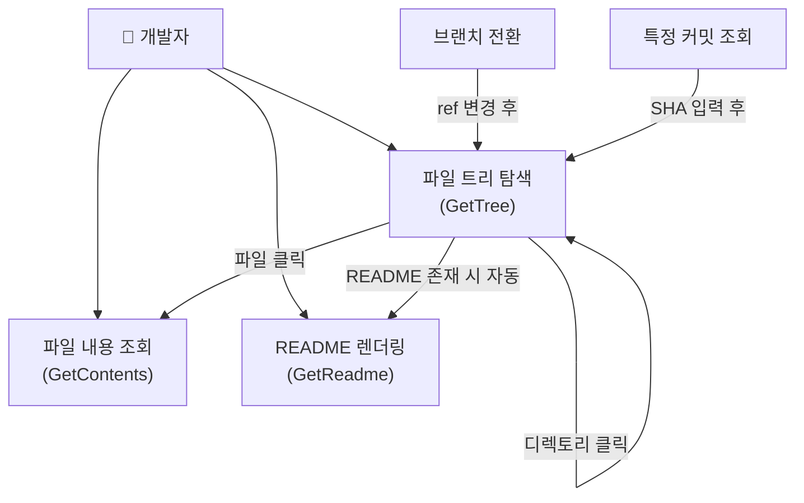
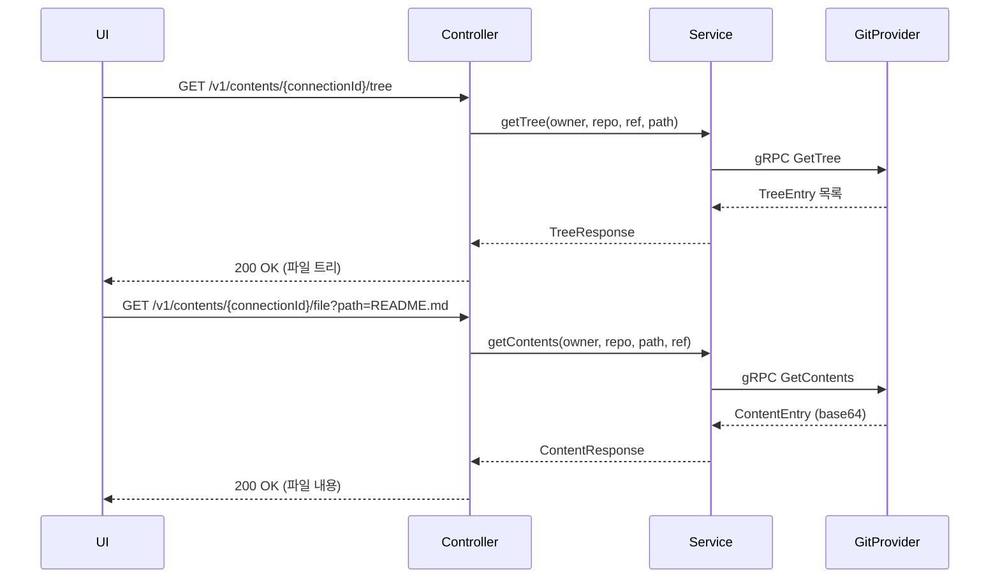

# Contents 유스케이스 모델

## 유스케이스 개요

**UC-REPO-001: 코드 탐색 (Code Browsing)**

개발자가 Git 저장소의 파일 구조를 탐색하고 파일 내용을 조회하는 유스케이스다. IDE와 유사한 파일 트리 네비게이션과 코드 뷰어 기능을 웹 브라우저에서 제공한다.

---

## 액터

| 액터 | 역할 |
|------|------|
| 개발자 | 코드 확인, 파일 구조 탐색이 주 목적 |
| 코드 리뷰어 | PR/MR 리뷰 중 참조 코드 확인 |
| 프로젝트 관리자 | 저장소 구조 파악 |

---

## 유스케이스 다이어그램



---

## 사전 조건

| 조건 | 설명 |
|------|------|
| PC-1 | Connection이 ACTIVE 상태 |
| PC-2 | 사용자가 저장소에 대한 읽기 권한 보유 |
| PC-3 | 저장소에 최소 1개 이상의 커밋 존재 |

---

## 기본 흐름

```
액터                          시스템
─────                         ─────
1. 저장소 선택
        ──────────────────▶
                              2. 기본 브랜치 정보 조회
                              3. 루트 디렉토리 트리 조회 (GetTree)
        ◀──────────────────
                              4. 파일 트리 UI 표시
5. 디렉토리 클릭
        ──────────────────▶
                              6. 하위 트리 조회 (GetTree, path=클릭 경로)
        ◀──────────────────
                              7. 하위 디렉토리 펼침 표시
8. 파일 클릭
        ──────────────────▶
                              9. 파일 내용 조회 (GetContents)
        ◀──────────────────
                              10. 파일 내용 표시 (문법 강조)
```

---

## 대안 흐름

### AF-1: 브랜치 전환

사용자가 드롭다운에서 다른 브랜치를 선택하면, 시스템은 선택된 브랜치의 `ref`로 GetTree를 다시 호출하여 해당 브랜치의 파일 구조를 표시한다. 기본 흐름 4단계로 복귀한다.

### AF-2: 특정 커밋 조회

사용자가 커밋 SHA를 직접 입력하면, `ref` 파라미터에 SHA를 넣어 GetTree를 호출한다. "Viewing commit abc1234" 배너를 표시하여 현재 스냅샷 상태임을 명확히 한다.

### AF-3: README 자동 렌더링

현재 디렉토리에 README 파일이 존재하면 시스템이 자동으로 GetReadme를 호출하여 마크다운 렌더링 결과를 우측 패널에 표시한다. 사용자가 별도로 README를 클릭하지 않아도 된다.

### AF-4: 전체 트리 펼치기

사용자가 "Expand All" 버튼을 클릭하면 `recursive=true`로 GetTree를 호출하여 전체 파일 트리를 한번에 가져온다. 대용량 저장소에서는 응답 시간이 길 수 있으므로 로딩 인디케이터를 표시한다.

---

## 예외 흐름

| 예외 | 원인 | 시스템 대응 |
|------|------|-------------|
| EF-1: 빈 저장소 | 커밋이 없는 저장소 | "이 저장소는 비어 있습니다" 메시지 + 첫 커밋 방법 안내 |
| EF-2: 권한 없음 | Provider API 403 반환 | "이 저장소에 접근할 권한이 없습니다" 메시지 |
| EF-3: 파일/브랜치 없음 | Provider API 404 반환 | "요청한 리소스를 찾을 수 없습니다" + 기본 브랜치 리다이렉트 제안 |
| EF-4: 대용량 파일 | 파일 크기 1MB 초과 | "파일이 너무 커서 미리보기 불가" 메시지 + Raw 다운로드 링크 |

---

## API 시퀀스



---

## 비기능 요구사항

| 요구사항 | 기준 |
|----------|------|
| 트리 조회 응답 시간 | 2초 이내 |
| 파일 조회 응답 시간 | 1초 이내 |
| 동시 사용자 | 100명 동시 접속 지원 |
| 캐싱 | 동일 ref의 트리·파일은 5분 캐시 (Git SHA 기반 불변 활용) |
| 파일 미리보기 크기 | 최대 1MB |

---

## 사후 조건

| 조건 | 설명 |
|------|------|
| SC-1 | 파일 내용이 화면에 표시됨 |
| SC-2 | 파일 메타데이터(크기, SHA) 확인 가능 |
| SC-3 | 선택한 브랜치/커밋의 파일 상태가 반영됨 |
