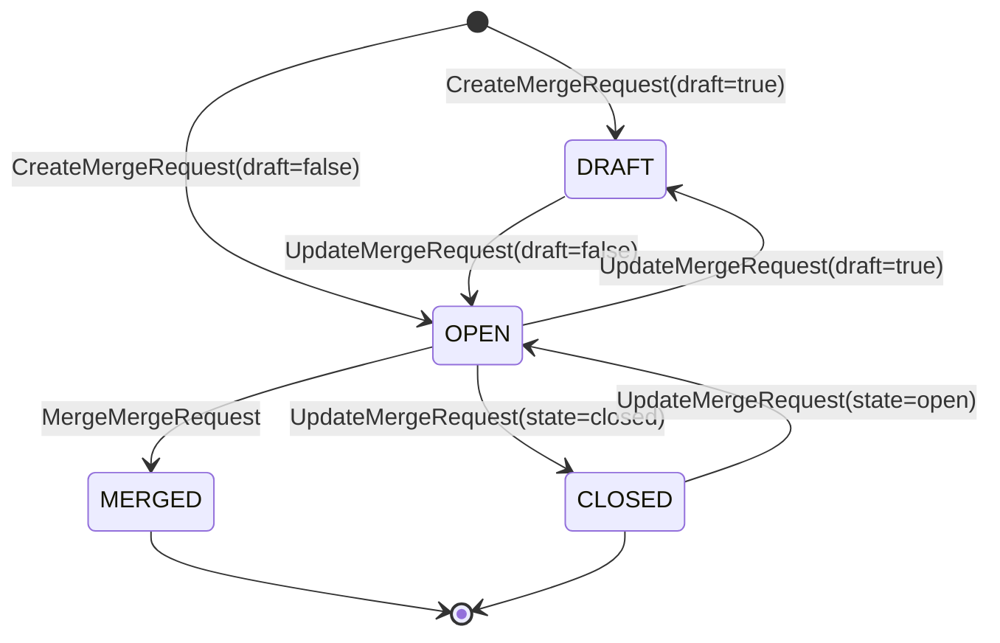

# MergeRequest API 설계

## 개요

MergeRequestService는 Pull Request / Merge Request의 전체 라이프사이클을 관리한다. `mr_server.go` (1,007줄)에 구현되어 있으며, 4개 서비스 중 가장 크다. CRUD 외에 리뷰와 코멘트 기능까지 포함하여 총 12개 RPC를 제공한다.

본 시스템은 GitHub의 Pull Request, GitLab의 Merge Request, Bitbucket의 Pull Request를 **MergeRequest**로 통일하여 다룬다.

---

## 용어 통일

| TPS 통합 용어 | GitHub | GitLab | Bitbucket |
|--------------|--------|--------|-----------|
| MergeRequest | Pull Request | Merge Request | Pull Request |
| number | number | iid | id |
| 댓글 | Issue Comments | Notes | Comments |
| 리뷰 | Reviews | Approvals | Approve/Unapprove |

---

## RPC 목록

### MR CRUD

| RPC | HTTP 메서드 | 경로 | 설명 |
|-----|------------|------|------|
| ListMergeRequests | GET / POST | `/v1/merge-requests/{connectionId}/list` | MR 목록 조회 |
| GetMergeRequest | GET / POST | `/v1/merge-requests/{connectionId}/{number}` | MR 상세 조회 |
| CreateMergeRequest | POST | `/v1/merge-requests/create` | MR 생성 |
| UpdateMergeRequest | PUT / PATCH | `/v1/merge-requests/{connectionId}/{number}` | MR 수정 |
| MergeMergeRequest | POST | `/v1/merge-requests/merge` | MR 머지 |
| GetMergeRequestDiff | GET | `/v1/merge-requests/{connectionId}/{number}/diff` | MR 변경사항 조회 |

### Review

| RPC | HTTP 메서드 | 경로 | 설명 |
|-----|------------|------|------|
| ListReviews | GET | `/v1/merge-requests/{connectionId}/{number}/reviews` | 리뷰 목록 조회 |
| SubmitReview | POST | `/v1/merge-requests/{connectionId}/{number}/reviews` | 리뷰 제출 |

### Comment

| RPC | HTTP 메서드 | 경로 | 설명 |
|-----|------------|------|------|
| ListComments | GET | `/v1/merge-requests/{connectionId}/{number}/comments` | 댓글 목록 조회 |
| CreateComment | POST | `/v1/merge-requests/{connectionId}/{number}/comments` | 댓글 생성 |
| UpdateComment | PUT | `/v1/merge-requests/{connectionId}/{number}/comments/{commentId}` | 댓글 수정 |
| DeleteComment | DELETE | `/v1/merge-requests/{connectionId}/{number}/comments/{commentId}` | 댓글 삭제 |

---

## MR CRUD 상세

### ListMergeRequests

**요청 파라미터**

| 파라미터 | 타입 | 필수 | 기본값 | 설명 |
|----------|------|------|--------|------|
| connectionId | UUID | 필수 | - | Connection ID |
| namespace | String | 필수 | - | 저장소 소유자 |
| repository | String | 필수 | - | 저장소 이름 |
| status | String | 선택 | OPEN | 상태 필터 (OPEN, CLOSED, MERGED, DRAFT) |

**응답 필드**

| 필드 | 타입 | 설명 |
|------|------|------|
| mergeRequests[].externalId | String | Provider 내부 MR ID |
| mergeRequests[].number | Integer | MR 번호 (사람이 읽는 번호) |
| mergeRequests[].title | String | MR 제목 |
| mergeRequests[].status | String | OPEN, CLOSED, MERGED, DRAFT |
| mergeRequests[].sourceBranch | String | 소스 브랜치 |
| mergeRequests[].targetBranch | String | 타겟 브랜치 |
| mergeRequests[].authorName | String | 작성자 이름 |
| mergeRequests[].url | String | Provider 웹 UI URL |
| totalCount | Integer | 전체 MR 수 |

### GetMergeRequest

**요청 파라미터**

| 파라미터 | 타입 | 필수 | 설명 |
|----------|------|------|------|
| connectionId | UUID | 필수 | Connection ID |
| number | Integer | 필수 | MR 번호 |
| namespace | String | 필수 | 저장소 소유자 |
| repository | String | 필수 | 저장소 이름 |

**응답 필드 (MergeRequestDetail)**

| 필드 | 타입 | 설명 |
|------|------|------|
| id | UUID | 내부 ID |
| repositoryId | UUID | 저장소 ID |
| externalId | String | Provider MR ID |
| number | Integer | MR 번호 |
| title | String | 제목 |
| description | String | 설명 |
| status | String | OPEN, CLOSED, MERGED, DRAFT |
| sourceBranch | String | 소스 브랜치 |
| targetBranch | String | 타겟 브랜치 |
| draft | Boolean | Draft 여부 |
| mergeable | Boolean | 머지 가능 여부 |
| authorName | String | 작성자 이름 |
| authorEmail | String | 작성자 이메일 |
| assignees | Array | 담당자 목록 |
| reviewers | Array | 리뷰어 목록 |
| labels | Array | 레이블 목록 |
| url | String | Provider URL |
| mergedAt | DateTime | 머지 시간 (null if not merged) |
| closedAt | DateTime | 닫힌 시간 (null if open) |
| createdAt | DateTime | 생성 시간 |
| updatedAt | DateTime | 수정 시간 |

### CreateMergeRequest

**요청 본문**

| 필드 | 타입 | 필수 | 설명 |
|------|------|------|------|
| connectionId | UUID | 필수 | Connection ID |
| namespace | String | 필수 | 저장소 소유자 |
| repository | String | 필수 | 저장소 이름 |
| title | String | 필수 | MR 제목 |
| description | String | 선택 | MR 설명 |
| sourceBranch | String | 필수 | 소스 브랜치 |
| targetBranch | String | 필수 | 타겟 브랜치 |
| draft | Boolean | 선택 | Draft MR 여부 |
| assignees | Array | 선택 | 담당자 목록 |
| reviewers | Array | 선택 | 리뷰어 목록 |
| labels | Array | 선택 | 레이블 목록 |

Draft MR 구현 방식은 Provider마다 다르다. GitHub는 `draft=true` 필드를 사용하고, GitLab은 타이틀에 `"Draft: "` 접두사를 붙인다. Bitbucket은 Draft 개념이 없다.

### UpdateMergeRequest

**요청 본문**

| 필드 | 타입 | 필수 | 설명 |
|------|------|------|------|
| connectionId | UUID | 필수 | Connection ID |
| namespace | String | 필수 | 저장소 소유자 |
| repository | String | 필수 | 저장소 이름 |
| number | Integer | 필수 | MR 번호 |
| title | String | 선택 | 새 제목 |
| description | String | 선택 | 새 설명 |
| state | String | 선택 | `open` (재오픈), `closed` (닫기) |
| targetBranch | String | 선택 | 타겟 브랜치 변경 |
| draft | Boolean | 선택 | Draft 상태 변경 |

### MergeMergeRequest

**요청 본문**

| 필드 | 타입 | 필수 | 기본값 | 설명 |
|------|------|------|--------|------|
| connectionId | UUID | 필수 | - | Connection ID |
| namespace | String | 필수 | - | 저장소 소유자 |
| repository | String | 필수 | - | 저장소 이름 |
| number | Integer | 필수 | - | MR 번호 |
| mergeMethod | String | 선택 | MERGE | 머지 방식 (MERGE, SQUASH, REBASE) |
| commitMessage | String | 선택 | - | 머지 커밋 메시지 |
| deleteSourceBranch | Boolean | 선택 | false | 머지 후 소스 브랜치 삭제 여부 |

**MergeMethod Provider 지원 현황**

| 방식 | GitHub | GitLab | Bitbucket |
|------|--------|--------|-----------|
| MERGE | 머지 커밋 생성 | 머지 커밋 생성 | 기본 지원 |
| SQUASH | squash and merge | squash=true | 미지원 |
| REBASE | rebase and merge | 별도 설정 필요 | 미지원 |

### GetMergeRequestDiff

**응답 필드**

| 필드 | 타입 | 설명 |
|------|------|------|
| files[].filename | String | 파일 경로 |
| files[].status | String | added, removed, modified, renamed |
| files[].additions | Integer | 추가된 라인 수 |
| files[].deletions | Integer | 삭제된 라인 수 |
| files[].changes | Integer | 총 변경 라인 수 |
| files[].patch | String | unified diff 패치 내용 |

---

## Review 상세

### SubmitReview

**요청 본문**

| 필드 | 타입 | 필수 | 설명 |
|------|------|------|------|
| connectionId | UUID | 필수 | Connection ID |
| namespace | String | 필수 | 저장소 소유자 |
| repository | String | 필수 | 저장소 이름 |
| number | Integer | 필수 | MR 번호 |
| state | String | 필수 | APPROVED, CHANGES_REQUESTED, COMMENTED |
| body | String | 선택 | 리뷰 코멘트 내용 |

**ReviewState Provider 매핑**

| ReviewState | GitHub | GitLab | Bitbucket |
|-------------|--------|--------|-----------|
| APPROVED | APPROVE 이벤트 | approve 엔드포인트 | Approve API |
| CHANGES_REQUESTED | REQUEST_CHANGES 이벤트 | 댓글로 대체 | 댓글로 대체 |
| COMMENTED | COMMENT 이벤트 | 댓글로 대체 | 댓글로 대체 |
| DISMISSED | dismiss 엔드포인트 | unapprove | Unapprove API |

**응답 필드 (Review)**

| 필드 | 타입 | 설명 |
|------|------|------|
| id | String | 리뷰 ID |
| user | Object | 리뷰 작성자 |
| state | String | PENDING, APPROVED, CHANGES_REQUESTED, COMMENTED, DISMISSED |
| body | String | 리뷰 내용 |
| submittedAt | DateTime | 제출 시간 |

Bitbucket은 정식 Review API가 없으므로 `ListReviews`는 항상 빈 배열을 반환한다.

---

## Comment 상세

### CreateComment

**요청 본문**

| 필드 | 타입 | 필수 | 설명 |
|------|------|------|------|
| connectionId | UUID | 필수 | Connection ID |
| namespace | String | 필수 | 저장소 소유자 |
| repository | String | 필수 | 저장소 이름 |
| number | Integer | 필수 | MR 번호 |
| body | String | 필수 | 댓글 내용 |
| path | String | 선택 | 인라인 댓글 대상 파일 경로 |
| line | Integer | 선택 | 인라인 댓글 대상 라인 번호 |
| inReplyTo | String | 선택 | 답글 대상 댓글 ID |

**Provider별 인라인 댓글 지원**

| 기능 | GitHub | GitLab | Bitbucket |
|------|--------|--------|-----------|
| 일반 댓글 | 지원 | 지원 | 지원 |
| 인라인 댓글 (path+line) | 지원 | 지원 | 미지원 |
| 답글 (inReplyTo) | 지원 | 미지원 | 미지원 |
| 댓글 수정 | 지원 | 지원 (Notes API) | 지원 (v0.9.88+) |
| 댓글 삭제 | 지원 | 지원 (Notes API) | 지원 (v0.9.88+) |

**응답 필드 (Comment)**

| 필드 | 타입 | 설명 |
|------|------|------|
| id | String | 댓글 ID |
| user | Object | 작성자 정보 |
| body | String | 댓글 내용 |
| path | String | 인라인 댓글 파일 경로 (있는 경우) |
| line | Integer | 인라인 댓글 라인 번호 (있는 경우) |
| createdAt | DateTime | 생성 시간 |
| updatedAt | DateTime | 수정 시간 |

---

## MR 라이프사이클 다이어그램



---

## gRPC Proto 정의

```protobuf
service MergeRequestService {
  // MR CRUD
  rpc ListMergeRequests(ListMergeRequestsRequest) returns (ListMergeRequestsResponse);
  rpc GetMergeRequest(GetMergeRequestRequest) returns (GetMergeRequestResponse);
  rpc CreateMergeRequest(CreateMergeRequestRequest) returns (CreateMergeRequestResponse);
  rpc UpdateMergeRequest(UpdateMergeRequestRequest) returns (UpdateMergeRequestResponse);
  rpc MergeMergeRequest(MergeMergeRequestRequest) returns (MergeMergeRequestResponse);
  rpc GetMergeRequestDiff(GetMergeRequestDiffRequest) returns (GetMergeRequestDiffResponse);

  // Review
  rpc ListReviews(ListReviewsRequest) returns (ListReviewsResponse);
  rpc SubmitReview(SubmitReviewRequest) returns (SubmitReviewResponse);

  // Comment
  rpc ListComments(ListCommentsRequest) returns (ListCommentsResponse);
  rpc CreateComment(CreateCommentRequest) returns (CreateCommentResponse);
  rpc UpdateComment(UpdateCommentRequest) returns (UpdateCommentResponse);
  rpc DeleteComment(DeleteCommentRequest) returns (DeleteCommentResponse);
}

enum MergeRequestState {
  MR_STATE_UNKNOWN = 0;
  MR_STATE_OPEN = 1;
  MR_STATE_CLOSED = 2;
  MR_STATE_MERGED = 3;
  MR_STATE_DRAFT = 4;
}

enum MergeMethod {
  MERGE_METHOD_MERGE = 0;
  MERGE_METHOD_SQUASH = 1;
  MERGE_METHOD_REBASE = 2;
}

enum ReviewState {
  REVIEW_STATE_PENDING = 0;
  REVIEW_STATE_APPROVED = 1;
  REVIEW_STATE_CHANGES_REQUESTED = 2;
  REVIEW_STATE_COMMENTED = 3;
  REVIEW_STATE_DISMISSED = 4;
}
```

---

## 변환 계층

MergeRequestService는 가장 풍부한 변환 함수 세트를 가진다.

| 변환 | 방향 | 필드 수 |
|------|------|---------|
| MergeRequestInfo → MergeRequest | client → proto | 15개+ |
| UserInfo → User | client → proto | 5개 |
| ReviewInfo → Review | client → proto | 4개 |
| CommentInfo → Comment | client → proto | 8개 |
| MergeRequestDiffInfo → MergeRequestDiff | client → proto | 4개 |
| FileDiffInfo → FileDiff | client → proto | 6개 |

enum 변환 함수: `convertMRStateToString`, `convertStringToMRState`, `convertMergeMethodToString`, `convertReviewStateToString`, `convertStringToReviewState`

---

## 에러 응답

| HTTP 코드 | 에러 코드 | 설명 |
|-----------|-----------|------|
| 400 | `INVALID_REQUEST` | 필수 파라미터 누락 |
| 404 | `NOT_FOUND` | MR, 저장소, 댓글을 찾을 수 없음 |
| 409 | `CONFLICT` | 이미 머지된 MR에 머지 시도 등 |
| 422 | `UNPROCESSABLE` | 충돌 있는 MR 머지 시도 |
| 501 | `NOT_IMPLEMENTED` | Provider에서 미지원 기능 (예: Bitbucket squash) |
