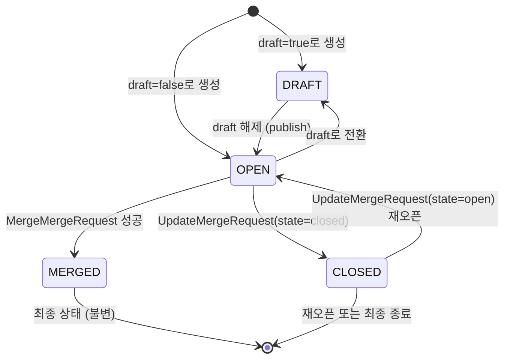
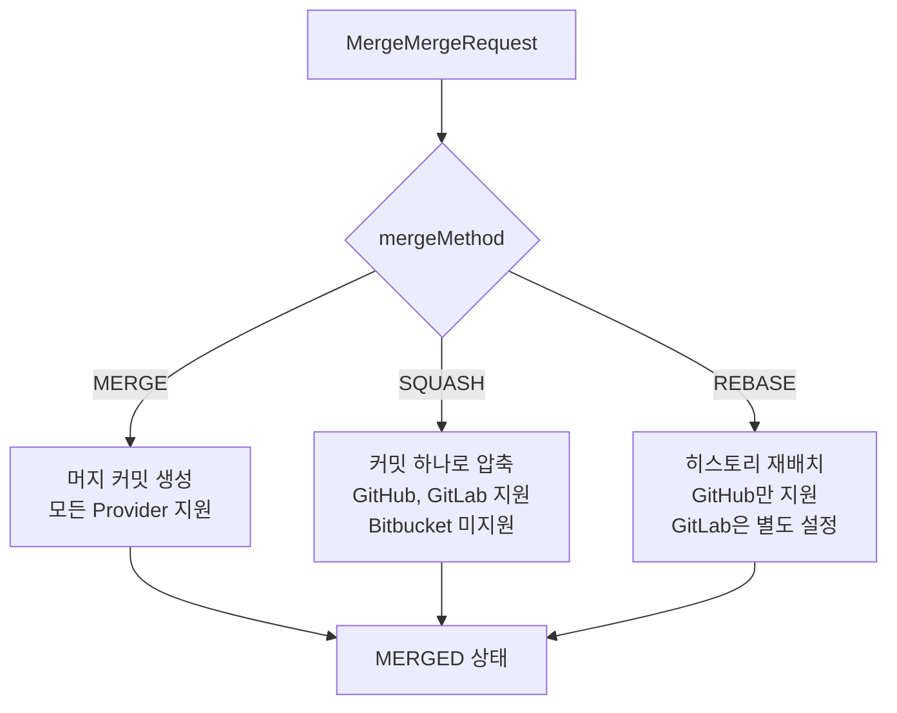

# MergeRequest 유스케이스 모델

## 개요

MergeRequest는 코드 변경사항을 기준 브랜치에 통합하기 위한 협업 단위다. GitHub의 Pull Request, GitLab의 Merge Request, Bitbucket의 Pull Request를 TPS에서 MergeRequest로 통일한다. 생성부터 머지까지 전체 라이프사이클과 리뷰·코멘트 협업 기능을 포함한다.

---

## MR 상태 다이어그램



---

## 유스케이스 목록

### UC-MR-001: MR 생성

개발자가 기능 개발 또는 버그 수정 완료 후 MR을 생성하여 코드 리뷰를 요청한다.

**사전 조건**: 소스 브랜치에 최소 1개 커밋 존재, 타겟 브랜치 존재

**기본 흐름**:
1. 소스/타겟 브랜치 선택
2. 제목·설명 작성
3. 리뷰어·담당자 지정 (선택)
4. CreateMergeRequest 호출
5. MR 생성 완료, OPEN 상태로 전환

**대안 흐름 - Draft 생성**: `draft=true`로 생성하면 DRAFT 상태로 시작. 작업이 완료되면 OPEN으로 전환.

### UC-MR-002: 코드 리뷰

리뷰어가 MR의 변경사항을 검토하고 승인 또는 변경 요청을 제출한다.

**기본 흐름**:
1. GetMergeRequestDiff로 변경 파일 목록 조회
2. 파일별 코드 검토
3. 인라인 댓글 작성 (CreateComment with path+line)
4. SubmitReview로 전체 리뷰 결과 제출 (APPROVED / CHANGES_REQUESTED)

### UC-MR-003: MR 머지

리뷰 승인 후 MR을 기준 브랜치에 병합한다.

**사전 조건**: 머지 가능 상태 (충돌 없음), 필요한 리뷰 승인 완료

**기본 흐름**:
1. MergeMergeRequest 호출 (mergeMethod 선택)
2. Provider가 브랜치 병합 수행
3. MR 상태가 MERGED로 전환
4. `deleteSourceBranch=true`이면 소스 브랜치 자동 삭제

---

## Provider 용어 매핑

각 Provider가 사용하는 용어와 개념이 다르다. TPS는 이를 통일된 인터페이스로 추상화한다.

| TPS | GitHub | GitLab | Bitbucket |
|-----|--------|--------|-----------|
| MergeRequest | Pull Request | Merge Request | Pull Request |
| number | `.number` | `.iid` (internal id) | `.id` |
| DRAFT | `draft: true` 필드 | 타이틀에 `"Draft: "` 접두사 | 미지원 (개념 없음) |
| 댓글 API | Issue Comments API | Notes API | Comments API |
| 리뷰 API | Reviews API (APPROVE/REQUEST_CHANGES) | Approvals API (approve/unapprove) | Approve/Unapprove 엔드포인트만 존재 |

### Draft MR 처리

Draft는 작업 진행 중임을 나타내는 상태다. Provider별 구현 방식이 다르므로 서버에서 변환을 수행한다.

- **GitHub**: API 요청 시 `draft: true` 필드 설정
- **GitLab**: 타이틀 앞에 `"Draft: "` 문자열 자동 추가/제거
- **Bitbucket**: Draft 개념 없음. `draft=true` 요청 시 일반 OPEN MR로 생성

### 리뷰 시스템 차이

세 Provider의 리뷰 시스템이 근본적으로 다르다. TPS는 통일된 ReviewState로 추상화하되, 내부적으로는 Provider별 API를 호출한다.

| 상태 | GitHub 내부 동작 | GitLab 내부 동작 | Bitbucket 내부 동작 |
|------|----------------|----------------|-------------------|
| APPROVED | APPROVE 이벤트 | approve 엔드포인트 | Approve API |
| CHANGES_REQUESTED | REQUEST_CHANGES 이벤트 | 댓글로 대체 | 댓글로 대체 |
| COMMENTED | COMMENT 이벤트 | Notes 생성 | Comments 생성 |
| DISMISSED | dismiss 엔드포인트 | unapprove | Unapprove API |

Bitbucket은 `ListReviews`가 항상 빈 배열을 반환한다. 정식 Review 목록 API가 없기 때문이다.

---

## MR 머지 방식



---

## Bitbucket 제한 사항

Bitbucket은 다른 Provider에 비해 기능 제한이 있다. TPS 사용 시 인지해야 할 사항이다.

| 기능 | 상태 | 대안 |
|------|------|------|
| Draft MR | 미지원 | 일반 OPEN MR로 생성됨 |
| SQUASH 머지 | 미지원 | MERGE 방식만 사용 가능 |
| REBASE 머지 | 미지원 | MERGE 방식만 사용 가능 |
| 인라인 댓글 (path+line) | 미지원 | 일반 댓글만 가능 |
| 리뷰 목록 조회 | 미지원 | 빈 배열 반환 |
| CHANGES_REQUESTED 리뷰 | 미지원 | 댓글로 대체 |

---

## 서비스 등록 이슈 (수정 완료)

MergeRequestService는 `mr_server.go`에 완전히 구현되어 있었지만, `cmd/server/main.go`에서 gRPC 서버와 REST gateway에 등록하지 않은 버그가 있었다. 현재는 수정 완료되어 정상 동작한다.

```go
// 수정 후 main.go
mrServer := server.NewMergeRequestServer()
pb.RegisterMergeRequestServiceServer(grpcServer, mrServer)
pb.RegisterMergeRequestServiceHandlerFromEndpoint(ctx, mux, grpcEndpoint, opts)
```
