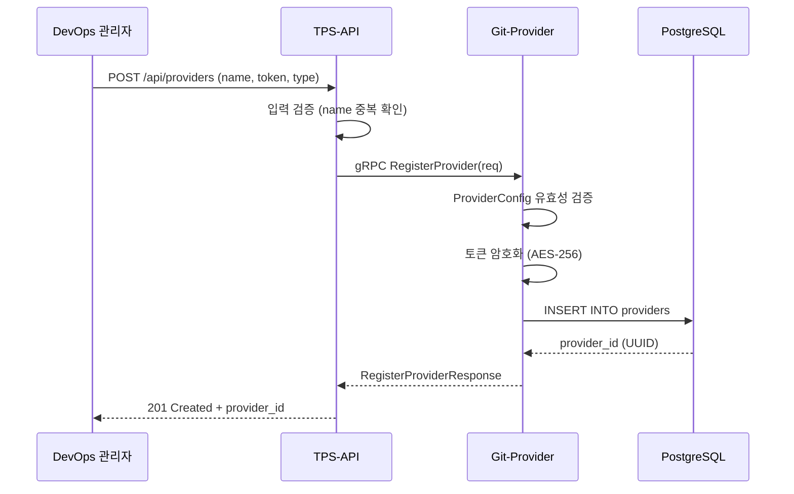

# Provider API 설계

## 개요

ProviderService는 Git 프로바이더(GitHub, GitLab, Bitbucket) 연결 정보를 등록하고 관리하는 서비스다. 현재 `provider.proto`에 정의되어 있으나 서버 구현은 미완료 상태이며, 인증 정보를 DB에 저장하고 조회하는 기능이 향후 구현 대상이다.

---

## Proto 서비스 정의

```protobuf
service ProviderService {
  rpc RegisterProvider(RegisterProviderRequest) returns (RegisterProviderResponse);
  rpc GetProvider(GetProviderRequest) returns (GetProviderResponse);
  rpc ListProviders(ListProvidersRequest) returns (ListProvidersResponse);
  rpc DeleteProvider(DeleteProviderRequest) returns (DeleteProviderResponse);
}
```

---

## ProviderConfig oneof 구조

모든 RPC에서 `ProviderConfig`는 `oneof config` 필드로 프로바이더 유형을 구분한다.

```protobuf
message ProviderConfig {
  oneof config {
    GitHubConfig github = 1;
    GitLabConfig gitlab = 2;
    BitbucketConfig bitbucket = 3;
  }
}

message GitHubConfig {
  string token    = 1;  // Personal Access Token (ghp_xxx)
  string base_url = 2;  // Enterprise URL (선택, 기본: api.github.com)
}

message GitLabConfig {
  string token    = 1;  // Personal Access Token (glpat-xxx)
  string base_url = 2;  // Self-hosted URL (선택, 기본: gitlab.com)
}

message BitbucketConfig {
  string email      = 1;  // Atlassian 계정 이메일
  string api_token  = 2;  // App Password
  string workspace  = 3;  // 기본 워크스페이스 slug
}
```

---

## RPC 상세

### 1. RegisterProvider

프로바이더 인증 정보를 등록한다.

**요청**

| 필드 | 타입 | 필수 | 설명 |
|------|------|------|------|
| name | string | O | 프로바이더 식별 이름 |
| provider | ProviderConfig | O | 프로바이더 설정 (oneof) |
| project_id | string | O | 소속 프로젝트 ID |

**응답**

| 필드 | 타입 | 설명 |
|------|------|------|
| provider_id | string | 등록된 프로바이더 UUID |
| name | string | 등록 이름 |
| type | string | GITHUB / GITLAB / BITBUCKET |
| created_at | string | 등록 시각 (RFC3339) |

---

### 2. GetProvider

등록된 프로바이더 정보를 단건 조회한다.

**요청**

| 필드 | 타입 | 필수 | 설명 |
|------|------|------|------|
| provider_id | string | O | 조회할 프로바이더 UUID |

**응답**

| 필드 | 타입 | 설명 |
|------|------|------|
| provider_id | string | 프로바이더 UUID |
| name | string | 등록 이름 |
| type | string | GITHUB / GITLAB / BITBUCKET |
| base_url | string | API Base URL |
| created_at | string | 등록 시각 |

---

### 3. ListProviders

프로젝트에 속한 전체 프로바이더 목록을 조회한다.

**요청**

| 필드 | 타입 | 필수 | 설명 |
|------|------|------|------|
| project_id | string | O | 프로젝트 UUID |
| type | string | X | 필터 (GITHUB / GITLAB / BITBUCKET) |

**응답**

| 필드 | 타입 | 설명 |
|------|------|------|
| providers | []ProviderInfo | 프로바이더 목록 |
| total | int32 | 전체 개수 |

---

### 4. DeleteProvider

등록된 프로바이더를 삭제한다.

**요청**

| 필드 | 타입 | 필수 | 설명 |
|------|------|------|------|
| provider_id | string | O | 삭제할 프로바이더 UUID |

**응답**

| 필드 | 타입 | 설명 |
|------|------|------|
| success | bool | 삭제 성공 여부 |
| message | string | 결과 메시지 |

---

## Provider 등록 흐름



---

## Provider 유형별 인증 방식

| Provider | 인증 방식 | 필수 필드 | 선택 필드 |
|----------|----------|----------|----------|
| GitHub | Bearer Token | token | base_url (Enterprise) |
| GitLab | PRIVATE-TOKEN Header | token | base_url (Self-hosted) |
| Bitbucket | Basic Auth (email:apiToken) | email, api_token | workspace |

---

## 관련 문서

- [usecase-model.md](usecase-model.md) - Provider 유스케이스 모델
- [review.md](review.md) - Provider 클라이언트 구현 리뷰
- [GitHub/api-reference.md](GitHub/api-reference.md) - GitHub API 레퍼런스
- [GitLab/api-reference.md](GitLab/api-reference.md) - GitLab API 레퍼런스
- [Bitbucket/api-reference.md](Bitbucket/api-reference.md) - Bitbucket API 레퍼런스
