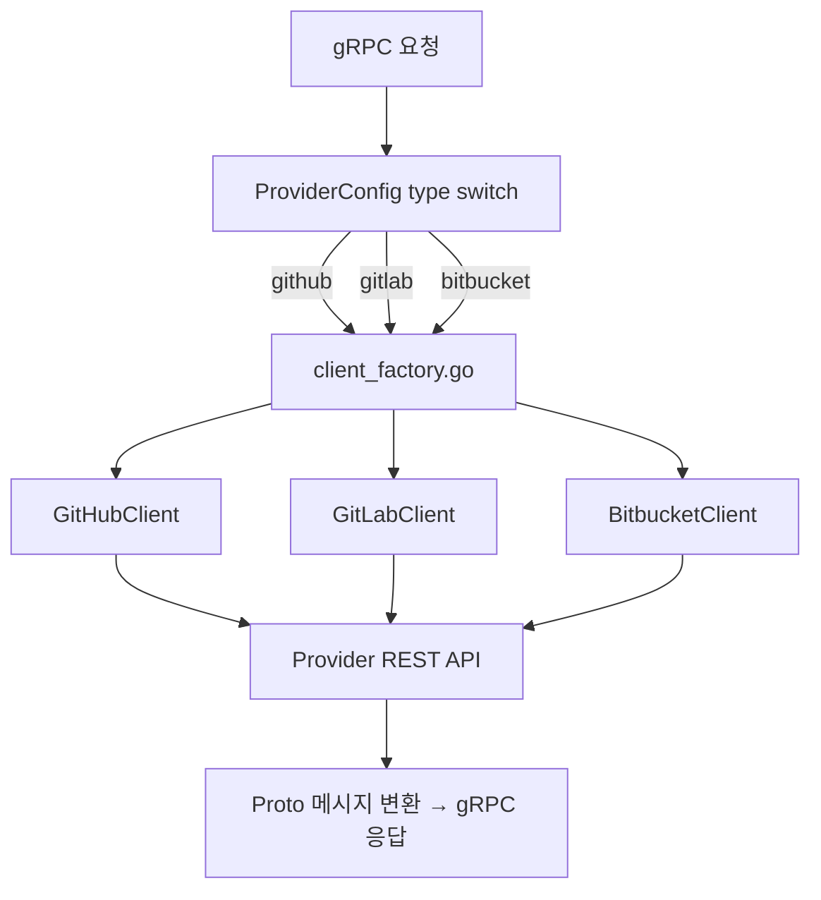

# Provider 구현 리뷰

## What - 무엇을 구현했는가

`internal/client/` 패키지는 GitHub, GitLab, Bitbucket 세 가지 프로바이더의 REST API를 Go 타입으로 추상화하는 어댑터 계층이다. 각 클라이언트는 프로바이더 고유 API를 호출하고, 결과를 공통 타입(`BranchComparison`, `MergeRequestInfo` 등) 또는 proto 메시지(`*pb.Repository`, `*pb.Branch`)로 변환한다.

| 클라이언트 | 파일 | 줄 수 | Go 라이브러리 |
|-----------|------|-------|--------------|
| GitHubClient | github.go | 1,140 | google/go-github v57 |
| GitLabClient | gitlab.go | 960 | xanzy/go-gitlab v115 |
| BitbucketClient | bitbucket.go | 1,248 | ktrysmt/go-bitbucket v0.9.88 |

### Proto Service ↔ Go 구현 매핑

| Proto Service | gRPC 서버 파일 | 클라이언트 파일 |
|---------------|--------------|----------------|
| GitService | git_server.go | github.go / gitlab.go / bitbucket.go |
| BranchService | branch_server.go | 동일 |
| ContentsService | contents_server.go | 동일 |
| MergeRequestService | mr_server.go | 동일 |

---

## How - 어떻게 구현했는가

### 코드 구조

```
internal/
├── client/
│   ├── github.go      # GitHubClient + 공통 타입 정의
│   ├── gitlab.go      # GitLabClient
│   └── bitbucket.go   # BitbucketClient
└── server/
    └── client_factory.go  # 3개 팩토리 함수 (패키지 레벨)
```

### 인증 방식

| Provider | 방식 | 구현 |
|----------|------|------|
| GitHub | Bearer Token | `oauth2.StaticTokenSource` → `github.NewClient(httpClient)` |
| GitLab | PRIVATE-TOKEN Header | `gitlab.NewClient(token, baseURL)` |
| Bitbucket | Basic Auth (email:apiToken) | `bitbucket.NewBasicAuth(email, apiToken)` |

GitHub는 Enterprise Server를 위한 `baseURL` 파라미터를 지원한다. 빈 문자열이면 github.com을 사용하고, 값이 있으면 `github.NewEnterpriseClient()`를 호출한다. GitLab도 self-hosted 인스턴스를 위한 `baseURL`을 지원한다.

### 공통 데이터 타입 (github.go에 정의)

```go
type BranchComparison struct {
    AheadBy, BehindBy, TotalCommits int
    MergeableState, SuggestedAction string
    ChangedFiles, Additions, Deletions int
}

type MergeRequestInfo struct {
    ID string; Number int; Title, Description, State string
    SourceBranch, TargetBranch string; Draft, Mergeable bool
    Author *UserInfo; Assignees, Reviewers []*UserInfo
    Labels []string; URL string
    CreatedAt, UpdatedAt, MergedAt, ClosedAt string
}
```

### 데이터 흐름



### 클라이언트 팩토리

이전에는 4개 서버 파일에 각각 동일한 코드가 복사되어 있었다. 리팩토링을 통해 `client_factory.go`에 패키지 레벨 함수 3개로 통합했다.

```go
func createGitHubClient(ctx context.Context, config *pb.GitHubConfig) (*client.GitHubClient, error)
func createGitLabClient(config *pb.GitLabConfig) (*client.GitLabClient, error)
func createBitbucketClient(config *pb.BitbucketConfig) (*client.BitbucketClient, error)
```

GitHub만 `ctx` 파라미터가 필요한 이유는 `oauth2.NewClient(ctx, tokenSource)`에서 컨텍스트를 사용하기 때문이다.

---

## Why - 왜 이렇게 구현했는가

### Adapter 패턴 선택

세 Provider가 각기 다른 API 구조, 인증 방식, 응답 포맷을 사용한다. 서버 계층이 이 차이를 직접 다루면 조건 분기가 폭발적으로 늘어난다. Adapter 패턴으로 각 Provider의 차이를 `internal/client/` 계층에서 흡수하면, 서버 계층은 공통 타입만 다루면 된다.

### Stateless 설계

인증 정보를 요청마다 `ProviderConfig`로 전달받으므로 서버가 세션이나 상태를 관리할 필요가 없다. 이는 수평 확장을 용이하게 한다. 단점은 매 요청마다 클라이언트 객체를 생성하는 오버헤드이며, 향후 커넥션 풀 도입이 고려 대상이다.

### 기능 매트릭스

| 기능 | GitHub | GitLab | Bitbucket |
|------|--------|--------|-----------|
| Repository CRUD | 완료 | 완료 | 완료 |
| Branch CRUD | 완료 | 완료 | 완료 |
| Branch Compare | 완료 (1회 호출) | 완료 (2회 호출) | 완료 (diffstat) |
| Stale Branch 탐지 | 완료 | 완료 | 완료 |
| File Tree | 완료 (truncated 지원) | 완료 (페이지네이션) | 완료 (재귀 헬퍼) |
| MR CRUD | 완료 | 완료 | 완료 |
| MR Merge | merge/squash/rebase | merge/squash | merge만 |
| MR Draft | 완료 | 완료 (제목 접두사) | 미지원 |
| Review 시스템 | 완료 (Review API) | 완료 (Approval API) | 부분 (Approve만) |
| 인라인 댓글 | 완료 | 부분 (미완성) | 미지원 |

### Provider별 특이사항

**GitHub**: API가 풍부하고 라이브러리가 잘 정리되어 있어 가장 완성도 높은 구현. Draft PR, Merge Method 3가지, Enterprise 모두 지원.

**GitLab**: `CompareBranches`에서 ahead/behind를 구하기 위해 정방향/역방향 2회 API 호출 필요. 인라인 댓글은 Discussion API가 필요하여 현재 미완성.

**Bitbucket**: `go-bitbucket` 라이브러리가 `interface{}` 반환이 많아 런타임 타입 단언 코드가 빈번하다. Draft PR 개념이 없고, Merge Method도 merge_commit만 지원한다.

---

## 참고 패턴

| 패턴 | 적용 위치 | 설명 |
|------|----------|------|
| Adapter 패턴 | `internal/client/` | Provider별 API 차이를 공통 타입으로 변환 |
| Factory 패턴 | `client_factory.go` | ProviderConfig에 따라 적절한 클라이언트 생성 |
| Type Switching | `*_server.go` | Go의 oneof 타입 스위치로 런타임 다형성 구현 |
| Stateless 설계 | 서버 전체 | 인증 정보를 요청마다 전달받아 서버 상태 없음 |

---

## 개선 가능 사항

1. **공통 타입 분리**: `BranchComparison`, `MergeRequestInfo` 등을 `types.go`로 분리하면 가독성이 향상된다.
2. **인터페이스 추출**: 3개 클라이언트의 공통 인터페이스(`GitProvider`)를 정의하면 테스트 시 모킹이 가능해진다.
3. **에러 세분화**: Provider API 에러를 공통 에러 타입으로 래핑하여 404/403/500을 구분한다.
4. **커넥션 풀**: 매 요청마다 클라이언트를 생성하는 대신, Provider+Token 기준 캐싱을 도입한다.
5. **Bitbucket 타입 안전성**: `map[string]interface{}` 대신 구조체 디코딩 래퍼를 작성한다.
6. **GitLab 인라인 댓글**: Discussion API를 사용하여 실제 인라인 댓글 기능을 완성한다.
