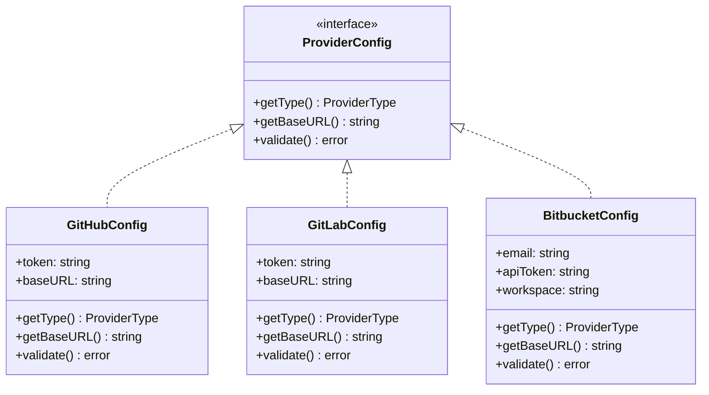

# Provider 유스케이스 모델

## 액터

**DevOps 관리자**: 조직의 Git 프로바이더 계정(GitHub, GitLab, Bitbucket)을 TPS 플랫폼에 연결하고 관리하는 역할을 담당한다. 프로바이더 등록 후 해당 Connection을 기반으로 저장소, 브랜치, MR 등의 작업이 이루어진다.

---

## 유스케이스 목록

| ID | 유스케이스 | 액터 | 설명 |
|----|-----------|------|------|
| UC-P01 | Provider 등록 | DevOps 관리자 | 새 Git 프로바이더 인증 정보를 등록한다 |
| UC-P02 | Provider 조회 | DevOps 관리자 | 등록된 프로바이더 정보를 단건 조회한다 |
| UC-P03 | Provider 목록 조회 | DevOps 관리자 | 프로젝트에 속한 전체 프로바이더를 조회한다 |
| UC-P04 | Provider 삭제 | DevOps 관리자 | 등록된 프로바이더 연결 정보를 삭제한다 |

---

## UC-P01: Provider 등록

### 기본 흐름

1. 관리자가 프로바이더 유형(GitHub/GitLab/Bitbucket)을 선택한다.
2. 인증 정보(토큰, 이메일+비밀번호 등)와 등록 이름을 입력한다.
3. 시스템이 입력값을 검증하고, 이름 중복 여부를 확인한다.
4. 인증 정보를 암호화하여 DB에 저장하고 provider_id를 반환한다.

### 예외 흐름

- 이름이 이미 존재하면 `ALREADY_EXISTS` 에러를 반환한다.
- 토큰이 유효하지 않으면 `INVALID_ARGUMENT` 에러를 반환한다.
- base_url이 잘못된 형식이면 `INVALID_ARGUMENT` 에러를 반환한다.

---

## UC-P04: Provider 삭제

### 선행 조건

삭제 대상 프로바이더를 참조하는 Repository Connection이 없어야 한다. 참조가 남아 있으면 삭제를 거부하고 이유를 반환한다. 이는 참조 무결성을 보호하기 위한 제약으로, 먼저 해당 Connection을 삭제한 후 Provider를 삭제해야 한다.

---

## ProviderConfig 클래스 다이어그램



---

## 도메인 모델

### ProviderType 열거형

```
ProviderType
├── GITHUB     - GitHub (github.com 또는 GitHub Enterprise)
├── GITLAB     - GitLab (gitlab.com 또는 Self-hosted)
└── BITBUCKET  - Bitbucket Cloud
```

### Credentials 인터페이스

```
Credentials (interface)
├── TokenCredentials
│   └── token: string           (GitHub, GitLab)
└── BasicCredentials
    ├── username: string         (Bitbucket email)
    └── password: string         (Bitbucket App Password)
```

### Provider 도메인 엔티티

```
Provider (Aggregate Root)
├── id: UUID
├── projectId: UUID
├── name: string                 (프로젝트 내 고유)
├── type: ProviderType
├── baseURL: string
├── status: ProviderStatus
│   └── ACTIVE | INACTIVE | FAILED
├── credential: Credential       (별도 테이블, 암호화 저장)
├── createdAt: Instant
└── updatedAt: Instant
```

---

## Provider별 인증 구조 비교

| 항목 | GitHub | GitLab | Bitbucket |
|------|--------|--------|-----------|
| 인증 방식 | Bearer Token | PRIVATE-TOKEN Header | Basic Auth |
| 토큰 종류 | Personal Access Token (ghp_xxx) | Personal Access Token (glpat-xxx) | App Password |
| Enterprise/Self-hosted | base_url 지정 | base_url 지정 | Cloud Only |
| 추가 필드 | - | - | email, workspace |

---

## 관련 문서

- [api-design.md](api-design.md) - ProviderService RPC 설계
- [review.md](review.md) - Provider 클라이언트 구현 리뷰
- [test.md](test.md) - Provider 테스트 시나리오
