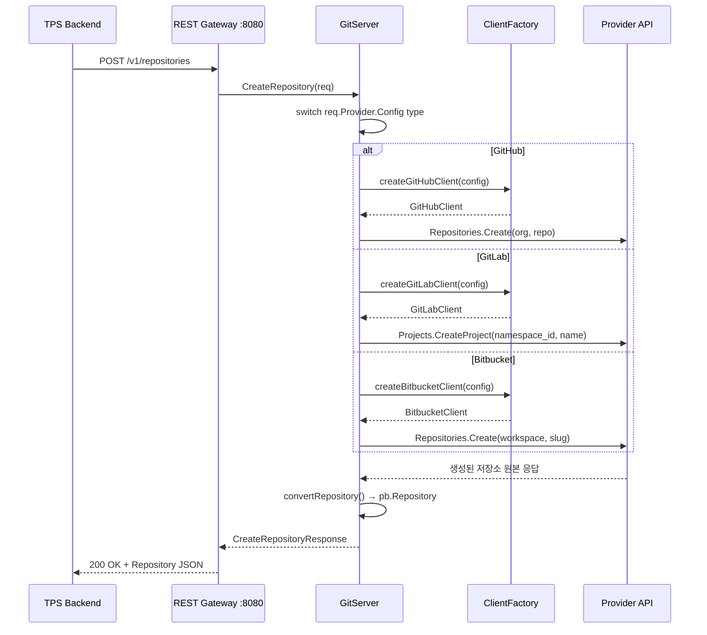

# Repository API 설계

## 개요

GitService는 `provider.proto`에 정의된 서비스로, 저장소와 브랜치의 CRUD를 담당한다. git-provider의 `git_server.go`(330줄)에 구현되어 있으며, GitHub/GitLab/Bitbucket 세 프로바이더를 통합 인터페이스로 추상화한다.

---

## RPC 목록

### Repository 메서드 (4개)

| 메서드 | HTTP 매핑 | 설명 |
|--------|----------|------|
| `ListRepositories` | `POST /v1/repositories/list` | 프로바이더의 저장소 전체 목록 |
| `GetRepository` | `POST /v1/repositories/get` | 단일 저장소 상세 정보 |
| `CreateRepository` | `POST /v1/repositories` | 새 저장소 생성 |
| `DeleteRepository` | `POST /v1/repositories/delete` | 저장소 삭제 |

> grpc-gateway v2는 GET/DELETE 대신 POST를 사용한다. 이는 gRPC 요청 바디가 항상 존재하기 때문이다.

---

## ListRepositories

### Proto 정의

```protobuf
rpc ListRepositories(ListRepositoriesRequest) returns (ListRepositoriesResponse);

message ListRepositoriesRequest {
  ProviderConfig provider = 1;
  string namespace = 2;  // GitHub: org, GitLab: group, Bitbucket: workspace
}

message ListRepositoriesResponse {
  repeated Repository repositories = 1;
}
```

### 요청 파라미터

| 필드 | 타입 | 필수 | 설명 |
|------|------|------|------|
| `provider` | ProviderConfig | O | 프로바이더 인증 정보 (oneof) |
| `namespace` | string | X | 소유자 (미지정 시 인증 사용자의 전체 저장소) |

### 프로바이더별 동작

| Provider | API | namespace 사용 |
|----------|-----|----------------|
| GitHub | `Repositories.List(ctx, "", opts)` | org 파라미터로 전달 |
| GitLab | `Projects.ListProjects(opts)` | group ID로 변환 |
| Bitbucket | `Repositories.ListForAccount(opts)` | workspace slug로 전달 |

### curl 예시

```bash
# GitHub - 조직 저장소 목록
curl -X POST http://localhost:8080/v1/repositories/list \
  -H 'Content-Type: application/json' \
  -d '{
    "provider": {
      "github": { "token": "ghp_xxxxxxxxxxxx" }
    },
    "namespace": "my-organization"
  }'

# GitLab - 그룹 프로젝트 목록
curl -X POST http://localhost:8080/v1/repositories/list \
  -H 'Content-Type: application/json' \
  -d '{
    "provider": {
      "gitlab": {
        "token": "glpat-xxxxxxxxxxxx",
        "base_url": "https://gitlab.company.com"
      }
    },
    "namespace": "dev-team"
  }'

# Bitbucket - Workspace 저장소 목록 (workspace는 Config에서)
curl -X POST http://localhost:8080/v1/repositories/list \
  -H 'Content-Type: application/json' \
  -d '{
    "provider": {
      "bitbucket": {
        "email": "user@example.com",
        "api_token": "ATATT3xFfGF0...",
        "workspace": "my-workspace"
      }
    }
  }'
```

### 응답 예시

```json
{
  "repositories": [
    {
      "id": "123456789",
      "name": "backend-api",
      "full_name": "my-organization/backend-api",
      "url": "https://github.com/my-organization/backend-api",
      "clone_url": "https://github.com/my-organization/backend-api.git",
      "ssh_url": "git@github.com:my-organization/backend-api.git",
      "default_branch": "main",
      "private": true,
      "namespace": {
        "id": "98765",
        "name": "my-organization",
        "type": "NAMESPACE_TYPE_ORGANIZATION"
      }
    }
  ]
}
```

---

## GetRepository

### Proto 정의

```protobuf
rpc GetRepository(GetRepositoryRequest) returns (GetRepositoryResponse);

message GetRepositoryRequest {
  ProviderConfig provider = 1;
  string namespace = 2;   // GitHub: owner, GitLab: 선택
  string repository = 3;  // 저장소명 또는 slug
}

message GetRepositoryResponse {
  Repository repository = 1;
}
```

### 요청 파라미터

| 필드 | 타입 | 필수 | 설명 |
|------|------|------|------|
| `provider` | ProviderConfig | O | 프로바이더 인증 정보 |
| `namespace` | string | GitHub 필수 | GitHub: owner, GitLab: 그룹 경로 |
| `repository` | string | O | 저장소명 |

### 프로바이더별 동작

| Provider | 조회 방식 | 비고 |
|----------|---------|------|
| GitHub | `Repositories.Get(ctx, owner, repo)` | namespace = owner 필수 |
| GitLab | `Projects.GetProject(namespace/repo)` | URL-encoded path |
| Bitbucket | `Repositories.Repository.Get(workspace, slug)` | workspace는 Config에서 |

### curl 예시

```bash
# GitHub
curl -X POST http://localhost:8080/v1/repositories/get \
  -H 'Content-Type: application/json' \
  -d '{
    "provider": { "github": { "token": "ghp_xxxxxxxxxxxx" } },
    "namespace": "my-organization",
    "repository": "backend-api"
  }'

# GitLab (Self-hosted, Subgroup)
curl -X POST http://localhost:8080/v1/repositories/get \
  -H 'Content-Type: application/json' \
  -d '{
    "provider": {
      "gitlab": {
        "token": "glpat-xxxxxxxxxxxx",
        "base_url": "https://gitlab.company.com"
      }
    },
    "namespace": "dev-team/backend",
    "repository": "api-gateway"
  }'

# Bitbucket
curl -X POST http://localhost:8080/v1/repositories/get \
  -H 'Content-Type: application/json' \
  -d '{
    "provider": {
      "bitbucket": {
        "email": "user@example.com",
        "api_token": "ATATT3xFfGF0...",
        "workspace": "my-workspace"
      }
    },
    "repository": "data-pipeline"
  }'
```

---

## CreateRepository

### Proto 정의

```protobuf
rpc CreateRepository(CreateRepositoryRequest) returns (CreateRepositoryResponse);

message CreateRepositoryRequest {
  ProviderConfig provider = 1;
  string namespace = 2;      // 소유자 (org, group, workspace)
  string name = 3;           // 저장소명
  string description = 4;    // 설명
  bool private = 5;          // 비공개 여부
}

message CreateRepositoryResponse {
  Repository repository = 1;
}
```

### 요청 파라미터

| 필드 | 타입 | 필수 | 설명 |
|------|------|------|------|
| `provider` | ProviderConfig | O | 프로바이더 인증 정보 |
| `namespace` | string | X | GitHub: org, GitLab: group/subgroup, Bitbucket: 불필요 |
| `name` | string | O | 저장소명 |
| `description` | string | X | 저장소 설명 |
| `private` | bool | X | 비공개 여부 (기본: true) |

### 프로바이더별 동작

| Provider | 특이사항 |
|----------|---------|
| GitHub | `namespace` 지정 시 조직 저장소, 미지정 시 개인 저장소 |
| GitLab | `namespace_id`로 그룹/서브그룹 지정. 경로는 서버에서 결합 |
| Bitbucket | workspace는 Config에서 가져옴. `namespace`는 무시 |

### 시퀀스 다이어그램



### curl 예시

```bash
# GitHub - Organization 저장소 생성
curl -X POST http://localhost:8080/v1/repositories \
  -H 'Content-Type: application/json' \
  -d '{
    "provider": { "github": { "token": "ghp_xxxxxxxxxxxx" } },
    "namespace": "my-organization",
    "name": "new-service",
    "description": "New microservice repository",
    "private": true
  }'

# GitLab - Subgroup 저장소 생성
curl -X POST http://localhost:8080/v1/repositories \
  -H 'Content-Type: application/json' \
  -d '{
    "provider": {
      "gitlab": {
        "token": "glpat-xxxxxxxxxxxx",
        "base_url": "https://gitlab.company.com"
      }
    },
    "namespace": "dev-team/backend",
    "name": "api-gateway",
    "description": "API Gateway service",
    "private": true
  }'

# Bitbucket - Workspace 저장소 생성
curl -X POST http://localhost:8080/v1/repositories \
  -H 'Content-Type: application/json' \
  -d '{
    "provider": {
      "bitbucket": {
        "email": "user@example.com",
        "api_token": "ATATT3xFfGF0...",
        "workspace": "my-workspace"
      }
    },
    "name": "data-pipeline",
    "description": "Data processing pipeline",
    "private": true
  }'
```

### 응답 예시

```json
{
  "repository": {
    "id": "987654321",
    "name": "new-service",
    "full_name": "my-organization/new-service",
    "description": "New microservice repository",
    "url": "https://github.com/my-organization/new-service",
    "clone_url": "https://github.com/my-organization/new-service.git",
    "ssh_url": "git@github.com:my-organization/new-service.git",
    "default_branch": "main",
    "private": true,
    "namespace": {
      "id": "98765",
      "name": "my-organization",
      "type": "NAMESPACE_TYPE_ORGANIZATION"
    },
    "created_at": "2026-02-28T09:00:00Z"
  }
}
```

---

## DeleteRepository

### Proto 정의

```protobuf
rpc DeleteRepository(DeleteRepositoryRequest) returns (DeleteRepositoryResponse);

message DeleteRepositoryRequest {
  ProviderConfig provider = 1;
  string namespace = 2;   // GitHub: owner
  string repository = 3;  // 저장소명
}

message DeleteRepositoryResponse {
  bool success = 1;
}
```

### 요청 파라미터

| 필드 | 타입 | 필수 | 설명 |
|------|------|------|------|
| `provider` | ProviderConfig | O | 프로바이더 인증 정보 |
| `namespace` | string | GitHub 필수 | 소유자 |
| `repository` | string | O | 삭제할 저장소명 |

> GitHub는 `delete_repo` 스코프가 있는 토큰이 필요하다. GitLab은 Owner 역할, Bitbucket은 Repository Admin 권한이 필요하다.

### curl 예시

```bash
# GitHub
curl -X POST http://localhost:8080/v1/repositories/delete \
  -H 'Content-Type: application/json' \
  -d '{
    "provider": { "github": { "token": "ghp_xxxxxxxxxxxx" } },
    "namespace": "my-organization",
    "repository": "old-service"
  }'

# 응답
{ "success": true }
```

---

## 통합 Repository 모델

모든 프로바이더 응답은 동일한 `Repository` proto 메시지로 변환된다.

```protobuf
message Repository {
  string id = 1;
  string name = 2;
  string full_name = 3;
  string description = 4;
  string url = 5;
  string clone_url = 6;
  string ssh_url = 7;
  string default_branch = 8;
  bool private = 9;
  Namespace namespace = 10;
  string created_at = 11;
  string updated_at = 12;
}

message Namespace {
  string id = 1;
  string name = 2;
  string full_path = 3;
  NamespaceType type = 4;
}

enum NamespaceType {
  NAMESPACE_TYPE_UNSPECIFIED = 0;
  NAMESPACE_TYPE_USER = 1;
  NAMESPACE_TYPE_ORGANIZATION = 2;
  NAMESPACE_TYPE_GROUP = 3;
  NAMESPACE_TYPE_WORKSPACE = 4;
}
```

### 프로바이더별 필드 매핑

| 통합 필드 | GitHub | GitLab | Bitbucket |
|----------|--------|--------|-----------|
| `id` | `id` (int → string) | `id` (int → string) | `uuid` |
| `name` | `name` | `name` | `name` |
| `full_name` | `full_name` | `path_with_namespace` | `full_name` |
| `url` | `html_url` | `web_url` | `links.html.href` |
| `clone_url` | `clone_url` | `http_url_to_repo` | `links.clone[https]` |
| `ssh_url` | `ssh_url` | `ssh_url_to_repo` | `links.clone[ssh]` |
| `default_branch` | `default_branch` | `default_branch` | `mainbranch.name` |
| `private` | `private` | `visibility != "public"` | `is_private` |
| `namespace.type` | User→USER, Organization→ORGANIZATION | user→USER, group→GROUP | 항상 WORKSPACE |

---

## 에러 코드

| gRPC 코드 | HTTP | 원인 |
|-----------|------|------|
| `INVALID_ARGUMENT` | 400 | provider 누락, name 미지정 |
| `UNAUTHENTICATED` | 401 | 토큰 만료 또는 무효 |
| `PERMISSION_DENIED` | 403 | 권한 부족 (delete_repo 스코프 없음 등) |
| `NOT_FOUND` | 404 | 저장소 또는 namespace 미존재 |
| `ALREADY_EXISTS` | 409 | 동일 이름의 저장소가 이미 존재 |
| `INTERNAL` | 500 | Provider API 오류 |

---

## 관련 문서

- [Repository 유스케이스 모델](./usecase-model.md)
- [Repository 구현 리뷰](./review.md)
- [Repository 테스트](./test.md)
- [GitHub API 레퍼런스](../Provider/GitHub/api-reference.md)
- [GitLab API 레퍼런스](../Provider/GitLab/api-reference.md)
- [Bitbucket API 레퍼런스](../Provider/Bitbucket/api-reference.md)
