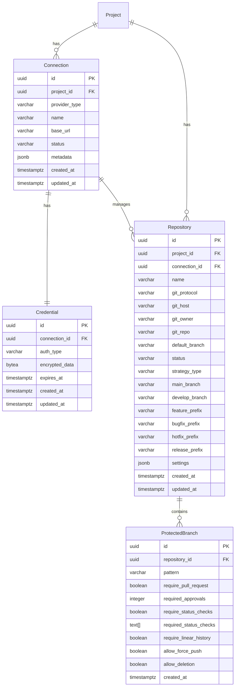

# Repository 도메인 모델

## 개요

Repository 도메인은 Git 저장소와 브랜치 전략을 관리하는 Aggregate Root다. Connection 도메인을 통해 연결된 VCS Provider(GitHub, GitLab, Bitbucket)의 저장소를 TPS 내부에 등록하고 브랜치 전략·보호 규칙을 관리한다. Connection 도메인은 외부 DevOps 서비스와의 연결 자체를 관리하며, Repository는 Connection에 의존한다.

---

## 전체 ERD



---

## Repository (Aggregate Root)

Repository는 도메인의 Aggregate Root다. GitUrl과 BranchStrategy는 Value Object이지만 MyBatis를 사용하기 때문에 개별 컬럼으로 flatten되어 저장된다. `settings`는 JSONB 타입으로 TypeHandler를 통해 직렬화된다.

```kotlin
class Repository(
    val projectId: UUID,
    val connectionId: UUID,
    var name: String,

    // GitUrl embedded fields (개별 컬럼으로 저장)
    val gitProtocol: String,
    val gitHost: String,
    val gitOwner: String,
    val gitRepo: String,

    var defaultBranch: String = "main",
    var status: RepositoryStatus = RepositoryStatus.ACTIVE,

    // BranchStrategy embedded fields (개별 컬럼으로 저장)
    var strategyType: BranchStrategyType = BranchStrategyType.GIT_FLOW,
    var mainBranch: String = "main",
    var developBranch: String? = "develop",
    var featurePrefix: String = "feature/",
    var bugfixPrefix: String = "bugfix/",
    var hotfixPrefix: String = "hotfix/",
    var releasePrefix: String = "release/",

    var settings: RepositorySettings = RepositorySettings(),  // JSONB

    val createdAt: Instant = Instant.now(),
    var updatedAt: Instant = Instant.now()
) : AggregateRoot()
```

### 주요 도메인 메서드

| 메서드 | 설명 |
|--------|------|
| `updateBranchStrategy(strategy)` | 브랜치 전략 변경 + BranchStrategyChangedEvent 등록 |
| `addProtectedBranch(pattern, rules)` | 보호 브랜치 추가 |
| `removeProtectedBranch(pattern)` | 보호 브랜치 제거 |
| `isBranchProtected(branchName)` | 브랜치 보호 여부 확인 (glob 패턴 지원) |
| `generateBranchName(ticket)` | 티켓 기반 브랜치명 자동 생성 |

---

## Value Objects

### GitUrl

URL 파싱 결과를 타입 안전하게 표현한다. HTTPS와 SSH URL을 모두 파싱할 수 있으며, DB에는 protocol/host/owner/repo 4개 컬럼으로 저장된다.

```kotlin
data class GitUrl(
    val protocol: String,  // "https" | "ssh"
    val host: String,      // "github.com"
    val owner: String,     // "my-org"
    val repo: String       // "backend-api"
) {
    val httpsUrl: String get() = "https://$host/$owner/$repo.git"
    val sshUrl: String   get() = "git@$host:$owner/$repo.git"
    val webUrl: String   get() = "https://$host/$owner/$repo"

    companion object {
        fun parse(url: String): GitUrl { /* HTTPS/SSH 정규식 파싱 */ }
    }
}
```

### BranchStrategy

브랜치 전략과 브랜치명 생성 규칙을 캡슐화한다. 세 가지 전략을 팩토리 메서드로 제공한다.

```kotlin
data class BranchStrategy(
    val type: BranchStrategyType = BranchStrategyType.GIT_FLOW,
    val mainBranch: String = "main",
    val developBranch: String? = "develop",
    val featurePrefix: String = "feature/",
    val bugfixPrefix: String = "bugfix/",
    val hotfixPrefix: String = "hotfix/",
    val releasePrefix: String = "release/"
) {
    fun generateBranchName(ticket: TicketReference): String
    fun getTargetBranch(branchType: BranchType): String

    companion object {
        fun gitFlow(): BranchStrategy     // main + develop + 4개 prefix
        fun githubFlow(): BranchStrategy  // main + feature/ 만
        fun trunkBased(): BranchStrategy  // main only
    }
}
```

| 전략 | mainBranch | developBranch | featurePrefix | 적합한 환경 |
|------|-----------|---------------|---------------|------------|
| GIT_FLOW | main | develop | feature/ | 릴리즈 주기 명확한 프로젝트 |
| GITHUB_FLOW | main | null | feature/ | 지속적 배포 환경 |
| TRUNK_BASED | main | null | "" (없음) | 단일 브랜치 중심 |

**브랜치명 생성 규칙**: `{prefix}{ticket.number}-{sanitized-title}`

- 티켓 타입 FEATURE/REFACTOR/DOCS → featurePrefix
- 티켓 타입 BUG → bugfixPrefix
- 티켓 타입 HOTFIX → hotfixPrefix
- title은 소문자 + 특수문자 하이픈 치환 + 30자 제한

### ProtectionRules

보호 브랜치에 적용할 규칙 모음이다. ProtectedBranch 엔티티의 개별 컬럼으로 저장된다.

```kotlin
data class ProtectionRules(
    val requirePullRequest: Boolean = true,
    val requiredApprovals: Int = 1,
    val requireStatusChecks: Boolean = true,
    val requiredStatusChecks: List<String> = listOf("build", "test"),  // text[]
    val requireLinearHistory: Boolean = false,
    val allowForcePush: Boolean = false,
    val allowDeletion: Boolean = false
)
```

### RepositorySettings

웹훅, CI/CD 연동 설정을 담는다. PostgreSQL JSONB 컬럼으로 저장되며 TypeHandler로 직렬화된다.

```kotlin
data class RepositorySettings(
    val enableWebhook: Boolean = true,
    val webhookEvents: List<String> = listOf("push", "pull_request", "create", "delete"),
    val autoSyncInterval: Duration = Duration.ofMinutes(5),
    val enableCIIntegration: Boolean = true,
    val ciConnectionId: UUID? = null,
    val enableCDIntegration: Boolean = false,
    val cdConnectionId: UUID? = null
)
```

---

## Connection (Aggregate Root)

Connection은 외부 DevOps 서비스와의 연결 자체를 관리한다. Repository는 `connectionId`를 통해 Connection을 참조한다. Repository가 존재하는 한 Connection 삭제는 RESTRICT된다.

```kotlin
class Connection(
    val projectId: UUID,
    val providerType: ProviderType,
    var name: String,
    var baseUrl: String,
    var status: ConnectionStatus = ConnectionStatus.PENDING,
    var metadata: ConnectionMetadata = ConnectionMetadata()
) : AggregateRoot() {
    @Transient var credential: Credential? = null

    fun activate()              // ACTIVE로 전환 + ConnectionActivatedEvent
    fun deactivate()            // INACTIVE로 전환
    fun markAsFailed(reason)    // FAILED 전환 + lastError 기록
    fun updateCredential(cred)  // 자격증명 갱신 + PENDING으로 롤백
}
```

### ProviderType

14개 프로바이더를 5개 카테고리로 분류한다.

| 카테고리 | ProviderType |
|---------|-------------|
| REPOSITORY | GITHUB, GITLAB, BITBUCKET |
| CI | JENKINS, GITHUB_ACTIONS, GITLAB_CI |
| DEPLOYMENT | KUBERNETES, ARGOCD, AWS_ECS |
| NOTIFICATION | SLACK, DISCORD, TEAMS |
| WORKFLOW | N8N |

### ConnectionStatus 전이

```
PENDING → TESTING → ACTIVE
                  → FAILED
ACTIVE → INACTIVE
ACTIVE → FAILED
INACTIVE → PENDING (재활성화)
```

---

## 데이터베이스 스키마

### repositories 테이블

```sql
CREATE TABLE repositories (
    id UUID PRIMARY KEY DEFAULT gen_random_uuid(),
    project_id UUID NOT NULL,
    connection_id UUID NOT NULL REFERENCES connections(id),
    name VARCHAR(255) NOT NULL,

    -- GitUrl (Value Object → 4개 컬럼)
    git_protocol VARCHAR(10) NOT NULL,
    git_host VARCHAR(255) NOT NULL,
    git_owner VARCHAR(255) NOT NULL,
    git_repo VARCHAR(255) NOT NULL,

    default_branch VARCHAR(100) NOT NULL DEFAULT 'main',
    status VARCHAR(20) NOT NULL DEFAULT 'ACTIVE',

    -- BranchStrategy (Value Object → 7개 컬럼)
    strategy_type VARCHAR(30) NOT NULL DEFAULT 'GIT_FLOW',
    main_branch VARCHAR(100) NOT NULL DEFAULT 'main',
    develop_branch VARCHAR(100) DEFAULT 'develop',
    feature_prefix VARCHAR(50) DEFAULT 'feature/',
    bugfix_prefix VARCHAR(50) DEFAULT 'bugfix/',
    hotfix_prefix VARCHAR(50) DEFAULT 'hotfix/',
    release_prefix VARCHAR(50) DEFAULT 'release/',

    settings JSONB DEFAULT '{}',

    created_at TIMESTAMP WITH TIME ZONE DEFAULT NOW(),
    updated_at TIMESTAMP WITH TIME ZONE DEFAULT NOW(),
    version BIGINT DEFAULT 0,

    CONSTRAINT uk_repository_project_name UNIQUE (project_id, name),
    CONSTRAINT uk_repository_url UNIQUE (git_host, git_owner, git_repo)
);

CREATE INDEX idx_repositories_project    ON repositories(project_id);
CREATE INDEX idx_repositories_connection ON repositories(connection_id);
CREATE INDEX idx_repositories_status     ON repositories(status);
CREATE INDEX idx_repositories_git_url    ON repositories(git_host, git_owner, git_repo);
```

### protected_branches 테이블

```sql
CREATE TABLE protected_branches (
    id UUID PRIMARY KEY DEFAULT gen_random_uuid(),
    repository_id UUID NOT NULL REFERENCES repositories(id) ON DELETE CASCADE,
    pattern VARCHAR(255) NOT NULL,

    -- ProtectionRules (Value Object → 7개 컬럼)
    require_pull_request BOOLEAN DEFAULT true,
    required_approvals INTEGER DEFAULT 1,
    require_status_checks BOOLEAN DEFAULT true,
    required_status_checks TEXT[] DEFAULT ARRAY['build', 'test'],
    require_linear_history BOOLEAN DEFAULT false,
    allow_force_push BOOLEAN DEFAULT false,
    allow_deletion BOOLEAN DEFAULT false,

    created_at TIMESTAMP WITH TIME ZONE DEFAULT NOW(),

    CONSTRAINT uk_protected_branch UNIQUE (repository_id, pattern)
);
```

### connections / credentials 테이블

```sql
CREATE TABLE connections (
    id UUID PRIMARY KEY DEFAULT gen_random_uuid(),
    project_id UUID NOT NULL,
    provider_type VARCHAR(50) NOT NULL,
    name VARCHAR(255) NOT NULL,
    base_url VARCHAR(500) NOT NULL,
    status VARCHAR(20) NOT NULL DEFAULT 'PENDING',
    metadata JSONB DEFAULT '{}',
    created_at TIMESTAMP WITH TIME ZONE DEFAULT NOW(),
    updated_at TIMESTAMP WITH TIME ZONE DEFAULT NOW(),
    version BIGINT DEFAULT 0,
    CONSTRAINT uk_connection_project_name UNIQUE (project_id, name)
);

CREATE TABLE credentials (
    id UUID PRIMARY KEY DEFAULT gen_random_uuid(),
    connection_id UUID NOT NULL REFERENCES connections(id) ON DELETE CASCADE,
    auth_type VARCHAR(50) NOT NULL,  -- PERSONAL_ACCESS_TOKEN, OAUTH2, API_KEY ...
    encrypted_data BYTEA NOT NULL,
    expires_at TIMESTAMP WITH TIME ZONE,
    created_at TIMESTAMP WITH TIME ZONE DEFAULT NOW(),
    updated_at TIMESTAMP WITH TIME ZONE DEFAULT NOW(),
    CONSTRAINT uk_credential_connection UNIQUE (connection_id)
);

CREATE INDEX idx_connections_project  ON connections(project_id);
CREATE INDEX idx_connections_provider ON connections(provider_type);
CREATE INDEX idx_connections_status   ON connections(status);
```

---

## TypeHandler

MyBatis는 JSONB와 text[] 타입을 기본으로 지원하지 않으므로 TypeHandler를 직접 구현한다.

| TypeHandler | 대상 컬럼 | 변환 |
|-------------|---------|------|
| `RepositorySettingsTypeHandler` | `repositories.settings` (JSONB) | `RepositorySettings` ↔ JSON 문자열 |
| `ConnectionMetadataTypeHandler` | `connections.metadata` (JSONB) | `ConnectionMetadata` ↔ JSON 문자열 |
| `StringListTypeHandler` | `protected_branches.required_status_checks` (text[]) | `List<String>` ↔ PostgreSQL 배열 |

JSONB TypeHandler는 `ps.setObject(i, json, Types.OTHER)`로 PostgreSQL에 전달하고, 조회 시 `rs.getString(columnName)`으로 읽어 ObjectMapper로 역직렬화한다.

---

## 도메인 이벤트

```kotlin
sealed class RepositoryEvent : DomainEvent(aggregateType = "Repository")

class RepositoryRegisteredEvent(
    aggregateId: UUID,
    val projectId: UUID,
    val name: String,
    val gitUrl: GitUrl
) : RepositoryEvent()

class BranchStrategyChangedEvent(
    aggregateId: UUID,
    val strategy: BranchStrategy
) : RepositoryEvent()

class ProtectedBranchAddedEvent(
    aggregateId: UUID,
    val pattern: String,
    val rules: ProtectionRules
) : RepositoryEvent()
```

```kotlin
sealed class ConnectionEvent : DomainEvent(aggregateType = "Connection")

class ConnectionCreatedEvent(aggregateId: UUID, val projectId: UUID,
    val providerType: ProviderType, val name: String) : ConnectionEvent()
class ConnectionActivatedEvent(aggregateId: UUID, val providerType: ProviderType,
    val projectId: UUID) : ConnectionEvent()
class ConnectionFailedEvent(aggregateId: UUID, val projectId: UUID,
    val reason: String) : ConnectionEvent()
```

---

## 삭제 정책

| 엔티티 | 삭제 전략 | 비고 |
|--------|---------|------|
| Connection | RESTRICT | Repository가 참조 중이면 삭제 불가 |
| Repository | Soft Delete (status = DELETED) | 물리 삭제 금지 |
| ProtectedBranch | CASCADE DELETE | Repository 삭제 시 자동 삭제 |
| Credential | CASCADE DELETE | Connection 삭제 시 자동 삭제 |

---

## 인프라 계층 구조

```
infrastructure/persistence/mybatis/
├── mapper/
│   ├── RepositoryDbMapper.kt       # @Mapper, SQL 어노테이션
│   ├── ProtectedBranchDbMapper.kt
│   ├── ConnectionDbMapper.kt
│   └── CredentialDbMapper.kt
├── adapter/
│   ├── RepositoryRepositoryAdapter.kt  # Domain Port 구현
│   ├── ProtectedBranchRepositoryAdapter.kt
│   ├── ConnectionRepositoryAdapter.kt
│   └── CredentialRepositoryAdapter.kt
└── typehandler/
    ├── RepositorySettingsTypeHandler.kt  # JSONB
    ├── ConnectionMetadataTypeHandler.kt  # JSONB
    └── StringListTypeHandler.kt          # text[]
```

Adapter는 Mapper를 주입받아 Domain Repository 인터페이스(Port)를 구현한다. `findById` 호출 시 ProtectedBranch와 Credential을 후속 조회하여 Aggregate를 완성한다.

---

## 관련 문서

- [Repository API 설계](./api-design.md)
- [Repository 유스케이스 모델](./usecase-model.md)
- [Repository 구현 리뷰](./review.md)
- [아키텍처 개요](../Architecture/overview.md)
- [Phase 1 요약](../Architecture/phase1-summary.md)
