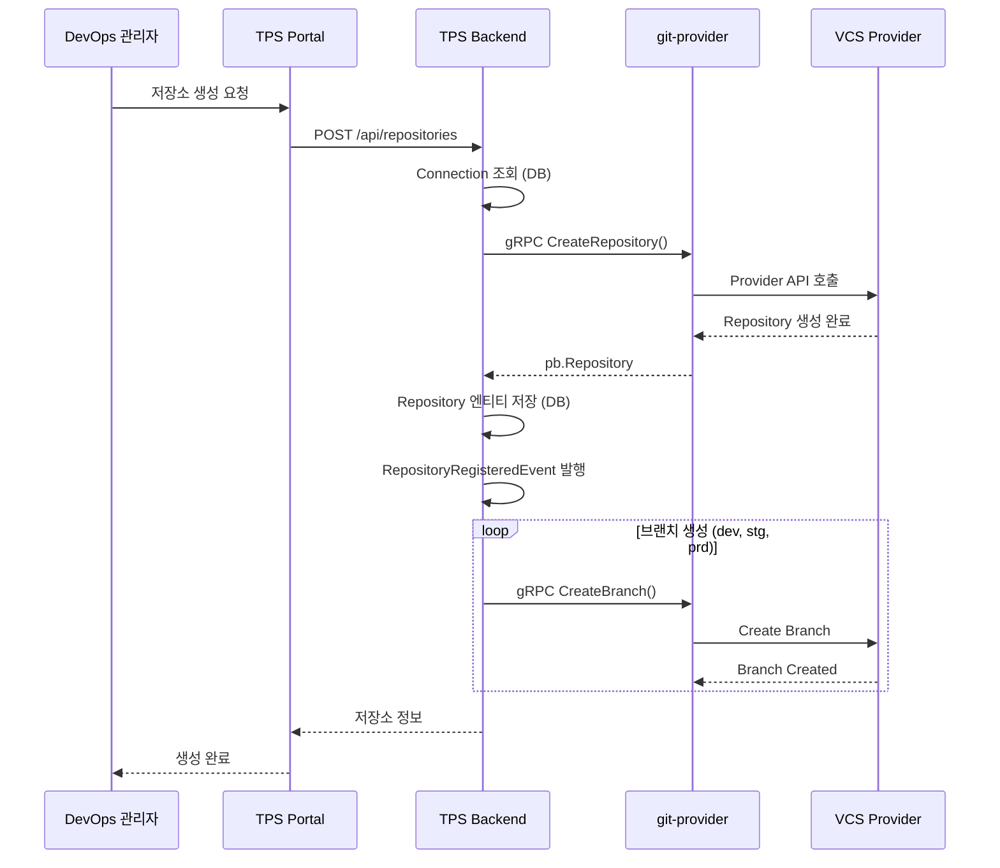
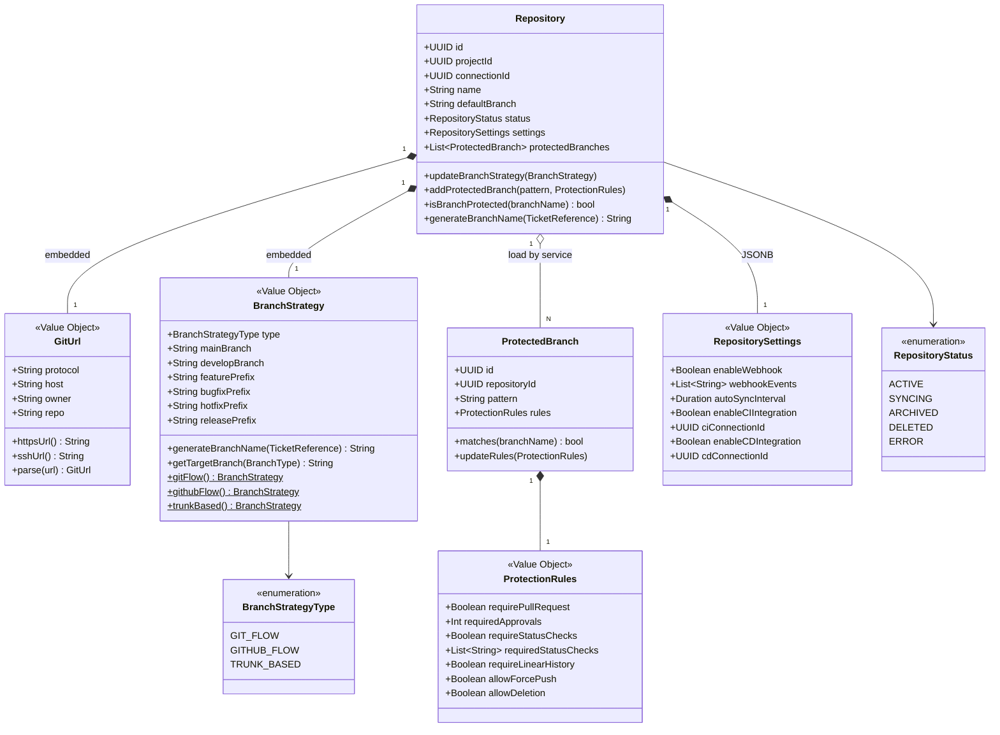
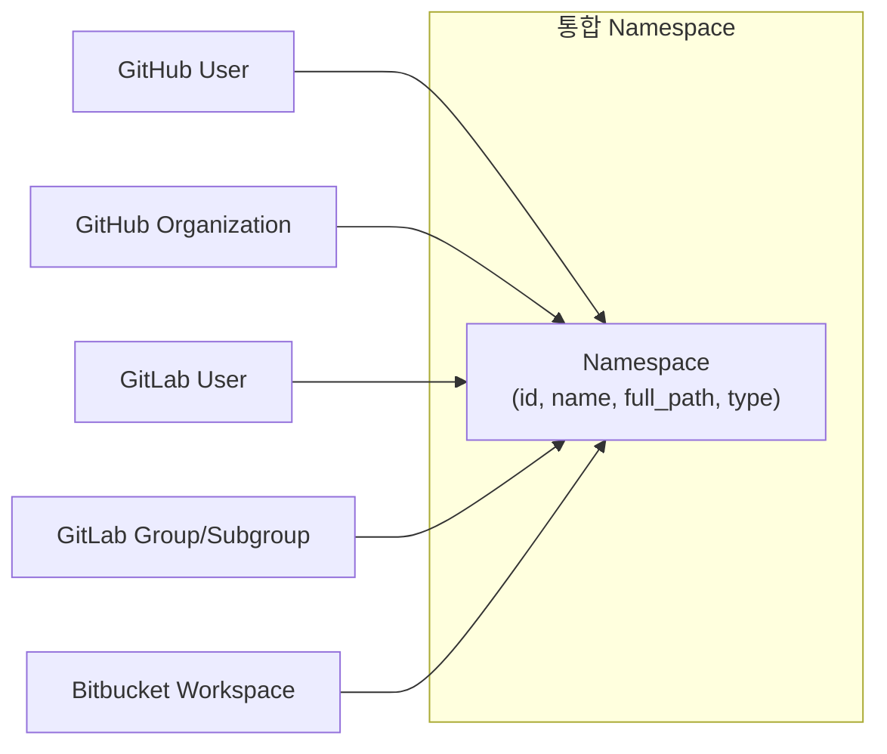
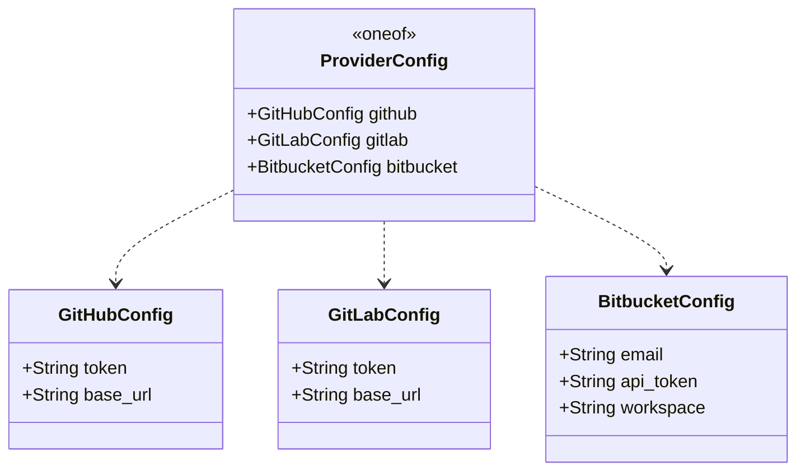

# Repository 유스케이스 모델

## 개요

Repository 도메인은 멀티 프로바이더 환경에서 Git 저장소를 생성·조회·삭제하고, 브랜치 전략을 관리하는 유스케이스를 담당한다. git-provider(Go) 서비스가 외부 VCS API를 추상화하고, TPS-API(Kotlin)가 내부 도메인 엔티티로 영속화한다.

---

## 액터

| 액터 | 역할 |
|------|------|
| DevOps 관리자 | 저장소 등록, 브랜치 전략 설정, 보호 브랜치 관리 |
| TPS Backend (시스템) | git-provider gRPC 호출, 도메인 이벤트 발행 |
| git-provider (시스템) | Provider API 추상화, 통합 응답 변환 |

---

## 유스케이스 목록

| ID | 유스케이스 | 액터 | 관련 RPC |
|----|----------|------|---------|
| UC-R01 | 저장소 생성 | DevOps 관리자 | CreateRepository |
| UC-R02 | 저장소 목록 조회 | DevOps 관리자 | ListRepositories |
| UC-R03 | 저장소 상세 조회 | DevOps 관리자 | GetRepository |
| UC-R04 | 저장소 삭제 | DevOps 관리자 | DeleteRepository |
| UC-R05 | 브랜치 전략 설정 | DevOps 관리자 | 내부 도메인 |
| UC-R06 | 보호 브랜치 관리 | DevOps 관리자 | 내부 도메인 |
| UC-R07 | 브랜치명 자동 생성 | TPS Backend | 내부 도메인 |

---

## UC-R01: 저장소 생성

**목표**: GitHub/GitLab/Bitbucket에 저장소를 생성하고 TPS에 등록한다.

**사전 조건**:
- 활성 상태(ACTIVE)인 Connection이 존재해야 한다.
- 동일 project + name 조합의 Repository가 없어야 한다.

**주요 흐름**:



**대안 흐름**:
- 저장소명 중복: `ALREADY_EXISTS` 반환
- Connection 비활성: `FAILED_PRECONDITION` 반환
- Provider 인증 실패: `UNAUTHENTICATED` 반환

---

## UC-R05: 브랜치 전략 설정

**목표**: 저장소에 적용할 브랜치 전략(GIT_FLOW, GITHUB_FLOW, TRUNK_BASED)을 설정한다.

**지원 전략**:

| 전략 | 설명 | 브랜치 구성 |
|------|------|------------|
| GIT_FLOW | 릴리즈 주기가 명확한 프로젝트 | main, develop, feature/, release/, hotfix/ |
| GITHUB_FLOW | 지속적 배포 환경 | main, feature/ |
| TRUNK_BASED | 단일 브랜치 중심, 짧은 수명 feature | main |

**브랜치명 자동 생성 규칙**:

```
{prefix}{ticket-number}-{sanitized-title}
예시: feature/RH-123-add-user-authentication
```

티켓 타입에 따라 prefix가 결정된다. FEATURE/REFACTOR/DOCS는 `featurePrefix`, BUG는 `bugfixPrefix`, HOTFIX는 `hotfixPrefix`를 사용한다.

---

## UC-R06: 보호 브랜치 관리

**목표**: 저장소의 주요 브랜치(main, develop)에 보호 규칙을 적용한다.

**보호 규칙 구성**:

| 규칙 | 기본값 | 설명 |
|------|--------|------|
| `requirePullRequest` | true | PR 없이 직접 푸시 금지 |
| `requiredApprovals` | 1 | 최소 승인자 수 |
| `requireStatusChecks` | true | CI 체크 통과 필수 |
| `requiredStatusChecks` | ["build", "test"] | 필수 체크 목록 |
| `requireLinearHistory` | false | 선형 히스토리 강제 |
| `allowForcePush` | false | Force push 허용 여부 |
| `allowDeletion` | false | 브랜치 삭제 허용 여부 |

**자동 설정**: `registerRepository()` 호출 시 `main`과 `develop`(GIT_FLOW) 브랜치에 기본 보호 규칙이 자동으로 적용된다.

---

## 도메인 모델

### 클래스 다이어그램



### 도메인 이벤트

| 이벤트 | 발생 조건 | 포함 데이터 |
|--------|---------|-----------|
| `RepositoryRegisteredEvent` | 저장소 등록 완료 | repositoryId, projectId, name, gitUrl |
| `BranchStrategyChangedEvent` | 브랜치 전략 변경 | repositoryId, strategy |
| `ProtectedBranchAddedEvent` | 보호 브랜치 추가 | repositoryId, pattern, rules |

---

## Namespace 통합 모델

각 프로바이더의 소유자 개념을 통합 Namespace로 표현한다.



| NamespaceType | GitHub | GitLab | Bitbucket |
|---------------|--------|--------|-----------|
| USER | User | User | - |
| ORGANIZATION | Organization | - | - |
| GROUP | - | Group / Subgroup | - |
| WORKSPACE | - | - | Workspace |

---

## ProviderConfig oneof 구조

저장소 생성 요청에는 프로바이더별 인증 정보가 oneof로 포함된다.



---

## 관련 문서

- [Repository API 설계](./api-design.md)
- [Repository 구현 리뷰](./review.md)
- [Repository 도메인 모델](./domain-model.md)
- [Provider 유스케이스 모델](../Provider/usecase-model.md)
