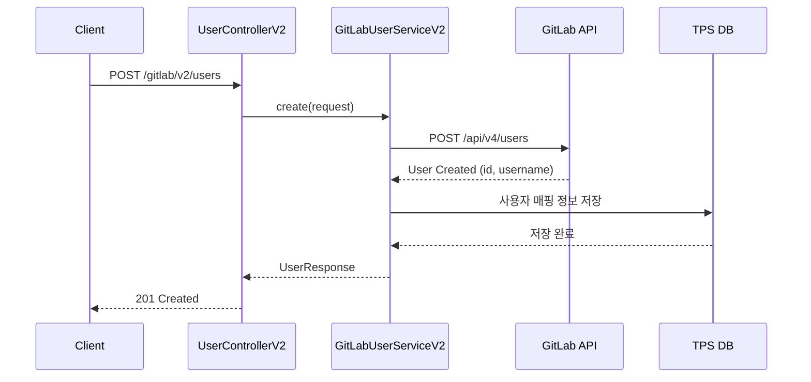
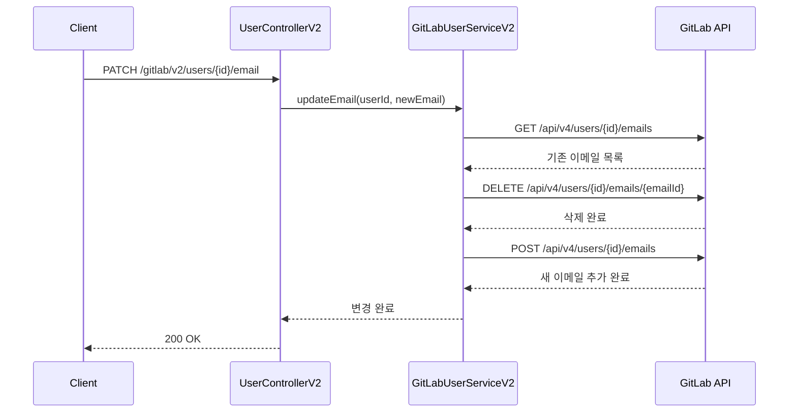

# User API - 사용자 관리

GitLab 사용자 관리를 위한 API입니다.

## 목적

TPS 시스템과 GitLab 간의 사용자 정보를 동기화하고 통합 관리합니다.

| 핵심 기능 | 설명 |
|----------|------|
| **사용자 동기화** | TPS 사용자 정보를 GitLab과 자동 동기화 |
| **상태 관리** | 사용자 활성화/비활성화/차단 상태 제어 |
| **업무코드 매핑** | 사용자를 업무코드(taskCd) 기반으로 그룹핑 |
| **이메일 관리** | 사용자 이메일 추가/변경/삭제 |

## 시퀀스 다이어그램

### 사용자 생성

### 사용자 이메일 변경

## 호출하는 GitLab API

| Method | Endpoint | 설명 |
|--------|----------|------|
| GET | `/api/v4/users` | 전체 사용자 조회 |
| GET | `/api/v4/users/{id}` | 사용자 조회 |
| POST | `/api/v4/users` | 사용자 생성 |
| PUT | `/api/v4/users/{id}` | 사용자 수정 |
| DELETE | `/api/v4/users/{id}` | 사용자 삭제 |
| POST | `/api/v4/users/{id}/block` | 사용자 차단 |
| POST | `/api/v4/users/{id}/unblock` | 사용자 차단 해제 |
| POST | `/api/v4/users/{id}/deactivate` | 사용자 비활성화 |
| POST | `/api/v4/users/{id}/activate` | 사용자 활성화 |

## 제공하는 외부 API

| Method | Endpoint | 설명 |
|--------|----------|------|
| POST | `/gitlab/v2/select_user` | 사용자 페이지네이션 조회 |
| POST | `/gitlab/v2/select_user/tlId` | 툴아이디별 사용자 조회 |
| POST | `/gitlab/v2/users` | 사용자 생성 |
| PATCH | `/gitlab/v2/users/{targetUserId}/email` | 사용자 이메일 변경 |
| PATCH | `/gitlab/v2/users/{targetUserId}/tasks` | 사용자 업무코드 변경 |
| POST | `/gitlab/v2/users/delete` | 사용자 삭제 |

## 참고사항

- 사용자 생성 시 TPS 내부 DB와 GitLab 동시 관리
- 이메일 변경 시 기존 이메일 삭제 후 새 이메일 추가
- 업무코드(taskCd) 기반 사용자 그룹핑 지원
