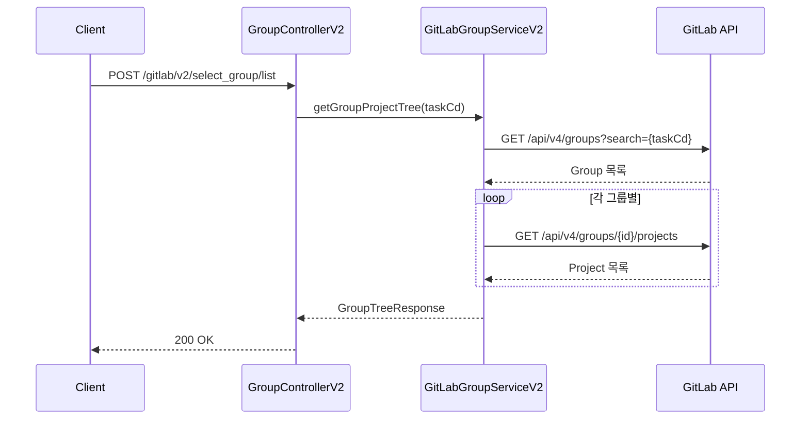

# Group API - 그룹 관리

GitLab 그룹 관리를 위한 API입니다.

## 목적

TPS 업무코드(taskCd) 기반의 조직 구조를 GitLab 그룹과 매핑하여 프로젝트 및 접근 권한을 체계적으로 관리합니다.

| 핵심 기능 | 설명 |
|----------|------|
| **조직 구조 매핑** | TPS 업무코드를 GitLab 그룹으로 매핑 |
| **멤버십 관리** | 그룹별 사용자 권한 부여 및 제거 |
| **프로젝트 그룹핑** | 그룹 하위 프로젝트 트리 구조 관리 |

## 시퀀스 다이어그램

### 그룹 프로젝트 트리 조회

## 호출하는 GitLab API

| Method | Endpoint | 설명 |
|--------|----------|------|
| GET | `/api/v4/groups` | 전체 그룹 조회 |
| GET | `/api/v4/groups/{id}` | 그룹 조회 |
| POST | `/api/v4/groups` | 그룹 생성 |
| DELETE | `/api/v4/groups/{id}` | 그룹 삭제 |
| GET | `/api/v4/groups/{id}/projects` | 그룹별 프로젝트 조회 |
| POST | `/api/v4/groups/{id}/members` | 그룹 멤버 추가 |
| DELETE | `/api/v4/groups/{id}/members/{userId}` | 그룹 멤버 삭제 |

## 제공하는 외부 API

| Method | Endpoint | 설명 |
|--------|----------|------|
| POST | `/gitlab/v2/select_group` | 그룹 페이지네이션 조회 |
| POST | `/gitlab/v2/select_group/list` | 그룹 프로젝트 트리 조회 |
| POST | `/gitlab/v2/create_group/user` | 그룹 멤버 추가 |
| POST | `/gitlab/v2/delete_group/users` | 그룹 멤버 삭제 |

## Access Level

| Level | 역할 | 권한 |
|-------|------|------|
| 10 | Guest | 이슈 조회 |
| 20 | Reporter | 코드 조회, 이슈 생성 |
| 30 | Developer | 코드 푸시, MR 생성 |
| 40 | Maintainer | 브랜치 보호, 멤버 관리 |
| 50 | Owner | 그룹 설정, 삭제 |
