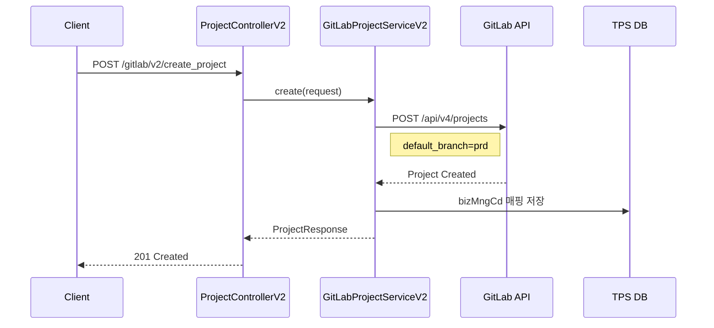

# Project API - 프로젝트/저장소 관리

GitLab 프로젝트(저장소) 관리를 위한 API입니다.

## 목적

TPS 업무관리코드(bizMngCd)와 GitLab 프로젝트를 매핑하여 소스 코드 저장소를 체계적으로 관리합니다.

| 핵심 기능 | 설명 |
|----------|------|
| **저장소 생성** | 업무별 Git 저장소 자동 생성 및 초기화 |
| **멤버 관리** | 프로젝트별 개발자 권한 부여 |
| **업무코드 매핑** | bizMngCd 기반 프로젝트 식별 및 조회 |

## 시퀀스 다이어그램

### 프로젝트 생성

## 호출하는 GitLab API

| Method | Endpoint | 설명 |
|--------|----------|------|
| GET | `/api/v4/projects` | 전체 프로젝트 조회 |
| GET | `/api/v4/projects/{id}` | 프로젝트 조회 |
| POST | `/api/v4/projects` | 프로젝트 생성 |
| PUT | `/api/v4/projects/{id}` | 프로젝트 수정 |
| DELETE | `/api/v4/projects/{id}` | 프로젝트 삭제 |
| POST | `/api/v4/projects/{id}/members` | 프로젝트 멤버 추가 |
| DELETE | `/api/v4/projects/{id}/members/{userId}` | 프로젝트 멤버 삭제 |

## 제공하는 외부 API

| Method | Endpoint | 설명 |
|--------|----------|------|
| POST | `/gitlab/v2/select_project` | 프로젝트 페이지네이션 조회 |
| GET | `/gitlab/v2/taskCd/{taskCd}/projects` | 업무코드별 프로젝트 조회 |
| POST | `/gitlab/v2/create_project` | 프로젝트 생성 |
| POST | `/gitlab/v2/update_project` | 프로젝트 수정 |
| POST | `/gitlab/v2/delete_projects` | 프로젝트 삭제 |
| POST | `/gitlab/v2/create_project/user` | 프로젝트 사용자 추가 |

## 참고사항

- 프로젝트 생성 시 기본 브랜치는 `prd`로 설정
- 삭제 시 연관된 모든 데이터도 함께 삭제됨
