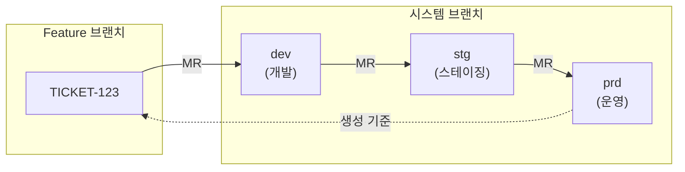

# Branch API - 브랜치 관리

GitLab 브랜치 관리를 위한 API입니다.

## 목적

TPS 티켓 기반 개발 흐름(dev → stg → prd)을 지원하기 위한 브랜치 생성, 보호, 관리 기능을 제공합니다.

| 핵심 기능 | 설명 |
|----------|------|
| **티켓 브랜치 생성** | 티켓 번호 기반 feature 브랜치 자동 생성 |
| **브랜치 보호** | 시스템 브랜치(dev/stg/prd) 보호 설정 |
| **배포 흐름 지원** | dev → stg → prd 순차 배포 구조 |

## 시퀀스 다이어그램

### TPS 브랜치 전략

## 호출하는 GitLab API

| Method | Endpoint | 설명 |
|--------|----------|------|
| GET | `/api/v4/projects/{id}/repository/branches` | 브랜치 목록 조회 |
| POST | `/api/v4/projects/{id}/repository/branches` | 브랜치 생성 |
| DELETE | `/api/v4/projects/{id}/repository/branches/{branch}` | 브랜치 삭제 |
| POST | `/api/v4/projects/{id}/protected_branches` | 브랜치 Protected 설정 |
| DELETE | `/api/v4/projects/{id}/protected_branches/{branch}` | 브랜치 Unprotect |

## 시스템 브랜치

| 브랜치 | 용도 | 설명 |
|--------|------|------|
| `dev` | 개발 | 개발 환경 배포용 |
| `stg` | 스테이징 | QA/테스트 환경용 |
| `prd` | 운영 | 운영 환경 배포용 (기본 브랜치) |
