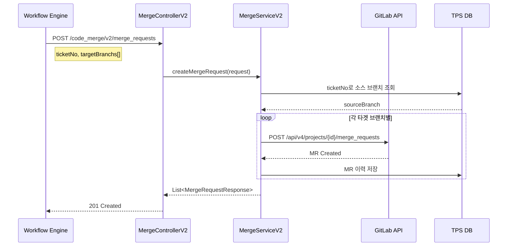
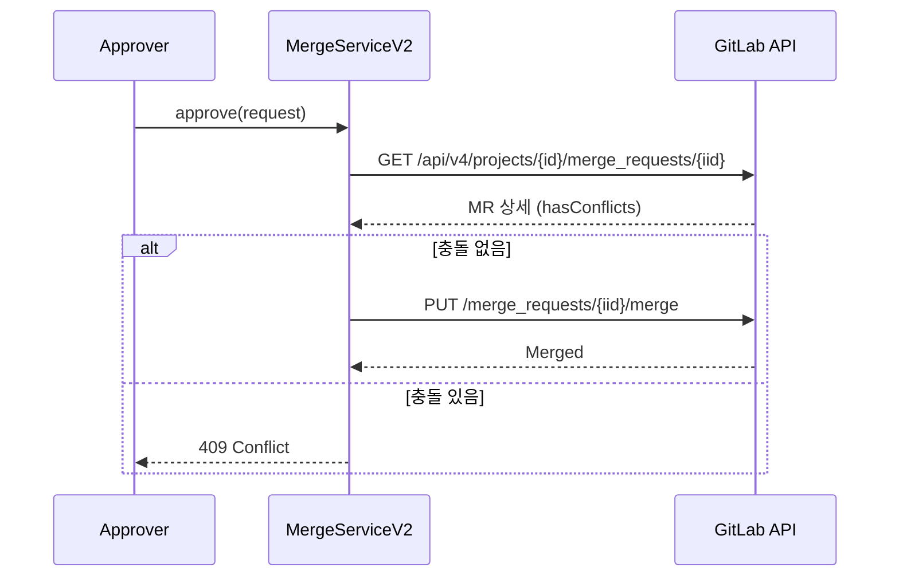

# Merge API - 병합 요청 관리

GitLab Merge Request(MR) 관리를 위한 API입니다.

## 목적

TPS 티켓 기반 코드 변경을 시스템 브랜치(dev → stg → prd)로 순차 병합하여 배포 파이프라인을 자동화합니다.

| 핵심 기능 | 설명 |
|----------|------|
| **티켓 기반 MR** | 티켓 번호로 소스 브랜치 자동 매핑 |
| **다중 타겟 지원** | 하나의 요청으로 dev/stg/prd 동시 MR 생성 |
| **충돌 관리** | 충돌 감지 및 Rebase 지원 |
| **Squash Merge** | 커밋 압축 병합으로 히스토리 정리 |

## 시퀀스 다이어그램

### 병합 요청 생성

### 병합 승인

## 호출하는 GitLab API

| Method | Endpoint | 설명 |
|--------|----------|------|
| GET | `/api/v4/projects/{id}/merge_requests` | 병합 요청 목록 |
| POST | `/api/v4/projects/{id}/merge_requests` | 병합 요청 생성 |
| PUT | `/api/v4/projects/{id}/merge_requests/{iid}/merge` | 병합 승인/실행 |
| DELETE | `/api/v4/projects/{id}/merge_requests/{iid}` | 병합 요청 삭제 |

## 제공하는 외부 API

| Method | Endpoint | 설명 |
|--------|----------|------|
| GET | `/code_merge/v2/merge_requests` | 병합 요청 목록 조회 |
| POST | `/code_merge/v2/merge_requests` | 병합 요청 생성 |
| POST | `/code_merge/v2/merge_requests/approve` | 병합 승인 |
| POST | `/code_merge/v2/merge_requests/revert` | 병합 취소 |

## Merge Status

| 상태 | 설명 |
|------|------|
| `can_be_merged` | 머지 가능 |
| `cannot_be_merged` | 충돌 있음 |
| `checking` | 확인 중 |
