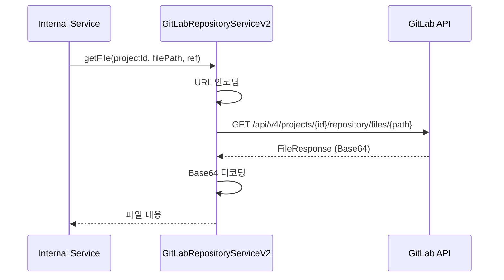

# Repository API - 저장소 파일 관리

GitLab 저장소 파일/트리 관리를 위한 API입니다.

## 목적

GitLab 저장소의 파일 및 디렉토리 구조를 조회하고, 파일 내용을 읽고 쓰는 기능을 제공합니다.

| 핵심 기능 | 설명 |
|----------|------|
| **트리 탐색** | 저장소 디렉토리 구조 계층적 조회 |
| **파일 조회** | 특정 브랜치/커밋의 파일 내용 조회 |
| **파일 편집** | API를 통한 파일 생성/수정/삭제 |

## 시퀀스 다이어그램

### 파일 내용 조회

## 호출하는 GitLab API

| Method | Endpoint | 설명 |
|--------|----------|------|
| GET | `/api/v4/projects/{id}/repository/tree` | 저장소 트리 조회 |
| GET | `/api/v4/projects/{id}/repository/files/{filePath}` | 파일 조회 |
| GET | `/api/v4/projects/{id}/repository/files/{filePath}/raw` | 파일 원본 조회 |
| POST | `/api/v4/projects/{id}/repository/files/{path}` | 파일 생성 |
| PUT | `/api/v4/projects/{id}/repository/files/{path}` | 파일 수정 |
| DELETE | `/api/v4/projects/{id}/repository/files/{path}` | 파일 삭제 |

## 파일 경로 인코딩

| 문자 | 인코딩 |
|------|--------|
| `/` | `%2F` |
| `.` | `%2E` |

## 참고사항

- 파일 내용은 Base64 인코딩으로 전송/수신
- 대용량 파일은 raw 엔드포인트 사용 권장
