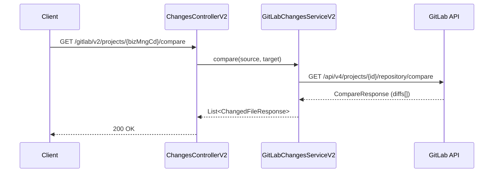
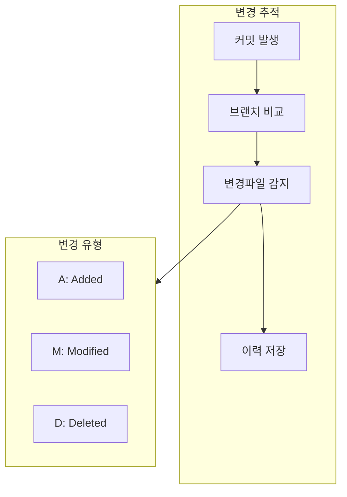

# Changes API - 커밋/변경사항 추적

커밋 이력 및 변경파일 추적을 위한 API입니다.

## 목적

TPS 티켓 및 워크플로우와 연계하여 코드 변경사항을 추적하고, 변경 프로그램 목록을 관리합니다.

| 핵심 기능 | 설명 |
|----------|------|
| **변경 추적** | 브랜치 간 diff를 통한 변경파일 식별 |
| **이력 관리** | 티켓/워크플로우 기반 변경 이력 저장 |
| **롤백 지원** | 워크플로우 실행번호 기반 롤백 처리 |

## 시퀀스 다이어그램

### 브랜치 비교 (Compare)

### 변경 추적 흐름

## 호출하는 GitLab API

| Method | Endpoint | 설명 |
|--------|----------|------|
| GET | `/api/v4/projects/{id}/repository/commits` | 커밋 목록 |
| GET | `/api/v4/projects/{id}/repository/commits/{sha}/diff` | 커밋 diff |
| GET | `/api/v4/projects/{id}/repository/compare` | 브랜치 비교 |

## 제공하는 외부 API

| Method | Endpoint | 설명 |
|--------|----------|------|
| POST | `/gitlab/v2/select/changed_files` | 변경파일 목록 |
| POST | `/gitlab/v2/create/changed_files` | 변경파일 이력 등록 |
| POST | `/gitlab/v2/rollback/changed_files/{wrkflwExcnNo}` | 롤백 동기화 |
| GET | `/gitlab/v2/projects/{bizMngCd}/compare` | 변경 프로그램 목록 |

## Change Type

| 타입 | 설명 |
|------|------|
| `A` | Added - 새 파일 추가 |
| `M` | Modified - 파일 수정 |
| `D` | Deleted - 파일 삭제 |
| `R` | Renamed - 파일명 변경 |
