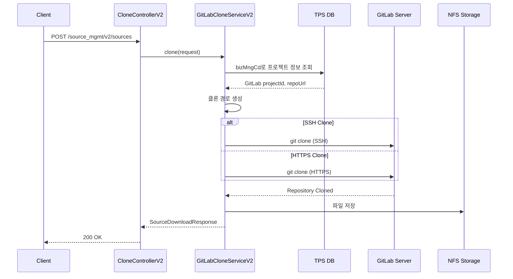
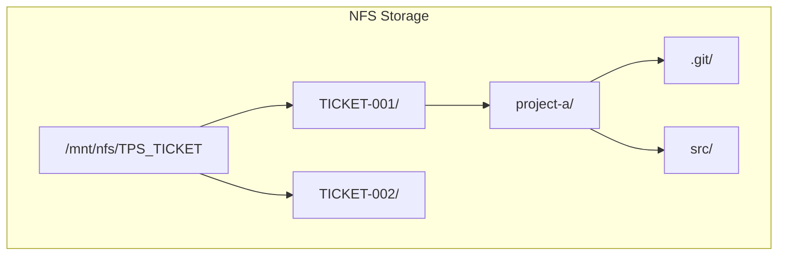

# Clone API - 소스 클론/다운로드

소스 코드 클론 및 다운로드를 위한 API입니다.

## 목적

TPS 티켓 작업을 위해 GitLab 저장소 소스 코드를 로컬/공유 스토리지에 클론하여 빌드 및 배포 환경을 준비합니다.

| 핵심 기능 | 설명 |
|----------|------|
| **티켓별 클론** | 티켓 번호 기반 독립적인 작업 디렉토리 생성 |
| **SSH/HTTPS 지원** | 환경에 따른 인증 방식 선택 |
| **NFS 스토리지** | 공유 스토리지를 통한 분산 환경 지원 |

## 시퀀스 다이어그램

### 소스 다운로드 (Clone)



### 디렉토리 구조



## 제공하는 외부 API

| Method | Endpoint | 설명 |
|--------|----------|------|
| POST | `/source_mgmt/v2/sources` | 소스 다운로드 (Clone) |
| DELETE | `/source_mgmt/v2/sources/{ticketNo}` | 소스 삭제 |

## 설정

```yaml
clone:
  base-path: /mnt/nfs/TPS_TICKET    # 프로덕션
```

## 시스템 브랜치

| 브랜치 | 용도 |
|--------|------|
| `dev` | 개발 환경용 |
| `stg` | QA/테스트 환경용 |
| `prd` | 운영 환경용 (기본값) |
