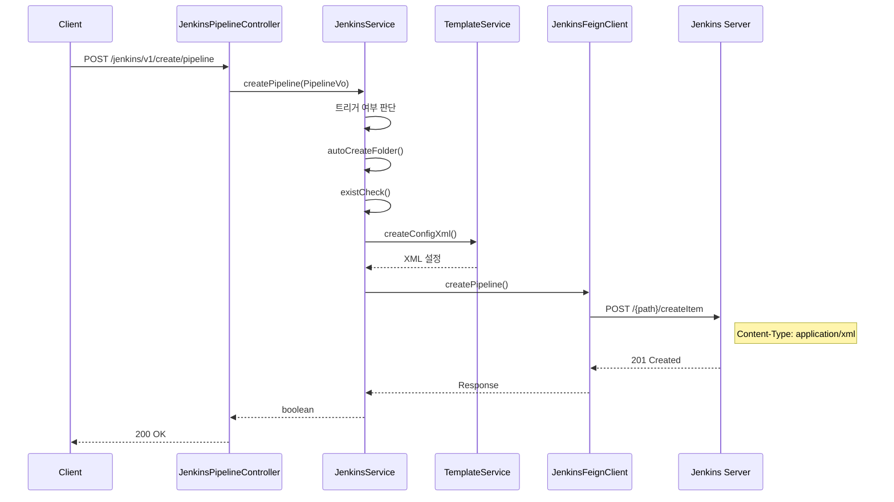
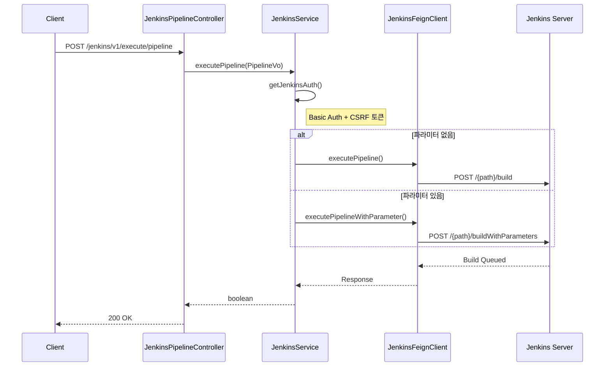
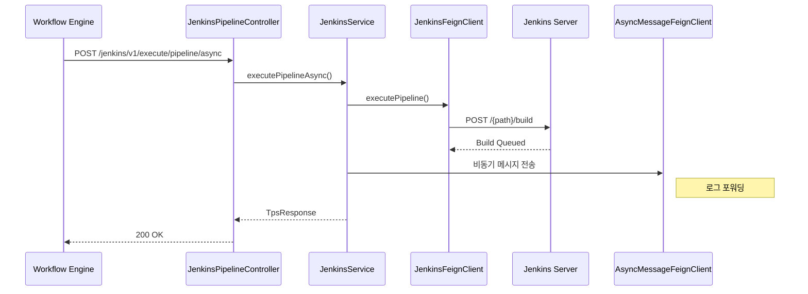
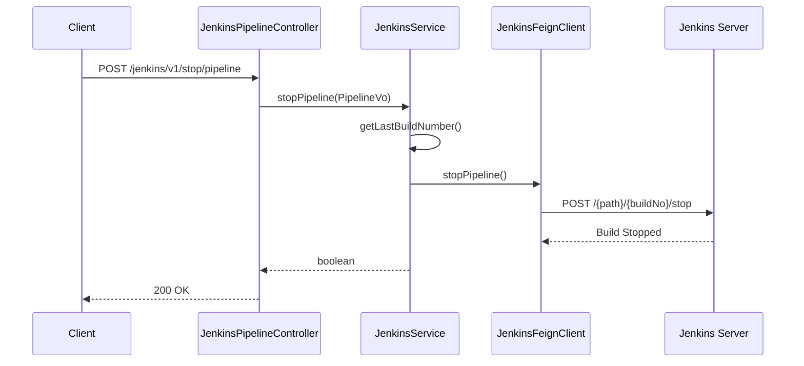
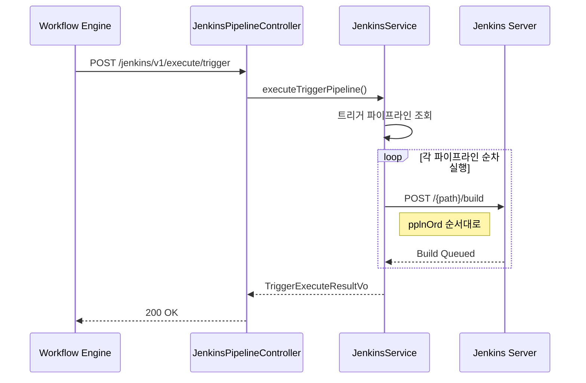

# Pipeline API - 파이프라인 관리

Jenkins 파이프라인(Job) CRUD, 실행, 중지, 검증을 위한 API입니다.

## 목적

TPS 워크플로우와 연계하여 Jenkins 파이프라인의 전체 생명주기를 관리합니다.

| 핵심 기능 | 설명 |
|----------|------|
| **파이프라인 CRUD** | Job 생성/수정/삭제 |
| **실행 제어** | 동기/비동기 실행, 중지 |
| **스크립트 검증** | Groovy 스크립트 문법 검사 |
| **트리거** | 다중 파이프라인 순차 실행 |

## 시퀀스 다이어그램

### 파이프라인 생성



### 파이프라인 실행 (동기)



### 파이프라인 실행 (비동기)



### 파이프라인 중지



### 트리거 실행 (다중 파이프라인)



## 호출하는 Jenkins API

| Method | Endpoint | 설명 |
|--------|----------|------|
| GET | `/crumbIssuer/api/json` | CSRF 토큰 획득 |
| GET | `/{path}/api/json` | 파이프라인 정보 조회 |
| GET | `/{path}/lastBuild/buildNumber` | 마지막 빌드 번호 |
| GET | `/{path}/config.xml` | 파이프라인 스크립트 조회 |
| POST | `/{path}/createItem` | 파이프라인 생성 |
| POST | `/{path}/config.xml` | 파이프라인 수정 |
| POST | `/{path}/doDelete` | 파이프라인 삭제 |
| POST | `/{path}/build` | 파이프라인 실행 |
| POST | `/{path}/buildWithParameters` | 파라미터 포함 실행 |
| POST | `/{path}/{buildNo}/stop` | 빌드 중지 |
| POST | `/{path}/descriptorByName/.../checkScriptCompile` | 스크립트 검증 |

## 제공하는 외부 API

| Method | Endpoint | 설명 |
|--------|----------|------|
| POST | `/jenkins/v1/create/pipeline` | 파이프라인 생성 |
| PUT | `/jenkins/v1/update/pipeline` | 파이프라인 수정 |
| DELETE | `/jenkins/v1/delete/pipeline` | 파이프라인 삭제 |
| POST | `/jenkins/v1/execute/pipeline` | 파이프라인 실행 (동기) |
| POST | `/jenkins/v1/execute/pipeline/async` | 파이프라인 실행 (비동기) |
| POST | `/jenkins/v1/stop/pipeline` | 파이프라인 중지 |
| POST | `/jenkins/v1/validate/pipeline` | 스크립트 검증 |
| POST | `/jenkins/v1/upsert/trigger` | 트리거 생성/수정 |
| POST | `/jenkins/v1/execute/trigger` | 트리거 실행 |
| POST | `/jenkins/v1/get/pipeline/last/status` | 최근 실행 상태 |

## 주요 DTO

### PipelineVo

```java
public class PipelineVo {
    PipelineStructVo pipelineStructVo;    // 파이프라인 구조
    List<PipelineParamVo> pipelineParamVoList;  // 파라미터 목록
    String jenkinsFile;                   // Jenkinsfile 스크립트
}
```

### PipelineStructVo

```java
public class PipelineStructVo {
    String taskCd;      // 업무 코드
    String envrnCd;     // 환경/브랜치 코드
    String bizNm;       // 파이프라인명
}
```

### TriggerPipelineVo

```java
public class TriggerPipelineVo {
    String wrkflwExcnNo;              // 워크플로우 실행 번호
    String taskCd;                    // 업무 코드
    String envrnCd;                   // 환경 코드
    List<PplnOrdVo> pplnOrdVoList;    // 파이프라인 순서 목록
}
```

## 파이프라인 경로 구조

```
Jenkins Root
└── {taskCd}/
    └── {envrnCd}/
        └── {bizNm}    ← 파이프라인 Job
```

예시: `DEV001/dev/build-api`

## 참고사항

- XML 기반 설정으로 Jenkins API에 전달
- 폴더가 없으면 자동 생성 (autoCreateFolder)
- 트리거는 여러 파이프라인을 순차 실행
- 비동기 실행 시 AsyncMessageFeignClient로 로그 포워딩
