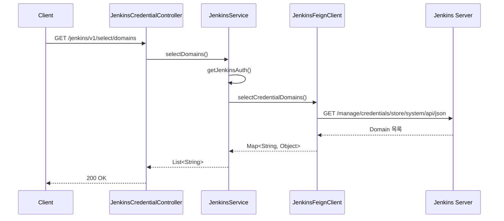
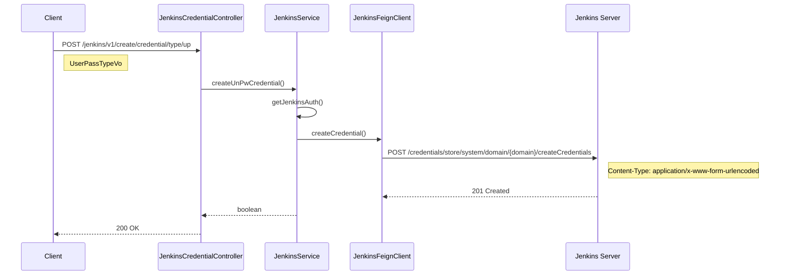
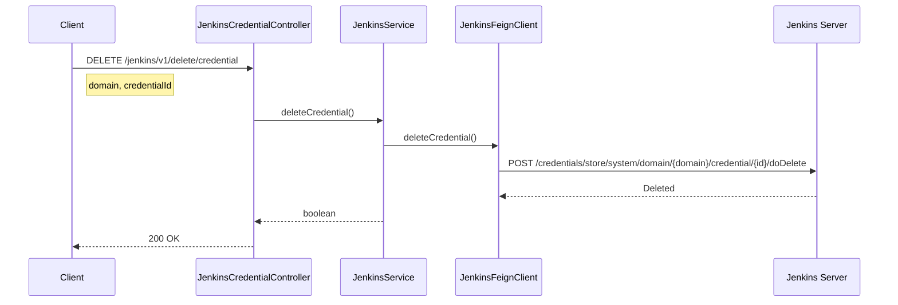
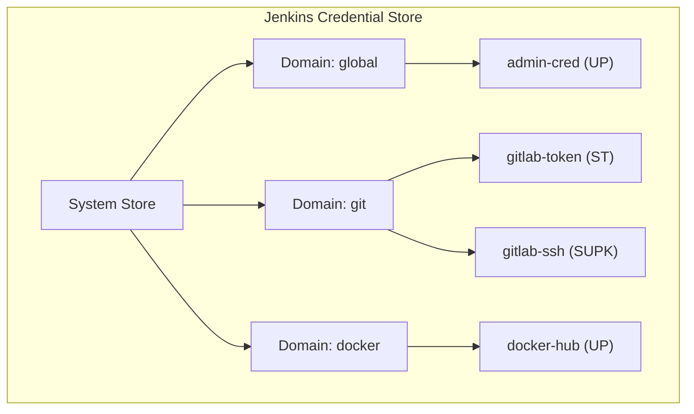

# Credential API - 자격증명 관리

Jenkins 자격증명(Credential) 관리를 위한 API입니다.

## 목적

Jenkins에서 사용하는 인증 정보(계정, SSH 키, 토큰 등)를 Domain 기반으로 체계적으로 관리합니다.

| 핵심 기능 | 설명 |
|----------|------|
| **Domain 관리** | Credential 구분 영역 생성 |
| **Username/Password** | 계정 기반 인증 정보 |
| **SSH Key** | 비공개키 기반 인증 정보 |
| **Secret Text** | API 토큰, 비밀번호 등 |

## 시퀀스 다이어그램

### Credential Domain 조회



### Credential 생성 (Username/Password)



### Credential 삭제



## 호출하는 Jenkins API

| Method | Endpoint | 설명 |
|--------|----------|------|
| GET | `/manage/credentials/store/system/api/json` | Domain 목록 조회 |
| GET | `/credentials/store/system/domain/{domain}/api/json` | Credential 목록 조회 |
| GET | `/credentials/store/system/domain/{domain}/credential/{id}` | Credential 존재 확인 |
| POST | `/manage/credentials/store/system/createDomain` | Domain 생성 |
| POST | `/credentials/store/system/domain/{domain}/createCredentials` | Credential 생성 |
| POST | `/credentials/store/system/domain/{domain}/credential/{id}/updateSubmit` | Credential 수정 |
| POST | `/credentials/store/system/domain/{domain}/credential/{id}/doDelete` | Credential 삭제 |

## 제공하는 외부 API

### Domain 관리

| Method | Endpoint | 설명 |
|--------|----------|------|
| GET | `/jenkins/v1/select/domains` | Domain 목록 조회 |
| GET | `/jenkins/v1/select/credentials` | Credential 목록 조회 |
| GET | `/jenkins/v1/select/credential` | Credential 존재 확인 |
| POST | `/jenkins/v1/create/domain` | Domain 생성 |

### Username/Password 타입

| Method | Endpoint | 설명 |
|--------|----------|------|
| POST | `/jenkins/v1/create/credential/type/up` | 생성 |
| PUT | `/jenkins/v1/update/credential/type/up` | 수정 |

### SSH Username with PrivateKey 타입

| Method | Endpoint | 설명 |
|--------|----------|------|
| POST | `/jenkins/v1/create/credential/type/supk` | 생성 |
| PUT | `/jenkins/v1/update/credential/type/supk` | 수정 |

### Secret Text 타입

| Method | Endpoint | 설명 |
|--------|----------|------|
| POST | `/jenkins/v1/create/credential/type/st` | 생성 |
| PUT | `/jenkins/v1/update/credential/type/st` | 수정 |

### 삭제

| Method | Endpoint | 설명 |
|--------|----------|------|
| DELETE | `/jenkins/v1/delete/credential` | Credential 삭제 |

## 주요 DTO

### UserPassTypeVo (Username/Password)

```java
public class UserPassTypeVo {
    String domain;       // Credential Domain
    String username;     // 사용자명
    String password;     // 비밀번호
    String id;           // Credential ID
    String description;  // 설명
}
```

### SshUserPrivateTypeVo (SSH Key)

```java
public class SshUserPrivateTypeVo {
    String domain;       // Credential Domain
    String id;           // Credential ID
    String description;  // 설명
    String username;     // SSH 사용자명
    String privateKey;   // SSH 비공개키
}
```

### SecretTextTypeVo (Secret Text)

```java
public class SecretTextTypeVo {
    String domain;       // Credential Domain
    String secret;       // 시크릿 값
    String id;           // Credential ID
    String description;  // 설명
}
```

## Credential 타입별 용도

| 타입 | 약어 | 용도 |
|------|------|------|
| Username with Password | `up` | Git 계정, Registry 인증 |
| SSH Username with PrivateKey | `supk` | SSH 접속, Git SSH Clone |
| Secret Text | `st` | API 토큰, 비밀번호 저장 |

## Credential 구조



## 참고사항

- Domain은 Credential을 논리적으로 그룹핑
- Credential ID는 Jenkinsfile에서 참조
- 비공개키는 PEM 형식으로 전달
- Secret Text는 마스킹되어 로그에 노출되지 않음
