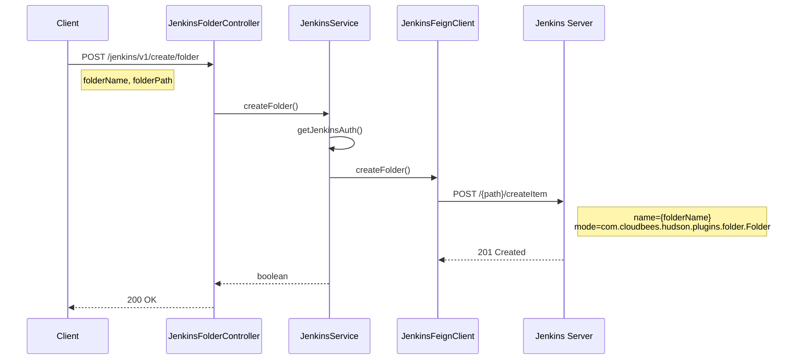
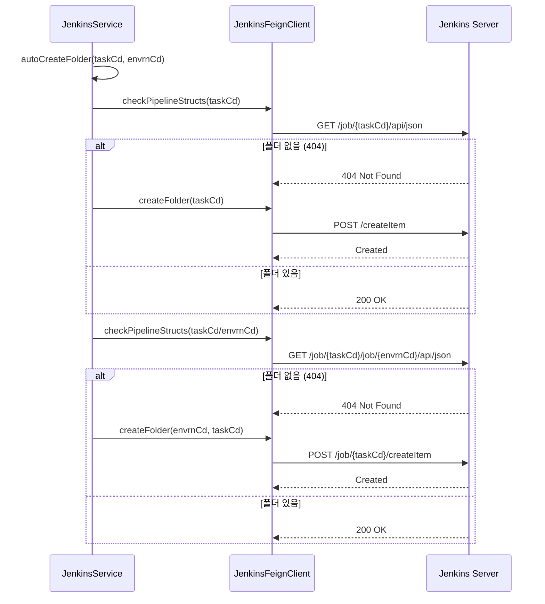
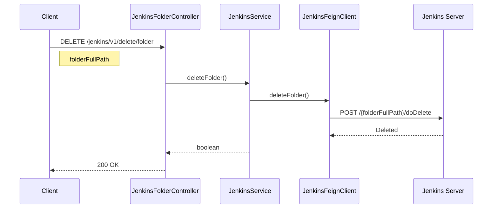
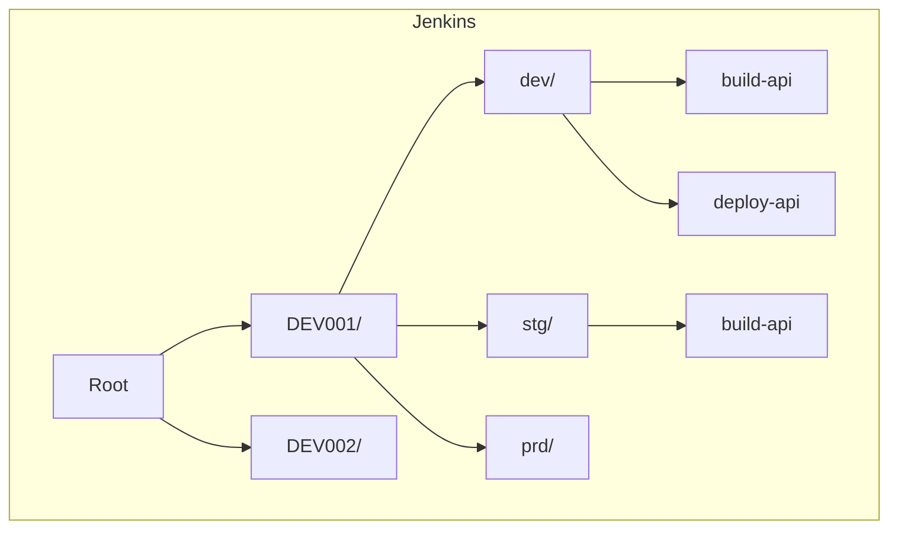

# Folder API - 폴더 관리

Jenkins 폴더 생성/삭제를 위한 API입니다.

## 목적

TPS 업무코드(taskCd)와 환경코드(envrnCd)를 기반으로 Jenkins 폴더 구조를 체계적으로 관리합니다.

| 핵심 기능 | 설명 |
|----------|------|
| **폴더 생성** | 업무/환경 기반 폴더 구조 생성 |
| **자동 생성** | 파이프라인 생성 시 폴더 자동 생성 |
| **폴더 삭제** | 빈 폴더 정리 |

## 시퀀스 다이어그램

### 폴더 생성



### 자동 폴더 생성 (파이프라인 생성 시)



### 폴더 삭제



## 호출하는 Jenkins API

| Method | Endpoint | 설명 |
|--------|----------|------|
| GET | `/{path}/api/json` | 폴더 존재 확인 |
| POST | `/{path}/createItem` | 폴더 생성 |
| POST | `/{path}/doDelete` | 폴더 삭제 |

## 제공하는 외부 API

| Method | Endpoint | 설명 |
|--------|----------|------|
| POST | `/jenkins/v1/create/folder` | 폴더 생성 |
| DELETE | `/jenkins/v1/delete/folder` | 폴더 삭제 |

### 요청 파라미터

**폴더 생성**:
- `folderName`: 폴더 이름
- `folderPath`: 상위 폴더 경로 (빈 값이면 루트)

**폴더 삭제**:
- `folderFullPath`: 폴더 전체 경로

## 폴더 구조 예시



**경로 패턴**: `/{taskCd}/{envrnCd}/{bizNm}`

## 폴더 생성 요청 형식

```
POST /{path}/createItem
Content-Type: application/x-www-form-urlencoded

name={folderName}
mode=com.cloudbees.hudson.plugins.folder.Folder
```

## 참고사항

- 폴더 생성 시 CloudBees Folder Plugin 필요
- 파이프라인 생성 시 autoCreateFolder 자동 호출
- 폴더 삭제 시 하위 Job도 함께 삭제됨
- 중첩 폴더 생성은 상위부터 순차적으로 생성
