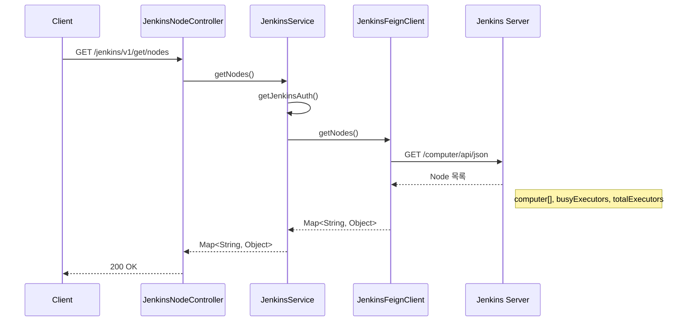
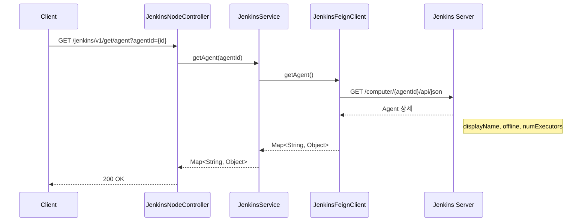
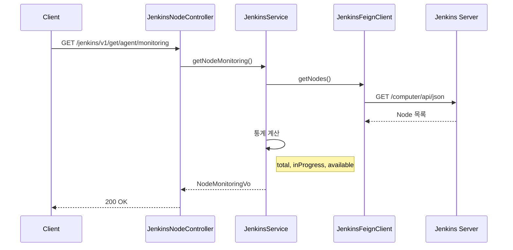
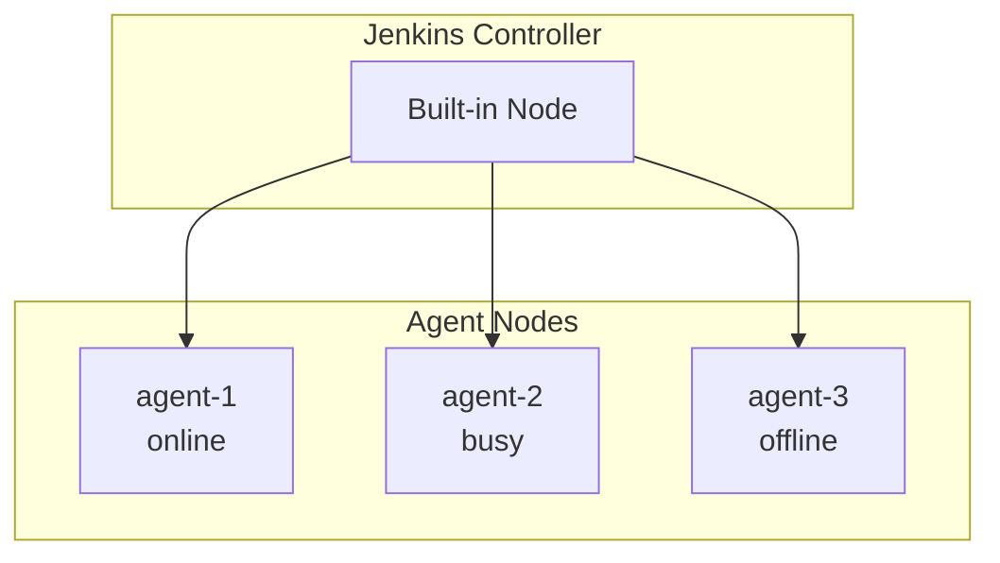

# Node API - Agent/Node 관리

Jenkins Agent/Node 상태 조회를 위한 API입니다.

## 목적

Jenkins 워커 노드의 상태를 모니터링하고 리소스 사용 현황을 파악합니다.

| 핵심 기능 | 설명 |
|----------|------|
| **노드 목록** | 전체 워커 노드 상태 조회 |
| **Agent 상태** | 특정 Agent 상세 정보 |
| **모니터링** | Agent 가용성 통계 |

## 시퀀스 다이어그램

### 전체 노드 조회



### 특정 Agent 조회



### Agent 모니터링 조회



## 호출하는 Jenkins API

| Method | Endpoint | 설명 |
|--------|----------|------|
| GET | `/computer/api/json` | 전체 Node 목록 조회 |
| GET | `/computer/{agentId}/api/json` | 특정 Agent 상태 조회 |

## 제공하는 외부 API

| Method | Endpoint | 설명 |
|--------|----------|------|
| GET | `/jenkins/v1/get/nodes` | 전체 Node 상태 조회 |
| GET | `/jenkins/v1/get/agent` | 특정 Agent 상태 조회 |
| GET | `/jenkins/v1/get/agent/monitoring` | Agent 모니터링 정보 |

## 주요 DTO

### AgentVo

```java
public class AgentVo {
    String displayName;     // 표시 이름
    String description;     // 설명
    long numExecutors;      // 실행기 수
    boolean offline;        // 오프라인 여부
    String architecture;    // 아키텍처
}
```

### NodeMonitoringVo

```java
public class NodeMonitoringVo {
    long totalAgent;            // 전체 Agent 수
    long inProgressAgent;       // 실행 중인 Agent 수
    long availableAgent;        // 사용 가능한 Agent 수
    List<AgentVo> agentVoList;  // Agent 상세 목록
}
```

## Node 상태 다이어그램



## 모니터링 지표

| 지표 | 설명 | 계산 |
|------|------|------|
| `totalAgent` | 전체 Agent 수 | 등록된 모든 Agent |
| `inProgressAgent` | 실행 중 | busy == true |
| `availableAgent` | 사용 가능 | online && !busy |

## Jenkins /computer/api/json 응답 예시

```json
{
  "_class": "hudson.model.ComputerSet",
  "busyExecutors": 2,
  "computer": [
    {
      "_class": "hudson.model.Hudson$MasterComputer",
      "displayName": "Built-In Node",
      "offline": false,
      "numExecutors": 2
    },
    {
      "_class": "hudson.slaves.SlaveComputer",
      "displayName": "agent-1",
      "offline": false,
      "numExecutors": 4
    }
  ],
  "totalExecutors": 6
}
```

## 참고사항

- Built-In Node(마스터)도 목록에 포함됨
- offline 상태는 연결 끊김 또는 수동 비활성화
- numExecutors는 동시 빌드 가능 수
- 모니터링 API로 CI/CD 대시보드 구성 가능
