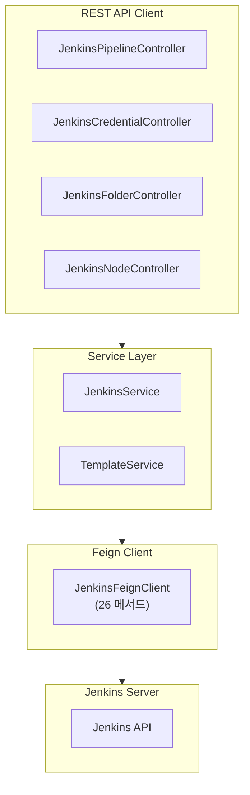
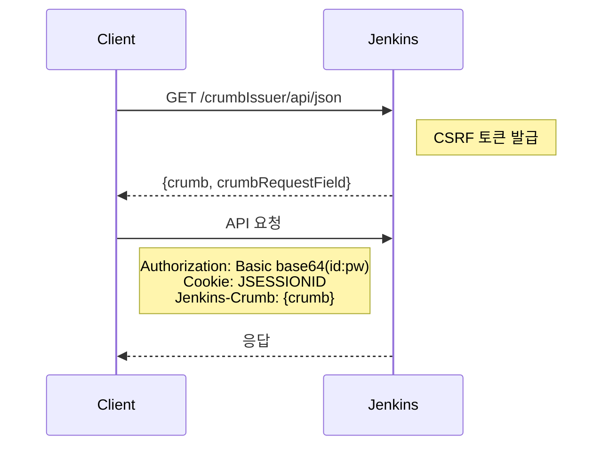

# Jenkins API 스펙

TPS Pipeline API의 Jenkins 연동 API 서비스입니다.

## 프로젝트 정보

| 항목 | 값 |
|------|-----|
| **프로젝트** | pipeline-api |
| **포트** | 8085 |
| **컨텍스트 경로** | `/pipeline/api` |
| **API 경로** | `/jenkins/v1` (V2), `/jenkins/v3` (V3) |

## 아키텍처 개요

## 도메인별 API 문서

| 도메인 | 문서 | 설명 |
|--------|------|------|
| 파이프라인 | [01-pipeline-api.md](./01-pipeline-api.md) | Job CRUD, 실행, 중지, 검증 |
| 자격증명 | [02-credential-api.md](./02-credential-api.md) | Domain, Credential 관리 |
| 폴더 | [03-folder-api.md](./03-folder-api.md) | 폴더 생성/삭제 |
| 노드 | [04-node-api.md](./04-node-api.md) | Agent/Node 상태 조회 |

## 인증 방식

Jenkins API 호출 시 3단계 인증:

## 주요 기능

| 기능 | 설명 |
|------|------|
| **빌드 관리** | 파이프라인 생성/수정/삭제/실행/중지 |
| **배포 관리** | 트리거 기반 다중 파이프라인 순차 실행 |
| **자격증명** | Username/Password, SSH Key, Secret Text 관리 |
| **모니터링** | Agent/Node 상태 및 통계 조회 |

## 외부 시스템 연계

- **Workflow Engine**: 비동기 파이프라인 실행, 로그 포워딩
- **PMS**: 업무코드 기반 파이프라인 구조화
- **Logging API**: 파이프라인 실행 로그 수집
