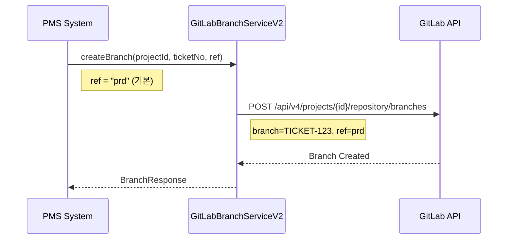
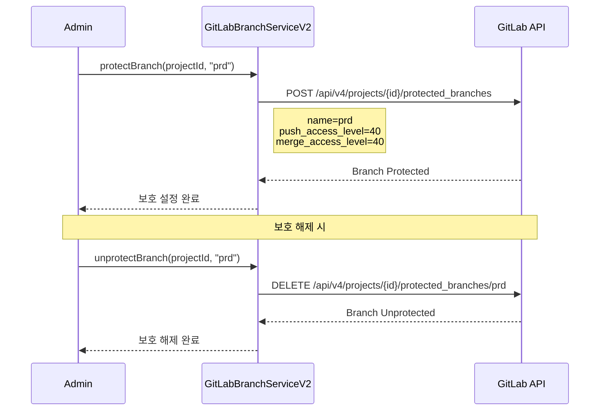
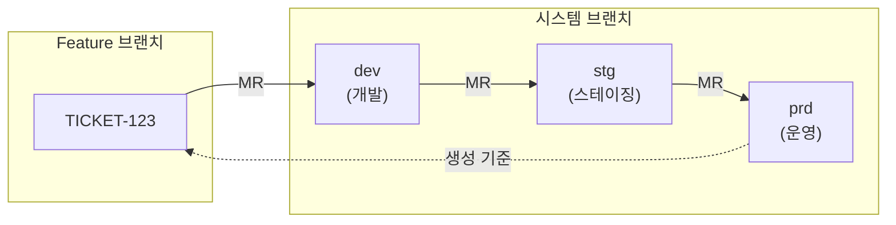

# Branch API - 브랜치 관리

GitLab 브랜치 관리를 위한 API입니다.

## 목적

TPS 티켓 기반 개발 흐름(dev → stg → prd)을 지원하기 위한 브랜치 생성, 보호, 관리 기능을 제공합니다.

| 핵심 기능 | 설명 |
|----------|------|
| **티켓 브랜치 생성** | 티켓 번호 기반 feature 브랜치 자동 생성 |
| **브랜치 보호** | 시스템 브랜치(dev/stg/prd) 보호 설정 |
| **권한 제어** | push/merge 권한 레벨 설정 |
| **배포 흐름 지원** | dev → stg → prd 순차 배포 구조 |

## 시퀀스 다이어그램

### 티켓 브랜치 생성



### 브랜치 보호 설정



### TPS 브랜치 전략



## 호출하는 GitLab API

| Method | Endpoint | 설명 |
|--------|----------|------|
| GET | `/api/v4/projects/{id}/repository/branches` | 브랜치 목록 조회 |
| GET | `/api/v4/projects/{id}/repository/branches/{branch}` | 브랜치 조회 |
| POST | `/api/v4/projects/{id}/repository/branches` | 브랜치 생성 |
| DELETE | `/api/v4/projects/{id}/repository/branches/{branch}` | 브랜치 삭제 |
| GET | `/api/v4/projects/{id}/protected_branches` | Protected 브랜치 조회 |
| POST | `/api/v4/projects/{id}/protected_branches` | 브랜치 Protected 설정 |
| DELETE | `/api/v4/projects/{id}/protected_branches/{branch}` | 브랜치 Unprotect |
| PUT | `/api/v4/projects/{id}/repository/branches/{branch}/rebase` | 브랜치 Rebase |

## 제공하는 외부 API

| Method | Endpoint | 설명 |
|--------|----------|------|
| GET | `/gitlab/v2/select_branch/{taskCd}/{projectId}/branch/{branchName}` | 브랜치 조회 |

## 주요 DTO

### Request

```java
// 브랜치 생성 요청
public class BranchCreateRequest {
    Long projectId;
    String branchName;
    String ref;             // 소스 브랜치 또는 커밋 SHA
}

// 브랜치 보호 설정
public class BranchProtectRequest {
    Long projectId;
    String branchName;
    Integer pushAccessLevel;       // 푸시 권한 레벨
    Integer mergeAccessLevel;      // 머지 권한 레벨
    Boolean allowForcePush;        // 강제 푸시 허용
}

// 브랜치 조회 요청
public class BranchSearchRequest {
    String taskCd;
    Long projectId;
    String branchName;
}
```

### Response

```java
// 브랜치 조회 응답
public class BranchResponse {
    String name;
    Boolean merged;
    Boolean protected;
    Boolean default;
    Boolean canPush;
    String webUrl;
    CommitInfo commit;
}

// 커밋 정보
public class CommitInfo {
    String id;              // SHA
    String shortId;
    String title;
    String message;
    String authorName;
    String authorEmail;
    String committedDate;
}
```

## 시스템 브랜치

TPS에서 사용하는 시스템 브랜치:

| 브랜치 | 용도 | 설명 |
|--------|------|------|
| `dev` | 개발 | 개발 환경 배포용 |
| `stg` | 스테이징 | QA/테스트 환경용 |
| `prd` | 운영 | 운영 환경 배포용 (기본 브랜치) |

## Access Level (브랜치 보호)

| Level | 설명 |
|-------|------|
| 0 | No access |
| 30 | Developer access |
| 40 | Maintainer access |
| 60 | Admin access |

## 참고사항

- 브랜치명에 특수문자 포함 시 URL 인코딩 필요
- 기본 브랜치(prd)는 삭제 불가
- Protected 브랜치는 직접 푸시 제한됨
- Rebase 작업은 Merge Request와 연계됨
