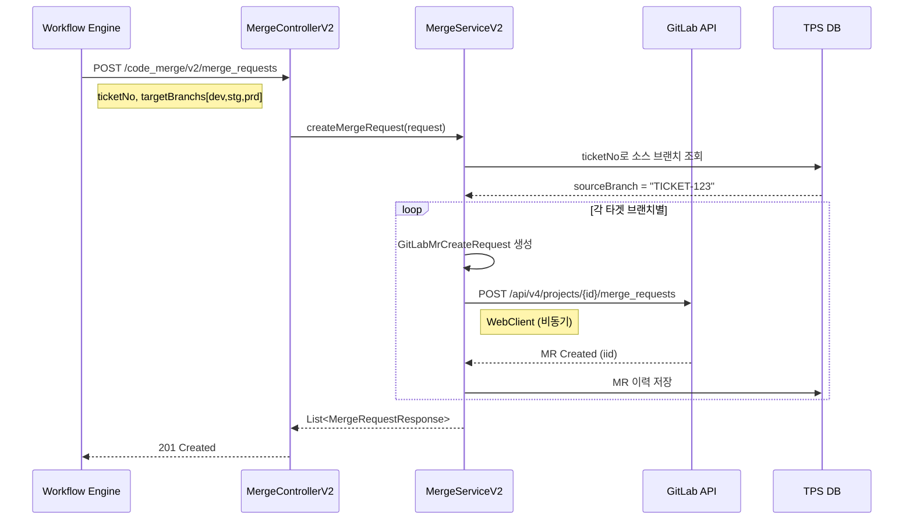
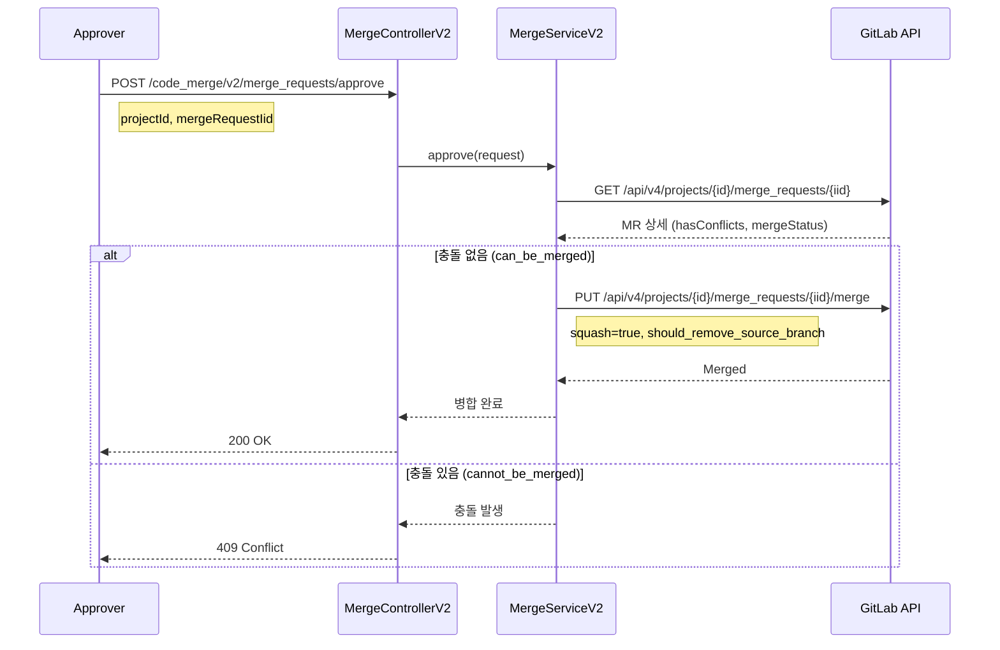
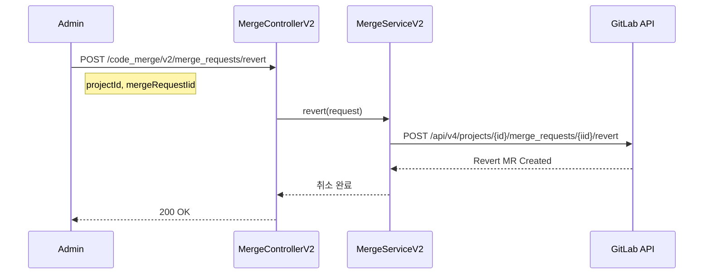
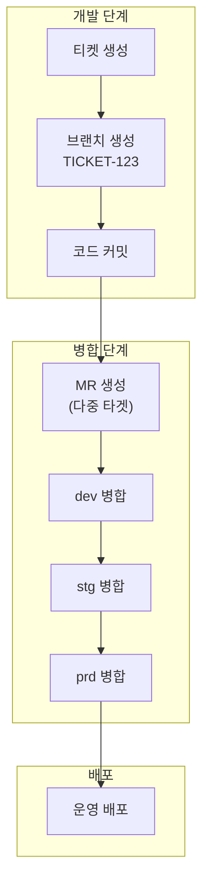

# Merge API - 병합 요청 관리

GitLab Merge Request(MR) 관리를 위한 API입니다.

## 목적

TPS 티켓 기반 코드 변경을 시스템 브랜치(dev → stg → prd)로 순차 병합하여 배포 파이프라인을 자동화합니다.

| 핵심 기능 | 설명 |
|----------|------|
| **티켓 기반 MR** | 티켓 번호로 소스 브랜치 자동 매핑 |
| **다중 타겟 지원** | 하나의 요청으로 dev/stg/prd 동시 MR 생성 |
| **충돌 관리** | 충돌 감지 및 Rebase 지원 |
| **Squash Merge** | 커밋 압축 병합으로 히스토리 정리 |

## 시퀀스 다이어그램

### 병합 요청 생성



### 병합 승인 (Merge)



### 병합 취소 (Revert)



### 전체 배포 흐름



## 호출하는 GitLab API

| Method | Endpoint | 설명 |
|--------|----------|------|
| GET | `/api/v4/projects/{bizNo}/merge_requests` | 병합 요청 목록 |
| GET | `/api/v4/projects/{bizNo}/merge_requests/{mergeId}` | 병합 요청 조회 |
| POST | `/api/v4/projects/{bizNo}/merge_requests` | 병합 요청 생성 |
| PUT | `/api/v4/projects/{bizNo}/merge_requests/{mergeId}/merge` | 병합 승인/실행 |
| PUT | `/api/v4/projects/{bizNo}/merge_requests/{mergeId}/rebase` | 병합 Rebase |
| DELETE | `/api/v4/projects/{bizNo}/merge_requests/{mergeId}` | 병합 요청 삭제 |
| GET | `/api/v4/projects/{bizNo}/merge_requests/{mergeId}/diffs` | 병합 diff 조회 |

## 제공하는 외부 API

| Method | Endpoint | 설명 |
|--------|----------|------|
| GET | `/code_merge/v2/merge_requests` | 병합 요청 목록 조회 |
| POST | `/code_merge/v2/merge_requests` | 병합 요청 생성 |
| POST | `/code_merge/v2/merge_requests/approve` | 병합 승인 |
| POST | `/code_merge/v2/merge_requests/revert` | 병합 취소 |

## 주요 DTO

### Request

```java
// 병합 요청 생성 (외부 API)
public class MrCreateRequest {
    String ticketNo;                // 티켓 번호
    List<String> targetBranchs;     // 대상 브랜치 목록 (dev, stg, prd)
    String title;
    String description;
}

// GitLab API 호출용
public class GitLabMrCreateRequest {
    String source_branch;
    String target_branch;
    String title;
    String description;
    Boolean squash;                 // 커밋 스쿼시 여부
    Boolean remove_source_branch;   // 머지 후 소스 브랜치 삭제
}

// 병합 승인 요청
public class MrApproveRequestV2 {
    Long projectId;
    Long mergeRequestIid;
    String sha;                     // 검증용 SHA
    Boolean squash;
    Boolean shouldRemoveSourceBranch;
}
```

### Response

```java
// 병합 요청 응답
public class MergeRequestResponse {
    Long id;
    Long iid;                       // 프로젝트 내 MR 번호
    String title;
    String description;
    String state;                   // opened, closed, merged
    String sourceBranch;
    String targetBranch;
    String mergeStatus;             // can_be_merged, cannot_be_merged
    Boolean hasConflicts;
    String webUrl;
    UserInfo author;
    UserInfo mergedBy;
    String mergedAt;
}

// Diff 응답
public class MergeDiffResponse {
    String oldPath;
    String newPath;
    String diff;
    Boolean newFile;
    Boolean renamedFile;
    Boolean deletedFile;
}
```

## Merge Request 상태

| 상태 | 설명 |
|------|------|
| `opened` | 열린 상태, 머지 대기 중 |
| `closed` | 닫힘, 머지 없이 종료 |
| `merged` | 머지 완료 |
| `locked` | 잠김, 편집 불가 |

## Merge Status

| 상태 | 설명 |
|------|------|
| `can_be_merged` | 머지 가능 |
| `cannot_be_merged` | 충돌 있음 |
| `checking` | 머지 가능 여부 확인 중 |
| `unchecked` | 아직 확인 안됨 |

## 참고사항

- MR 생성 시 WebClient(비동기) 사용
- 티켓 번호 기반으로 소스 브랜치 자동 매핑
- 다중 타겟 브랜치 지원 (dev → stg → prd)
- Squash merge 지원 (커밋 압축)
- 충돌 발생 시 Rebase 후 재시도 필요
