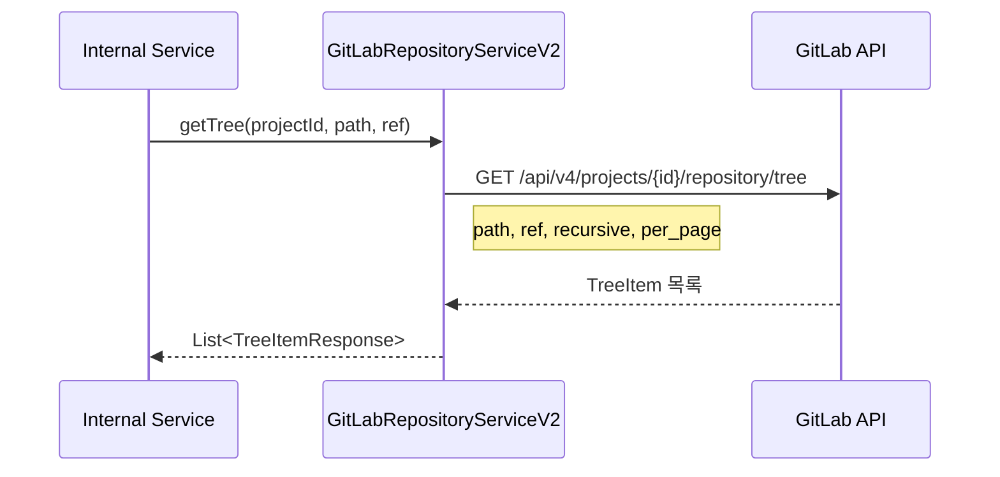
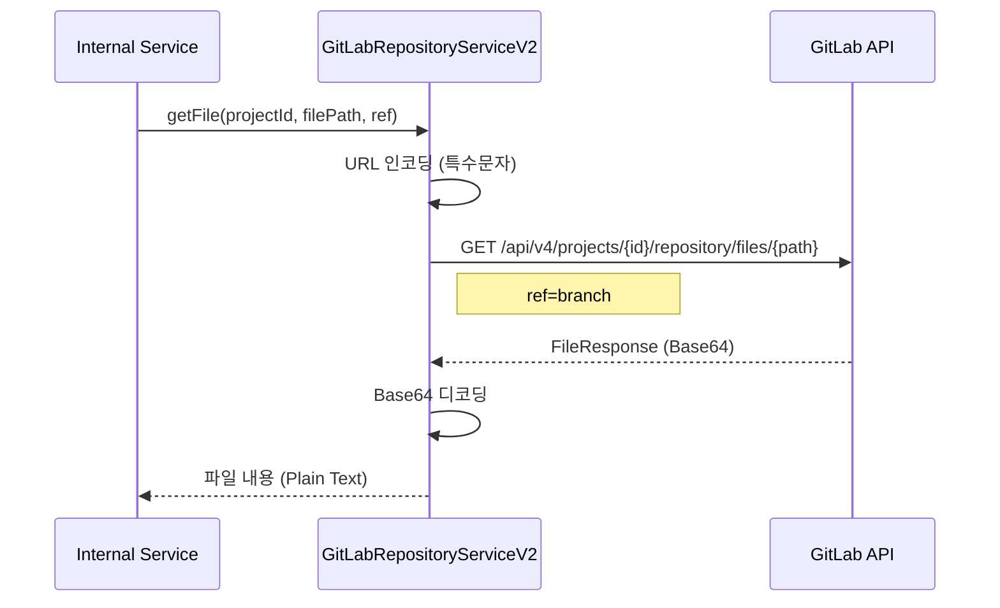
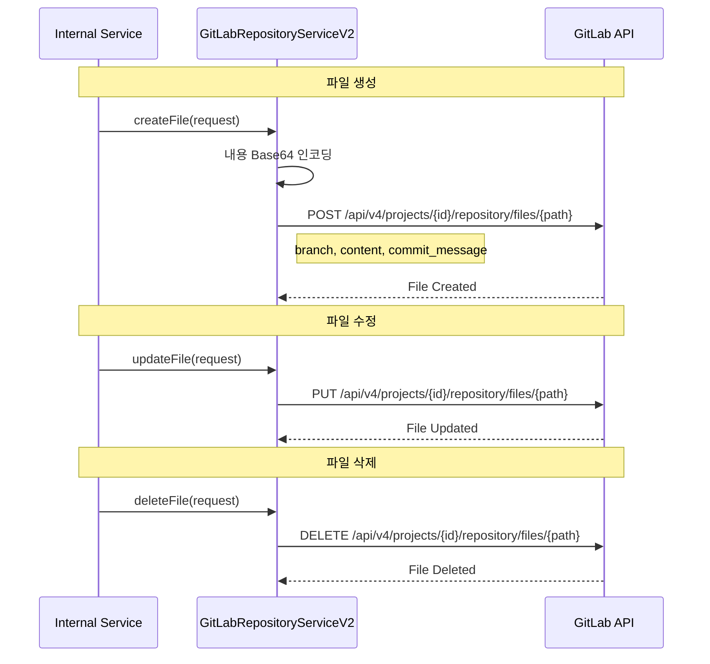
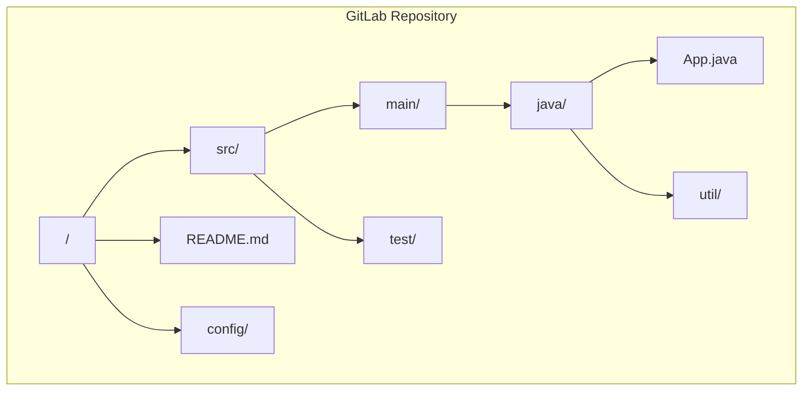

# Repository API - 저장소 파일 관리

GitLab 저장소 파일/트리 관리를 위한 API입니다.

## 목적

GitLab 저장소의 파일 및 디렉토리 구조를 조회하고, 파일 내용을 읽고 쓰는 기능을 제공합니다.

| 핵심 기능 | 설명 |
|----------|------|
| **트리 탐색** | 저장소 디렉토리 구조 계층적 조회 |
| **파일 조회** | 특정 브랜치/커밋의 파일 내용 조회 |
| **파일 편집** | API를 통한 파일 생성/수정/삭제 |
| **Base64 처리** | 바이너리 파일 포함 모든 파일 처리 |

## 시퀀스 다이어그램

### 저장소 트리 조회



### 파일 내용 조회



### 파일 생성/수정/삭제



### 저장소 구조 예시



## 호출하는 GitLab API

| Method | Endpoint | 설명 |
|--------|----------|------|
| GET | `/api/v4/projects/{id}/repository/tree` | 저장소 트리 조회 |
| GET | `/api/v4/projects/{id}/repository/files/{filePath}` | 파일 조회 |
| GET | `/api/v4/projects/{id}/repository/files/{filePath}/raw` | 파일 원본 조회 |
| POST | `/api/v4/projects/{bizNo}/repository/files/{path}` | 파일 생성 |
| PUT | `/api/v4/projects/{bizNo}/repository/files/{path}` | 파일 수정 |
| DELETE | `/api/v4/projects/{bizNo}/repository/files/{path}` | 파일 삭제 |

## 제공하는 외부 API

내부 서비스에서만 사용되며, 별도의 공개 엔드포인트는 없습니다.

## 주요 DTO

### Request

```java
// 트리 조회 요청
public class TreeRequest {
    Long projectId;
    String path;            // 디렉토리 경로 (빈 값이면 루트)
    String ref;             // 브랜치명 또는 커밋 SHA
    Boolean recursive;      // 재귀 조회 여부
    Integer perPage;        // 페이지당 항목 수
}

// 파일 조회 요청
public class FileRequest {
    Long projectId;
    String filePath;        // URL 인코딩 필요
    String ref;             // 브랜치명
}

// 파일 생성/수정 요청
public class FileCreateRequest {
    Long projectId;
    String filePath;
    String branch;
    String content;         // Base64 인코딩
    String commitMessage;
    String authorEmail;
    String authorName;
}

// 파일 삭제 요청
public class FileDeleteRequest {
    Long projectId;
    String filePath;
    String branch;
    String commitMessage;
}
```

### Response

```java
// 트리 항목 응답
public class TreeItemResponse {
    String id;              // Blob/Tree SHA
    String name;            // 파일/디렉토리명
    String type;            // blob, tree
    String path;            // 전체 경로
    String mode;            // 파일 모드 (100644, 040000 등)
}

// 파일 조회 응답
public class FileResponse {
    String fileName;
    String filePath;
    Long size;
    String encoding;        // base64
    String contentSha256;
    String ref;
    String blobId;
    String commitId;
    String lastCommitId;
    String content;         // Base64 인코딩된 내용
}

// 파일 원본 응답
// Content-Type에 따라 텍스트 또는 바이너리 반환
```

## 파일 경로 인코딩

GitLab API에서 파일 경로의 특수문자 처리:

| 문자 | 인코딩 |
|------|--------|
| `/` | `%2F` |
| `.` | `%2E` |
| `:` | `%3A` |

```java
// 예시
String encodedPath = URLEncoder.encode("src/main/java/App.java", "UTF-8")
                              .replace("+", "%20");
```

## Tree Type

| Type | 설명 |
|------|------|
| `blob` | 파일 |
| `tree` | 디렉토리 |

## 참고사항

- 파일 내용은 Base64 인코딩으로 전송/수신
- 파일 경로에 특수문자 포함 시 URL 인코딩 필수
- 대용량 파일은 raw 엔드포인트 사용 권장
- recursive=true 시 전체 하위 구조 조회 (성능 주의)
