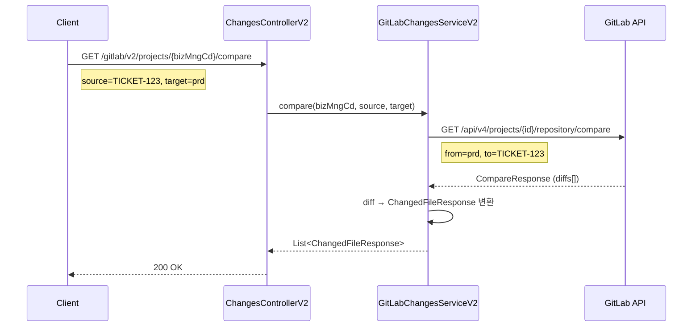
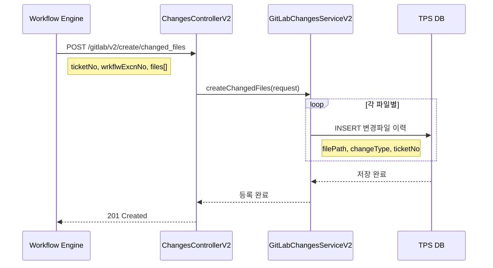
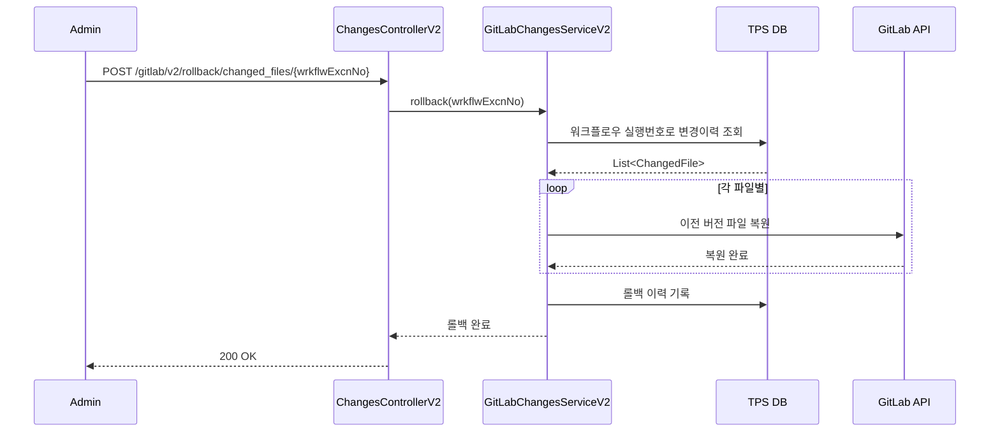
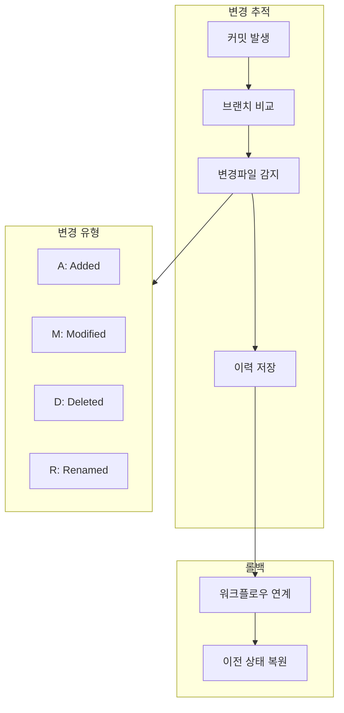

# Changes API - 커밋/변경사항 추적

커밋 이력 및 변경파일 추적을 위한 API입니다.

## 목적

TPS 티켓 및 워크플로우와 연계하여 코드 변경사항을 추적하고, 변경 프로그램 목록을 관리합니다.

| 핵심 기능 | 설명 |
|----------|------|
| **변경 추적** | 브랜치 간 diff를 통한 변경파일 식별 |
| **이력 관리** | 티켓/워크플로우 기반 변경 이력 저장 |
| **롤백 지원** | 워크플로우 실행번호 기반 롤백 처리 |
| **커밋 분석** | 파일별 커밋 이력 및 변경 유형 추적 |

## 시퀀스 다이어그램

### 브랜치 비교 (Compare)



### 변경파일 이력 등록



### 롤백 동기화



### 변경 추적 흐름



## 호출하는 GitLab API

| Method | Endpoint | 설명 |
|--------|----------|------|
| GET | `/api/v4/projects/{id}/repository/commits` | 커밋 목록 |
| GET | `/api/v4/projects/{id}/repository/commits?ref_name={branch}` | 브랜치별 커밋 |
| GET | `/api/v4/projects/{id}/repository/commits/{sha}/diff` | 커밋 diff |
| GET | `/api/v4/projects/{bizNo}/repository/compare?to={source}&from={target}` | 브랜치 비교 |

## 제공하는 외부 API

| Method | Endpoint | 설명 |
|--------|----------|------|
| POST | `/gitlab/v2/select/file_commitHistory` | 파일 커밋 이력 |
| POST | `/gitlab/v2/select/changed_files` | 변경파일 목록 |
| POST | `/gitlab/v2/select_pagination/changed_files` | 변경파일 페이지네이션 |
| POST | `/gitlab/v2/create/changed_files` | 변경파일 이력 등록 |
| POST | `/gitlab/v2/rollback/changed_files/{wrkflwExcnNo}` | 롤백 동기화 |
| GET | `/gitlab/v2/projects/{bizMngCd}/compare` | 변경 프로그램 목록 조회 (Compare API) |
| GET | `/gitlab/v2/projects/changes/{ticketNo}/ticket` | 변경 프로그램 목록 (DB 조회) |

## 주요 DTO

### Request

```java
// 커밋 이력 조회
public class CommitHistoryRequest {
    Long projectId;
    String filePath;
    String ref;             // 브랜치명
    Integer page;
    Integer perPage;
}

// 변경파일 조회
public class ChangedFilesRequest {
    String ticketNo;
    String bizMngCd;
    Integer page;
    Integer perPage;
}

// 브랜치 비교 요청
public class CompareRequest {
    Long projectId;
    String sourceBranch;    // 비교 대상 (from)
    String targetBranch;    // 비교 기준 (to)
}

// 변경파일 이력 등록
public class ChangedFilesCreateRequest {
    String ticketNo;
    String wrkflwExcnNo;    // 워크플로우 실행번호
    List<ChangedFile> files;
}
```

### Response

```java
// 커밋 응답
public class CommitResponse {
    String id;              // SHA
    String shortId;
    String title;
    String message;
    String authorName;
    String authorEmail;
    String authoredDate;
    String committerName;
    String committerEmail;
    String committedDate;
    String webUrl;
    List<String> parentIds;
}

// 커밋 diff 응답
public class CommitDiffResponse {
    String oldPath;
    String newPath;
    String diff;
    Boolean newFile;
    Boolean renamedFile;
    Boolean deletedFile;
    Integer aMode;
    Integer bMode;
}

// 브랜치 비교 응답
public class CompareResponse {
    CommitResponse commit;
    List<CommitResponse> commits;
    List<DiffResponse> diffs;
    Boolean compareTimeout;
    Boolean compareSameRef;
}

// 변경파일 응답
public class ChangedFileResponse {
    String filePath;
    String fileName;
    String changeType;      // A(추가), M(수정), D(삭제)
    String oldPath;         // 이름 변경 시 이전 경로
}
```

## Change Type

| 타입 | 설명 |
|------|------|
| `A` | Added - 새 파일 추가 |
| `M` | Modified - 파일 수정 |
| `D` | Deleted - 파일 삭제 |
| `R` | Renamed - 파일명 변경 |
| `C` | Copied - 파일 복사 |

## Compare API 파라미터

```
GET /api/v4/projects/{id}/repository/compare

from: 비교 기준 브랜치 (target)
to: 비교 대상 브랜치 (source)
straight: true면 직접 비교, false면 merge-base 비교
```

## 참고사항

- Compare API의 from/to 방향 주의 (GitLab 기준)
- 대량 변경 시 compare_timeout 발생 가능
- 변경파일 이력은 TPS 내부 DB에 별도 저장
- 롤백 시 워크플로우 실행번호 기준으로 처리
- 티켓 번호 기반 변경이력 추적 가능
