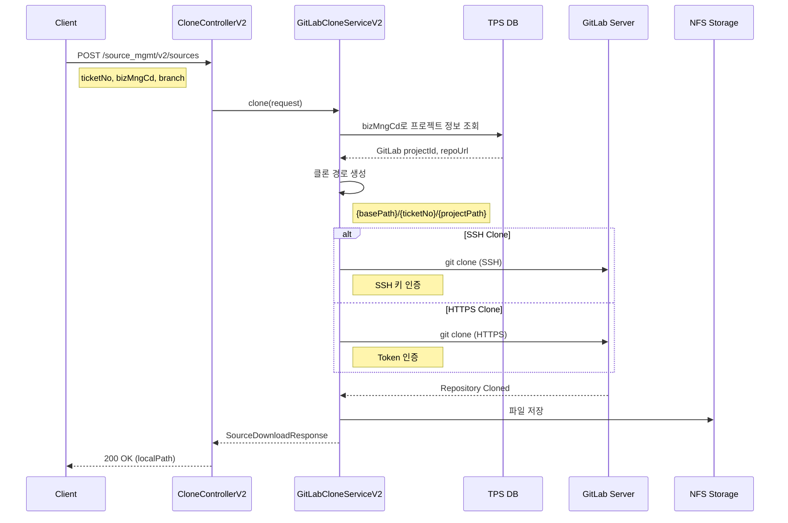
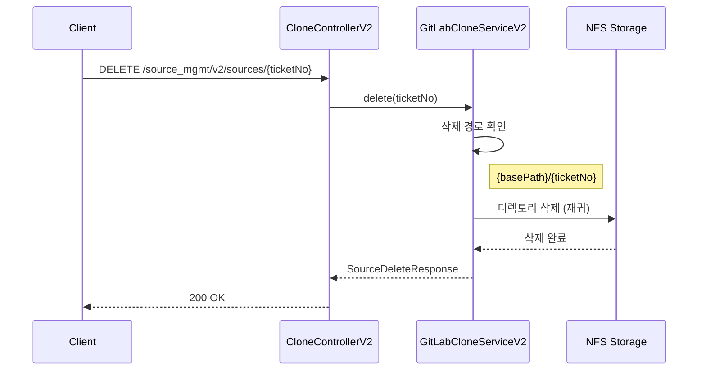
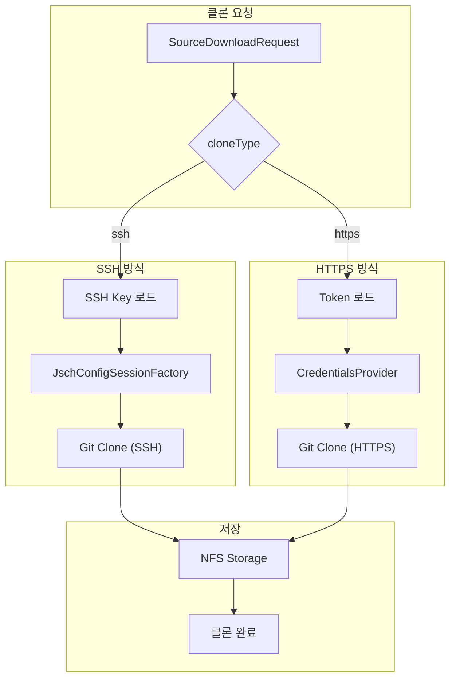
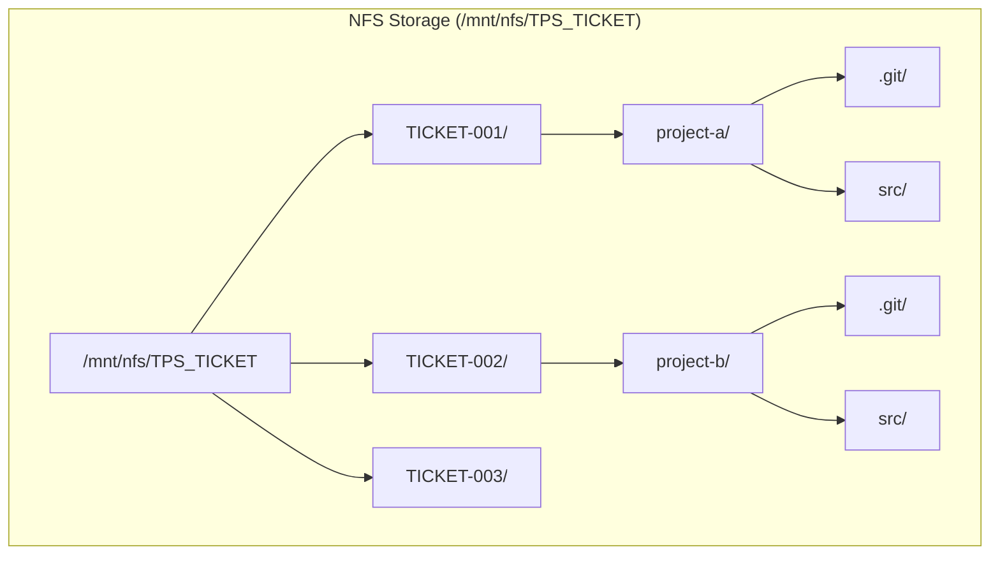

# Clone API - 소스 클론/다운로드

소스 코드 클론 및 다운로드를 위한 API입니다.

## 목적

TPS 티켓 작업을 위해 GitLab 저장소 소스 코드를 로컬/공유 스토리지에 클론하여 빌드 및 배포 환경을 준비합니다.

| 핵심 기능 | 설명 |
|----------|------|
| **티켓별 클론** | 티켓 번호 기반 독립적인 작업 디렉토리 생성 |
| **SSH/HTTPS 지원** | 환경에 따른 인증 방식 선택 |
| **NFS 스토리지** | 공유 스토리지를 통한 분산 환경 지원 |
| **브랜치 선택** | 특정 브랜치만 클론하여 효율성 확보 |

## 시퀀스 다이어그램

### 소스 다운로드 (Clone)



### 소스 삭제



### 클론 인증 흐름



### 디렉토리 구조



## 호출하는 GitLab API

JGit 라이브러리를 사용한 직접 Clone 방식입니다.

```java
// SSH Clone
Git.cloneRepository()
    .setURI("git@gitlab.example.com:group/project.git")
    .setDirectory(localPath)
    .setBranch(branch)
    .call();

// HTTPS Clone
Git.cloneRepository()
    .setURI("https://gitlab.example.com/group/project.git")
    .setCredentialsProvider(credentialsProvider)
    .setDirectory(localPath)
    .setBranch(branch)
    .call();
```

## 제공하는 외부 API

| Method | Endpoint | 설명 |
|--------|----------|------|
| POST | `/source_mgmt/v2/sources` | 소스 다운로드 (Clone) |
| DELETE | `/source_mgmt/v2/sources/{ticketNo}` | 소스 삭제 |

## 주요 DTO

### Request

```java
// 소스 다운로드 요청
public class SourceDownloadRequest {
    String ticketNo;        // 티켓 번호
    String bizMngCd;        // 업무관리코드 (프로젝트 매핑)
    String branch;          // 다운로드할 브랜치 (기본: prd)
    String cloneType;       // ssh 또는 https
}

// 소스 삭제 요청 (Path Parameter)
// ticketNo: 티켓 번호
```

### Response

```java
// 소스 다운로드 응답
public class SourceDownloadResponse {
    String ticketNo;
    String localPath;       // 클론된 로컬 경로
    String branch;
    String status;          // success, failed
    String message;
}

// 소스 삭제 응답
public class SourceDeleteResponse {
    String ticketNo;
    Boolean deleted;
    String message;
}
```

## 설정

### Clone 경로 설정

```yaml
# application.yml
clone:
  base-path: /mnt/nfs/TPS_TICKET    # 프로덕션
  # base-path: ~/TPS_TICKET          # 로컬 개발
```

## 시스템 브랜치

| 브랜치 | 용도 | 설명 |
|--------|------|------|
| `dev` | 개발 | 개발 환경용 |
| `stg` | 스테이징 | QA/테스트 환경용 |
| `prd` | 운영 | 운영 환경용 (기본값) |

## Clone 방식

### SSH Clone

```java
// SSH 키 기반 인증
SshSessionFactory sshSessionFactory = new JschConfigSessionFactory() {
    @Override
    protected void configure(Host host, Session session) {
        session.setConfig("StrictHostKeyChecking", "no");
    }
};
```

### HTTPS Clone

```java
// Username/Password 또는 Token 인증
CredentialsProvider credentialsProvider =
    new UsernamePasswordCredentialsProvider(username, token);
```

## 에러 처리

| 에러 | 원인 | 해결 |
|------|------|------|
| `TransportException` | 네트워크 또는 인증 실패 | 인증 정보 확인 |
| `InvalidRemoteException` | 잘못된 원격 URL | 프로젝트 URL 확인 |
| `JGitInternalException` | 로컬 경로 문제 | 디스크 공간, 권한 확인 |

## 참고사항

- 티켓 번호 기반으로 로컬 디렉토리 관리
- NFS 마운트 경로에 클론 (공유 스토리지)
- 클론 시 단일 브랜치만 다운로드 (shallow clone 아님)
- 삭제 시 해당 티켓의 모든 소스 제거
- 동일 티켓으로 재다운로드 시 기존 소스 덮어쓰기
