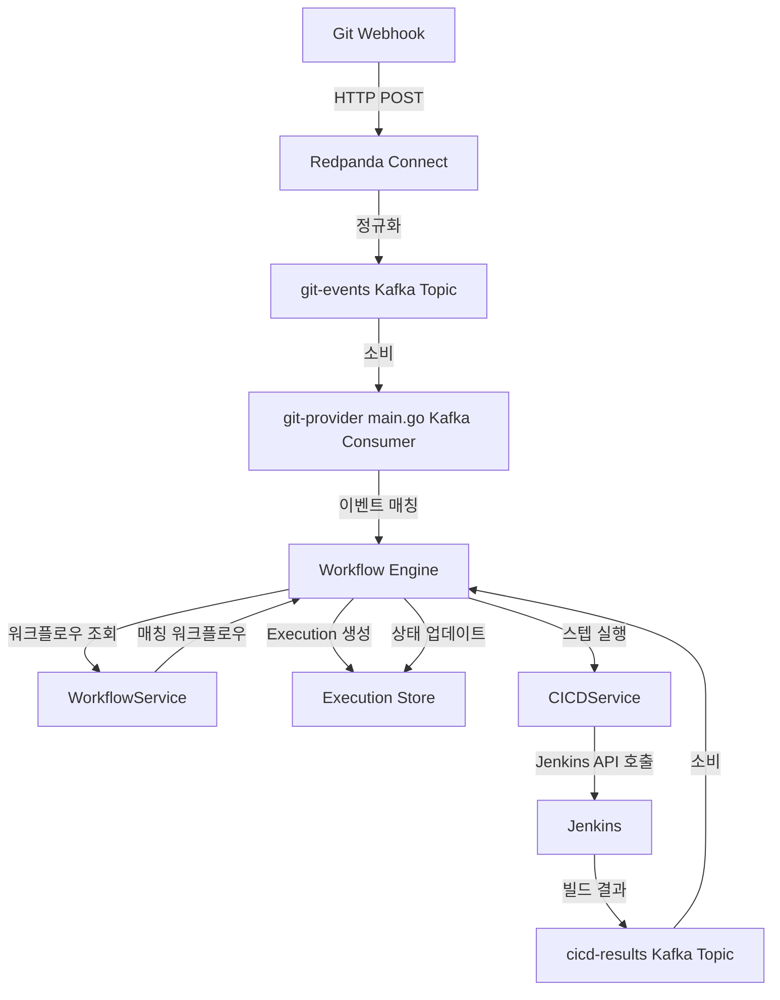
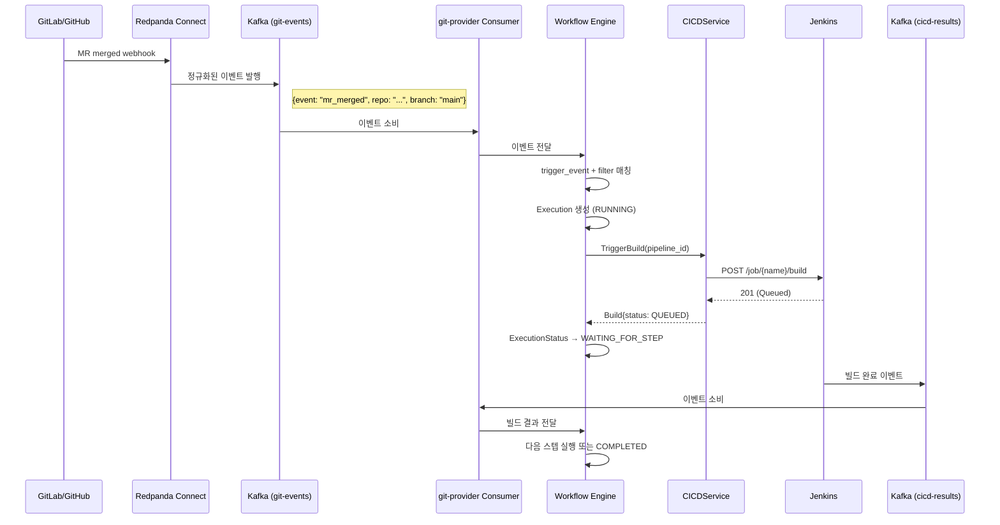

# Workflow API 설계

WorkflowService는 `workflow.proto`에 정의된 6개 RPC를 통해 워크플로우 정의와 실행 이력 관리를 담당한다. grpc-gateway를 통해 모든 RPC가 HTTP POST로 노출된다.

---

## 메시지 타입

### WorkflowFilter

| 필드 | 타입 | 설명 |
|------|------|------|
| `repository` | string | 저장소 (`namespace/repo`) |
| `branch` | string | 대상 브랜치 ("main", "develop") |

### WorkflowStep

| 필드 | 타입 | 설명 |
|------|------|------|
| `name` | string | 스텝 이름 ("deploy") |
| `type` | string | 스텝 유형 ("cicd_build") |
| `pipeline_id` | string | 연결된 CICDService 파이프라인 ID |

### Workflow

| 필드 | 타입 | 설명 |
|------|------|------|
| `id` | string | 워크플로우 UUID |
| `name` | string | 워크플로우 이름 |
| `trigger_event` | string | 트리거 이벤트 ("mr_merged", "push") |
| `filter` | WorkflowFilter | 저장소·브랜치 필터 |
| `steps` | WorkflowStep[] | 실행 스텝 목록 (순서 있음) |
| `created_at` | string | 생성 시각 (RFC3339) |
| `updated_at` | string | 수정 시각 (RFC3339) |

### ExecutionStatus

| 값 | 설명 |
|----|------|
| `EXECUTION_STATUS_RUNNING` | 워크플로우 실행 중 |
| `EXECUTION_STATUS_WAITING_FOR_STEP` | 스텝 완료 대기 중 |
| `EXECUTION_STATUS_COMPLETED` | 모든 스텝 완료 |
| `EXECUTION_STATUS_FAILED` | 스텝 실패로 중단 |

### StepExecution

| 필드 | 타입 | 설명 |
|------|------|------|
| `name` | string | 스텝 이름 |
| `type` | string | 스텝 유형 |
| `pipeline_id` | string | 연결된 파이프라인 ID |
| `status` | string | "pending", "running", "success", "failure" |
| `started_at` | string | 스텝 시작 시각 |
| `finished_at` | string | 스텝 종료 시각 |

### Execution

| 필드 | 타입 | 설명 |
|------|------|------|
| `id` | string | 실행 UUID |
| `workflow_id` | string | 워크플로우 ID |
| `status` | ExecutionStatus | 실행 상태 |
| `current_step` | int32 | 현재 실행 중인 스텝 인덱스 |
| `steps` | StepExecution[] | 스텝별 실행 상태 |
| `trigger_event` | string | 트리거한 이벤트 타입 |
| `repository` | string | 대상 저장소 |
| `branch` | string | 대상 브랜치 |
| `commit_sha` | string | 커밋 SHA |
| `started_at` | string | 실행 시작 시각 |
| `finished_at` | string | 실행 종료 시각 |

---

## RPC 목록

### 워크플로우 관리 (4개)

#### CreateWorkflow

워크플로우를 정의하고 저장한다. 트리거 이벤트와 필터 조건을 설정하여 어떤 저장소·브랜치·이벤트에서 어떤 스텝을 실행할지 결정한다.

| 항목 | 내용 |
|------|------|
| HTTP | `POST /v1/workflows/create` |
| gRPC | `WorkflowService.CreateWorkflow` |

**요청 (CreateWorkflowRequest)**

| 필드 | 타입 | 필수 | 설명 |
|------|------|------|------|
| `name` | string | Y | 워크플로우 이름 |
| `trigger_event` | string | Y | "mr_merged", "push" |
| `filter` | WorkflowFilter | Y | 저장소·브랜치 조건 |
| `steps` | WorkflowStep[] | Y | 실행 스텝 (순서 있음) |

**응답 (CreateWorkflowResponse)**

| 필드 | 타입 | 설명 |
|------|------|------|
| `workflow` | Workflow | 생성된 워크플로우 |

---

#### GetWorkflow

ID로 워크플로우 정의를 조회한다.

| 항목 | 내용 |
|------|------|
| HTTP | `POST /v1/workflows/get` |
| gRPC | `WorkflowService.GetWorkflow` |

**요청 (GetWorkflowRequest)**

| 필드 | 타입 | 필수 | 설명 |
|------|------|------|------|
| `id` | string | Y | 워크플로우 UUID |

**응답 (GetWorkflowResponse)**

| 필드 | 타입 | 설명 |
|------|------|------|
| `workflow` | Workflow | 워크플로우 정의 |

---

#### ListWorkflows

등록된 워크플로우 목록을 조회한다. `repository` 필터로 특정 저장소의 워크플로우만 조회할 수 있다.

| 항목 | 내용 |
|------|------|
| HTTP | `POST /v1/workflows/list` |
| gRPC | `WorkflowService.ListWorkflows` |

**요청 (ListWorkflowsRequest)**

| 필드 | 타입 | 필수 | 설명 |
|------|------|------|------|
| `repository` | string | N | 저장소 필터 |

**응답 (ListWorkflowsResponse)**

| 필드 | 타입 | 설명 |
|------|------|------|
| `workflows` | Workflow[] | 워크플로우 목록 |

---

#### DeleteWorkflow

워크플로우를 삭제한다. 삭제 후 해당 워크플로우 이벤트가 발생해도 더 이상 실행되지 않는다.

| 항목 | 내용 |
|------|------|
| HTTP | `POST /v1/workflows/delete` |
| gRPC | `WorkflowService.DeleteWorkflow` |

**요청 (DeleteWorkflowRequest)**

| 필드 | 타입 | 필수 | 설명 |
|------|------|------|------|
| `id` | string | Y | 워크플로우 UUID |

**응답 (DeleteWorkflowResponse)**

| 필드 | 타입 | 설명 |
|------|------|------|
| `success` | bool | 삭제 성공 여부 |

---

### 실행 이력 조회 (2개)

실행(Execution)은 워크플로우가 트리거될 때마다 생성되는 인스턴스다. 읽기 전용이며 외부에서 직접 생성하거나 삭제할 수 없다.

#### GetExecution

실행 ID로 특정 실행의 상세 정보를 조회한다.

| 항목 | 내용 |
|------|------|
| HTTP | `POST /v1/executions/get` |
| gRPC | `WorkflowService.GetExecution` |

**요청 (GetExecutionRequest)**

| 필드 | 타입 | 필수 | 설명 |
|------|------|------|------|
| `execution_id` | string | Y | 실행 UUID |

**응답 (GetExecutionResponse)**

| 필드 | 타입 | 설명 |
|------|------|------|
| `execution` | Execution | 실행 상세 정보 |

---

#### ListExecutions

워크플로우의 실행 이력을 조회한다.

| 항목 | 내용 |
|------|------|
| HTTP | `POST /v1/executions/list` |
| gRPC | `WorkflowService.ListExecutions` |

**요청 (ListExecutionsRequest)**

| 필드 | 타입 | 필수 | 설명 |
|------|------|------|------|
| `workflow_id` | string | Y | 워크플로우 UUID |
| `limit` | int32 | N | 최대 개수 (기본값 20) |

**응답 (ListExecutionsResponse)**

| 필드 | 타입 | 설명 |
|------|------|------|
| `executions` | Execution[] | 실행 이력 (최신순) |

---

## 워크플로우 엔진 아키텍처

## E2E 이벤트 흐름

MR merge부터 Jenkins 빌드 완료까지의 전체 흐름이다.

---

## RPC 요약표

| RPC | HTTP 엔드포인트 | 설명 |
|-----|----------------|------|
| CreateWorkflow | POST /v1/workflows/create | 워크플로우 생성 |
| GetWorkflow | POST /v1/workflows/get | 워크플로우 조회 |
| ListWorkflows | POST /v1/workflows/list | 워크플로우 목록 |
| DeleteWorkflow | POST /v1/workflows/delete | 워크플로우 삭제 |
| GetExecution | POST /v1/executions/get | 실행 상세 조회 |
| ListExecutions | POST /v1/executions/list | 실행 이력 조회 |
