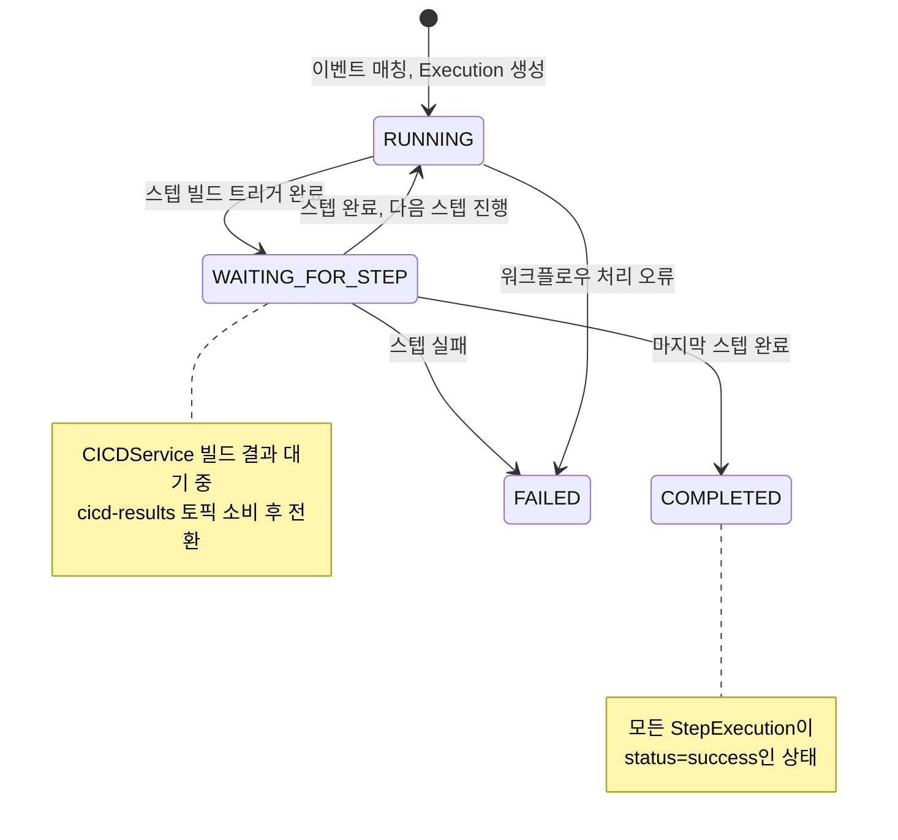

# Workflow 유스케이스 모델

WorkflowService는 Git 이벤트를 받아 미리 정의된 워크플로우에 따라 CI/CD 파이프라인을 자동 실행하는 오케스트레이터다. 사람이 직접 빌드를 트리거하지 않아도 MR merge나 push 이벤트만으로 빌드~배포가 자동화된다.

---

## 액터

| 액터 | 역할 |
|------|------|
| **DevOps 관리자** | 워크플로우 생성·삭제·조회, 실행 이력 모니터링 |
| **Git Webhook** | MR merge, push 이벤트로 워크플로우 자동 트리거 |

---

## 유스케이스

### UC-W1: 워크플로우 정의

**액터**: DevOps 관리자

**설명**: 어떤 이벤트가 발생했을 때 어떤 파이프라인을 실행할지 정의한다. 저장소와 브랜치 필터로 적용 범위를 좁히고, 스텝 목록으로 실행 순서를 지정한다.

**사전 조건**:
- 연결할 파이프라인이 CICDService에 등록되어 있어야 한다.
- `pipeline_id`가 유효해야 한다.

**기본 흐름**:
1. 관리자가 워크플로우 이름, 트리거 이벤트, 필터, 스텝 목록을 입력한다.
2. 시스템이 워크플로우 UUID를 생성하고 저장한다.
3. 이후 해당 이벤트가 발생하면 이 워크플로우가 자동 실행된다.

**예시**:
```
이름: backend-deploy-on-merge
트리거: mr_merged
필터: repository=my-org/backend, branch=main
스텝:
  1. name=build, type=cicd_build, pipeline_id=<백엔드 빌드 파이프라인>
  2. name=deploy, type=cicd_build, pipeline_id=<배포 파이프라인>
```

---

### UC-W2: 워크플로우 자동 실행

**액터**: Git Webhook (자동)

**설명**: MR이 merge되거나 push가 발생하면 Redpanda Connect가 이벤트를 정규화하여 Kafka에 발행하고, git-provider의 컨슈머가 이를 소비하여 매칭되는 워크플로우를 실행한다.

**기본 흐름**:
1. Git 서버가 webhook을 Redpanda Connect로 전송한다.
2. Redpanda Connect가 이벤트를 정규화하여 `git-events` 토픽에 발행한다.
3. Kafka 컨슈머가 이벤트를 소비하고 `trigger_event + filter`로 워크플로우를 매칭한다.
4. 매칭된 워크플로우로 Execution을 생성한다 (status: RUNNING).
5. 첫 번째 스텝의 파이프라인을 CICDService에 빌드 트리거한다.
6. 빌드 완료 이벤트(`cicd-results` 토픽)를 수신하면 다음 스텝으로 진행한다.
7. 모든 스텝 완료 시 Execution status를 COMPLETED로 갱신한다.

**대안 흐름**:
- 매칭 워크플로우 없음 → 이벤트 무시
- 스텝 실패 → Execution status를 FAILED로 갱신하고 중단

---

### UC-W3: 실행 모니터링

**액터**: DevOps 관리자

**설명**: 워크플로우 실행 이력을 조회하여 성공·실패 여부와 각 스텝별 상태를 확인한다.

**기본 흐름**:
1. 관리자가 `workflow_id`로 실행 이력을 조회한다.
2. 시스템이 최신순 Execution 목록을 반환한다.
3. 특정 Execution의 `execution_id`로 스텝별 상세 상태를 확인한다.

---

## ExecutionStatus 생애주기

워크플로우 실행은 스텝 간 이동 과정에서 WAITING_FOR_STEP 상태를 거친다. 이 상태는 CICDService에 빌드를 요청한 뒤 `cicd-results` 이벤트를 기다리는 구간이다.



---

## 도메인 모델

```
Workflow (워크플로우 정의)
├── id: UUID
├── name: 워크플로우 이름
├── trigger_event: 트리거 이벤트 ("mr_merged", "push")
├── filter: WorkflowFilter
│   ├── repository: namespace/repo
│   └── branch: 대상 브랜치
└── steps[]: WorkflowStep (순서 있음)
    ├── name: 스텝 이름
    ├── type: 스텝 유형 ("cicd_build")
    └── pipeline_id: CICDService 파이프라인 ID

Execution (실행 인스턴스)
├── id: UUID
├── workflow_id: 연결된 워크플로우
├── status: ExecutionStatus
├── current_step: 현재 스텝 인덱스
├── steps[]: StepExecution
│   ├── name, type, pipeline_id
│   ├── status: "pending"/"running"/"success"/"failure"
│   └── started_at / finished_at
├── trigger_event: 트리거한 이벤트
├── repository, branch, commit_sha
└── started_at / finished_at
```

---

## 설계 특징

Workflow(정의)와 Execution(인스턴스)의 분리는 하나의 워크플로우가 여러 번 실행되더라도 각 실행 이력을 독립적으로 추적할 수 있게 한다. Git commit의 이력과 유사하게, Workflow는 불변 설계도이고 Execution은 해당 설계도를 특정 시점에 실행한 결과물이다.

`WorkflowFilter`의 `repository + branch` 조합으로 동일 저장소의 main 브랜치와 develop 브랜치에 각각 다른 워크플로우를 적용할 수 있다. 이를 통해 main→프로덕션 배포, develop→스테이징 배포를 별도 워크플로우로 관리하는 패턴이 자연스럽게 구현된다.
